# AWS Networking Foundations Bootcamp

> A beginner-to-advanced networking companion to the AWS Complete Study Course. The sequence intentionally starts at a laptop/phone and legacy data center before mapping the same concepts into AWS VPC networking.

## Navigation

- [Course home](index.md)
- [Separate networking lecture index](md/networking/index.md)
- [AWS VPC module](md/modules/vpc-networking.md)

---

# Networking Bootcamp — Start Here


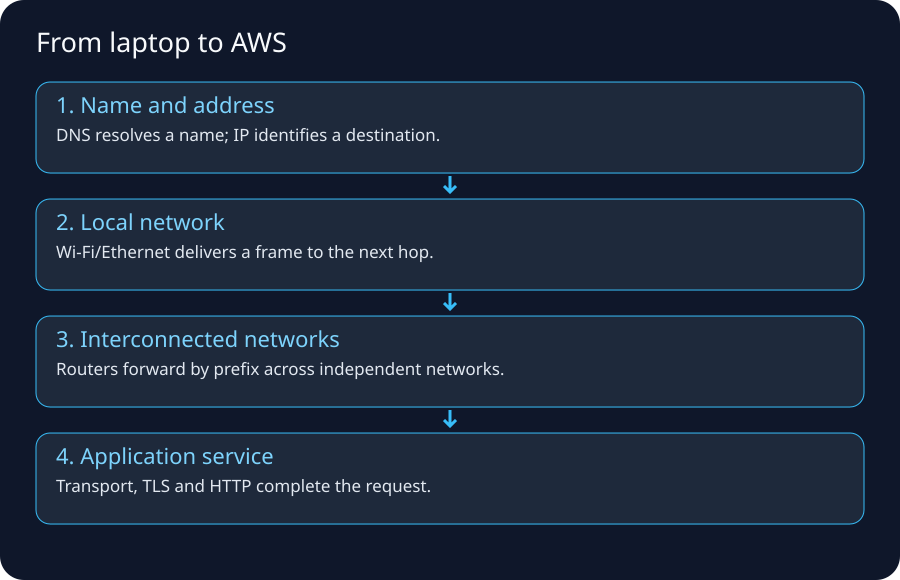

If networking feels mysterious, do **not** begin with VPC route tables. Begin with one question:

> **When I type `https://example.com` on my laptop or phone, what physical and logical systems touch my traffic before the page appears?**

AWS networking is mostly the same networking ideas exposed as software-defined resources. The names change; the packet still needs an address, a next hop, a permitted path, a transport session, and an application endpoint.

## The seven questions to ask for every network problem

1. **Name:** What hostname did the client use, and what IP did DNS return?
2. **Address:** What source and destination IPs exist at this point in the path? Were they translated?
3. **Local link:** How does the device reach the next-hop router on this LAN/WLAN/cellular access network?
4. **Route:** Which routing table chooses the next hop for the destination prefix?
5. **Policy:** Which firewall/security policy can allow or deny the flow?
6. **Transport:** Which protocol and ports are used? Did TCP/QUIC establish a session?
7. **Application:** Did TLS and HTTP/application behavior succeed after the network path worked?

### Memory trick

> **N-A-L-R-P-T-A = Name, Address, Link, Route, Policy, Transport, Application.**

If you debug in that order, you avoid the common mistake of changing firewall rules when the real problem is DNS, routing, or an application that is not listening.

## Recommended study order

| Order | Lecture | Why it comes here |
|---:|---|---|
| 1 | [Layers, Frames, Packets, Ports & Encapsulation](md/networking/01-layers-frames-packets-ports.md) | Learn the vocabulary that all later diagrams use. |
| 2 | [Your PC on Wi‑Fi → the Internet](md/networking/02-home-wifi-to-internet.md) | Builds the complete path from a familiar device. |
| 3 | [Phone on Mobile Data → the Internet](md/networking/03-mobile-data-to-internet.md) | Shows why cellular access differs from Wi‑Fi while IP remains the common layer. |
| 4 | [IP Addressing, Subnetting, NAT & CGNAT](md/networking/04-ip-subnetting-nat-cgnat.md) | Explains private/public addresses and why NAT exists. |
| 5 | [Routing, ISPs, Autonomous Systems, BGP, Peering & Transit](md/networking/05-routing-isp-bgp-peering.md) | Explains how packets cross independent networks. |
| 6 | [DNS → TCP/QUIC → TLS → HTTP](md/networking/06-dns-tcp-tls-http.md) | Reconstructs a browser request in time order. |
| 7 | [Ingress, Egress, Firewalls, WAF, Proxies & DMZs](md/networking/07-ingress-egress-firewalls-dmz.md) | Explains security controls at different layers. |
| 8 | [Legacy/In-house Data Center Network Flow](md/networking/08-legacy-datacenter-networking.md) | Gives the exact mental bridge to enterprise networking. |
| 9 | [AWS Internet & VPC Packet Flow](md/networking/09-aws-internet-vpc-packet-flow.md) | Maps every legacy component to AWS. |
| 10 | [Network Troubleshooting Labs](md/networking/10-network-troubleshooting-labs.md) | Teaches how to prove which layer is broken. |
| 11 | [Networking Cheat Sheet & Interview Questions](md/networking/11-networking-cheatsheet.md) | Revision and recall. |

## One diagram to remember before anything else

```text
Application wants: https://shop.example.com/orders
                         |
                         v
                    DNS resolves name
                         |
                         v
             destination IP: 198.51.100.20
                         |
                         v
             local routing table decides:
             remote network -> default gateway
                         |
                         v
      Laptop --Wi-Fi--> home router --ISP--> Internet routers
                         |
                         v
               destination edge/firewall/LB
                         |
                         v
                    application server
```

The important idea is that **your laptop usually does not know the complete Internet path**. It knows the destination IP and a local route, often a default route. Each router independently performs a similar next-hop decision.

## What “the Internet” actually means

The Internet is a **network of networks**, not one giant LAN. Large networks are organized into independently administered routing domains called **Autonomous Systems (ASes)**. ISPs, cloud providers, CDNs, universities, and large enterprises may operate ASes. BGP is the principal protocol used to exchange reachable IP prefixes and routing policy between ASes.

Do not memorize “BGP finds the shortest path.” That is an oversimplification. BGP is **policy-driven**; AS-path length is only one attribute among several, and commercial or engineering policy can make a longer-looking route preferable.

## How AWS fits into this picture

| Familiar network idea | Legacy/home example | AWS expression |
|---|---|---|
| Address range | Office subnet `10.20.30.0/24` | VPC/subnet CIDR |
| Routing table | Router/default gateway routes | VPC route table |
| Internet edge | ISP-facing router/firewall | Internet Gateway + public routing |
| Outbound address translation | Firewall/router PAT | NAT Gateway for private IPv4 egress |
| Stateful workload firewall | Host or perimeter firewall | Security Group |
| Stateless subnet ACL | Router ACL | Network ACL |
| Layer-7 web firewall | Appliance WAF/reverse proxy | AWS WAF |
| Deep packet/IPS firewall | Palo Alto/Fortinet/etc. | AWS Network Firewall / appliances via GWLB |
| DNS | Corporate DNS / public DNS | Route 53 + VPC Resolver |
| Load balancer | F5/HAProxy/NGINX appliance | ALB/NLB |
| Hub router | Core/WAN router | Transit Gateway |
| Private carrier circuit | MPLS/private line | Direct Connect |
| Site-to-site encrypted tunnel | IPsec VPN appliance | AWS Site-to-Site VPN |

## The three traffic directions you should recognize

### North–south
Traffic crosses the environment boundary.

```text
Internet user -> enterprise/AWS application
application -> Internet SaaS/API
```

### East–west
Traffic stays inside the environment but crosses workloads/segments.

```text
web tier -> app tier -> database
service A -> service B
VPC A -> VPC B
```

### Management/control-plane traffic
Administrators or automation configure resources; this is not always the same path as application data.

```text
Engineer -> AWS API/control plane
Application packet -> VPC data path
```

This distinction matters because a console/API action can succeed while the packet path is broken, or the packet path can work while IAM prevents you from changing it.

## Beginner mistakes this bootcamp will remove

- Thinking a public subnet is public because of its name.
- Thinking a public IP is physically configured on every NIC exactly as shown in the console.
- Thinking DNS sends your web request to the server.
- Thinking the destination MAC address of an Internet packet is the remote server’s MAC.
- Thinking routers forward based on TCP port instead of destination IP prefixes.
- Thinking NAT is the same thing as a firewall.
- Thinking “ingress” always means public Internet traffic.
- Thinking all firewalls work at the same network layer.
- Thinking Security Groups and NACLs behave identically.
- Thinking an outbound HTTPS request requires inbound port 443 to be open on the client.
- Thinking `ping` proves an HTTPS application is healthy.
- Thinking `traceroute` always reveals every router.

## Internet examples and authoritative reading

- Cloudflare, **How does the Internet work?**: https://www.cloudflare.com/learning/network-layer/how-does-the-internet-work/
- Cloudflare, **What is a router?**: https://www.cloudflare.com/learning/network-layer/what-is-a-router/
- Cloudflare, **What is BGP?**: https://www.cloudflare.com/learning/security/glossary/what-is-bgp/
- Cloudflare, **What is DNS?**: https://www.cloudflare.com/learning/dns/what-is-dns/
- AWS, **Amazon VPC User Guide**: https://docs.aws.amazon.com/vpc/latest/userguide/what-is-amazon-vpc.html

> **Teaching note:** external diagrams are linked as references. The diagrams packaged in this course are original study redraws so they remain readable, printable, and consistent with the rest of the guide.

## Self-test before moving on

You are ready for the next lecture if you can explain, without AWS terminology:

1. Why a laptop needs a default gateway.
2. Why the destination MAC on the first Wi‑Fi frame is normally the gateway/AP-side next hop rather than the remote website.
3. Why DNS and routing solve different problems.
4. Why a private IPv4 address can access the Internet through NAT.
5. Why a return packet may take a different physical/router path on the Internet.

[Next → Layers, Frames, Packets, Ports & Encapsulation](md/networking/01-layers-frames-packets-ports.md)

---

# Layers, Frames, Packets, Ports & Encapsulation


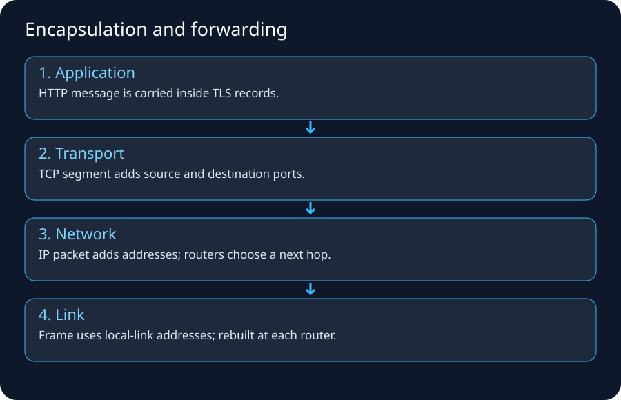

## 1. Why layers exist

Networking is easier when each part has a narrow responsibility. Your browser should not need to know how Wi‑Fi retransmits a radio frame; your Wi‑Fi adapter should not need to understand HTTP cookies; a core Internet router should not need to parse your HTML.

The practical TCP/IP model can be remembered as:

```text
Application     HTTP, DNS, SSH, database protocol
Transport       TCP, UDP, QUIC behavior
Internet        IP, ICMP, routing between networks
Link            Ethernet, Wi-Fi, local frame delivery
Physical        copper, fiber, radio
```

The seven-layer OSI model is useful vocabulary, but real systems often blur boundaries. Use it to **locate responsibility**, not to force every protocol into a perfect box.

## 2. Four identifiers people confuse

Suppose your laptop opens HTTPS to `198.51.100.20`.

| Identifier | Example | Scope | Main purpose |
|---|---|---|---|
| MAC/link address | `8c:85:90:aa:bb:cc` | Local link | Deliver a frame to the next interface on the LAN/WLAN |
| IP address | `192.168.1.25` → `198.51.100.20` | Across routed networks | Identify source/destination IP endpoints |
| Port | `51514` → `443` | Host/transport | Identify a transport endpoint/application socket |
| DNS name | `shop.example.com` | Naming system | Human/service name that resolves to records such as IPs |

### Memory trick

> **MAC = next device, IP = remote endpoint/network, port = process, DNS = name.**

That statement is simplified but extremely useful.

## 3. Encapsulation: one request becomes several wrappers

Imagine the browser creates:

```text
GET /orders HTTP/1.1
Host: shop.example.com
```

A simplified outbound stack is:

```text
HTTP data
  ↓ encrypted/secured by TLS
TLS records
  ↓ carried by TCP
TCP segment
  src port 51514
  dst port 443
  ↓ carried by IP
IP packet
  src 192.168.1.25
  dst 198.51.100.20
  ↓ carried on the local Wi-Fi link
802.11 frame
  src MAC = laptop Wi-Fi adapter
  dst MAC = local next hop/AP/gateway side
  ↓
radio symbols/bits
```

At the destination, the wrappers are processed in the opposite direction until the web server/application receives the request.

## 4. What changes at a router?

This is a critical interview and troubleshooting concept.

A normal Layer-3 router forwards the **IP packet** between links. The local-link frame is not carried unchanged from your laptop to the remote server.

Simplified router behavior:

1. Receive an Ethernet/Wi‑Fi frame addressed to one of its local interfaces.
2. Remove the link-layer header/trailer.
3. Inspect destination IP.
4. Decrease IPv4 TTL or IPv6 Hop Limit.
5. Find the best matching route for the destination.
6. Resolve/know the next-hop link-layer address on the outgoing interface.
7. Encapsulate the IP packet inside a **new link-layer frame**.
8. Transmit toward the next hop.

Therefore:

```text
Laptop -> Router A -> Router B -> Server

IP destination may remain: 198.51.100.20
MAC destination changes:    every Layer-2 segment/hop
```

NAT is a special case because it can also rewrite IP addresses/ports.

## 5. Switch versus router

### Switch
A Layer-2 switch typically forwards frames inside a broadcast domain/VLAN using MAC address learning.

```text
Host A ---+
          +--- Switch --- Host B
Host C ---+
```

It learns which MAC addresses are reachable through which ports.

### Router
A router connects IP networks/subnets.

```text
10.0.1.0/24 --- Router --- 10.0.2.0/24
```

Hosts on `10.0.1.0/24` send remote-subnet traffic to a router/default gateway.

### Layer-3 switch
Enterprise switches can also perform routing. Do not infer capability merely from the physical shape of the appliance.

## 6. How the host knows whether a destination is local

Example host:

```text
IP address:      192.168.1.25
Subnet prefix:   /24
Default gateway: 192.168.1.1
```

For destination `192.168.1.77`, the host can determine that the destination belongs to the same `/24` and attempt local delivery.

For destination `198.51.100.20`, the destination is outside the local prefix, so a typical route table says:

```text
192.168.1.0/24  -> directly connected
0.0.0.0/0       -> 192.168.1.1
```

That `0.0.0.0/0` is the **default route**: the catch-all route when no more specific route matches.

## 7. ARP and IPv6 Neighbor Discovery

With IPv4, a host often uses **ARP** to learn the MAC address associated with a local IPv4 next hop.

Example intent:

```text
Laptop: “Who has 192.168.1.1? I need its MAC so I can send this frame.”
Router: “192.168.1.1 is at aa:bb:cc:dd:ee:ff.”
```

The laptop does **not** ARP for a remote website IP that is outside its subnet. It ARPs for the local next hop (often the default gateway).

IPv6 uses Neighbor Discovery rather than ARP.

## 8. TCP and UDP in one page

### TCP
TCP provides a reliable byte stream with connection state, sequencing, acknowledgements, retransmission, flow control, and congestion-control mechanisms.

Common protocols: HTTPS over TCP, SSH, many databases.

A classic TCP connection starts:

```text
Client                  Server
  | ---- SYN ----------> |
  | <--- SYN + ACK ----- |
  | ---- ACK ----------> |
  |   connected          |
```

### UDP
UDP is message/datagram-oriented and does not itself provide TCP-style connection establishment/reliability.

Common uses include DNS transport, voice/video mechanisms, gaming, and QUIC.

### QUIC / HTTP/3
Modern HTTP/3 uses QUIC over UDP and integrates transport/security behavior differently from classic HTTP over TCP + TLS. The important beginner lesson is: **UDP does not imply “unreliable application.”** Reliability can be implemented above UDP, as QUIC does.

## 9. Ports and sockets

A server process listens on a transport endpoint, for example TCP port 443.

The client usually chooses an ephemeral source port:

```text
192.168.1.25:51514  ---> 198.51.100.20:443
```

The 5-tuple commonly used to distinguish a flow is:

```text
source IP
source port
destination IP
destination port
protocol
```

This is why thousands of clients can all connect to the same server port 443 while remaining distinct flows.

## 10. MTU, fragmentation and the “small ping works, app fails” problem

Each link has a Maximum Transmission Unit (MTU). If a path cannot carry a packet as large as the sender expects, fragmentation or Path MTU Discovery behavior matters. VPN/tunnel headers reduce usable payload size.

Symptoms of MTU issues can include:

- small requests work but larger transfers stall,
- TLS connections behave strangely,
- VPN-connected applications fail selectively,
- ICMP filtering breaks Path MTU Discovery.

Do not make MTU your first guess, but know it exists when basic connectivity works yet larger packets fail.

## 11. ICMP is not “the ping protocol only”

ICMP supports network control/error messages. `ping` commonly uses ICMP Echo, but ICMP is also involved in operational behavior such as reporting unreachable destinations and supporting path diagnostics. Blocking all ICMP can create subtle operational problems.

## 12. Layer-oriented debugging

| Symptom | Likely area to check first |
|---|---|
| Wi‑Fi shows disconnected | physical/link/access |
| Has Wi‑Fi but no IP | DHCP/address configuration |
| Can reach local gateway but not Internet | routing/NAT/ISP |
| Can reach IP but hostname fails | DNS |
| TCP connection refused | destination reachable, no listener or active reject |
| TCP timeout | path/policy/drop/congestion possible |
| TLS certificate error | TLS/name/certificate/time issue |
| HTTP 403 | application/WAF/authz rather than basic routing |
| HTTP 500 | application/server dependency |

## 13. Legacy data-center connection

In a legacy enterprise, teams often divided ownership like this:

```text
Server team        host OS, NIC, TCP listener
Network team       VLAN, switch, route, BGP/OSPF
Firewall team      access policy/NAT/inspection
DNS team           zones/resolvers
Load balancer team VIP/pools/certificates
Application team   HTTP/API behavior
```

A ticket might bounce among five teams because each owns a different layer. AWS collapses some appliances into services, but the logical boundaries remain.

## 14. AWS bridge

When you later see:

```text
EC2 ENI -> subnet -> route table -> NAT gateway -> IGW
```

translate it mentally to:

```text
host interface -> local routed segment -> next-hop decision
-> address translation edge -> Internet routing edge
```

Security Groups are not “AWS magic”; they are a stateful packet/flow permission boundary associated with supported interfaces/resources. NACLs are a different, stateless subnet-level control.

## 15. Hands-on lab on your own computer

Run equivalents appropriate for your OS:

```bash
# Linux/macOS examples
ip addr                 # or ifconfig
ip route                # route table
a rp -a                 # use: arp -a (remove the space)
nslookup example.com
# or dig example.com
traceroute example.com
curl -v https://example.com/
```

Windows equivalents include:

```powershell
ipconfig /all
route print
arp -a
nslookup example.com
tracert example.com
curl.exe -v https://example.com/
```

Record:

- your private IP,
- prefix/netmask,
- default gateway,
- DNS resolver,
- resolved destination IP,
- first few route hops.

Do not be surprised if some `traceroute` hops show `*`; networks can filter or deprioritize the diagnostic messages while forwarding normal traffic.

## 16. Memory card

```text
Name        DNS
Process     Port
Remote host IP
Local hop   MAC/link address
Next hop    Route table
Permission  Firewall/policy
Proof       packet capture/log/flow evidence
```

## 17. Internet lecture trail

- Cloudflare, Network layer: https://www.cloudflare.com/learning/network-layer/what-is-the-network-layer/
- Cloudflare, Router: https://www.cloudflare.com/learning/network-layer/what-is-a-router/
- Cloudflare, Internet overview: https://www.cloudflare.com/learning/network-layer/how-does-the-internet-work/


---

# Your PC on Wi‑Fi → the Internet: Complete Packet Walk


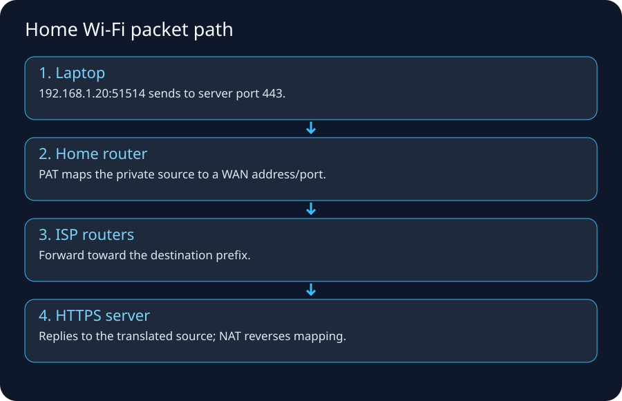

## 1. The scenario

You are at home. Your laptop is connected to Wi‑Fi. You type:

```text
https://shop.example.com/products/42
```

Assume this simplified state:

```text
Laptop Wi-Fi IP:      192.168.1.25/24
Default gateway:      192.168.1.1
DNS resolver:         192.168.1.1 (router forwards to ISP/public resolver)
Router WAN address:   100.64.18.22   (example CGNAT/shared address)
ISP public NAT addr:  203.0.113.9    (documentation example)
Website IP:           198.51.100.20  (documentation example)
Destination TCP port: 443
```

The specific addresses are examples. `192.168.0.0/16` is private space; `100.64.0.0/10` is shared address space reserved for service-provider CGNAT use.

## 2. Before the browser can send anything: Wi‑Fi association

Wi‑Fi is the local access/link technology. The laptop discovers an SSID, authenticates/associates according to the network's security mode, and establishes link-layer connectivity to the access point.

Home equipment often combines several logical functions in one plastic box:

```text
Wi-Fi access point
Ethernet switch
IP router/default gateway
DHCP server
DNS forwarder/cache
NAT/PAT
stateful firewall
sometimes modem/ONT function
```

That is why beginners call everything “the router.” In enterprise networks these functions may be separate devices/services.

## 3. DHCP: how the laptop learns basic network configuration

A typical home client learns configuration automatically using DHCP. Conceptually it receives:

- an IP address such as `192.168.1.25`,
- a subnet prefix/netmask such as `/24`,
- a default gateway such as `192.168.1.1`,
- one or more DNS resolver addresses,
- lease timing and other options.

Without a default gateway, the laptop can still communicate with local neighbors if addressing is correct, but it normally has no route to arbitrary remote networks.

### Failure example

```text
Laptop IP: 169.254.x.x
```

On many systems, an IPv4 link-local/self-assigned address can indicate that DHCP did not provide normal configuration. You may have Wi‑Fi radio association but still lack usable routed connectivity.

## 4. DNS: turn the hostname into an IP

The browser/OS needs an address for `shop.example.com`.

The full public DNS hierarchy may involve:

```text
client/stub resolver
   ↓
recursive resolver
   ↓
root DNS
   ↓ referral
TLD (.com) DNS
   ↓ referral
authoritative DNS for example.com
   ↓
A/AAAA/CNAME/etc. answer
```

Caching means this full chain does not happen for every request.

The result might be:

```text
shop.example.com -> 198.51.100.20
```

DNS has now solved the **name problem**. It has not sent your HTTPS request.

## 5. The laptop decides: local destination or remote destination?

The laptop compares the destination with its local routes.

```text
192.168.1.0/24 -> directly connected Wi-Fi
0.0.0.0/0      -> 192.168.1.1
```

`198.51.100.20` is not in `192.168.1.0/24`, so the default route wins.

The next hop is `192.168.1.1`.

## 6. ARP: discover the gateway's local MAC address

To send a Wi‑Fi/Ethernet-layer frame toward `192.168.1.1`, the laptop needs local-link addressing. With IPv4, it may use ARP to learn the gateway's MAC address.

Critical point:

> The laptop does **not** need the website server's MAC address. MAC addresses are local-link identifiers. The first frame targets the local next hop.

## 7. TCP connection to HTTPS

The laptop chooses an ephemeral source port, for example `51514`, and initiates TCP:

```text
192.168.1.25:51514 -> 198.51.100.20:443
```

Simplified handshake:

```text
Laptop                         Website
  SYN ------------------------->
      <---------------- SYN/ACK
  ACK ------------------------->
```

If this never completes, TLS and HTTP have not started yet.

## 8. NAT/PAT at the home router

Private IPv4 `192.168.1.25` is not globally routed on the public Internet. The home router usually translates the flow.

Before translation:

```text
src 192.168.1.25:51514
 dst 198.51.100.20:443
```

Possible mapping:

```text
192.168.1.25:51514  <-> router/external-address:62001
```

Port Address Translation lets multiple inside hosts share one external IPv4 address by assigning distinct translated ports/state.

A NAT table conceptually remembers:

```text
inside-local                outside
192.168.1.25:51514  ->  translated-address:62001
192.168.1.31:53100  ->  translated-address:62002
```

Return packets matching established translations can be mapped back to the correct internal host.

### NAT is not exactly a firewall

NAT changes addresses/ports. A stateful firewall enforces connection policy. Consumer devices often combine both, which is why the concepts get conflated.

## 9. The modem/ONT and ISP access network

Depending on your service, the physical/access path may be:

```text
Fiber: laptop -> Wi-Fi router -> ONT -> ISP optical access network
Cable: laptop -> Wi-Fi router -> cable modem -> HFC/CMTS/CCAP network
DSL:  laptop -> Wi-Fi router -> DSL modem -> copper access/DSLAM
Fixed wireless: router/CPE -> radio access -> provider aggregation
```

The home LAN frame format does not necessarily remain the same through the access provider. The provider carries IP traffic over its own access and transport technologies.

## 10. CGNAT: why “what is my IP?” can differ from your router WAN IP

IPv4 scarcity caused many providers to deploy **Carrier-Grade NAT (CGNAT)**. RFC 6598 reserved `100.64.0.0/10` as Shared Address Space for provider networks.

You can therefore have two levels of translation:

```text
Laptop 192.168.1.25
   ↓ home NAT
Router WAN 100.64.18.22
   ↓ ISP CGNAT
Shared public IPv4 203.0.113.9
   ↓ Internet
```

This helps explain why inbound port forwarding can be difficult or impossible when the provider owns the outer NAT mapping.

## 11. ISP routers and the wider Internet

Your ISP has many routers. Inside one provider, traffic may be forwarded using internal routing protocols and MPLS/SR or other transport technologies. At boundaries between independent networks, BGP exchanges prefix reachability and policy.

Your packet may traverse:

```text
ISP access router
 -> regional aggregation
 -> provider core
 -> peering/transit edge
 -> another autonomous system
 -> destination network edge
```

The exact path can change because of routing policy, failures, congestion engineering, peering changes, or CDN placement.

## 12. Peering, transit and Internet exchanges

### Peering
Two networks exchange traffic directly according to an agreement/policy.

### Transit
One network pays another network to provide reachability to wider parts of the Internet.

### IXP
An Internet Exchange Point provides shared infrastructure where many networks can interconnect and peer.

These commercial/engineering relationships help explain why the “geographically shortest” path is not always selected.

## 13. Arrival at the destination network

The IP prefix containing `198.51.100.20` is routed toward the destination operator. The first system that actually handles the application may be a CDN/edge proxy, DDoS protection layer, WAF, reverse proxy, or load balancer rather than the origin server.

Modern website path:

```text
Browser
 -> ISP
 -> Internet
 -> CDN edge
 -> WAF/security
 -> load balancer/reverse proxy
 -> app service
 -> database/cache
```

## 14. TLS starts after transport connectivity exists

Once the connection is available, TLS authenticates the server (normally via its certificate chain and hostname validation), negotiates cryptographic parameters, and derives session keys.

A certificate error tells you something useful: **you reached enough of the destination path to perform TLS**. This is different from a DNS failure or TCP timeout.

## 15. HTTP request and response

Only after the required DNS/routing/transport/security setup can the application exchange HTTP semantics:

```text
GET /products/42 HTTP/1.1
Host: shop.example.com
...
```

The response may trigger many more requests for CSS, JavaScript, images, fonts, APIs, analytics, ads, and other resources. A “single webpage load” can therefore create many connections/streams and DNS lookups.

## 16. Return traffic: reverse direction is related but not guaranteed identical

The server's response is routed toward the source public address. The Internet can use asymmetric routing: the return path need not traverse the exact same routers.

At the ISP CGNAT and home NAT boundaries, state maps the return traffic back:

```text
198.51.100.20:443 -> 203.0.113.9:translated-port
 -> 100.64.18.22:translated-port
 -> 192.168.1.25:51514
```

The home router then emits a local Wi‑Fi frame to the laptop.

## 17. What is ingress and egress here?

The words are always relative to a boundary.

From your **home LAN**:

```text
Laptop -> Internet = egress
Internet -> Laptop = ingress
```

From the **website's data center**:

```text
Laptop request -> website = ingress
Website response/request to external API = egress
```

Never use “ingress” without mentally asking: **ingress into what?**

## 18. A packet snapshot at key boundaries

Assume a single-NAT case for simplicity.

### On laptop LAN before NAT

```text
L2 src MAC: laptop
L2 dst MAC: home gateway
IP src:     192.168.1.25
IP dst:     198.51.100.20
TCP src:    51514
TCP dst:    443
```

### On public Internet after NAT

```text
L2 addresses: change per link
IP src:      203.0.113.9
IP dst:      198.51.100.20
TCP src:     62001
TCP dst:     443
```

### On return Internet traffic

```text
IP src:  198.51.100.20
IP dst:  203.0.113.9
TCP src: 443
TCP dst: 62001
```

### Back on LAN after NAT reversal

```text
IP src:  198.51.100.20
IP dst:  192.168.1.25
TCP src: 443
TCP dst: 51514
```

## 19. “Internet works on phone but not laptop” troubleshooting

Work down a proof tree:

```text
1. Is laptop associated to Wi-Fi?
2. Did laptop receive IP/prefix/gateway/DNS?
3. Can it reach the gateway?
4. Can it reach a known IP?
5. Can it resolve DNS?
6. Can it open TCP/443?
7. Does TLS validate?
8. Does HTTP return a useful status?
```

If another Wi‑Fi device works, the WAN/ISP path is less likely to be the root cause, though not impossible because device-specific policy/DNS/IPv6 can differ.

## 20. Legacy-to-AWS analogy

| Home/ISP concept | AWS analogue |
|---|---|
| private laptop IP | EC2/task private IP |
| home LAN subnet | VPC subnet |
| local routing/default route | subnet route table |
| home NAT | NAT Gateway for private IPv4 egress |
| ISP Internet edge | Internet Gateway + AWS edge/global network |
| home firewall | Security Groups/NACLs/Network Firewall depending layer/scope |
| DNS resolver | VPC Resolver / Route 53 |

Do not force the analogy too literally; AWS implements these functions as distributed cloud primitives rather than one home-router box.

## 21. Best Internet examples

- Cloudflare, How does the Internet work?: https://www.cloudflare.com/learning/network-layer/how-does-the-internet-work/
- RFC 1918 private IPv4: https://www.rfc-editor.org/rfc/rfc1918
- RFC 6598 CGNAT Shared Address Space: https://www.rfc-editor.org/rfc/rfc6598
- Cloudflare, What is a router?: https://www.cloudflare.com/learning/network-layer/what-is-a-router/

## 22. What you must remember

1. Wi‑Fi gets you onto the local link; it is not “the Internet.”
2. DHCP commonly gives your host IP, prefix, gateway, and DNS settings.
3. DNS returns addressing information; routing moves packets.
4. Remote traffic is normally sent to the default gateway.
5. NAT can rewrite private source addressing to an Internet-routable address.
6. Your ISP may perform a second CGNAT layer.
7. BGP connects independently operated networks; it is policy-driven.
8. TLS/HTTP are later stages—do not troubleshoot them before proving basic reachability.


---

# Phone on Mobile Data → the Internet: 4G/5G Mental Model


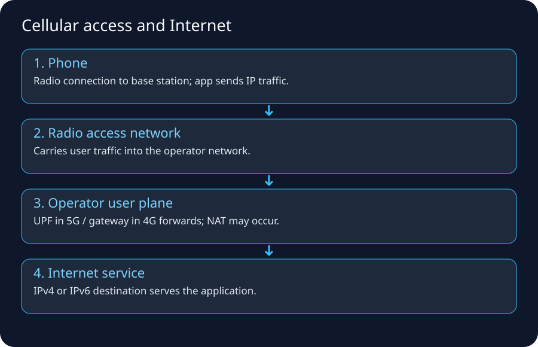

## 1. Why mobile data deserves its own flow

When your phone leaves Wi‑Fi and uses cellular data, the application still speaks IP to remote services, but the **access network and subscriber/session machinery are different**.

A useful simplified path is:

```text
App on phone
  ↓
IP stack on phone
  ↓
4G/5G radio access
  ↓
cell site / base station
  ↓
mobile transport/backhaul
  ↓
mobile packet core
  ↓
operator policy + address translation / Internet edge
  ↓
peering/transit
  ↓
website/cloud/CDN
```

This is deliberately simplified. Mobile cores contain many control-plane functions, policy/QoS functions, subscriber databases, and user-plane anchors.

## 2. Two planes: control plane vs user plane

This distinction is the key to understanding cellular networks.

### Control plane
Handles things such as:

- authentication/subscriber identity,
- mobility and registration,
- session establishment,
- policy/QoS decisions,
- selecting user-plane functions,
- signaling during handover.

### User plane
Carries the actual application packets after connectivity is established.

```text
Control plane: “Who is this subscriber and how should the session work?”
User plane:    “Carry these IP packets to/from the data network.”
```

In 5G terminology, the **UPF (User Plane Function)** is a major user-plane component that forwards UE traffic between the radio access side and Data Networks such as the Internet. GSMA descriptions of 5G connectivity model a PDU session as the connectivity abstraction between applications on the UE and a Data Network.

## 3. Terms you should recognize

| Term | Meaning at beginner level |
|---|---|
| UE | User Equipment: phone/modem/device |
| RAN | Radio Access Network |
| eNodeB | 4G/LTE base station term |
| gNB | 5G NR base station term |
| EPC | 4G Evolved Packet Core |
| 5GC | 5G Core |
| UPF | 5G user-plane forwarding/anchor function |
| PGW | 4G packet data network gateway function |
| APN | 4G-style access point/profile concept for data services |
| DNN | 5G Data Network Name; selects/identifies data-network connectivity context |
| PDU session | 5G connectivity session between UE and a data network |

You do not need to memorize every 3GPP interface to understand AWS networking. Learn the packet path and plane separation first.

## 4. Step 1 — the phone attaches/registers with the mobile network

Unlike home Wi‑Fi, cellular access is tightly integrated with operator subscriber identity and mobility.

Conceptually:

1. Phone discovers suitable radio service.
2. SIM/eSIM-based subscriber credentials participate in authentication.
3. Network establishes control-plane context.
4. The device requests packet-data connectivity.
5. Policy/session functions select how user traffic should be carried.
6. A user-plane path is established toward a Data Network such as the Internet.

The exact procedures differ by generation and deployment mode. The learning objective is not protocol-message memorization; it is to understand that **IP packets ride on top of a managed mobile session**.

## 5. Step 2 — the phone gets IP connectivity

The carrier provides addressing/session information. Depending on the network and device, the phone may receive IPv4, IPv6, or dual-stack connectivity.

For IPv4, carriers commonly use address sharing/NAT because public IPv4 space is scarce. The address shown inside the phone may not be the public address seen by an Internet website.

Possible simplified path:
```text
Phone IP
  ↓
mobile core user-plane tunnel
  ↓
carrier NAT/CGNAT
  ↓
public Internet address
```

IPv6 changes the addressing model because globally unique IPv6 addresses do not require IPv4-style NAT merely to conserve addresses, although firewall/policy controls are still needed.

## 6. Step 3 — radio traffic reaches the base station

Your IP packet is carried over radio protocols to the serving cell/base station. Radio conditions affect:

- latency,
- retransmissions,
- throughput,
- handover behavior,
- packet loss/jitter under congestion,
- power usage.

A full cellular stack is far more complex than “Wi‑Fi but farther.” Spectrum scheduling, mobility, QoS, and operator core behavior all participate.

## 7. Step 4 — transport/backhaul moves traffic into the packet core

Cell sites connect into provider transport networks using fiber, microwave, Ethernet/IP/MPLS, segment routing, or other carrier technologies. The provider must carry both control signaling and user traffic reliably across its network.

This middle network is largely invisible to the app. Your phone does not have a routing table entry for every cell-site/core router.

## 8. Step 5 — packet core forwards toward the Data Network

In 5G, user traffic is carried through the user-plane architecture to a UPF. A UPF can be placed centrally or closer to the edge depending on latency/service design.

Conceptual user-plane flow:

```text
UE
 -> gNB
 -> user-plane tunnel
 -> UPF
 -> Data Network (Internet/private enterprise network/edge application)
```

GSMA material describes the UPF as forwarding UE traffic between access networks such as 5G gNBs and Data Networks, with QoS enforcement under session-control policy.

## 9. Why carriers use multiple UPFs / local breakout

If every packet from every city had to travel to one distant national gateway before reaching a nearby app, latency and transport cost could be poor.

A provider can place user-plane functions closer to users or selected services:

```text
Phone in Atlanta
 -> local/regional UPF
 -> nearby CDN/edge service
```

instead of:

```text
Phone in Atlanta
 -> distant national core anchor
 -> back across network
 -> nearby destination
```

This is one reason mobile/edge architectures discuss local breakout.

## 10. What happens when you visit a website on mobile data

After the cellular session exists, application-layer behavior resembles other IP access methods:

```text
1. DNS lookup
2. destination IP selected
3. route/user-plane forwarding toward Internet
4. TCP handshake or QUIC setup
5. TLS handshake
6. HTTP request
7. response/data packets return through carrier path
```

The access network changed, but DNS/IP/transport/TLS/HTTP concepts remain reusable.

## 11. Mobile data vs Wi‑Fi: side-by-side

| Question | Home Wi‑Fi | Mobile data |
|---|---|---|
| First wireless hop | Wi‑Fi AP | cellular base station |
| Subscriber/auth model | local WLAN password/enterprise auth | SIM/eSIM + operator authentication |
| Gateway to wider network | home router/CPE | carrier packet core/user plane |
| Common IPv4 translation | home NAT, possibly ISP CGNAT | carrier CGNAT/NAT common |
| Mobility | usually reconnect/roam among WLAN APs | core/RAN designed for wide-area mobility/handover |
| Policy/QoS | home/enterprise WLAN policies | carrier subscriber/session/QoS policies |
| Internet routing | ISP after CPE | mobile operator Internet edge/peering |

## 12. Why your public IP changes when switching Wi‑Fi ↔ cellular

You changed access networks and therefore the Internet egress path.

```text
Wi-Fi:
phone -> home NAT -> home ISP -> Internet

Mobile:
phone -> carrier RAN/core -> carrier Internet edge -> Internet
```

The source public address seen by a website can change. Existing TCP sessions may break because the endpoint path/address changed unless a higher-level protocol/system supports mobility/resumption.

## 13. Tethering/hotspot: another NAT boundary can appear

When a phone shares mobile data as a hotspot, the phone may act like a small router for connected devices:

```text
Laptop private hotspot IP
 -> phone hotspot NAT/routing
 -> mobile session
 -> carrier NAT (possible)
 -> Internet
```

This can create multiple address-translation layers, similar to home NAT + CGNAT.

## 14. Enterprise private mobile networking

Mobile networks can connect devices to private enterprise networks rather than the public Internet. With appropriate carrier/private-5G design, the Data Network can be an enterprise environment or edge workload.

That means “mobile data” does not necessarily equal “public Internet.” The packet core can steer traffic according to the service/session design.

## 15. Troubleshooting mobile data by layer

### No cellular service
Check radio coverage, SIM/eSIM state, airplane mode, network registration.

### Signal exists but no data
Session/APN/DNN/subscriber provisioning, carrier outage, device IP configuration, policy.

### Some apps fail but others work
DNS, IPv4/IPv6 behavior, MTU, app endpoint, carrier filtering, TLS/certificate, service-specific issue.

### Works on Wi‑Fi, fails on mobile
Compare:

- resolved DNS answers,
- IPv4 vs IPv6 path,
- source address/geolocation restrictions,
- CGNAT/port behavior,
- MTU/path behavior,
- application WAF/rate-limiting policy.

### Works on mobile, fails on Wi‑Fi
Home DNS/router/ISP/firewall is more suspect than the destination application.

## 16. AWS connection: mobile client hitting an AWS app

A common path can be:

```text
Phone app
 -> carrier RAN + packet core
 -> carrier Internet edge
 -> Internet/peering
 -> Route 53-resolved endpoint
 -> CloudFront / API Gateway / ALB
 -> private application resources
```

The AWS VPC does not care that the first hop was 5G. By the time traffic arrives at the public AWS endpoint, it is IP traffic with source/destination addressing and transport/application protocol state.

## 17. Security implication: source IP may represent a shared carrier egress

With carrier NAT, many subscribers can share public IPv4 addresses over time or concurrently through port translation. Therefore:

- source IP is not a strong user identity,
- IP allowlists for consumer/mobile users can be brittle,
- rate limiting solely by source IP can unfairly group users,
- audit systems should use authenticated application identities in addition to network metadata.

## 18. Real-world mental exercise

Open a public “what is my IP” site on Wi‑Fi, note the address, then disable Wi‑Fi and repeat on cellular. Do not treat the result as sensitive credentials, but notice how the visible Internet egress identity changes.

Then test:

```text
DNS resolver behavior
IPv4 address
IPv6 availability
latency to same site
```

The goal is not benchmarking; it is observing that the **same phone/app can traverse two very different access networks**.

## 19. Internet/reference trail

- GSMA cellular ecosystem material describing 5G connectivity and UPF forwarding: https://www.gsma.com/solutions-and-impact/technologies/internet-of-things/wp-content/uploads/2023/02/ACJA_4_UAS_Cellular_Ecosystem_Whitepaper.pdf
- 3GPP specifications portal: https://portal.3gpp.org/
- Ericsson overview of packet core/user plane: https://www.ericsson.com/en/portfolio/cloud-software-and-services/cloud-core/packet-core/cloud-packet-core/packet-core-gateway
- RFC 6598 CGNAT shared space: https://www.rfc-editor.org/rfc/rfc6598

## 20. What to remember

> **Cellular changes the access and session machinery, not the fundamental need for DNS, IP routing, transport, security, and application protocols.**

Memory path:

```text
UE -> RAN -> mobile transport -> packet core/UPF -> carrier edge/NAT -> Internet -> service
```


---

# IP Addressing, Subnetting, NAT, PAT, CGNAT & IPv6


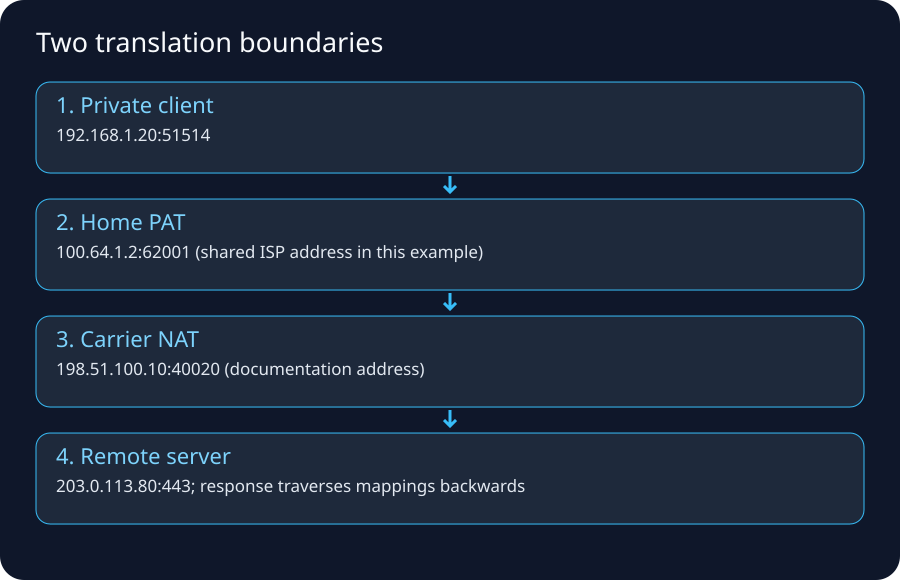

## 1. The address question

Every routed packet needs source and destination IP addresses. Before learning CIDR math, understand the job:

> **An IP address identifies an interface/end point in an IP routing context, and the prefix tells routers which block/network it belongs to.**

IPv4 is 32 bits. IPv6 is 128 bits.

## 2. IPv4 dotted decimal is just a human representation

```text
192.168.1.25
```

is four 8-bit numbers:

```text
192      168      1        25
11000000 10101000 00000001 00011001
```

Routers perform prefix comparisons in binary. Humans use CIDR notation to describe how many leading bits form the network prefix.

## 3. CIDR notation

```text
192.168.1.0/24
```

means the first 24 bits are the prefix.

A `/24` contains 256 total IPv4 addresses in the mathematical block. Whether all are assignable depends on platform/network rules. AWS reserves addresses within each subnet, so do not equate mathematical block size with usable AWS host count.

Common sizes:

| Prefix | Total IPv4 addresses | Mental shortcut |
|---:|---:|---|
| /16 | 65,536 | large VPC/site block |
| /20 | 4,096 | medium block |
| /24 | 256 | classic small LAN-sized block |
| /26 | 64 | quarter of a /24 |
| /27 | 32 | eighth of a /24 |
| /28 | 16 | small block |
| /32 | 1 | single IPv4 address/host route |

Formula:

```text
IPv4 block size = 2^(32 - prefix length)
```

## 4. How a host decides “same subnet or router?”

Host:

```text
IP: 10.20.30.25/24
```

Destination A:

```text
10.20.30.99
```

Same `/24` prefix -> local-link delivery.

Destination B:

```text
10.20.31.99
```

Different `/24` -> use a router according to routing table.

This is why an incorrect subnet mask/prefix can create bizarre connectivity: the host may incorrectly believe a remote IP is local and ARP for it, or incorrectly send a local peer to a router.

## 5. Private IPv4 ranges (RFC 1918)

The classic private ranges are:

```text
10.0.0.0/8
172.16.0.0/12
192.168.0.0/16
```

These can be reused by many organizations and are not globally routed as normal public Internet addresses.

### The overlap problem

Company A:

```text
10.0.0.0/8
```

Company B:

```text
10.0.0.0/8
```

If they later connect networks, overlapping addresses make routing ambiguous. This is a common legacy acquisition/VPN/cloud-migration problem.

AWS VPC IPAM and disciplined enterprise IP planning help reduce this risk, but they do not magically fix existing overlaps.

## 6. Public IPv4

A public IPv4 address is intended to be globally routable/unique in Internet routing space under the relevant allocation/announcement model.

Do not confuse:

```text
“public IP exists”
```

with:

```text
“the service is reachable from everyone.”
```

Reachability also needs routing, firewall/security permission, a listening service, and correct return path.

## 7. Special documentation ranges used in this guide

To avoid accidentally using real routable addresses in examples, documentation commonly uses ranges such as:

```text
192.0.2.0/24
198.51.100.0/24
203.0.113.0/24
```

Treat addresses from those blocks in diagrams as examples, not real targets.

## 8. NAT: what it actually changes

Network Address Translation rewrites address information as packets cross a translation boundary.

The most familiar case is source NAT for outbound IPv4:

```text
Inside packet:
src 10.0.1.25
 dst 198.51.100.20

After source NAT:
src 203.0.113.5
 dst 198.51.100.20
```

A translation table preserves enough state to map return traffic.

## 9. PAT/NAPT: why many private devices share one public IPv4

In common home/enterprise usage, address **and port** translation is involved.

```text
10.0.1.25:51001 -> 203.0.113.5:62001
10.0.1.26:51001 -> 203.0.113.5:62002
```

The same public address can represent many simultaneous flows because translated ports distinguish mappings.

AWS documentation explicitly notes that what industry commonly calls NAT devices perform both address and port translation in these scenarios.

## 10. Static one-to-one NAT vs dynamic/PAT

### One-to-one mapping
A public address maps predictably to one inside address. Enterprise firewalls often support static NAT for published servers.

### Dynamic source NAT/PAT
Many inside clients share one/few outside addresses for outbound sessions.

### Destination NAT / port forwarding
Inbound traffic to a public address/port is translated toward an internal server.

Example:

```text
203.0.113.10:443 -> 10.0.10.50:443
```

A reverse proxy/load balancer can also publish applications, but that is application/proxying rather than merely packet address translation.

## 11. NAT is not a security architecture by itself

It is tempting to say “private IP = secure.” That is incomplete.

Security depends on:

- ingress/egress policy,
- stateful firewall behavior,
- application authentication,
- patching,
- segmentation,
- logging/monitoring,
- route exposure,
- identity and data controls.

NAT can incidentally block unsolicited inbound flows if no mapping/publishing exists, but its primary conceptual job is translation.

## 12. CGNAT: NAT operated by the provider

RFC 6598 defines:

```text
100.64.0.0/10
```

as Shared Address Space for carrier/service-provider use with CGN.

Possible chain:

```text
Laptop 192.168.1.25
 -> home router 100.64.5.10
 -> ISP CGN public 203.0.113.20
 -> Internet
```

Problems/implications include:

- harder inbound hosting/port forwarding,
- shared public source addresses,
- need for port/time metadata in abuse investigations,
- application rate limiting by public IP may group unrelated subscribers.

## 13. AWS public IPv4 is a useful non-obvious example

For EC2, AWS documentation explains that a public IPv4 displayed for an instance is mapped to its primary private IPv4 through NAT. Inside the instance OS, tools such as `ip addr`/`ifconfig` show the private address rather than that public IPv4 as a directly configured NIC address.

The Internet Gateway performs one-to-one NAT behavior for instance public IPv4/Elastic IP traffic as part of Internet connectivity.

This is an excellent example of why you should distinguish:

```text
logical/public addressing shown by the cloud control plane
```

from

```text
address configured on the guest network interface
```

## 14. Subnetting exercise: split a /24

Start:

```text
10.0.8.0/24
```

Split into four equal blocks -> borrow two more prefix bits:

```text
10.0.8.0/26
10.0.8.64/26
10.0.8.128/26
10.0.8.192/26
```

Each `/26` contains 64 mathematical addresses.

### Pattern shortcut

For IPv4:

```text
/24 256
/25 128
/26 64
/27 32
/28 16
/29 8
/30 4
/31 2 (special point-to-point use possible)
/32 1
```

Each extra prefix bit halves the block.

## 15. VLSM planning example

Need:

```text
App subnet A: ~100 hosts
App subnet B: ~100 hosts
DB subnet A:  ~30 hosts
DB subnet B:  ~30 hosts
Ops subnet:   ~20 hosts
```

Do not assign arbitrary `/24`s just because they are easy. Plan growth, AZ duplication, container/pod/ENI consumption, load balancer ENIs, endpoints, and future network connections.

A cloud subnet can run out of IPs before CPU or storage becomes the bottleneck.

## 16. IPv6: key conceptual differences

IPv6 has a much larger address space and globally unique addressing is common. In AWS, IPv6 addresses are globally unique/public by default in the addressing sense.

That does **not** mean “open to the Internet.” Route tables and security controls still decide reachability.

For AWS outbound-only IPv6 from private workloads, an **egress-only Internet Gateway** can allow outbound communication while preventing Internet-initiated IPv6 connections.

### Important NAT contrast

```text
IPv4 private egress: usually NAT Gateway in AWS
IPv6 private egress: no address-conservation NAT required; use egress-only IGW for outbound-only Internet pattern
```

## 17. Dual stack

A dual-stack workload can have both IPv4 and IPv6. DNS may return A and AAAA records. Client behavior may prefer one family depending on OS/network reachability.

Troubleshooting rule:

> When “some clients work, some fail,” compare IPv4 and IPv6 separately.

It is possible to have healthy IPv4 routing but broken IPv6 routing, DNS, firewall policy, or vice versa.

## 18. Longest-prefix match preview

A router with:

```text
0.0.0.0/0        -> Internet
10.0.0.0/8       -> internal WAN
10.20.0.0/16     -> site B
10.20.30.0/24    -> special firewall
10.20.30.50/32   -> host-specific next hop
```

sending to `10.20.30.50` selects `/32`, because it is the most specific matching prefix.

This rule is foundational in enterprise routing and AWS route tables.

## 19. Address plan mistakes that hurt later

- Using overlapping RFC1918 ranges everywhere.
- Allocating subnets with no growth room.
- Forgetting Kubernetes/container ENI/pod IP consumption.
- Treating IPs as permanent server identities.
- Hardcoding IPs where DNS/service discovery should be used.
- Mixing “subnet is public” with “address is public.”
- Ignoring IPv6 when clients can reach the service over AAAA records.

## 20. Quick packet translation dry run

Client sends:

```text
10.0.1.25:51514 -> 198.51.100.20:443
```

NAT chooses:

```text
203.0.113.5:62001
```

Internet sees:

```text
203.0.113.5:62001 -> 198.51.100.20:443
```

Server responds:

```text
198.51.100.20:443 -> 203.0.113.5:62001
```

NAT table finds mapping and rewrites:

```text
198.51.100.20:443 -> 10.0.1.25:51514
```

If the state expires, an unexpected later inbound packet may no longer map to the inside client.

## 21. AWS mapping

| Addressing concept | AWS object/behavior |
|---|---|
| network address plan | VPC CIDR / IPAM pool |
| subnet prefix | subnet CIDR |
| workload address | ENI private IPv4/IPv6 |
| stable public IPv4 | Elastic IP where supported |
| outbound private IPv4 translation | NAT Gateway |
| instance public IPv4 mapping | IGW/public IPv4 mapping behavior |
| outbound-only IPv6 edge | egress-only Internet Gateway |
| service-private path | VPC endpoint / PrivateLink depending service pattern |

## 22. Internet/AWS references

- RFC 1918: https://www.rfc-editor.org/rfc/rfc1918
- RFC 6598: https://www.rfc-editor.org/rfc/rfc6598
- EC2 IP addressing: https://docs.aws.amazon.com/AWSEC2/latest/UserGuide/using-instance-addressing.html
- AWS public IPv4 mapping: https://docs.aws.amazon.com/AWSEC2/latest/UserGuide/working-with-ip-addresses.html
- AWS Internet Gateway: https://docs.aws.amazon.com/vpc/latest/userguide/VPC_Internet_Gateway.html
- AWS egress-only IGW: https://docs.aws.amazon.com/vpc/latest/userguide/egress-only-internet-gateway.html

## 23. Memory tricks

```text
CIDR: more /bits = smaller network
/24 = 256, /25 = 128, /26 = 64 ...

NAT: rewrite address
PAT: rewrite/use ports too
CGNAT: provider-owned large-scale NAT

IPv4 private egress in AWS -> NAT GW
IPv6 outbound-only in AWS -> egress-only IGW
```


---

# Routing, ISPs, Autonomous Systems, BGP, Peering & Transit


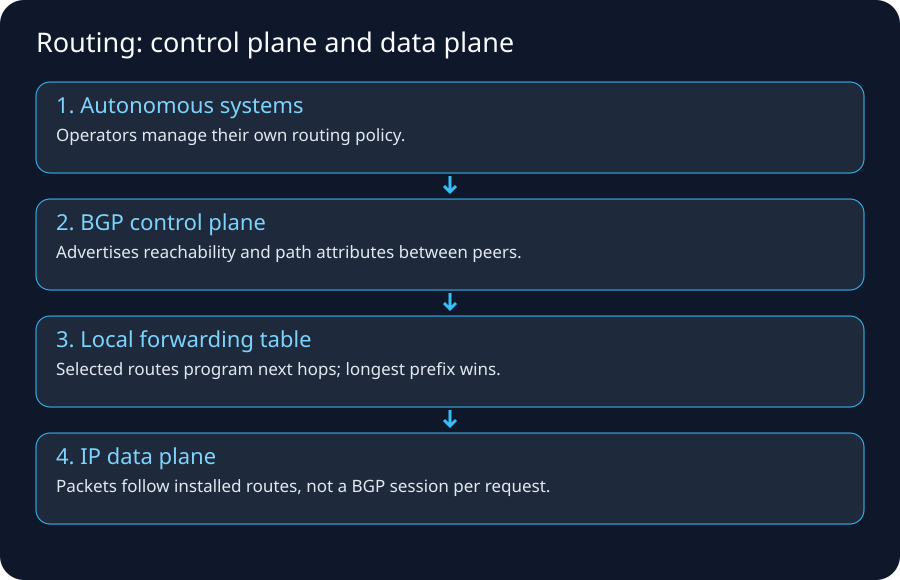

## 1. Routing in one sentence

> **Routing is the process of selecting a next hop/interface for a packet based primarily on its destination IP prefix and the routes known to the device.**

A router usually does not know the complete future path of one packet. It knows its own routing table and forwards to a next hop. The next router repeats the process.

## 2. The routing table mental model

Example:

```text
Destination          Next hop / target
10.0.0.0/8           internal-router
172.16.50.0/24       vpn-tunnel
198.51.100.0/24      peer-A
0.0.0.0/0            isp-default
```

For destination `198.51.100.25`, the `/24` route is more specific than `0.0.0.0/0`, so it wins.

### Longest prefix match

This principle appears everywhere:

- host routing tables,
- enterprise routers,
- AWS VPC route tables,
- Transit Gateway route tables.

AWS explicitly documents most-specific/longest-prefix matching as the normal route-selection behavior before additional route-priority rules.

## 3. Connected, static, default and dynamic routes

### Connected route
A network is directly attached to an interface.

### Static route
An administrator explicitly configures destination -> next hop.

### Default route
Catch-all route such as:

```text
0.0.0.0/0 -> ISP
::/0      -> IPv6 upstream
```

### Dynamic route
A routing protocol learns reachability from other routers and installs/selects routes according to protocol rules/policy.

Examples in enterprises include OSPF, IS-IS, BGP; exact usage varies.

## 4. Why you do not put “the whole Internet” into a home router manually

A home router normally sends unknown destinations to its ISP via a default route. The ISP participates in much larger routing systems and knows many prefixes.

```text
Laptop: “not local -> gateway”
Home router: “not local -> ISP”
ISP edge/core: “this prefix -> this backbone/peer/transit path”
Destination AS: “this prefix is mine -> deliver internally”
```

Each device only needs the level of routing knowledge appropriate to its role.

## 5. Autonomous Systems: the Internet as organizations

An **Autonomous System (AS)** is a routing domain under common administrative control that presents routing policy to other networks. ISPs, cloud providers, CDNs, large enterprises, universities, and carriers can operate ASes.

Each participating AS can use an Autonomous System Number (ASN) for external BGP routing.

Think:

```text
Internet = many ASes + links + agreements + routing policy
```

not:

```text
Internet = one company/router hierarchy
```

## 6. BGP: what it really does

Border Gateway Protocol exchanges reachability information for IP prefixes between routing domains and applies policy to choose/advertise paths.

Cloudflare's BGP learning material describes the Internet as many autonomous systems exchanging routes, and correctly notes that route choice can include business/policy considerations rather than merely geographic distance.

### Do not memorize this wrong sentence

> “BGP chooses the shortest path.”

Better:

> **BGP chooses a best path according to attributes and operator policy. AS-path length can matter, but it is not the only consideration.**

## 7. BGP simplified example

Suppose AS65010 owns:

```text
198.51.100.0/24
```

It advertises that prefix to two upstream networks:

```text
           ISP A (AS65001)
          /
AS65010 --
          \
           ISP B (AS65002)
```

Other networks learn one or more possible AS paths. Their policies determine which path becomes preferred for forwarding toward that prefix.

## 8. Peering vs transit

### Peering
Networks exchange traffic directly, typically for their own/customer routes according to policy/agreement.

### Transit
A customer network pays an upstream provider for broader/global Internet reachability.

### Why this matters

Two companies in the same city may send traffic through a distant path if they lack direct peering or policy selects another route. A CDN invests heavily in peering/edge presence to bring content closer in network terms.

## 9. Internet Exchange Point (IXP)

An IXP is shared interconnection infrastructure where multiple networks can connect and exchange traffic. It reduces the need for a unique physical circuit between every pair of networks.

Conceptually:

```text
ISP A ---+
CDN   ---+--- IXP switching fabric
Cloud ---+
ISP B ---+
```

BGP sessions and policy determine what routes/traffic are exchanged.

## 10. Interior vs exterior routing

A large ISP can use one set of protocols/technologies internally and BGP externally.

```text
inside AS:  IGP / MPLS / segment routing / iBGP design
between AS: eBGP at boundaries
```

You do not need to master carrier architecture for AWS, but this prevents the misconception that every Internet router talks eBGP directly to every other router.

## 11. The data plane vs routing/control plane

### Control plane
Learns/selects routes, runs routing protocols, builds forwarding state.

### Data plane
Forwards actual packets using that state.

This is analogous to cloud control plane vs packet data path:

```text
AWS API: configure route table
VPC data plane: forward packets according to route table
```

## 12. Asymmetric routing

The forward and return path may differ:

```text
Client -> ISP A -> Transit X -> Server
Server -> Peer Y -> ISP B -> Client
```

The Internet does not promise symmetric hop-by-hop paths.

Why it matters:

- stateful middleboxes often need both directions,
- on-prem firewalls can drop return traffic if it bypasses the expected appliance,
- AWS Network Firewall stateful inspection requires correct/symmetric routing through inspection endpoints for flows being inspected.

## 13. ECMP and multiple next hops

Networks can use multiple equal-cost paths to distribute traffic. Hashing may keep packets of a flow on a consistent path while different flows use different paths.

Do not assume one traceroute run represents every flow or every moment.

## 14. Route convergence and failures

If a link/router disappears, routing systems need time to detect the failure and select/propagate alternatives. During convergence, packets can be lost or paths can change.

High availability therefore involves more than owning two circuits; you must design:

- route advertisement,
- failure detection,
- policy,
- stateful firewall symmetry,
- DNS/app failover behavior,
- capacity on surviving paths.

## 15. TTL/Hop Limit and traceroute

IPv4 TTL / IPv6 Hop Limit decreases as routers forward packets. `traceroute` exploits expiration behavior to infer hops by sending probes with increasing limits.

But traceroute is not a perfect truth source:

- routers can filter diagnostic responses,
- MPLS/tunnels can hide details,
- asymmetric paths can differ,
- load balancing can show varying hops,
- asterisks do not necessarily mean forwarding is broken.

## 16. Route summarization

Instead of advertising hundreds of small prefixes individually, networks can aggregate contiguous ranges where design permits.

Example:

```text
10.20.0.0/24
10.20.1.0/24
...
10.20.255.0/24
```

can potentially be represented as:

```text
10.20.0.0/16
```

Summarization reduces routing-state complexity but can create blackholes if the summary is advertised where some subranges are not actually reachable.

## 17. Legacy enterprise Internet edge

A serious enterprise might have:

```text
             ISP A
               |
          Edge Router A
             /   \
LAN/DMZ -- Firewall pair
             \   /
          Edge Router B
               |
             ISP B
```

BGP can advertise enterprise-owned public prefixes to multiple ISPs. Firewalls/NAT sit in or near the path. Redundancy protocols, routing policy, and failover behavior must all agree.

For smaller companies, the provider may simply assign addresses/default routes without the enterprise running public BGP.

## 18. AWS route table mapping

AWS VPC route table example:

```text
10.0.0.0/16    local
10.50.0.0/16   tgw-1234
0.0.0.0/0      nat-1234
```

For destination `10.50.2.8`, the `/16` Transit Gateway route is more specific than the default NAT route.

### Public subnet

```text
10.0.0.0/16    local
0.0.0.0/0      igw-1234
```

### Private app subnet

```text
10.0.0.0/16    local
0.0.0.0/0      nat-az-a
```

The route table does not itself grant firewall permission; route and policy are separate questions.

## 19. Transit Gateway as a cloud routing hub

When dozens/hundreds of VPCs and on-prem connections exist, full-mesh VPC peering becomes operationally difficult. Transit Gateway provides a regional transit hub with attachments and its own route tables/segmentation model.

Legacy analogy:

```text
WAN/core router hub  <-> Transit Gateway
```

But remember it is a managed cloud service with AWS-specific attachment and routing semantics, not a virtual Cisco CLI box.

## 20. Direct Connect and VPN routing

### Site-to-Site VPN
Encrypted IPsec tunnels over Internet connectivity. Routes can be static or dynamically exchanged with BGP depending on setup.

### Direct Connect
Dedicated/private connectivity from your network through a Direct Connect location/provider arrangement into AWS connectivity constructs. BGP is used for route exchange on virtual interfaces.

Common hybrid design uses Direct Connect as primary with VPN backup, but actual topology, failure domains, bandwidth, and route preference need explicit design/testing.

## 21. BGP failure/attack concepts you should recognize

Because BGP is trust/policy-heavy, route leaks and hijacks can send traffic to unexpected networks. Operators mitigate with mechanisms such as route filtering, prefix limits, and RPKI-based Route Origin Validation where deployed.

You do not need to become an Internet routing security specialist to understand the lesson:

> **DNS security and TLS are not substitutes for correct routing security, and routing security is not a substitute for end-to-end application authentication/encryption. They protect different layers.**

## 22. Dry run — where does this packet go?

Routes:

```text
0.0.0.0/0        -> Internet
10.0.0.0/8       -> Corporate WAN
10.20.0.0/16     -> Site B
10.20.30.0/24    -> Inspection firewall
10.20.30.50/32   -> Emergency host route
```

Destinations:

```text
8.8.8.8       -> /0 Internet
10.99.1.2     -> /8 Corporate WAN
10.20.9.9     -> /16 Site B
10.20.30.88   -> /24 Inspection firewall
10.20.30.50   -> /32 Emergency host route
```

Always choose the most specific matching prefix first.

## 23. Common wrong mental models

- “Default route means Internet.” It means **catch-all next hop**; that next hop could be a firewall, VPN, TGW, or blackhole.
- “BGP knows application ports.” Normal IP route selection is prefix/policy based, not HTTP endpoint based.- “More hops always means slower.” Physical distance, congestion, link capacity, queuing, and processing matter too.
- “Traceroute shows the exact packet path.” It is a diagnostic approximation.
- “Two links means HA.” Routing/failover/state/capacity design decides HA.

## 24. Best Internet/AWS examples

- Cloudflare BGP explanation: https://www.cloudflare.com/learning/security/glossary/what-is-bgp/
- AWS VPC route priority / longest-prefix match: https://docs.aws.amazon.com/vpc/latest/userguide/route-tables-priority.html
- AWS Transit Gateway: https://docs.aws.amazon.com/vpc/latest/tgw/what-is-transit-gateway.html
- AWS VPN routing: https://docs.aws.amazon.com/vpn/latest/s2svpn/VPNRoutingTypes.html
- AWS Direct Connect: https://docs.aws.amazon.com/directconnect/latest/UserGuide/Welcome.html

## 25. Memory trick

> **Prefix tells where; route tells next hop; BGP tells networks what prefixes are reachable under policy.**


---

# DNS → Routing → TCP/QUIC → TLS → HTTP: A Browser Request in Time Order


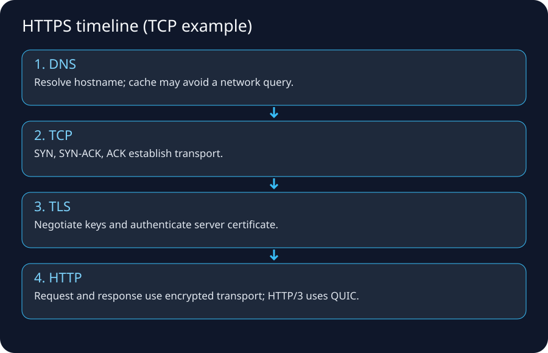

## 1. The mistake this lecture fixes

When someone says “the website is down,” at least five different systems may be failing:

```text
Name resolution
IP routing
transport connection
TLS/security negotiation
HTTP/application behavior
```

A good engineer identifies **which stage failed** before changing anything.

## 2. Scenario

You enter:

```text
https://api.example.com/orders?id=42
```

Assume DNS eventually returns:

```text
api.example.com -> 198.51.100.20
```

We will trace the request from name to application response.

## 3. URL anatomy

```text
https://api.example.com:443/orders?id=42
|       |                |   |
scheme  hostname         port path/query
```

The port is often implicit:

```text
HTTP  -> 80 by convention
HTTPS -> 443 by convention
```

The hostname participates in DNS and TLS/HTTP behavior. It is not interchangeable with the IP address.

## 4. DNS: the naming layer

DNS translates names to records. For web access, A records can provide IPv4 addresses and AAAA records IPv6 addresses. CNAME and alias-style provider records can add indirection.

A full uncached conceptual lookup:

```text
Browser/OS stub
    |
    v
Recursive resolver
    |
    +--> Root server: “who handles .com?”
    |
    +--> .com TLD: “who is authoritative for example.com?”
    |
    +--> authoritative nameserver: “what is api.example.com?”
    |
    v
Answer cached and returned to client
```

Cloudflare's DNS tutorial uses this same resolver → root → TLD → authoritative mental model.

## 5. Caching changes what you observe

The answer might already be cached in:

- browser/application cache,
- OS stub resolver/cache,
- local router/enterprise DNS,
- recursive resolver.

Therefore, changing a DNS record does not guarantee every client sees the new value immediately. TTLs and negative caching matter.

### Debugging commands

```bash
nslookup api.example.com
dig api.example.com A
dig api.example.com AAAA
dig +trace example.com
```

`+trace` is a useful learning tool but differs from a normal recursive lookup path.

## 6. DNS can return different answers to different users

Reasons include:

- CDN/geo/latency routing,
- weighted routing,
- health-based failover,
- split-horizon/private DNS,
- IPv4 vs IPv6,
- resolver geography,
- cached older answer.

So “it resolves for me” does not prove another user's DNS path is identical.

## 7. AWS DNS mapping

### Route 53 authoritative DNS
Hosts public/private DNS zones and routing policies.

### VPC Resolver
AWS provides a DNS resolver to VPC resources. Current AWS docs describe the VPC Resolver/AmazonProvidedDNS as integrated into each AZ and reachable via special addresses including the VPC base + 2 IPv4 address and link-local resolver addresses.

### Route 53 Resolver endpoints/rules
Used to integrate VPC DNS with on-premises DNS systems for hybrid resolution.

A common hybrid failure:

```text
EC2 can route to on-prem network
BUT
internal.corp does not resolve
```

The route is fine; DNS forwarding/rules are wrong.

## 8. After DNS: choose a route to the returned IP

Suppose answer is `198.51.100.20`. The host routing table decides where the packet should go.

Typical home host:

```text
192.168.1.0/24 -> local
0.0.0.0/0      -> 192.168.1.1
```

The host does not ask DNS for a router. DNS answered the name question; the routing table answers the next-hop question.

## 9. TCP handshake

For classic HTTPS over TCP:

```text
Client                                  Server
51514 -> 443   SYN -------------------->
               <---------------- SYN/ACK
               ACK -------------------->
```

After this, both endpoints have connection state.

### Common outcomes

#### Connection timeout
Possible causes:

- route missing/blackhole,
- firewall silently drops,
- destination down,
- load balancer has no reachable path,
- return route missing,
- severe network loss.

#### Connection refused
Often means the destination path is reachable and something actively rejected the connection—commonly no process is listening on that port or a device sent a reset.

#### Immediate ICMP unreachable
A router/host is explicitly reporting a reachability problem.

The exact interpretation depends on environment, but these symptoms are more informative than “network issue.”

## 10. TCP source and destination ports

```text
client 192.168.1.25:51514
server 198.51.100.20:443
```

The server does **not** respond to destination port 443 on the client. It responds to the client's ephemeral port:

```text
server 198.51.100.20:443
 -> client 192.168.1.25:51514
```

This is why a stateful firewall can allow an outbound connection and automatically allow its response without a blanket inbound rule for port 443 on the client.

## 11. TCP reliability at beginner level

TCP numbers bytes, acknowledges received data, retransmits missing data, and implements flow/congestion control. It makes a lossy packet network look like a reliable ordered byte stream to the application under normal conditions.

But TCP cannot fix:

- a dead destination,
- permanent firewall blocks,
- application protocol bugs,
- excessive latency beyond application timeouts.

## 12. TLS: identity + confidentiality + integrity

After TCP is available, HTTPS performs TLS negotiation.

Modern TLS conceptually accomplishes:

1. agree on protocol/cryptographic parameters,
2. authenticate the server using its certificate/private-key proof and trust chain,
3. derive shared session keys,
4. protect subsequent application data with symmetric cryptography.

Cloudflare's TLS explanation notes that TLS handshakes authenticate, negotiate algorithms, and establish session keys; TLS 1.3 reduces handshake complexity compared with older versions.

## 13. Certificate hostname validation

If you request:

```text
https://api.example.com
```

the certificate needs to be valid for that hostname according to certificate rules. Connecting directly to the raw IP can produce a certificate/name mismatch even when routing and TCP work.

This is a frequent mistake when testing ALB/CloudFront/custom domains.

## 14. SNI: one IP can serve many TLS hostnames

Server Name Indication lets a client indicate the intended hostname during TLS negotiation so a shared endpoint can select an appropriate certificate/configuration.

This helps explain how CDNs/load balancers host many domains behind shared edge addresses.

## 15. HTTP: finally, application semantics

After the secure channel exists:

```http
GET /orders?id=42 HTTP/1.1
Host: api.example.com
Authorization: Bearer ...
```

Possible responses:

```text
200 OK        application succeeded
301/302       redirect
400           malformed/client request issue
401           authentication required/failed
403           understood but not permitted/policy block
404           route/resource not found
429           rate limit/throttling
500           application/server error
502/503/504   proxy/upstream/unavailable/timeout patterns
```

Do not map every 5xx to “network.” A load balancer can have perfect network connectivity to the client and still return 503 because no targets are healthy.

## 16. One browser page creates many dependency flows

HTML may reference:

```text
CSS from CDN A
JavaScript from CDN B
fonts from provider C
images from object storage/CDN
API calls to api.example.com
analytics endpoint
identity provider
```

Thus:

```text
“homepage HTML returned” != “page fully works”
```

Use browser developer tools/network waterfall to identify which dependent hostname/request failed.

## 17. HTTP/2 and HTTP/3 mental model

### HTTP/2
Typically runs over one TCP/TLS connection and multiplexes streams, reducing some connection overhead compared with older HTTP/1.1 usage patterns.

### HTTP/3
Runs over QUIC on UDP. QUIC integrates cryptographic/transport behavior and supports multiplexed streams without TCP's exact head-of-line behavior across all streams.

For troubleshooting, remember that “HTTPS” traffic may not always be TCP/443; HTTP/3 commonly uses QUIC/UDP on port 443.

## 18. Proxy and load balancer connection boundaries

A reverse proxy/load balancer can terminate one client connection and create a different backend connection:

```text
Client --TLS/TCP--> ALB --HTTP/TCP or HTTPS/TCP--> app target
```

Therefore there can be two distinct failures:

- client ↔ load balancer,
- load balancer ↔ target.

Logs/metrics and health checks help identify which boundary is broken.

## 19. TLS termination patterns

### At edge/CDN

```text
Client TLS -> CloudFront
CloudFront -> origin connection
```

### At ALB

```text
Client TLS -> ALB :443
ALB -> app :8080 or :443
```

### Pass-through to server
Layer-4 designs can forward encrypted traffic without terminating it at that intermediate layer.

Each pattern changes:

- certificate ownership,
- visibility for WAF/L7 routing,
- client IP propagation method,
- backend encryption,
- troubleshooting evidence.

## 20. DNS vs load balancing

DNS can return endpoint addresses, but DNS itself does not continuously proxy the connection.

Example:

```text
Route 53 -> returns ALB name/address mapping
Client -> directly establishes connection to ALB endpoint
```

This is why DNS TTL and load-balancer health are different layers.

## 21. Packet walk with state table

| Stage | Source → destination | What was solved? | Best evidence |
|---|---|---|---|
| DNS | client → resolver | hostname → record | `dig`, resolver logs |
| route | client/router | next hop | route table, traceroute |
| TCP | client ephemeral → 443 | transport session | `nc`, SYN/SYN-ACK capture |
| TLS | client ↔ TLS endpoint | encryption + server identity | `openssl s_client`, `curl -v` |
| HTTP | browser → web endpoint | app request | access logs/status/body |
| backend | LB/proxy → target | upstream request | LB logs, target logs/metrics |

## 22. Practical debugging commands

```bash
# DNS
dig api.example.com

# Does TCP 443 open?
nc -vz api.example.com 443

# Observe TLS and HTTP
curl -v https://api.example.com/

# Inspect certificate/TLS
openssl s_client -connect api.example.com:443 -servername api.example.com

# Route/hops
traceroute api.example.com
# or Windows: tracert
```

Use these only against systems/networks where you are authorized to test.

## 23. AWS example: browser to private app tier

```text
Browser
  ↓ DNS
Route 53
  ↓
CloudFront/WAF (optional)
  ↓ TLS/HTTP
ALB :443
  ↓ target selection
App :8080 in private subnet
  ↓
RDS :5432
```

Debug each boundary independently:

```text
DNS correct?
CloudFront origin healthy?
ALB listener/certificate?
ALB SG to app SG?
target group health?
app listening 8080?
app SG to DB SG 5432?
DB connection/auth?
```

## 24. Best references

- Cloudflare DNS: https://www.cloudflare.com/learning/dns/what-is-dns/
- Cloudflare recursive DNS: https://www.cloudflare.com/learning/dns/what-is-recursive-dns/
- Cloudflare TLS handshake: https://www.cloudflare.com/learning/ssl/what-happens-in-a-tls-handshake/
- AWS VPC Resolver: https://docs.aws.amazon.com/Route53/latest/DeveloperGuide/resolver.html
- AWS Amazon DNS concepts: https://docs.aws.amazon.com/vpc/latest/userguide/AmazonDNS-concepts.html

## 25. Memory trick

> **Resolve → Route → Connect → Encrypt → Request.**

```text
DNS -> IP route -> TCP/QUIC -> TLS -> HTTP
```

When debugging, identify the first arrow that fails.


---

# Ingress, Egress, Firewalls, WAF, Proxies, DMZ & Stateful vs Stateless Filtering


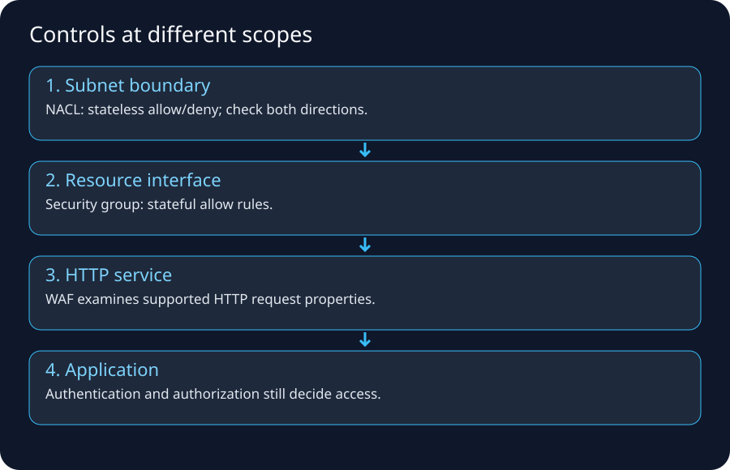

## 1. Start with the boundary

“Ingress” and “egress” are relative terms.

For an application VPC:

```text
Internet -> VPC/application = ingress
VPC/application -> Internet = egress
```

For a database subnet:

```text
app subnet -> DB subnet = ingress to DB subnet
DB response -> app subnet = egress from DB subnet
```

Always say **ingress to what** or **egress from what**.

## 2. A firewall is a policy enforcement point, not one specific product

A network firewall monitors/controls traffic based on rules. Products differ in what context they inspect:

- packet header only,
- connection state,
- protocol/application metadata,
- TLS-decrypted content where configured,
- signatures/IPS rules,
- domain/URL/user identity integrations.

Cloudflare's firewall primer correctly frames a firewall as controlling traffic between trust boundaries and emphasizes both inbound and outbound control.

## 3. Stateless filtering

A stateless rule evaluates packets independently.

Example:

```text
allow inbound TCP dst port 443
```

That rule does not automatically imply:

```text
allow return packets to client ephemeral ports
```

unless separate rules cover them.

### AWS analogy
Network ACLs are stateless. AWS documentation specifically warns that return traffic must satisfy NACL rules independently.

## 4. Stateful filtering

A stateful firewall tracks connection/flow state.

If policy allows:

```text
client -> server TCP 443
```

return packets that belong to that established allowed flow can normally pass without an independent broad inbound/outbound rule for the reverse ephemeral port.

### AWS analogy
Security Groups are stateful. Response traffic for an allowed flow is recognized as part of the stateful model.

## 5. The ephemeral-port trap

Client initiates:

```text
client:51514 -> server:443
```

Server responds:

```text
server:443 -> client:51514
```

A stateless ACL must permit the relevant reverse-direction ephemeral-port traffic. This is one reason NACL rules are easier to misconfigure than Security Groups for ordinary application flows.

## 6. Layer 3/4 network firewall vs Layer 7 WAF

### Network firewall
Common decision inputs:

```text
source/destination IP
protocol
source/destination port
connection state
IDS/IPS signatures/domain rules depending product
```

### Web Application Firewall (WAF)
Understands HTTP/application-layer concepts such as:

```text
URI path
headers
query strings
HTTP methods
request body patterns
SQLi/XSS signatures
rate-based web rules
```

A WAF is not a replacement for subnet/port-level firewalling. A network firewall is not automatically aware that `/admin/deleteUser` is a dangerous HTTP request.

## 7. Host firewall vs network firewall

A server can have local firewall rules:

```text
Linux nftables/iptables/firewalld
Windows Defender Firewall
```

Even if every upstream firewall allows TCP 443, the host firewall can still block the connection.

Troubleshooting therefore asks:

```text
perimeter policy?
subnet policy?
resource/ENI policy?
host firewall?
process listening?
```

## 8. DMZ/perimeter zone

Traditional enterprises often expose Internet-facing components in a separate perimeter network/DMZ rather than placing them directly inside trusted application/database networks.

Classic pattern:

```text
Internet
  ↓
edge router
  ↓
external firewall
  ↓
DMZ: reverse proxy/WAF/load balancer
  ↓
internal firewall
  ↓
application network
  ↓
DB network
```

The DMZ limits how far an Internet-facing compromise can move without crossing additional policy boundaries.

AWS Prescriptive Guidance still uses the perimeter-zone idea when explaining migrations to architectures with CloudFront/WAF, Network Firewall, ALB, and routed inspection.

## 9. North–south inspection

North–south traffic crosses an environment/perimeter:

```text
Internet -> workload
workload -> Internet
on-prem -> cloud
cloud -> on-prem
```

Controls may include:

- DDoS protection,
- edge WAF,
- network firewall/IPS,
- reverse proxy/load balancer,
- NAT,
- egress proxy/domain allowlists.

## 10. East–west inspection

East–west traffic moves inside the environment:

```text
web -> app
app -> DB
VPC A -> VPC B
workload -> shared service
```

Legacy networks often relied heavily on VLANs + internal firewalls. Cloud environments can combine Security Groups, network firewalls, Transit Gateway route segmentation, Kubernetes policies, service-mesh/mTLS, and identity-based application controls.

## 11. Egress security is as important as ingress

If an attacker compromises an application, unrestricted egress can enable:

- command-and-control,
- data exfiltration,
- malware download,
- calls to unauthorized external services.

Legacy enterprises frequently use outbound firewalls/proxies and domain/category filtering. AWS designs can use:

- restrictive Security Groups where practical,
- AWS Network Firewall domain/rule policies,
- centralized egress VPCs,
- NAT Gateway with fixed Elastic IPs for vendor allowlists,
- VPC endpoints to keep AWS-service traffic off NAT/Internet paths.

## 12. Proxy vs firewall vs NAT vs load balancer

| Component | Main job | Does it usually create a new app/transport connection? |
|---|---|---|
| Router | forward packets between networks | no |
| NAT | translate address/port | no app proxy required |
| Stateful firewall | permit/deny flows with state | typically no app proxy required |
| Forward proxy | makes requests on behalf of clients | yes |
| Reverse proxy | receives client requests for servers | yes |
| Load balancer | distribute flows/requests | depends on L4/L7 implementation; often distinct frontend/backend state |
| WAF | inspect HTTP requests | usually attached/integrated at an L7 proxy/service |

These boxes can be combined in products, which is why enterprise diagrams sometimes show one appliance performing several roles.

## 13. Forward proxy

Used by clients for outbound access:

```text
Employee browser -> corporate proxy -> Internet
```

Benefits can include:

- URL/domain policy,
- authentication/user attribution,
- malware scanning,
- logging,
- controlled egress addresses.

## 14. Reverse proxy

Used by servers/applications:

```text
Internet client -> reverse proxy -> backend server
```

The client thinks it is talking to the service endpoint. The reverse proxy can terminate TLS, route by hostname/path, enforce headers, cache, and shield origin topology.

ALB and CloudFront can participate in reverse-proxy-like roles at different scopes.

## 15. IDS vs IPS

### IDS
Detects/alerts on suspicious traffic.

### IPS
Can actively block/drop traffic based on detection rules/policy.

Modern managed firewalls can provide both inspection and prevention behavior.

AWS Network Firewall includes stateless and stateful rule engines and supports Suricata-compatible stateful rules. Deployment design must route traffic through the firewall endpoints.

## 16. Why symmetric routing matters to stateful firewalls

Stateful inspection wants to observe both directions of the same flow.

Bad topology:

```text
request -> firewall A -> server
response -> different path bypassing firewall A
```

The return path can look unrelated/invalid to stateful inspection systems or bypass intended policy entirely.

AWS Network Firewall documentation calls out symmetric routing requirements, particularly in centralized Transit Gateway inspection designs.

## 17. Firewall rule examples: good vs bad

### Too broad

```text
ALLOW TCP 0-65535 FROM 0.0.0.0/0 TO app-network
```

### Better intent

```text
Internet -> public reverse proxy/WAF :443
reverse proxy -> app tier :8080
app tier -> DB tier :5432
app tier -> approved egress proxy :443
```

The second design expresses the **relationship between tiers**, making lateral movement and accidental exposure harder.

## 18. Security Group referencing in AWS

Instead of hardcoding transient instance IPs:

```text
ALB-SG -> APP-SG TCP 8080
APP-SG -> DB-SG TCP 5432
```

This expresses architectural intent. Instances can scale/change IPs without rewriting network policy around each host.

## 19. NACL use case

NACLs can provide subnet-level coarse guardrails/explicit deny capability.

They are not usually the best place to express every application relationship because:

- they are subnet-scoped,
- stateless,
- rule-number ordered,
- return ephemeral ports must be considered.

Security Groups are normally the primary workload-level control in many VPC designs.

## 20. AWS Network Firewall

Use when you need managed network inspection such as:

- centralized egress filtering,
- intrusion prevention,
- domain-based controls,
- stateless/stateful policy,
- inspection across VPC/on-prem paths.

It is inserted through routing; creating a firewall without routing traffic through its endpoints does not inspect that traffic.

## 21. AWS WAF

Use at supported Layer-7 resources for HTTP/S protections such as:

- managed rule groups,
- IP/rate rules,
- SQL injection/XSS patterns,
- URI/header/query/body matching.

It does not replace Security Groups for an EC2 database port or NACLs for subnet guardrails.

## 22. Legacy inbound HTTPS flow

```text
Public DNS
 -> enterprise public VIP
 -> border router
 -> perimeter firewall permits 443
 -> WAF/reverse proxy terminates TLS
 -> load balancer chooses backend
 -> internal firewall permits proxy/LB to app port
 -> app
```

Each arrow can have a distinct owner and log source.

## 23. Legacy outbound API flow

```text
App server
 -> internal route
 -> egress firewall/proxy
 -> source NAT to public IP
 -> ISP
 -> vendor API
```

If vendor requires IP allowlisting, the enterprise stabilizes one/few egress public addresses.

AWS equivalent often becomes:

```text
private app -> NAT Gateway EIP -> IGW -> vendor
```

possibly with Network Firewall/proxy inspection inserted.

## 24. Troubleshooting a timeout across firewalls

Check in order:

```text
1 route reaches firewall?
2 firewall policy matches correct src/dst/proto/port?
3 NAT occurs where expected?
4 route after firewall reaches destination?
5 destination host firewall allows?
6 process listens?
7 return route comes back through expected stateful path?
8 translated return packet maps correctly?
```

Logs should prove each step; do not “temporarily allow all” in production as a default debugging method.

## 25. Evidence sources

Legacy:

- firewall session table,
- firewall traffic/deny logs,
- router route table,
- NAT translation table,
- load balancer logs,
- packet capture/tcpdump,
- proxy logs.

AWS:

- VPC Flow Logs,
- Network Firewall flow/alert logs,
- ALB access logs/metrics,
- WAF logs,
- Reachability Analyzer,
- route tables,
- Security Group/NACL configuration.

VPC Flow Logs can record `ACCEPT` or `REJECT` metadata, but they are not full packet payload captures and do not replace application logs.

## 26. Best references

- Cloudflare firewall overview: https://www.cloudflare.com/learning/security/what-is-a-firewall/
- AWS SG/NACL flow-log example: https://docs.aws.amazon.com/vpc/latest/userguide/flow-logs-records-examples.html
- AWS Network Firewall how it works: https://docs.aws.amazon.com/network-firewall/latest/developerguide/how-it-works.html
- AWS Network Firewall rule engines: https://docs.aws.amazon.com/network-firewall/latest/developerguide/firewall-rules-engines.html
- AWS perimeter-zone migration architecture: https://docs.aws.amazon.com/prescriptive-guidance/latest/migration-perimeter-zone-apps-network-firewall/architecture.html

## 27. Memory trick

```text
Route asks: where next?
Firewall asks: allowed?
NAT asks: what address/port should be rewritten?
Proxy asks: can I make the request on your behalf?
Load balancer asks: which backend?
WAF asks: is this HTTP request acceptable?
```


---

# Legacy / In-house Data Center Networking: Complete Flow Before Cloud


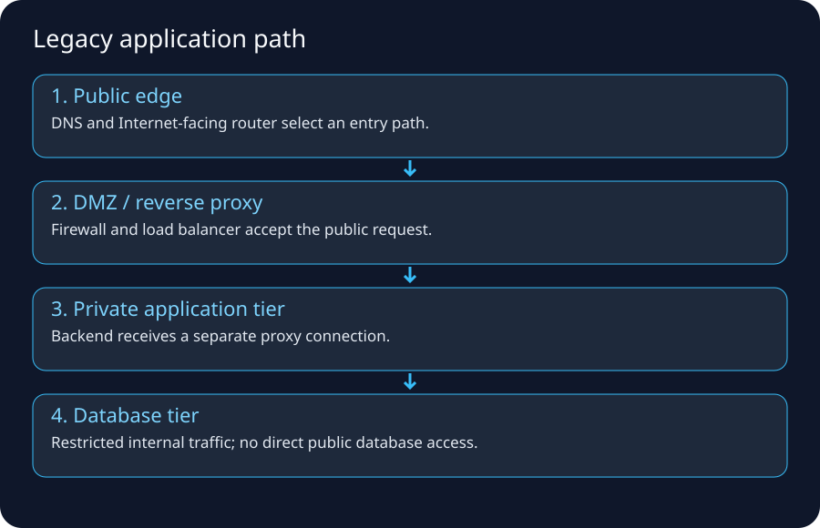

## 1. Why learn the legacy design first?

AWS did not invent IP routing, subnets, firewalls, load balancing, DNS, NAT, private connectivity, or segmentation. Cloud services mostly make these capabilities programmable and managed at a different operational layer.

If you understand the old data-center path, VPC architecture becomes a mapping exercise rather than memorization.

## 2. A representative enterprise Internet-facing architecture

```text
Users
  |
Internet
  |
ISP A -------- ISP B
  |              |
Edge Router A  Edge Router B
       \        /
        HA Firewall Pair
             |
          DMZ VLAN
     WAF / Reverse Proxy
      Load Balancer VIP
             |
       Internal Firewall
             |
          App VLAN
             |
       Internal Firewall
             |
           DB VLAN
```

Real environments vary widely. Some combine WAF/LB/firewall functions; others separate them into dedicated appliance clusters.

## 3. The physical layer people forget

A data center also requires:

- carrier circuits/fiber cross-connects,
- patch panels,
- top-of-rack switches,
- core/distribution switches,
- redundant power,
- optics/transceivers,
- rack space,
- spare ports/capacity,
- out-of-band management.

Cloud removes much direct hardware operation from application teams, but networking constraints still exist logically.

## 4. Carrier/ISP edge

An enterprise can connect to one or multiple ISPs.

Small design:

```text
enterprise router -> one ISP -> default route
```

Larger resilient design:

```text
         ISP A
          |
      Edge Router A
         \ /
      Enterprise
         / \
      Edge Router B
          |
         ISP B
```

Public BGP may be used when the organization has the addressing/ASN/design requirements to advertise prefixes through multiple providers.

## 5. Public IP ownership and publishing services

A company might receive/provider-assign public addresses or own provider-independent address space. It then exposes services through:

- static NAT,
- firewall VIPs,
- load-balancer virtual IPs,
- reverse proxies,
- public DNS.

Example:
```text
www.corp.example -> 203.0.113.50
```

At the edge:

```text
203.0.113.50:443 -> load balancer/WAF tier
```

The backend server can remain on private RFC1918 addressing.

## 6. VLANs and subnets

A typical segmentation plan:

```text
DMZ VLAN       10.10.10.0/24
Web VLAN       10.10.20.0/24
App VLAN       10.10.30.0/24
DB VLAN        10.10.40.0/24
Management     10.10.50.0/24
Backup         10.10.60.0/24
```

VLAN is a Layer-2 segmentation mechanism; subnet is an IP Layer-3 concept. They are often mapped one-to-one operationally but are not definitionally the same thing.

## 7. Default gateway and first-hop redundancy

Servers in a VLAN need a default gateway, often provided by redundant switches/routers/firewalls using a first-hop redundancy mechanism or clustered virtual gateway.

Example server:

```text
IP:      10.10.30.25/24
Gateway: 10.10.30.1
```

The virtual gateway can survive one physical network device failing.

## 8. Core/distribution/access networking

Classic campus/data-center hierarchy:

```text
servers
  ↓
access / top-of-rack switches
  ↓
distribution/aggregation
  ↓
core
  ↓
firewall/WAN/Internet
```

Modern leaf-spine fabrics flatten this topology, but the reasoning remains: many server links aggregate into redundant high-capacity routed paths.

## 9. DMZ/perimeter zone

Internet-facing components are isolated from trusted internal networks.

Why?

If the public web server is compromised, the attacker should not automatically receive unrestricted Layer-3 access to database/admin networks.

Policy can be:

```text
Internet -> WAF/LB :443 only
WAF/LB -> web/app :8080 only
app -> DB :5432 only
admin -> management :approved protocols only
```

## 10. Traditional firewall pair

Enterprises often run two firewalls for HA:

```text
Firewall A active
Firewall B standby
```

or active/active designs depending platform/topology.

Operational work includes:

- rule changes/tickets,
- NAT rules,
- software upgrades,
- failover tests,
- state synchronization,
- hardware replacement,
- interface/VLAN configuration,
- capacity planning,
- logging/SIEM integration.

AWS managed networking removes some appliance lifecycle work but replaces it with route/policy/service design responsibilities.

## 11. Load balancer appliance

A legacy load balancer commonly exposes a VIP:

```text
VIP 10.10.10.50:443
```

Backend pool:

```text
10.10.20.11:8080
10.10.20.12:8080
10.10.20.13:8080
```

It monitors health and chooses a backend. L7 devices can also route by hostname/path and terminate TLS.

AWS mapping:

```text
F5/NetScaler/HAProxy cluster -> ALB/NLB depending requirement
```

## 12. Internal DNS

Corporate DNS often handles both:

- public zones or delegation relationships,
- internal-only names such as `db01.prod.corp.local`/enterprise domains.

Clients point at corporate recursive resolvers, often integrated with Active Directory in Windows-heavy environments.

Hybrid cloud introduces split resolution problems:

```text
on-prem clients must resolve AWS private names
AWS workloads must resolve on-prem private names
```

Route 53 Resolver endpoints/rules solve the DNS forwarding part; VPN/DX/TGW solve the network reachability part.

## 13. Inbound web request: complete legacy flow

Assume user requests:

```text
https://www.corp.example/orders
```

### Step 1: DNS
Public authoritative DNS returns `203.0.113.50`.

### Step 2: Internet routing
BGP/Internet routing carries traffic toward the enterprise's provider/edge.

### Step 3: edge router
Enterprise edge receives the public-prefix traffic and forwards according to internal edge routing.

### Step 4: perimeter firewall
Firewall permits TCP 443 for the published service and may perform NAT/VIP forwarding.

### Step 5: WAF/reverse proxy
Inspects HTTP/TLS according to architecture; can block web attacks.

### Step 6: load balancer
Chooses a healthy application target.

### Step 7: internal routing/firewall
Traffic crosses into application VLAN only on approved port.

### Step 8: application
App processes business logic.

### Step 9: DB flow
App opens a separate connection to DB network, e.g. TCP 5432.

### Step 10: response
Return traffic follows valid routes/state through the environment and back to the user.

## 14. Outbound app-to-SaaS flow

App `10.10.30.25` calls vendor API `api.vendor.example:443`.

```text
App
 -> default gateway
 -> internal/core routing
 -> egress firewall
 -> source NAT
 -> ISP
 -> Internet/BGP
 -> vendor edge
```

The vendor may allowlist enterprise public NAT addresses.

Problem during migration:

```text
on-prem egress IP is allowlisted
AWS NAT Gateway EIP is not
```

The cloud app can resolve DNS and reach the Internet but gets HTTP 403 or connection rejection from vendor policy. That is not necessarily an AWS routing failure.

## 15. East-west app-to-DB flow

```text
App 10.10.30.25:ephemeral
 -> route to 10.10.40.0/24
 -> internal firewall policy
 -> DB 10.10.40.10:5432
```

The DB does not need Internet access to serve internal clients.

This maps nicely to AWS:

```text
APP-SG -> DB-SG :5432
DB subnet no default Internet route
```

## 16. Corporate user to internal app

A user in an office may traverse:

```text
Laptop
 -> access switch/Wi-Fi
 -> campus gateway
 -> WAN/MPLS/SD-WAN
 -> data center firewall
 -> internal load balancer
 -> app
```

If remote:

```text
Laptop
 -> home ISP
 -> corporate VPN gateway
 -> internal network
 -> app
```

This is the conceptual predecessor to Client VPN, Site-to-Site VPN, Direct Connect, Zero Trust/private access products, and hybrid cloud routing.

## 17. MPLS/private WAN legacy model

Enterprises historically connected offices/data centers using carrier private WANs such as MPLS L3VPN services.

Conceptually:

```text
Branch A -> carrier private WAN -> Data Center
Branch B -> carrier private WAN -> Data Center
```

Cloud migration adds AWS as another site through VPN/Direct Connect, or shifts to Internet/SD-WAN-centric designs.

## 18. Two data centers for DR

Legacy resiliency might use:

```text
Primary DC
Secondary DR DC
```

with:

- replicated databases/storage,
- DNS/global load-balancing failover,
- WAN replication links,
- duplicated firewall/LB infrastructure,
- runbooks to activate DR.

Cloud Regions/AZs change implementation but not the core questions: failure domain, RTO, RPO, data replication, traffic failover, capacity.

## 19. Change management in legacy networking

A simple requirement like “allow app A to call database B” can become:

```text
1 submit firewall ticket
2 identify exact source subnet
3 identify destination VIP/server
4 identify port/protocol
5 security review
6 change window
7 implement ACL/firewall rule
8 test
9 update CMDB/documentation
```

Cloud infrastructure-as-code can make these changes faster/repeatable, but careless automation can also reproduce bad policy instantly. Automation does not remove the need for correct intent.

## 20. Common legacy failure scenarios

### Wrong VLAN
Server connected/tagged into wrong broadcast domain.

### Duplicate IP
Two hosts use same address.

### Bad mask/gateway
Local/remote decisions fail.

### Firewall asymmetric routing
Request and reply cross different firewalls without shared state.

### NAT shadowing/order
Wrong translation rule matches before intended rule.

### Stale load-balancer pool
VIP exists but backends unhealthy.

### DNS stale record
Hostname points to retired VIP.

### Route leak/advertisement mistake
Traffic follows wrong WAN/ISP path.

### MTU mismatch through VPN
Small traffic succeeds; larger flows fail.

## 21. Legacy → AWS mapping table

| Legacy data center | AWS service/primitive |
|---|---|
| IP address management spreadsheet/IPAM appliance | VPC IPAM |
| VLAN/subnet | VPC subnet (not exactly a VLAN) |
| core router | distributed VPC routing / Transit Gateway for hub patterns |
| Internet edge router | Internet Gateway + AWS edge routing |
| firewall pair | Security Groups/NACLs and/or Network Firewall/appliances |
| NAT appliance | NAT Gateway |
| WAF appliance | AWS WAF |
| F5/ADC load balancer | ALB/NLB/GWLB depending need |
| DNS appliance/service | Route 53 + VPC Resolver |
| MPLS/private circuit | Direct Connect / carrier integration |
| IPsec concentrator | Site-to-Site VPN |
| firewall traffic logs | VPC Flow Logs / Network Firewall logs |
| network path testing | Reachability Analyzer + conventional tools |

## 22. What does not map one-to-one

Do not say:

```text
VPC = VLAN
Security Group = firewall appliance
Internet Gateway = physical router
```

These analogies help intuition but implementations differ. AWS constructs are distributed managed services with cloud-specific semantics.

## 23. The best migration question

For every legacy component ask:

```text
What responsibility did the appliance/team own?
What AWS service now owns part of that responsibility?
What responsibility still belongs to me?
```

Example NAT appliance:

```text
Old responsibilities:
hardware HA, patch OS, scale appliance, NAT rules, routing, logs

NAT Gateway removes:
OS/hardware management and much HA/scaling implementation

You still own:
subnet/route design, AZ resilience, EIP/vendor allowlists,
cost, monitoring, connection behavior, security/egress policy
```

## 24. Reference trail

- AWS perimeter-zone migration architecture: https://docs.aws.amazon.com/prescriptive-guidance/latest/migration-perimeter-zone-apps-network-firewall/architecture.html
- AWS Security Reference Architecture network guidance: https://docs.aws.amazon.com/prescriptive-guidance/latest/security-reference-architecture/network.html
- AWS hybrid networking: https://docs.aws.amazon.com/whitepapers/latest/aws-vpc-connectivity-options/welcome.html

## 25. Memory map

```text
Legacy Internet app:
DNS -> ISP/BGP -> edge router -> firewall/NAT -> DMZ/WAF/LB
    -> app VLAN -> internal firewall -> DB VLAN

AWS Internet app:
Route 53 -> AWS edge/CloudFront/WAF -> IGW/public ingress
    -> ALB -> SG -> private app -> SG -> DB
```


---

# AWS Internet & VPC Packet Flow — From Browser to Private Application and Back


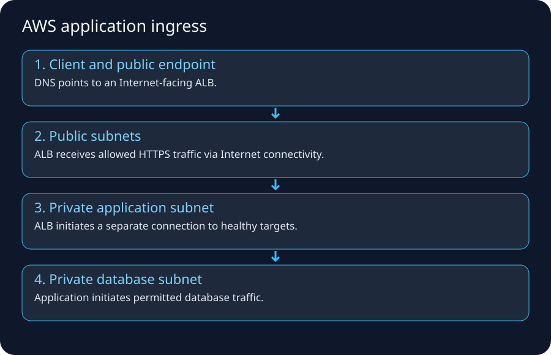

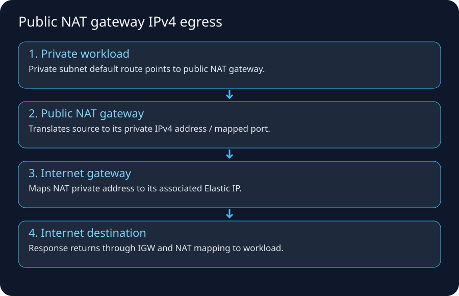

## 1. The AWS networking idea that removes most confusion

Do not ask only:

> “Is the subnet public?”

Ask this complete set:

```text
What IP does the resource have?
Which route table applies?
What target does the best route select?
What translation occurs, if any?
Which stateful/stateless policies apply?
What is the return path?
What endpoint is actually listening?
```

A VPC is software-defined networking, but packet reachability still depends on those ordinary networking questions.

## 2. Core objects and their responsibilities

| AWS object | Mental model | It does NOT automatically do |
|---|---|---|
| VPC | regional private routing/addressing boundary | make resources public |
| Subnet | AZ-scoped IP allocation/routing association | become public because named “public” |
| ENI | virtual network interface with IP/security associations | guarantee route to Internet |
| Route table | destination prefix → target decision | grant firewall permission |
| Internet Gateway | VPC Internet-routing edge; public IPv4 mapping behavior | assign app auth or open ports |
| NAT Gateway | source translation for initiated private IPv4 egress | accept unsolicited inbound sessions to private instances |
| Security Group | stateful allow policy on supported resource interfaces | explicit deny rules like NACL |
| Network ACL | stateless subnet-level allow/deny rules | remember connection return state |
| VPC endpoint | private connectivity to supported service | make every Internet service private |
| Transit Gateway | regional transit routing hub | inspect traffic by itself |
| Network Firewall | managed traffic inspection via routed endpoints | inspect traffic not routed through it |
| Route 53/VPC Resolver | DNS/name resolution | create IP reachability by itself |

## 3. What makes an AWS subnet “public”?

AWS documentation describes a subnet whose associated route table has a route to an Internet Gateway as a public subnet.

Typical IPv4 public route table:

```text
10.0.0.0/16  -> local
0.0.0.0/0    -> igw-1234
```

But an EC2 instance also needs suitable public addressing and security rules to be directly reachable from the Internet over IPv4.

### A route to IGW is necessary, not sufficient

Bad mental model:

```text
public subnet -> every instance exposed
```

Better:

```text
subnet route can reach IGW
+ resource has public IPv4/EIP if direct IPv4 Internet identity required
+ SG/NACL allow desired traffic
+ service listens
+ return route/state works
```

## 4. EC2 public IPv4: what the guest actually sees

AWS documents an important detail: an EC2 public IPv4 is mapped to the primary private IPv4 through NAT. The guest OS normally sees its private IPv4 on the network interface, not the public IPv4 as another ordinary local NIC address.

Example:

```text
EC2 guest sees:       10.0.1.25
AWS console shows:    public 203.0.113.25 (example)
Internet client uses: 203.0.113.25
IGW mapping delivers: private 10.0.1.25 inside VPC
```

This is why a process can listen on `0.0.0.0:443`/private interface and receive traffic sent to the associated public address through the VPC Internet path.

## 5. Direct public EC2 ingress flow

Simplified example:

```text
Internet client
 -> Internet routing/AWS edge
 -> Internet Gateway
 -> public IPv4 mapping to instance private IPv4
 -> subnet/NACL boundary
 -> ENI/Security Group
 -> EC2 operating system
 -> host firewall
 -> application listener
```

Return traffic must pass the reverse policy/path.

This pattern is valid for selected use cases but is usually not the preferred architecture for a scalable public web application; load balancers/CDNs provide better abstraction and operational controls.

## 6. Recommended multi-tier public web flow

```text
Browser
  ↓
Route 53 DNS
  ↓
CloudFront (optional CDN/edge)
  ↓
AWS WAF (often associated at edge/ALB/API surface)
  ↓
Application Load Balancer in public subnets
  ↓
APP security group relationship
  ↓
EC2/ECS/EKS targets in private app subnets
  ↓
DB security group relationship
  ↓
RDS/Aurora in isolated/private DB subnets
```

The app instances do not need public IPv4 addresses merely because end users on the Internet use the application.

## 7. Step-by-step ingress dry run

Assume:

```text
VPC              10.0.0.0/16
Public subnet A  10.0.1.0/24
Public subnet B  10.0.2.0/24
App subnet A     10.0.11.0/24
App subnet B     10.0.12.0/24
DB subnet A      10.0.21.0/24
DB subnet B      10.0.22.0/24
```

Security intent:

```text
Internet -> ALB-SG TCP 443
ALB-SG   -> APP-SG TCP 8080
APP-SG   -> DB-SG  TCP 5432
```

### Step A — DNS
`app.example.com` resolves to CloudFront/ALB-related endpoint information according to design.

### Step B — Internet reaches AWS edge/public endpoint
The user's ISP and Internet routing deliver traffic toward the AWS-advertised prefix/edge.

### Step C — optional CloudFront/WAF
CloudFront may terminate client TLS/cache/forward to origin. WAF evaluates HTTP requests where associated.

### Step D — ALB public listener
ALB listener accepts HTTPS 443. `ALB-SG` permits client ingress.

### Step E — target selection
ALB chooses a healthy target from its target group, then initiates/uses backend connectivity to the private app IP/port.

### Step F — app SG
`APP-SG` permits TCP 8080 **from ALB-SG**, not from the whole Internet.

### Step G — app to database
Application opens a separate DB connection to port 5432. `DB-SG` permits source `APP-SG`.

This is three separate transport/security relationships, not one giant browser-to-database connection.

## 8. Why the app subnet can be private yet ALB can reach it

Private does not mean “isolated from the VPC.”

The VPC local route provides connectivity among subnets in the VPC, subject to security policies and routing nuances.

```text
10.0.0.0/16 -> local
```

Therefore public ALB subnets can route to private app subnets without giving app instances public Internet addresses.

## 9. Private IPv4 egress through NAT Gateway

App `10.0.11.25` needs `https://api.vendor.example`.

Private route table:

```text
10.0.0.0/16 -> local
0.0.0.0/0   -> nat-gw-a
```

NAT Gateway lives in a public subnet with Internet route/EIP context.

Flow:

```text
10.0.11.25:51514
 -> private route table
 -> NAT Gateway
 -> source translated to NAT EIP/port
 -> public subnet route/IGW
 -> Internet
 -> vendor:443
```

AWS docs state that the NAT device replaces the source IPv4 address and maps responses back while not accepting unsolicited Internet connections to the private resources.

## 10. NAT Gateway is AZ-scoped architecture-wise

For resilient multi-AZ designs, a common pattern is one NAT Gateway per AZ with private subnets routing to the NAT in the same AZ.

Why?

- avoid one-AZ dependency for all egress,
- reduce unnecessary cross-AZ traffic patterns/cost,
- keep failure domains aligned.

One NAT for the whole VPC may be cheaper for small/noncritical environments but carries different resilience/cost trade-offs.

## 11. VPC endpoints: avoid the NAT/Internet-style path for supported AWS services

For supported services, endpoints can provide private connectivity.

Example S3 gateway endpoint concept:

```text
private EC2 -> route/prefix-list endpoint -> S3
```

instead of:

```text
private EC2 -> NAT GW -> IGW/public service endpoint path
```

Benefits can include lower NAT dependence, tighter policy, and reduced exposure/cost depending on service/traffic pattern.

### Interface endpoints / PrivateLink
Interface endpoints create private ENIs/endpoints in your VPC for supported services/private services. Private DNS can make the standard service name resolve to the private endpoint addresses in appropriate configurations.

## 12. IPv6 Internet access

AWS IPv6 addresses are globally unique. For public IPv6 Internet access, routes can point `::/0` to an Internet Gateway when inbound/outbound reachability is desired and policy permits.

For private-subnet-style outbound-only IPv6:

```text
::/0 -> egress-only Internet Gateway
```

AWS describes the egress-only IGW as stateful: it permits outbound IPv6 communication and return traffic while preventing Internet hosts from initiating connections to those instances.

## 13. Security Groups: think relationships, not perimeter only

Good three-tier policy:

```text
ALB-SG inbound 443 from Internet/client ranges
APP-SG inbound 8080 from ALB-SG
DB-SG  inbound 5432 from APP-SG
```

This is micro-segmentation at the workload interface level.

Security Groups are stateful; response traffic for allowed flows is automatically recognized by the stateful model.

## 14. NACLs: subnet guardrail and the return-traffic problem

NACLs are stateless and evaluated separately for inbound/outbound packets.

If you allow:

```text
inbound TCP 443
```

but deny relevant reverse ephemeral traffic, sessions fail.

AWS's own Flow Logs examples use ping/security-rule scenarios to demonstrate SG statefulness vs NACL statelessness.

## 15. Route tables and Security Groups solve different questions

```text
Route table: WHERE should packet go?
Security Group: MAY this flow pass this interface/resource boundary?
```

A perfect route plus blocked SG = no application connection.

An open SG plus missing route = no application connection.

Never troubleshoot them as one concept.

## 16. NACL and SG evaluation mental path

A simplified inbound path can include both subnet-level NACL and ENI-associated Security Group behavior. Exact distributed implementation should not be imagined as literal hardware boxes in a fixed rack order, but operationally both policy layers must permit the flow according to their semantics.

## 17. AWS Network Firewall insertion

Network Firewall creates endpoints in dedicated subnets/AZs. To inspect traffic, route tables must steer flows through those endpoints.

Possible centralized egress path:

```text
Spoke VPC
 -> Transit Gateway
 -> Inspection VPC
 -> Network Firewall endpoint
 -> NAT/egress path
 -> Internet
```

Stateful inspection requires carefully designed symmetric paths. AWS documentation explicitly warns about routing symmetry in centralized inspection designs.

## 18. Gateway Load Balancer (GWLB)

GWLB enables scalable insertion of compatible virtual network appliances from vendors or your own appliance fleet. Think of it as a service-insertion/load-distribution primitive for Layer-3 virtual appliances, not as a web ALB replacement.

Legacy mapping:

```text
physical firewall appliance cluster
 -> virtual appliance fleet behind GWLB
```

## 19. Transit Gateway packet flow

Spoke A needs Spoke B:

```text
VPC A subnet route: 10.2.0.0/16 -> TGW
TGW route table:    10.2.0.0/16 -> VPC B attachment
VPC B subnet route: return path -> TGW
```

There are **two route-table systems** to reason about:

- VPC subnet route tables,
- Transit Gateway route tables.

Missing either direction can break connectivity.

## 20. VPC Peering

Peering gives private routed connectivity between VPCs, subject to route/security configuration. It is not transitive: if A peers with B and B peers with C, A does not automatically route through B to C via those peerings.

This limitation is one reason Transit Gateway becomes attractive at larger scale.

## 21. Hybrid on-prem to AWS through VPN/Direct Connect

Conceptual path:

```text
On-prem app
 -> enterprise router/firewall
 -> VPN or Direct Connect
 -> VGW/TGW/DXGW design
 -> VPC route
 -> EC2/private load balancer
```

You need:

- non-overlapping/managed address space,
- routes advertised/propagated correctly,
- Security Groups/NACLs/firewalls,
- DNS resolution across environments,
- return routing,
- MTU considerations,
- redundancy.

## 22. Route 53 Resolver hybrid DNS

Network connectivity does not automatically solve private names.

Example:

```text
EC2 can ping 10.50.1.10 on-prem
but cannot resolve db.corp.example
```

Add/verify Resolver outbound endpoints/rules toward on-prem DNS, plus inbound endpoints if on-prem clients must resolve AWS private hosted-zone names.

## 23. VPC Flow Logs

Flow Logs capture metadata about IP flows for ENIs/subnets/VPCs depending configuration. Fields can include source/destination, ports, protocol, bytes/packets, interface and action such as `ACCEPT`/`REJECT`.

They answer:

```text
Did network policy accept/reject this flow metadata?
Did traffic reach this ENI/subnet observation point?
```

They do not show:

```text
HTTP request body
SQL statement
full packet payload
application exception
```

## 24. Reachability Analyzer

Reachability Analyzer performs static configuration analysis; it does not send test packets. It can identify a reachable configuration path or blocking component among supported AWS networking resources.

Use it before randomly editing route tables/SGs.

## 25. Flow Logs + Reachability Analyzer + app logs = layered evidence

A strong incident workflow:

```text
Reachability Analyzer: should config permit a path?
VPC Flow Logs: what flows were accepted/rejected/observed?
ALB/Network Firewall/WAF logs: what did intermediate services do?
OS tcpdump/socket tools: did packets reach host/process?
App logs/traces: what did the application do?
```

No single tool replaces all layers.

## 26. Scenario: private EC2 cannot download patches

Check:

```text
1 DNS resolves?
2 private subnet route 0.0.0.0/0 -> NAT?
3 NAT exists/available in proper public subnet/AZ design?
4 NAT subnet route 0.0.0.0/0 -> IGW?
5 NAT has required public connectivity/EIP context?
6 SG egress permits?
7 NACL allows both directions/ephemeral ports?
8 destination/IPv4 path available?
```

If calling S3, ask whether an S3 endpoint should replace NAT for that traffic.

## 27. Scenario: ALB is reachable but targets unhealthy

This proves the client-to-ALB path is at least partly working. Check the separate backend boundary:

```text
ALB target group port/protocol
ALB-SG -> APP-SG
NACLs
app process listening on expected IP/port
health-check path/status
application startup/dependency failures
```

## 28. Scenario: EC2 has public IP but Internet cannot connect

Possible causes:

- subnet route table lacks `0.0.0.0/0 -> IGW`,
- IGW not attached,
- SG inbound does not allow port/source,
- NACL blocks,
- host firewall blocks,
- service not listening,
- wrong public IP/DNS,
- IPv6 vs IPv4 mismatch,
- routing through an inspection architecture incorrectly.

Public IP alone is not enough.

## 29. Scenario: private app can call most sites but one vendor fails

Possible non-AWS-network causes:

- vendor allowlist missing NAT Gateway EIP,
- TLS SNI/certificate/protocol mismatch,
- vendor geo/ASN/security policy,
- DNS answer differs,
- rate limit,
- MTU/path issue,
- vendor outage.

First record the NAT egress public IP and exact `curl -v`/TLS symptom.

## 30. Legacy → AWS packet-path mapping

```text
Legacy:
server NIC -> VLAN -> core route -> firewall/NAT -> edge router -> ISP

AWS private egress:
ENI -> subnet route table -> NAT Gateway -> IGW -> Internet/AWS edge
```

```text
Legacy ingress:
ISP -> edge router -> firewall -> DMZ WAF/LB -> app VLAN

AWS ingress:
Internet/AWS edge -> CloudFront/WAF -> ALB -> SG -> private app
```

## 31. Best official sources

- Internet Gateway: https://docs.aws.amazon.com/vpc/latest/userguide/VPC_Internet_Gateway.html
- NAT Gateway scenarios: https://docs.aws.amazon.com/vpc/latest/userguide/nat-gateway-scenarios.html
- VPC NAT devices: https://docs.aws.amazon.com/vpc/latest/userguide/vpc-nat.html
- Route priority: https://docs.aws.amazon.com/vpc/latest/userguide/route-tables-priority.html
- VPC Resolver: https://docs.aws.amazon.com/Route53/latest/DeveloperGuide/resolver.html
- Egress-only IGW: https://docs.aws.amazon.com/vpc/latest/userguide/egress-only-internet-gateway.html
- VPC Flow Logs: https://docs.aws.amazon.com/vpc/latest/userguide/flow-logs.html
- Reachability Analyzer: https://docs.aws.amazon.com/vpc/latest/reachability/what-is-reachability-analyzer.html
- Network Firewall architectures: https://docs.aws.amazon.com/network-firewall/latest/developerguide/architectures.html

## 32. What you must remember

```text
Public subnet = route-table property/path, not a name.
Public IPv4 alone ≠ reachable.
Route ≠ permission.
SG stateful; NACL stateless.
Private app can receive traffic from public ALB without public IP.
Private IPv4 Internet egress commonly uses NAT Gateway.
IPv6 outbound-only can use egress-only IGW.
Endpoints can avoid NAT for supported AWS-service traffic.
Network Firewall only inspects traffic routed through it.
Flow Logs show flow metadata, not application payload.
```


---

# Network Troubleshooting Labs — Stop Guessing, Prove the Broken Layer


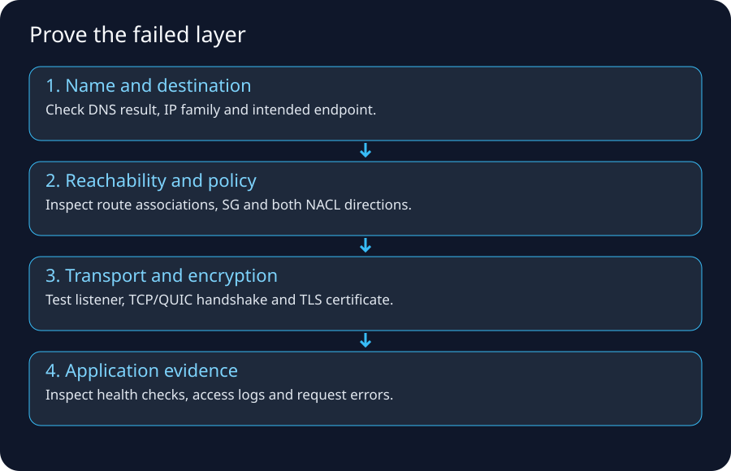

## 1. The golden rule

> **Change nothing until you can state the first layer where observed behavior differs from expected behavior.**

Randomly opening firewalls creates security risk and destroys evidence.

## 2. The troubleshooting ladder

Use this order:

```text
1. Name/DNS
2. Local address/interface
3. Local route/default gateway
4. End-to-end route/reachability
5. Firewall/security policy
6. Transport/listener
7. TLS
8. HTTP/application
9. downstream dependencies
```

A later layer cannot work if an earlier required layer is broken.

## 3. Build an evidence table before testing

| Question | Expected | Observed | Evidence |
|---|---|---|---|
| DNS A/AAAA | expected endpoint | ? | `dig` |
| source IP | expected interface | ? | `ip addr` |
| route | expected gateway/target | ? | `ip route get` / VPC RT |
| TCP port | opens | ? | `nc` / `curl` |
| TLS cert | valid hostname | ? | `openssl` |
| HTTP | 200/expected code | ? | `curl -v` |
| backend | healthy | ? | LB target health/logs |

This prevents “I think the route is correct” debugging.

## 4. Local host lab

Linux examples:

```bash
ip addrip route
ip route get 1.1.1.1
arp -n
resolvectl status   # systemd systems
ss -lntup
```

macOS equivalents include:

```bash
ifconfig
netstat -rn
route -n get default
arp -a
lsof -iTCP -sTCP:LISTEN
```

Windows:

```powershell
ipconfig /all
route print
arp -a
Get-NetTCPConnection -State Listen
```

### Exercise
Find your:

- active interface,
- private IP,
- prefix/netmask,
- default gateway,
- DNS resolvers,
- listening local ports.

## 5. DNS lab

```bash
nslookup example.com
dig example.com A
dig example.com AAAA
```

Then compare a specific resolver:

```bash
dig @1.1.1.1 example.com A
dig @8.8.8.8 example.com A
```

Do not assume answers will always be identical because CDNs/geo/routing/caching can influence results.

### Failure patterns

```text
NXDOMAIN      name does not exist according to DNS response
SERVFAIL      resolver/authoritative/validation/dependency problem possible
timeout       resolver path/firewall/network issue possible
wrong IP      stale/misconfigured DNS/cache/split-horizon issue
```

## 6. Test an IP path separately from DNS

If DNS returns `198.51.100.20`, you can reason about IP separately.

`ping` may be filtered, so do not require it.

Use application-relevant tests:

```bash
nc -vz host.example 443
curl -v https://host.example/
```

For HTTP services where you need to force a particular IP while preserving hostname/SNI, `curl --resolve` can be a powerful authorized diagnostic:

```bash
curl -v --resolve api.example.com:443:203.0.113.25 https://api.example.com/
```

This isolates DNS from TLS/HTTP endpoint testing.

## 7. Route/path tools

```bash
traceroute example.com
mtr example.com
```

Windows:

```powershell
tracert example.com
pathping example.com
```

Interpret carefully. Missing intermediate responses do not necessarily mean packet forwarding failed.

## 8. Transport test

### Port open

```bash
nc -vz api.example.com 443
```

### Server listener

Linux:

```bash
ss -lntp | grep ':8080'
```

If a process listens only on:

```text
127.0.0.1:8080
```

remote load balancers cannot normally reach it via the host's private ENI address. Bind to the correct interface according to application/security requirements.

## 9. TLS test

```bash
openssl s_client \
  -connect api.example.com:443 \
  -servername api.example.com
```

Inspect:

- certificate subject/SAN,
- issuer/chain,
- expiration,
- negotiated TLS version/cipher,
- hostname/SNI behavior.

A successful TCP connection plus failed TLS narrows the problem dramatically.

## 10. HTTP test

```bash
curl -v https://api.example.com/health
```

Observe:

```text
resolved IP
connection target
TLS messages
HTTP status
redirect Location header
server/proxy headers (when present)
response timing
```

### Status interpretation

```text
403 from WAF != TCP failure
503 from ALB != DNS failure
504 often indicates upstream timeout path
401 != firewall denial
```

## 11. Packet capture

Authorized Linux capture:

```bash
sudo tcpdump -ni any host 198.51.100.20 and port 443
```

You might see:

```text
SYN sent, no SYN/ACK        path/drop/destination issue
SYN, SYN/ACK, ACK           TCP established
TLS ClientHello, alert      TLS negotiation/certificate/protocol issue
HTTP request + response     network and transport are functioning
RST                          active reset/refusal/closed state
```

Wireshark provides deeper visual decoding.

Do not capture traffic you are not authorized to inspect; payloads can contain sensitive data.

## 12. NAT troubleshooting

Questions:

```text
Is source translation expected?
What public IP should destination see?
Does NAT have translation/session capacity?
Is return traffic addressed to translated tuple?
Is vendor allowlisting the translated public IP?
Is there double NAT/CGNAT?
```

A common vendor integration test is to call an endpoint that reports the source public IP, or inspect vendor logs, then compare with expected NAT EIP.

## 13. Stateful firewall troubleshooting

Check session logs/table:

```text
did SYN enter?
which policy matched?
was source NAT applied?
did SYN leave?
did SYN/ACK return?
did it return through same stateful device/path?
was it dropped by threat/IPS policy?
```

A stateful firewall with no return packet cannot complete the flow even if its allow rule looks correct.

## 14. AWS troubleshooting checklist — EC2 to Internet

```text
[ ] DNS resolution works
[ ] EC2 has correct private IP
[ ] subnet route table has expected default route
[ ] NAT/IGW target exists and is in correct state
[ ] NAT Gateway public subnet itself routes to IGW
[ ] SG egress allows required flow
[ ] NACL permits both directions
[ ] Network Firewall/inspection routes are symmetric/correct
[ ] destination permits the NAT/public source
[ ] IPv4/IPv6 family is what you expect
```

## 15. AWS troubleshooting checklist — Internet to ALB

```text
[ ] DNS points to correct ALB/CloudFront endpoint
[ ] ALB scheme is internet-facing
[ ] ALB subnets have appropriate Internet routing
[ ] ALB SG allows client source/443
[ ] NACLs do not block
[ ] listener exists on expected port/protocol
[ ] certificate/SNI is correct
[ ] WAF is not blocking unexpectedly
[ ] targets are healthy
```

## 16. AWS troubleshooting checklist — ALB to app

```text
[ ] target IP/instance registered
[ ] target health-check port/path correct
[ ] APP-SG permits source ALB-SG
[ ] app subnet route/local path correct
[ ] NACL permits flow/return
[ ] process listens on expected interface/port
[ ] host firewall permits
[ ] app health endpoint returns expected status fast enough
```

## 17. AWS troubleshooting checklist — app to RDS

```text
[ ] DNS endpoint resolves
[ ] route/local/VPC connectivity exists
[ ] DB-SG permits APP-SG on DB port
[ ] NACLs permit flow
[ ] DB is available/listening
[ ] credentials/auth method valid
[ ] TLS requirement/client trust correct
[ ] connection pool not exhausted
```

A DB authentication error proves much more network path success than a timeout.

## 18. VPC Flow Logs dry run

Imagine record metadata indicates:

```text
srcaddr=10.0.11.25
dstaddr=10.0.21.10
srcport=53120
dstport=5432
protocol=6
action=REJECT
```

This immediately focuses investigation on network policy/path around that ENI/subnet observation point rather than SQL credentials.

If action is `ACCEPT` but app times out, investigate:

- another hop/policy,
- host firewall,
- service listener,
- app-level timeout,
- return path,
- packet loss/MTU.

## 19. Reachability Analyzer lab

Use Reachability Analyzer to model a path such as:

```text
EC2 ENI -> another ENI
EC2 -> Internet Gateway path
source -> destination through TGW/peering supported resources
```

Important: it statically analyzes configuration. It does not prove that your application process is listening or that a runtime service is healthy.

## 20. Route-table lab

Given:

```text
10.0.0.0/16  local
10.50.0.0/16 tgw
0.0.0.0/0    nat
```

Answer:

```text
10.0.12.8   -> local
10.50.8.8   -> TGW
8.8.8.8     -> NAT
```

Now add:

```text
10.50.8.0/24 firewall-endpoint
```

Destination `10.50.8.8` now matches `/24` and takes the more specific firewall route.

## 21. NACL ephemeral-port lab

Client:

```text
10.0.1.25:53000 -> 10.0.2.50:443
```

Stateless subnet ACL reasoning must cover:

```text
forward packet to destination 443
reverse packet to client 53000
```

If the return-direction ACL blocks the ephemeral port, the connection fails even though inbound 443 looks correct.

## 22. SG statefulness lab

SG permits outbound HTTPS from client.

```text
client ephemeral -> server 443
```

The response is recognized as return traffic for the established allowed connection under SG statefulness. You do not add a broad “inbound 443” rule to the client just to receive that response.

## 23. IPv4 vs IPv6 split test

```bash
curl -4 -v https://example.com/
curl -6 -v https://example.com/
```

If one works and the other fails, stop treating the problem as one generic “Internet” issue. Compare DNS AAAA, IPv6 route, egress-only/IGW path, SG/NACL IPv6 rules, and upstream support.

## 24. MTU/VPN symptom lab

Scenario:

```text
SSH login works
small HTTP response works
large upload stalls over VPN
```

Investigate MTU/MSS/Path MTU Discovery and tunnel overhead after proving route/policy basics.

Useful tools vary by OS; controlled pings with DF/size options and packet captures can reveal fragmentation-needed/ICMP behavior.

## 25. “Works from bastion but not app server”

Compare exactly:

```text
source subnet
source SG
route table association
NACL
DNS resolver/search path
NAT/egress IP
proxy environment variables
IPv6 availability
host firewall
```

Do not conclude “AWS network is random.” The two hosts are different network principals/paths.

## 26. “Works by IP but not hostname”

High probability areas:

- DNS resolution,
- split-horizon zone,
- stale cache,
- search suffix,
- proxy/SNI/Host header behavior.

If HTTPS works only by hostname and fails by IP, that may be expected because TLS certificate/SNI and virtual hosting depend on hostname.

## 27. “Works in browser but curl fails”

Compare:

- proxy settings,
- client certificates,
- browser DNS/DoH,
- cookies/authentication,
- HTTP/2/3 behavior,
- user agent/WAF policy,
- system trust store vs browser trust store.

## 28. “403 means firewall” — wrong

A network firewall normally drops/rejects before an HTTP application response. An HTTP `403` means some HTTP-speaking component generated a response—perhaps WAF, proxy, API gateway, application authorization.

That is valuable evidence that DNS/routing/transport/TLS likely got much farther than a raw network drop.

## 29. Minimal incident notes template

```text
Client/source:
Timestamp + timezone:
Hostname:
Resolved A/AAAA:
Source public egress IP:
Expected destination/port:
Route path expectation:
TCP result:
TLS result:
HTTP result:
Relevant SG/NACL/firewall rule IDs:
Flow-log evidence:
LB/WAF/app log evidence:
Recent changes:
```

This is vastly more useful than “network not working.”

## 30. Best tools/reference trail

- VPC Flow Logs basics: https://docs.aws.amazon.com/vpc/latest/userguide/flow-logs-basics.html
- Flow-log records: https://docs.aws.amazon.com/vpc/latest/userguide/flow-log-records.html
- Reachability Analyzer: https://docs.aws.amazon.com/vpc/latest/reachability/what-is-reachability-analyzer.html
- Route priority: https://docs.aws.amazon.com/vpc/latest/userguide/route-tables-priority.html

## 31. Memory trick

> **D-A-R-E-P-T-A = DNS, Address, Route, Edge translation, Policy, Transport, Application.**

Write the evidence for each letter. The first failed letter is where investigation begins.


---

# Networking Cheat Sheet, Memory Map & Interview Questions


[← Troubleshooting labs](md/networking/10-network-troubleshooting-labs.md) · [Bootcamp home](md/networking/index.md)

## 1. One-page mental map

```text
NAME
DNS
  ↓
ADDRESS
IP + subnet/prefix
  ↓
LOCAL DELIVERY
MAC / Wi-Fi / Ethernet / ARP or IPv6 ND
  ↓
NEXT HOP
routing table / default gateway / longest prefix
  ↓
NETWORK-TO-NETWORK
ISP / AS / BGP / peering / transit
  ↓
BOUNDARY
NAT / firewall / proxy / load balancer
  ↓
TRANSPORT
TCP or QUIC/UDP, ports
  ↓
SECURITY
TLS
  ↓
APPLICATION
HTTP/API/database protocol
```

## 2. Fast definitions

| Term | Remember this |
|---|---|
| IP | Layer-3 addressing/routed delivery |
| subnet/prefix | block of IP addresses sharing leading prefix bits |
| MAC | local-link interface identifier used for frame delivery |
| ARP | IPv4 local neighbor IP→MAC resolution |
| default gateway | next hop for destinations without a more specific local route |
| route table | destination prefix → next hop/interface |
| longest prefix | most specific matching route wins |
| NAT | rewrite address information |
| PAT/NAPT | translate ports too, allowing address sharing |
| CGNAT | provider-scale NAT; shared `100.64.0.0/10` often used internally |
| ASN | autonomous-system number used in interdomain routing context |
| BGP | policy-driven route exchange between routing domains |
| peering | networks exchange traffic/routes directly under agreement |
| transit | upstream provides broader Internet reachability |
| DNS | names → records such as A/AAAA |
| TCP | reliable ordered byte stream with connection state |
| UDP | datagram transport without TCP's connection/reliability semantics |
| TLS | cryptographic authentication/confidentiality/integrity layer |
| WAF | HTTP-aware Layer-7 request filtering |
| stateful firewall | remembers permitted flow state |
| stateless ACL | each packet/direction must independently match rules |
| ingress | traffic entering a stated boundary |
| egress | traffic leaving a stated boundary |
| north–south | across environment/perimeter boundary |
| east–west | between internal workloads/segments |

## 3. Home Internet flow

```text
Browser
 -> DNS
 -> laptop routing table
 -> Wi-Fi frame to default gateway
 -> home NAT/firewall
 -> modem/ONT/access network
 -> ISP
 -> peering/transit/IXP
 -> destination AS/CDN
 -> TLS endpoint
 -> web app
```

## 4. Mobile Internet flow

```text
Phone/UE
 -> 4G/5G RAN
 -> mobile transport
 -> packet core / UPF-style user plane
 -> carrier policy/NAT/Internet edge
 -> peering/transit
 -> destination
```

## 5. Legacy data-center ingress

```text
Internet
 -> ISP/BGP edge router
 -> HA firewall/NAT
 -> DMZ WAF/reverse proxy
 -> load balancer
 -> internal firewall
 -> app VLAN
 -> DB firewall
 -> DB VLAN
```

## 6. AWS web ingress

```text
Route 53
 -> CloudFront/WAF (optional)
 -> ALB public endpoint
 -> ALB-SG
 -> APP-SG/private app
 -> DB-SG/private DB
```

## 7. AWS private IPv4 egress

```text
private EC2/task
 -> private route table 0.0.0.0/0
 -> NAT Gateway
 -> public subnet route
 -> Internet Gateway
 -> Internet/vendor
```

## 8. Common port memory (learn context, not just numbers)

| Protocol/service | Common port |
|---|---:|
| HTTP | TCP 80 |
| HTTPS | TCP 443; HTTP/3 commonly QUIC/UDP 443 |
| SSH | TCP 22 |
| DNS | UDP/TCP 53; encrypted DNS uses other transports/ports such as HTTPS 443 |
| PostgreSQL | TCP 5432 |
| MySQL | TCP 3306 |
| Redis | commonly TCP 6379 |
| SMTP | TCP 25/587/465 depending usage |

A port number is convention, not proof. Applications can listen elsewhere.

## 9. Security Group vs NACL

| | SG | NACL |
|---|---|---|
| scope | resource/ENI-associated | subnet boundary |
| state | stateful | stateless |
| actions | allow rules | allow + deny |
| return flow | recognized automatically | must match reverse rules |
| common role | primary workload policy | coarse subnet guardrail |

## 10. Router vs NAT vs firewall vs proxy

```text
Router   -> WHERE next?
NAT      -> WHAT address/port changes?
Firewall -> MAY this traffic pass?
Proxy    -> I terminate/make request on behalf of another side.
LB       -> WHICH backend handles it?
DNS      -> WHAT address/record belongs to this name?
```

## 11. Troubleshooting order

```text
DNS
 ↓
IP/interface
 ↓
route/default gateway
 ↓
NAT/edge path
 ↓
firewall/security policy
 ↓
TCP/QUIC transport
 ↓
TLS
 ↓
HTTP/application
 ↓
downstream dependency
```

## 12. Symptom → clue

| Symptom | Strong clue |
|---|---|
| NXDOMAIN | DNS/name issue |
| connection timeout | route/drop/destination/return path possible |
| connection refused | reached something that actively rejected/no listener |
| TLS hostname error | network path reached TLS stage; name/cert mismatch |
| HTTP 403 | an HTTP component denied request; not raw IP routing failure |
| ALB 503 | frontend can be reachable while targets unavailable/unhealthy |
| DB auth error | network path to DB is likely much further along than a timeout |
| works `-4`, fails `-6` | IPv6 path/config issue |

## 13. CIDR shortcuts

```text
/24 = 256
/25 = 128
/26 = 64
/27 = 32
/28 = 16
/29 = 8
/30 = 4
/31 = 2
/32 = 1
```

Each additional prefix bit halves the block.

## 14. RFC1918 and CGNAT ranges

```text
Private IPv4:
10.0.0.0/8
172.16.0.0/12
192.168.0.0/16

Carrier shared space:
100.64.0.0/10
```

## 15. Interview questions with model-answer direction

### Q1. What happens when you type a URL in a browser?
Strong answer order:

```text
parse URL -> DNS/cache -> route/default gateway -> ARP/ND local next hop
-> Internet routing/NAT -> TCP or QUIC -> TLS -> HTTP
-> CDN/LB/app -> dependent requests -> response rendering
```

Mention caching and that exact details differ for HTTP/3/CDNs.

### Q2. Why does the laptop need a default gateway?
For destinations not on a directly connected subnet, it needs a local next hop/router that can forward toward other networks.

### Q3. Why doesn't the laptop use the remote server MAC address?
MAC/link addresses are local-link scoped. The laptop frames the packet to its local next hop. Routers re-encapsulate on each link.

### Q4. What makes an AWS subnet public?
Its route table provides Internet Gateway routing; direct IPv4 reachability also requires suitable public addressing and security/listener conditions.

### Q5. Why can an EC2 instance with a public IPv4 show only a private IP in Linux?
AWS maps the public IPv4 to the primary private IPv4 through VPC Internet Gateway NAT behavior; the public address is not configured as a normal guest NIC address.

### Q6. Security Group vs NACL?
SG is stateful and workload/ENI-oriented with allow rules; NACL is stateless, subnet-oriented, supports allow/deny, and requires explicit reverse-direction permission.

### Q7. NAT Gateway vs Internet Gateway?
IGW provides the VPC Internet-routing edge and public IPv4 mapping behavior for publicly addressed resources. NAT Gateway is used so private IPv4 resources can initiate outbound connections using translated public egress without being directly publicly addressed.

### Q8. Why do private subnets need NAT for IPv4 Internet egress?
RFC1918/private addresses are not globally routable on the Internet. NAT supplies a routable translated source and return mapping.

### Q9. Why doesn't IPv6 require the same NAT pattern?
IPv6 has abundant globally unique addressing; security is enforced with routing/firewalls. AWS provides an egress-only IGW for outbound-only IPv6 behavior.

### Q10. What is longest-prefix match?
Among matching destination routes, the most specific prefix is preferred, e.g. `/24` over `/16` over `/0`, subject to platform-specific tie/priority rules.

### Q11. What is BGP?
A policy-driven interdomain routing protocol used to exchange IP-prefix reachability between autonomous systems and select/advertise paths using attributes/policy.

### Q12. Peering vs transit?
Peering directly exchanges selected routes/traffic between networks; transit provides broader reachability through an upstream provider.

### Q13. Stateful vs stateless firewall?
Stateful filtering tracks flow context and recognizes return traffic; stateless filtering evaluates each packet/direction independently.

### Q14. What is ingress vs egress?
Relative to a named boundary: entering it is ingress, leaving it is egress.

### Q15. WAF vs network firewall?
WAF understands HTTP-layer request properties; a network firewall primarily enforces/inspects network/transport flows and may include deeper IPS/domain capabilities depending product.

### Q16. What does DNS do?
Maps names to resource records. It does not itself forward the application's packets to the destination.

### Q17. Why can DNS work while the website fails?
DNS only solved name→record. Routing, firewall, transport, TLS, load balancer, or app can still fail.

### Q18. Why can ping fail but HTTPS work?
ICMP Echo may be filtered while TCP/443 is permitted; ping is not a universal application-health test.

### Q19. Why does a firewall need return-path symmetry?
Stateful inspection needs to correlate both directions of a flow; asymmetric paths can bypass or confuse stateful enforcement.

### Q20. What is VPC Flow Logs' limitation?
They provide flow metadata and accept/reject-style evidence, not full packet payload or application behavior.

## 16. Scenario questions

### Scenario A
Private EC2 cannot reach vendor API.

Answer framework:

```text
DNS -> private route -> NAT -> public route/IGW -> SG/NACL
-> Network Firewall if present -> vendor allowlist -> TLS/HTTP
```

### Scenario B
ALB works, app returns 503.

Check target group health, backend SG relationship, app port/listener, health path, target capacity/app dependencies.

### Scenario C
On-prem can ping EC2 IP but cannot use `db.aws.corp`.

Likely DNS integration problem: Resolver endpoints/rules/private hosted zone path, not necessarily VPN/DX routing.

### Scenario D
Vendor sees unexpected source IP after migration.

Cloud workload is probably egressing through a new NAT/Internet path. Stabilize/communicate the correct egress IP and verify architecture.

### Scenario E
HTTPS works from one subnet but not another.

Compare route-table association, NACL, SG source, NAT/endpoint path, DNS, firewall inspection, IPv4/IPv6.

## 17. Final memory map

```text
                    NETWORKING
                        |
        +---------------+----------------+
        |               |                |
      Naming          Routing          Policy
       DNS         IP / prefixes    SG/NACL/FW/WAF
        |               |                |
        +---------> Transport <-----------+
                    TCP/UDP/QUIC
                        |
                       TLS
                        |
                   Application
                  HTTP/API/DB
```

## 18. Best source trail

- Cloudflare Internet basics: https://www.cloudflare.com/learning/network-layer/how-does-the-internet-work/
- Cloudflare BGP: https://www.cloudflare.com/learning/security/glossary/what-is-bgp/
- Cloudflare DNS: https://www.cloudflare.com/learning/dns/what-is-dns/
- Cloudflare TLS: https://www.cloudflare.com/learning/ssl/what-happens-in-a-tls-handshake/
- AWS Internet Gateway: https://docs.aws.amazon.com/vpc/latest/userguide/VPC_Internet_Gateway.html
- AWS NAT: https://docs.aws.amazon.com/vpc/latest/userguide/vpc-nat.html
- AWS route priority: https://docs.aws.amazon.com/vpc/latest/userguide/route-tables-priority.html
- AWS Flow Logs: https://docs.aws.amazon.com/vpc/latest/userguide/flow-logs.html


---