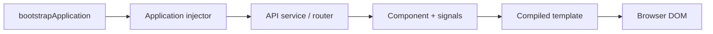
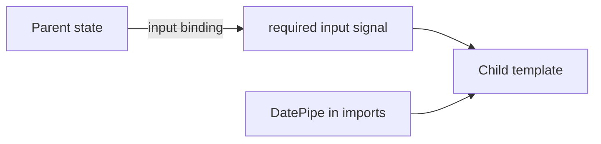
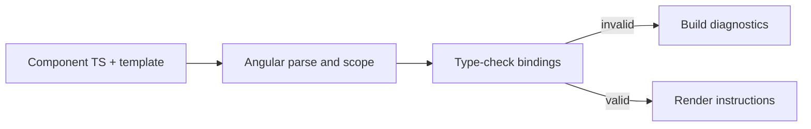
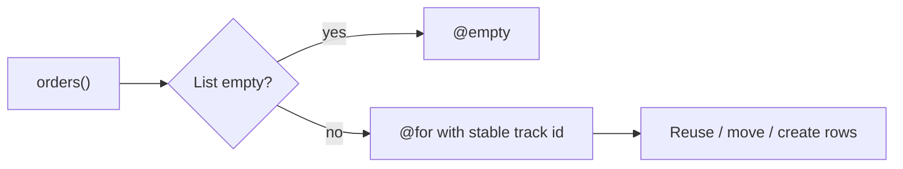

# Angular 22 — Interview Foundations (Q1–Q6)

> **Current bounded edition, 2026-10-09.** Reconciled `Angular_Interview_Mermaid_Workbook.md` (Q1–Q6, lines 155–284) with `Angular_Interview_Workbook.docx` (pages 3–5). Both contained the same six questions; this edition enhances them with contracts, examples, state traces, diagrams and caveats. It is **not** a claim of compiling an Angular application. Subsequent Q7–Q13 remain queued. Angular 22 is the current major release; earlier NgModule-based enterprise apps still exist.

## Contents

- [Q1: Why Angular?](#q1)
- [Q2: Standalone components](#q2)
- [Q3: Bootstrapping](#q3)
- [Q4: AOT and template checking](#q4)
- [Q5: Binding directions](#q5)
- [Q6: Built-in control flow](#q6)
- [Integrated exercise and references](#exercise)

## The architecture at a glance

Angular links component state, dependency injection, router, HTTP and forms with a compiled template system. A component **owns UI behavior**, a service typically owns reusable API/business coordination, and a template **projects state into the view**. Their exact ownership depends on the application architecture.



<a id="q1"></a>
## Q1. What does Angular solve?

**Requirement:** Explain what is gained by adopting a complete application framework rather than assembling unrelated libraries. Angular provides component templates, DI, routing, forms, HTTP, compilation/tooling, SSR/hydration integration and consistent patterns.

| Scenario | Expected architecture | Mistake to avoid |
|---|---|---|
| Many teams own screens | Shared conventions and testable components | One giant app component |
| Edit an order | Form with validation and API service | Trusting browser validation on the server |
| Navigate to a report | Router and lazy feature | Loading all features on startup |
| Search orders | Service fetches; component owns filter state | HTTP calls directly from template expressions |

**Step-by-step request trace:** (1) URL matches a route. (2) Angular loads the route component. (3) The injector resolves its dependencies. (4) The service requests data. (5) State updates, and Angular schedules the bound view to refresh. If a user leaves the route, async operations need cancellation/ownership handling.

**Invariant:** a view displays state, but rendering is not authorization. Protect data in the backend. **Trade-off:** conventions reduce design churn but add framework concepts and opinionated defaults. **Complexity:** no meaningful fixed Big-O for framework choice; measure route bundle weight, API latency and affected DOM updates separately.

**Interview follow-ups:** Angular vs React; route/component/service responsibilities; SSR; hydration and lazy loading.

<a id="q2"></a>
## Q2. Standalone component vs NgModule

**Requirement:** Define a required typed input and use a pipe without declaring the component in an NgModule.

```typescript
import {Component, input} from '@angular/core';
import {DatePipe} from '@angular/common';

type User = { id: number; name: string; joined: Date };

@Component({
  selector: 'app-user-card',
  imports: [DatePipe],
  template: `<h3>{{ user().name }}</h3>
             <time>{{ user().joined | date:'mediumDate' }}</time>`
})
export class UserCard {
  readonly user = input.required<User>();
}
```

**Examples:** input `{id:1,name:'Asha',joined:new Date('2026-01-01')}` renders Asha and a date; replacing it with Ravi updates the view; omitting `[user]` on a template usage gives a required-input compiler diagnostic; passing an incompatible type gives a template type-checking diagnostic under strict typing.

**How it works:** (1) the parent supplies `[user]="selectedUser()"`; (2) Angular writes the signal input binding; (3) the child reads `user()`; (4) `DatePipe` is in this component's template scope because of `imports`. Angular 19+ components default to standalone; `standalone: true` remains allowed; `standalone: false` opts into NgModule declaration.



**Invariant:** the parent owns the supplied value; a child input signal is read-only. **Edges:** delayed data should be narrowed with an outer `@if` rather than forced via unsafe non-null assertions. **Complexity:** binding a reference is O(1), but rendering depends on the subtree. **Mistakes:** claiming NgModules are removed; forgetting a pipe/directive in imports.

**Follow-ups:** `@Input` vs `input()`; two-way `model()`; content projection; provider scopes.

<a id="q3"></a>
## Q3. Bootstrap a modern application

**Requirement:** Start a standalone root and register a router and HTTP interceptor.

```typescript
import {bootstrapApplication} from '@angular/platform-browser';
import {provideRouter, Routes} from '@angular/router';
import {provideHttpClient, withInterceptors} from '@angular/common/http';
import {AppComponent} from './app.component';
import {authInterceptor} from './auth.interceptor';

const routes: Routes = [{
  path: 'orders',
  loadComponent: () => import('./orders.component')
    .then(m => m.OrdersComponent)
}];

bootstrapApplication(AppComponent, {
  providers: [
    provideRouter(routes),
    provideHttpClient(withInterceptors([authInterceptor]))
  ]
}).catch(console.error);
```

**Four examples:** opening `/orders` loads the lazily declared route; an HTTP request made by injected HttpClient uses registered interceptors; missing `provideHttpClient` produces an injection problem; a failed lazy import causes a route-loading error.

**Trace:** application platform starts → providers registered in application injector → root component created → router resolves URL → route chunk imported → feature component instantiated → service injects HttpClient → outbound HTTP request flows through interceptors. The code assumes `authInterceptor` and `OrdersComponent` exist in a real app.

**Invariant:** importing a TypeScript symbol alone does **not** register its provider. **Security:** client route guards and interceptors do not replace server authorization. **Complexity:** lazy loading shifts network/bundle costs to route entry; it does not remove them. **Follow-ups:** root vs child injectors, SSR bootstrapping, OIDC tokens.

<a id="q4"></a>
## Q4. AOT and template type checking

**Requirement:** Detect a binding error before running the corresponding browser path.

| Input | Declared contract | Expected |
|---|---|---|
| `{{ user.name }}` | User has string name | Valid binding |
| `{{ user.addresss }}` | User has `address` only | Template diagnostic |
| `<app-user-card />` | `user` required | Missing-input diagnostic |
| `[user]="123"` | expects User | Type mismatch diagnostic |

**How it works:** Angular parses component metadata/template → resolves import scopes → constructs typed representations of bindings → asks TypeScript to check them → produces build diagnostics and rendering instructions. The compiler handles more than minification and can catch invalid property access.



**Invariant:** build-time validity says nothing about the shape of untrusted runtime JSON. Validate backend data at trust boundaries. **Boundary:** `any` and weakened template options erase useful checks. **Cost:** depends on codebase size and type complexity; no universal O(n) claim for a full compiler. **Follow-ups:** strictTemplates, JIT vs AOT, SSR builds.

<a id="q5"></a>
## Q5. Data-binding directions

**Requirement:** Support an editable search term, a clear button and an avatar URL.

```typescript
import {Component, signal} from '@angular/core';
import {FormsModule} from '@angular/forms';

@Component({
  selector: 'app-search',
  imports: [FormsModule],
  template: `<input [(ngModel)]="search" aria-label="Search">
    <button (click)="clear()">Clear</button>
    <p>{{ search }}</p>
    `
})
export class SearchComponent {
  search = '';
  readonly avatarUrl = signal('/assets/avatar.png');
  clear() { this.search = ''; }
}
```

**Four examples:**

| Binding | Example | Direction |
|---|---|---|
| Interpolation | `{{ search }}` | Component → text |
| Property | `[src]="avatarUrl()"` | Component → DOM property |
| Event | `(click)="clear()"` | DOM event → component |
| Two-way | `[(ngModel)]="search"` | Both via directive |

**Dry run:** initial empty → user types "ab" → NgModel updates `search` → interpolation displays "ab" → click Clear → `search` becomes empty and the form view synchronizes.

**Invariant:** data down, events up; two-way syntax combines the two directions. **Pitfalls:** missing FormsModule, writing `(click)="clear"` instead of invocation, conflating DOM attributes and properties. **Cost:** this tiny example's handlers perform O(1) work, while resulting DOM updates depend on affected content. **Follow-ups:** model inputs, reactive forms, zoneless notifications, sanitization.

<a id="q6"></a>
## Q6. Built-in control flow and identity

**Requirement:** Render an order list, keep row identity during reorder and display an empty state.

```typescript
import {Component, signal} from '@angular/core';
type Order = {id: string; amount: number};

@Component({
  selector: 'app-orders',
  template: `
    @for (order of orders(); track order.id) {
      <p>{{ order.id }}: {{ order.amount }}</p>
    } @empty {
      <p>No orders</p>
    }
  `
})
export class OrdersComponent {
  readonly orders = signal<Order[]>([]);
}
```

| Input `orders()` | Expected rendered view |
|---|---|
| `[]` | No orders |
| `[{id:'a',amount:10}]` | a: 10 |
| `[a,b]` → `[b,a]` | Rows reorder, stable IDs reused |
| `[a,b]` → `[b,c]` | a removed, c created, b retained |

**Detailed trace:** `orders()` signal changes → Angular re-evaluates the loop → compares tracking keys to prior iteration → reuses/moves/removes/creates rows → updates bindings. A unique stable entity key is the essential invariant; changing keys or using indices for reordering lists can mix up component state.

**Original state diagram:**



**Boundaries:** duplicate IDs break the intended stable identity mapping; Angular `@switch` does not fall through; choose `@if` for conditional content and `@for` for iteration. **Complexity:** n rows require O(n) output DOM capacity; no claim that keyed list rendering is O(1). **Follow-ups:** `@if` aliases, `@defer`, immutable lists and signals.

<a id="exercise"></a>
## Integrated senior interview exercise

Design `/orders` as a lazy route, resolve an HTTP service by DI, display loading/error/empty states, filter n returned orders in O(n) time and O(n) extra space, and track visible rows by immutable IDs. Test: empty list, reordered list, late response after navigation, 401 response, and malformed backend payload. Do **not** claim route guards enforce authorization.

## Verification and primary sources

- Both **actual Library source texts** were inspected for the Q1–Q6 section; the original Markdown had source hash `b1d89bb0461fa6ee0e9aa826a0093700731ca12348169b4aefd6c3d5f96bf42e` per local intake manifest. Word workbook was separately read; no file hash was claimed for it.
- Code snippets and traces were checked conceptually against the linked official docs. **No Angular CLI/Node integration compile, browser screenshot or live server call was executed** during this source-comparison pass.
- Official Angular: [supported versions](https://angular.dev/reference/versions), [release timetable](https://angular.dev/reference/releases), [components/imports](https://angular.dev/guide/components/importing), [inputs](https://angular.dev/guide/components/inputs), [AOT compiler](https://angular.dev/tools/cli/aot-compiler), [two-way binding](https://angular.dev/guide/templates/two-way-binding), [control flow](https://angular.dev/guide/templates/control-flow), [zoneless](https://angular.dev/guide/zoneless).
- **Next:** read and enrich Q7–Q13, component lifecycle and communication, from both sources; do not create a second guide edition.
