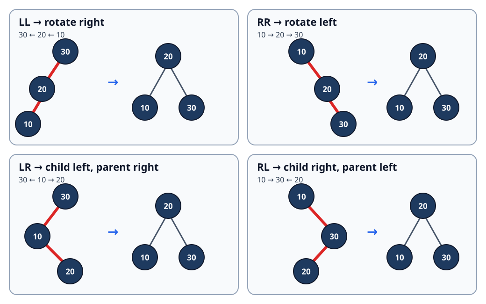

# AVL Tree: Height-Guided Rotations After Every Update

[Local study intake](../README.md) · [Java implementation](java/AvlIntSet.java) · [Validation harness](java/AvlIntSetCheck.java) · [Red-black comparison](red-black-tree-insertion-deletion.md)

This module enriches section 3 of the uploaded `Advanced_Trees_FAANG_Mermaid_Study_Guide.md`. The source contributes the four rotation cases, a useful LR trace and the warning that deletion can rebalance several ancestors. Its Java cannot compile as written because inline comments swallow height updates, complete `if` conditions and the LR/RL rotations. The repository version replaces that fragment with a complete Java 17 set, one shared repair routine for insertion and deletion, structural validation, four contract examples, proofs, an original rotation diagram and independent randomized tests.

The canonical Trees/BST guide contained no AVL material, so this focused advanced-tree unit does not duplicate an existing lesson.

## 1. Simple definition and exact contract

An **AVL tree** is a binary search tree that stores each node's height and maintains this rule at every node:

```text
abs(height(left) - height(right)) <= 1
```

This module uses `height(null)=0` and `height(leaf)=1`. Its balance factor is:

```text
balance(node) = height(node.left) - height(node.right)
```

Positive means left-heavy; negative means right-heavy.

The Java class implements a mutable set of distinct `int` values:

- `add(key)` returns `true` only when a new key is stored;
- `remove(key)` returns `true` only when an existing key is removed;
- `contains(key)` performs ordinary BST search;
- `toList()` constructs all keys in ascending order;
- `heightLevels()` returns zero for empty and one for a leaf;
- `validate()` checks strict ordering, stored heights, AVL balance and recorded size.

It is an in-memory teaching structure, not a concurrent collection or persistent index.

### Four concrete examples

| Start | Operation | Expected result | Concept |
|---|---|---|---|
| empty | add `30,20,10` | sorted `[10,20,30]`, height 2 | LL imbalance needs one right rotation |
| empty | add `30,10,20` | sorted `[10,20,30]`, height 2 | LR zig-zag needs two rotations |
| `{10,20,30}` | add `20` | `false`; size remains 3 | duplicate keys are rejected |
| `{MIN_VALUE,0,MAX_VALUE}` | remove `0` | `[MIN_VALUE,MAX_VALUE]` | comparisons avoid subtraction overflow |

Removing a missing key is a no-op and returns `false`. The tree shape is internal: callers rely on set behavior and invariants, not one exact layout.

## 2. Why plain BST insertion is not enough

Sorted insertion into an ordinary BST can form a chain. Searching `1,2,3,...,n` then costs `O(n)` in the worst case. AVL adds one integer height per node and repairs a subtree as soon as its balance reaches `+2` or `-2`.



Rotations preserve in-order key order. They change height without changing the set of keys.

## 3. Four imbalance families

| Heavy path from unbalanced node `z` | Child balance | Repair |
|---|---:|---|
| left → left (LL) | `balance(z.left) >= 0` | rotate right at `z` |
| right → right (RR) | `balance(z.right) <= 0` | rotate left at `z` |
| left → right (LR) | `balance(z.left) < 0` | rotate left at child, then right at `z` |
| right → left (RL) | `balance(z.right) > 0` | rotate right at child, then left at `z` |

Memory rule: a straight heavy path needs one opposite rotation; a zig-zag is straightened at the child first, then rotated at the parent.

The repair code deliberately classifies from **child balance**, not from the inserted or deleted key:

```java
if (balance > 1) {
    if (balance(node.left) < 0) node.left = rotateLeft(node.left);
    return rotateRight(node);
}
if (balance < -1) {
    if (balance(node.right) > 0) node.right = rotateRight(node.right);
    return rotateLeft(node);
}
```

That rule works for both insertion and deletion. Direction tests based on the updated key are common insertion shortcuts but are wrong for general deletion repair.

## 4. Rotation internals and the height-update trap

Right rotation at `z`, where `y=z.left`:

1. save `middle=y.right`;
2. make `z` the right child of `y`;
3. attach `middle` as `z.left`;
4. update `z` first because it moved down;
5. update `y`, the new subtree root;
6. return `y` to the caller so the parent reconnects correctly.

```java
private static Node rotateRight(Node top) {
    Node promoted = top.left;
    Node middle = promoted.right;
    promoted.right = top;
    top.left = middle;
    updateHeight(top);
    updateHeight(promoted);
    return promoted;
}
```

Updating the promoted node first reads a stale height from the node that moved down. The tree may still search correctly while future balance decisions become wrong; this is why the test harness validates cached heights, not just returned keys.

## 5. Insertion dry run: a large LR case

Insert `50,30,70,20,40,60,80,10,25,27`.

The first nine values form a valid AVL tree. Key 27 becomes the right child of 25. While recursion unwinds:

| Node | Left height | Right height | Balance | Action |
|---:|---:|---:|---:|---|
| 25 | 0 | 1 | -1 | still balanced |
| 20 | 1 | 2 | -1 | still balanced |
| 30 | 3 | 1 | +2 | left-heavy, but left child is right-heavy: LR |

Repair:

1. `rotateLeft(20)` promotes 25 and makes 20 its left child.
2. `rotateRight(30)` promotes 25 over 30.
3. Recompute heights bottom-up.

The repaired left subtree of 50 is rooted at 25, with `20` on the left and `30` on the right; 27 stays left of 30. Node 50 has left/right heights 3 and 2, so it remains balanced.

### Insertion invariant

Before returning from `insert(node,key)`:

> the returned subtree contains exactly the old keys plus `key` if absent, obeys BST order, stores exact heights, and has balance in `{-1,0,+1}`.

The base case creates a height-1 leaf. Recursive insertion changes only one child. `rebalance` updates the current height and performs the unique straight or zig-zag repair if required.

## 6. Deletion: why repair may continue to the root

BST deletion has three structural cases:

1. leaf: return `null`;
2. one child: return that child;
3. two children: copy the in-order successor from the right subtree, then delete its old copy.

Afterward, every ancestor on the search path is rebalanced. Deletion can reduce subtree height, so repairing one node can expose a new imbalance higher up. Unlike insertion, work must continue during the entire recursive return.

### Deletion trace: `9,5,10,0,6,11,-1,1,2`, then remove 10

| Step | State change | Why |
|---:|---|---|
| 1 | find 10 by BST search | only one path can contain it |
| 2 | replace/remove through its single/right-side structure | standard BST deletion |
| 3 | update the former parent height | one subtree may now be shorter |
| 4 | observe a left-heavy ancestor | deletion, not the removed key, determines the case |
| 5 | inspect the left child's balance and rotate | restore the local `abs(balance)<=1` rule |
| 6 | continue unwinding and checking ancestors | height reduction can propagate |

The harness executes this case, validates after deletion, and then deletes every remaining key while rechecking invariants.

The public method first runs `contains`. That adds another logarithmic descent but makes missing-key removal a strict structural no-op and simplifies the recursive precondition.

## 7. Complete Java 17 implementation

The runnable implementation is [AvlIntSet.java](java/AvlIntSet.java); [AvlIntSetCheck.java](java/AvlIntSetCheck.java) supplies deterministic, adversarial, permutation and randomized oracle tests.

Insertion and deletion both end at the same repair function:

```java
private static Node rebalance(Node node) {
    updateHeight(node);
    int balance = balance(node);
    if (balance > 1) {
        if (balance(node.left) < 0) node.left = rotateLeft(node.left);
        return rotateRight(node);
    }
    if (balance < -1) {
        if (balance(node.right) > 0) node.right = rotateRight(node.right);
        return rotateLeft(node);
    }
    return node;
}
```

Using one routine prevents insertion and deletion logic from drifting apart. `validate()` independently recomputes true heights from the leaves and rejects a stale cached value even when all membership queries happen to succeed.

## 8. Correctness arguments

**Search.** Strict BST order puts every possible target in exactly one of the current node, left subtree or right subtree. Each comparison descends one level, so `contains` returns true exactly for stored keys.

**Rotation order.** In a right rotation, the ordered regions remain `A < y < B < z < C` before and after reconnecting. Left rotation is symmetric. Therefore rotations preserve the BST invariant and all keys.

**Height repair.** The node moved down depends only on its newly attached children, so updating it first computes its exact height. The promoted node can then use that value. A single rotation repairs straight heavy paths; straightening the child followed by the parent rotation repairs zig-zags. The returned subtree has balance at most one.

**Insertion.** Inductively, the recursive child returns a valid AVL subtree with exactly the intended keys. Only ancestors on that path can change height. `rebalance` restores each such node without changing order or membership, proving the returned root is a valid AVL set.

**Deletion.** Standard BST deletion removes exactly the target; successor substitution preserves strict order. Only nodes on the deletion/successor path can lose height. Rebalancing every ancestor restores stored height and AVL balance, so the final tree is valid and lacks exactly the removed key.

**Traversal.** In-order traversal emits the left subtree, node, then right subtree. BST order and induction imply `toList()` returns every stored key once in ascending order.

## 9. Why AVL height is logarithmic

Let `N(h)` be the minimum nodes in an AVL tree of height `h` under this module's level convention. The sparsest legal height-`h` tree has child heights `h-1` and `h-2`:

```text
N(0)=0, N(1)=1
N(h)=1 + N(h-1) + N(h-2)
```

This Fibonacci-like recurrence grows exponentially with `h`; solving in the other direction gives `h=O(log n)`. Therefore search, insertion and deletion traverse only logarithmically many levels in the worst case. NIST's [Dictionary of Algorithms and Data Structures](https://xlinux.nist.gov/dads/) records AVL among balanced search-tree structures.

## 10. Complexity, including output construction

| Operation | Time | Auxiliary/output space |
|---|---:|---:|
| `contains` | `O(log n)` | `O(1)` iterative |
| `add` | `O(log n)` | `O(log n)` recursion |
| `remove` | `O(log n)` including precheck | `O(log n)` recursion |
| one rotation | `O(1)` | `O(1)` |
| `toList` | `O(n)` | `O(n)` output plus `O(log n)` stack |
| `validate` | `O(n)` | `O(log n)` stack |
| tree storage | — | `O(n)` nodes, including one cached height each |

Returning `n` boxed integers is an `O(n)` construction cost; it is not constant auxiliary space. Java object-layout overhead is implementation-dependent.

## 11. Boundaries and common errors

- Pick one height convention and use it everywhere. Mixing leaf height 0 with leaf height 1 corrupts balance calculations.
- Update the node moved down before the promoted node after rotation.
- Reconnect the rotation's returned root at the caller; rotating local references alone loses the repair.
- During deletion, classify from child balance, not from the deleted key's direction.
- Continue deletion repair through every ancestor; stopping after the first rotation is unsafe.
- Guard duplicate insertion and missing deletion so size stays correct.
- Compare integers with `<`/`>` or `Integer.compare`, not subtraction that can overflow.
- Validate cached metadata separately from search results.
- The class is not thread-safe; external synchronization or a concurrent structure is required for shared mutation.

## 12. AVL versus other ordered structures

| Requirement | Suitable baseline | Trade-off |
|---|---|---|
| worst-case ordered lookup with tight height | AVL tree | stores height and may rebalance more aggressively |
| general Java ordered map/set | `TreeMap` / `TreeSet` | Java specifies a red-black implementation, not AVL |
| page-oriented database index | B-tree/B+ tree | high fan-out reduces page transitions |
| average constant-time lookup without order | hash table | no sorted traversal or predecessor/successor |
| indexed range aggregates | Fenwick/segment tree | exploits dense positions and an aggregation operation |

Oracle's [Java 17 `TreeMap` documentation](https://docs.oracle.com/en/java/javase/17/docs/api/java.base/java/util/TreeMap.html) documents a red-black `NavigableMap` with logarithmic core operations. Use it for standard Java production code unless an AVL-specific requirement and maintenance burden are justified.

## 13. Interview variations

1. Derive the Fibonacci minimum-node recurrence and logarithmic height.
2. Return the first unbalanced ancestor and name LL/RR/LR/RL from a trace.
3. Add `floor`, `ceiling`, predecessor and successor.
4. Store subtree sizes for rank/select and prove metadata update order.
5. Convert the set into a generic comparator-based map with replacement semantics.
6. Compare insertion-only repair with deletion's potentially repeated ancestor repairs.
7. Compare AVL, red-black, treap, B-tree and skip-list choices for a workload.

## 14. Sources and provenance

- Candidate source actually read: `untitled/Advanced_Trees_FAANG_Mermaid_Study_Guide.md`, section 3, lines 272–448; archive and source SHA-256 values are recorded in the intake manifest.
- Definition/index reference: [NIST Dictionary of Algorithms and Data Structures](https://xlinux.nist.gov/dads/).
- Java comparison reference: [Java SE 17 `TreeMap`](https://docs.oracle.com/en/java/javase/17/docs/api/java.base/java/util/TreeMap.html).
- Historical origin: G. M. Adelson-Velsky and E. M. Landis, “An algorithm for the organization of information,” 1962.

The contract, repair routine, traces, proofs, boundary analysis, corrected Java, SVG and tests are original teaching additions. This module does not claim that Java's standard ordered collections use AVL trees.
