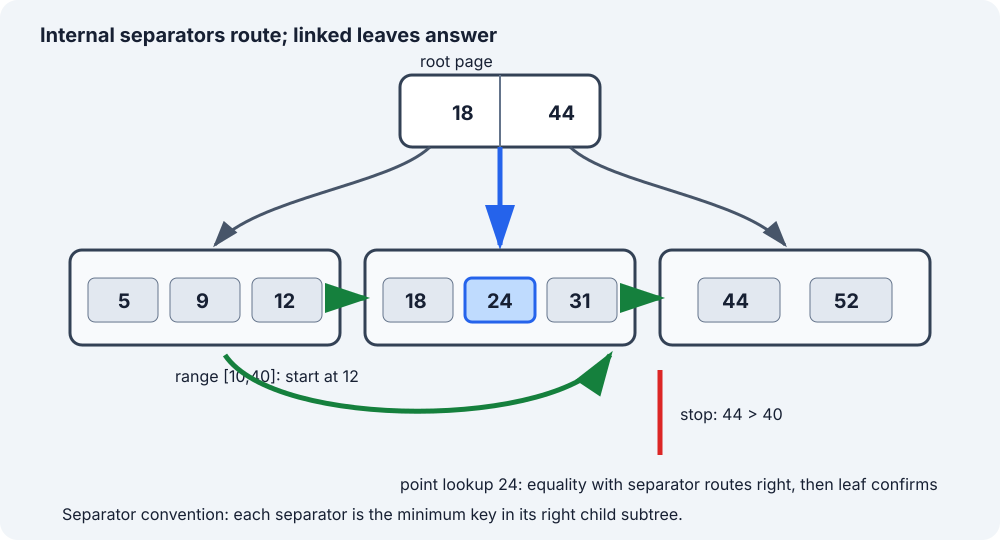

# B+ Tree Database Index: Route Once, Scan Leaves

[Local study intake](../README.md) · [Java read model](java/BPlusTreeReadModel.java) · [Validation harness](java/BPlusTreeReadModelCheck.java)

This module enriches section 6 of the uploaded `Advanced_Trees_FAANG_Mermaid_Study_Guide.md`. The source contributes the B+ tree distinction, linked-leaf idea and split outline. The page-oriented model, exact separator invariant, four examples, lookup/range traces, deletion cautions, Java 17 bulk-loaded read model, correctness argument, cost derivation, database boundaries and original diagram are added teaching material. The canonical system-design guide already compares B-tree and LSM families; this focused module adds data-structure mechanics instead of duplicating that overview.

## 1. Simple definition and learning contract

A **B+ tree** is a height-balanced multiway search tree designed to keep many keys in each node. Internal nodes route by separator keys; leaf nodes hold the searchable entries in key order. A leaf-level sibling chain lets a range query descend once and then continue sequentially.

This module uses one precise separator convention:

> `separator[i]` is the smallest key in `children[i + 1]`'s subtree.

Therefore a search key equal to a separator goes **right**. Real engines can encode boundaries differently; never mix a diagram's convention with different comparison code.

The runnable Java model is intentionally narrower than a database engine:

- input is already sorted and keys are distinct;
- `bulkLoad` creates an immutable in-memory index;
- `get` performs point lookup;
- `range(from, to, limit)` returns inclusive, ascending results;
- leaves are linked for continuation;
- there is no insert/delete API, page cache, WAL, MVCC, latch, checksum, overflow page, compression or crash recovery.

That boundary is important: the program validates routing and range-scan invariants without pretending to implement a storage engine.

### Four concrete examples

| Data / request | Expected result | Concept tested |
|---|---|---|
| keys `5,9,12,18,24,31,44,52`; `get(24)` | value for key 24 | equality with a leaf entry |
| same tree; `get(25)` | empty | landing in the correct leaf does not imply a match |
| same tree; `range(10,40,99)` | keys `12,18,24,31` | one descent, then linked-leaf continuation |
| same tree; `range(18,24,2)` | keys `18,24` | inclusive bounds and output limit |

The implementation also accepts an empty input, supports `Integer.MIN_VALUE`/`MAX_VALUE`, rejects duplicate or unsorted keys, rejects negative limits, and rejects reversed range bounds.

## 2. B-tree family intuition: optimize page visits

A binary search tree spends one pointer per branch and may hold one key per node. A disk-oriented tree instead tries to match a node to a storage page. If one page can hold hundreds of separators and child page identifiers, fan-out is high and height stays small.

For example, a purely illustrative fan-out of 256 can address roughly:

| Levels containing children | Approximate leaf-page reach |
|---:|---:|
| 1 | 256 |
| 2 | 65,536 |
| 3 | 16,777,216 |

Those are not capacity promises: page size, key width, tuple metadata, fill factor, compression and engine format change fan-out. The lesson is that a shallow page tree can replace many random pointer hops.

### B-tree versus B+ tree vocabulary

| Property | Classical B-tree description | B+ tree description used here |
|---|---|---|
| Internal node contents | keys may be searchable records | separators primarily route |
| Search success | may occur before a leaf | confirmed in a leaf |
| Leaf contents | records not necessarily confined there | all searchable key/value entries |
| Ordered range | possible by ordered traversal | natural after reaching first leaf |
| Internal fan-out | high | often higher when internal payload is smaller |

Database product documentation often says **B-tree** for a page structure with B+ tree-like characteristics. PostgreSQL documents leaf tuples that point to table rows and internal tuples that point down a level; SQLite distinguishes table and index b-tree page formats. Prefer the engine's documented terms over arguing from the textbook label.

## 3. Structure and invariants



The example has root separators `[18 | 44]` and leaves:

- `L0 = [5,9,12]`
- `L1 = [18,24,31]`
- `L2 = [44,52]`

Its invariants are:

1. **Sorted pages:** keys inside every node are strictly increasing in this model.
2. **Separator ranges:** child 0 contains keys `< separator[0]`; a middle child `i` contains keys `>= separator[i-1]` and `< separator[i]`; the last child contains keys `>=` the final separator.
3. **Leaf-only entries:** a point result is accepted only after searching a leaf.
4. **Uniform depth:** every leaf is at the same depth.
5. **Ordered leaf chain:** following `next` visits all later leaves in nondecreasing key order without returning to internal nodes.
6. **Occupancy:** non-root nodes normally obey engine-specific minimum and maximum fill rules. The bulk loader balances groups, but this teaching model does not expose dynamic underflow/overflow repair.

The routing loop uses an **upper bound** over separators:

```java
int child = 0;
while (child < separators.length && key >= separators[child]) {
    child++;
}
```

Production code normally binary-searches a wide node, as the Java source does. The `>=` is the key line: with lower-bound-of-right-child separators, equality belongs to the right child.

## 4. Point lookup trace

Find key 24 in the pictured tree.

| Page step | Keys inspected | Decision | Reason |
|---:|---|---|---|
| 1 | root `[18,44]` | choose child 1 | `24 >= 18` but `24 < 44` |
| 2 | leaf `[18,24,31]` | binary-search index 1 | key equals 24 |
| result | entry `(24,value)` | found | only a leaf confirms membership |

Find missing key 25:

| Page step | Decision |
|---:|---|
| 1 | the same root comparisons choose child 1 |
| 2 | leaf binary search places 25 between 24 and 31 |
| result | not found; do not scan the next leaf for an exact unique-key lookup |

For duplicate-key database indexes, one logical key may map to several row identifiers or span representation-specific entries. This Java contract avoids that separate problem by requiring distinct keys.

## 5. Range scan trace

Run `range(10, 40, 99)`.

| Step | Current page / position | Output | Next action |
|---:|---|---|---|
| 1 | root `[18,44]` routes 10 to `L0` | `[]` | descend once |
| 2 | lower-bound search in `[5,9,12]` gives index 2 | `[12]` | leaf exhausted; follow `next` |
| 3 | scan `[18,24,31]` | `[12,18,24,31]` | leaf exhausted; follow `next` |
| 4 | first key in `[44,52]` is 44 | unchanged | `44 > 40`; stop immediately |

The scan does **not** descend from the root for every returned key. That is the central B+ tree range advantage: routing cost is paid for the start, then leaf adjacency carries the scan.

Limits are operationally useful. `range(10,40,2)` stops after `[12,18]`; it need not materialize the full matching range merely to discard later items.

## 6. Dynamic insertion and deletion mechanics

The runnable model is immutable, but interviews often ask for the write path.

### Leaf split example

Assume a leaf holds at most three keys. Insert 28 into `[18,24,31]`:

| Phase | State | Parent action |
|---|---|---|
| insert in order | `[18,24,28,31]` | leaf overflows |
| split | left `[18,24]`, right `[28,31]` | wire `left.next = right`; preserve old successor after right |
| publish separator | right's first key is 28 | copy 28 into parent with a downlink to right |

If the parent overflows, split it and propagate a routing entry upward. A root split creates a new root and is the only ordinary insertion event that increases height.

### Deletion is not merely “remove a key”

After deleting from a leaf:

1. if occupancy is still legal, stop—but update an ancestor separator if the leaf's first key changed and that key defines a boundary;
2. otherwise redistribute with a sibling when allowed, then refresh separators;
3. otherwise merge siblings, repair the leaf chain, and remove the redundant parent entry;
4. propagate parent underflow upward; if a root has only one child, replace the root and reduce height.

A frequent error is to borrow or merge leaf entries but leave the parent boundary stale. Another is to repair parent pointers while forgetting the leaf `next` link. A production engine additionally coordinates concurrent readers, logged page changes, split visibility and recovery; these details are outside an interview-level container implementation.

## 7. Java 17 read model

The complete source is [BPlusTreeReadModel.java](java/BPlusTreeReadModel.java). It creates balanced leaf groups from sorted input, links them, and repeatedly groups children into internal nodes. Each separator is derived—not guessed—from the first key of its right child.

```java
private Leaf descend(int key) {
    Node node = root;
    while (node instanceof Internal internal) {
        int child = upperBound(internal.separators, key);
        node = internal.children[child];
    }
    return (Leaf) node;
}
```

Range lookup descends to `fromInclusive`, uses a leaf lower bound, and then advances through `leaf.next`:

```java
Leaf leaf = descend(fromInclusive);
int index = lowerBound(leaf.keys, fromInclusive);
while (leaf != null && result.size() < limit) {
    while (index < leaf.keys.length && result.size() < limit) {
        int key = leaf.keys[index];
        if (key > toInclusive) return result;
        result.add(new Entry(key, leaf.values[index++]));
    }
    leaf = leaf.next;
    index = 0;
}
```

`limit` caps the number of constructed `Entry` results. It does not promise a database execution plan, isolation level, stable snapshot, or server-side cursor.

## 8. Why the read algorithms are correct

**Descent.** In an internal node, `upperBound(separators,key)` returns the number of separators less than or equal to `key`. By the separator-range invariant, exactly that child contains every possible occurrence of `key`. Repeating this choice moves one level downward while preserving the claim that the selected subtree is the only candidate. Uniform leaf depth guarantees termination at a leaf; binary search then finds the key if and only if it exists.

**Range start.** The same descent selects the only leaf that could contain `fromInclusive`. A lower-bound search chooses the first leaf key not less than the lower bound, so no qualifying key inside that leaf is skipped.

**Range continuation.** Keys remaining in the current leaf are ordered. The leaf-chain invariant says every key in the next leaf is at least every key in the current leaf, and repeated `next` visits all later leaves. Appending until a key exceeds `toInclusive` therefore returns every in-range entry, in order, exactly once. Stopping at `limit` returns the correct prefix of that ordered answer.

**Bulk loading.** Input keys are strictly increasing. Contiguous slices are therefore internally sorted and every leaf's keys are below the next leaf's keys. Separators copied from right-child minima establish the routing ranges. Grouping every node at one level before building the next keeps all leaves at uniform depth. Induction over constructed levels proves all read invariants.

## 9. Cost derivation, including output

Let `n` be entries, `F` average internal fan-out, `B` average leaf entries, `h` tree height, and `k` returned entries.

| Operation | Page-oriented intuition | Java model CPU cost | Result space |
|---|---:|---:|---:|
| point lookup | O(h) page visits | O(h log F + log B), bounded by O(log n) | O(1) |
| range lookup | O(h + leaves visited) page visits | O(log n + k) plus boundary checks | O(k) |
| bulk load | sequential construction | O(n) | O(n) index storage |

With useful occupancy, `h` is logarithmic in fan-out: approximately `O(log_F(n/B))` internal levels plus the leaf. Exact height depends on root and occupancy rules.

Returning `k` Java records necessarily costs O(k) time and O(k) output space; no algorithm can materialize k distinct results in less. If values themselves are copied rather than referenced, add the total copied payload length. A streaming cursor can reduce client-side auxiliary memory to O(1) beyond buffers, but total output work remains proportional to what is consumed.

The Java model stores every key/value reference plus node arrays: O(n) total. Its iterative lookup uses O(1) auxiliary stack space.

## 10. Database reality and trade-offs

### Clustered and secondary indexes are product-specific

In InnoDB, the clustered index stores row data and secondary entries include the row's primary-key columns. A wide primary key therefore enlarges secondary indexes. PostgreSQL's documented B-tree leaf tuples point to table rows in a heap-organized relation. These are different physical contracts even though both expose ordered indexes.

### B+ tree strengths

- equality, inequality and bounded range predicates;
- ordered iteration and `ORDER BY` plans when index order aligns;
- predecessor/successor and prefix ranges under a compatible collation/operator class;
- shallow trees through high page fan-out.

### Costs and alternatives

- random insertions can split pages and amplify writes;
- every additional index consumes storage and write work;
- wide keys reduce fan-out;
- an unanchored substring search such as `LIKE '%term%'` is not rescued by ordinary key ordering;
- hash indexes target equality, LSM families buffer writes and pay compaction/read trade-offs, and inverted/spatial/vector indexes serve different predicates.

An index being available does not force the optimizer to use it. Selectivity, covering ability, table size, statistics, ordering and base-row fetch cost can make a scan or another index cheaper.

## 11. Common errors, boundaries and interview variations

- Route separator equality left while separators mean “minimum of right child.” Use `>=`/upper bound for this convention.
- Return an internal separator as the record. In this model, only leaves contain searchable entries.
- Re-descend for every range key. Descend once, then use the leaf chain.
- Call the structure “sorted” without naming the comparison/collation. Index order is defined by an operator class or comparator.
- Claim all database B-trees have an identical leaf-link or payload layout. Cite the target engine.
- Ignore duplicate keys, null ordering, composite encodings or row identifiers. They materially change the entry contract.
- Treat every page split as a height increase. Height rises only when the root splits.
- Describe deletion without separator refresh, leaf-link repair, or root contraction.
- Equate O(log n) CPU with a fixed number of disk reads. Cache residency and page layout dominate real latency.
- Present the Java model as durable or concurrent. It is an immutable algorithm model only.

Useful interview follow-ups:

1. **Composite index `(tenant_id, created_at)`:** explain why tenant equality plus a time range forms one contiguous key interval, while filtering only on `created_at` may not.
2. **Covering index:** add projected columns to leaf entries to avoid a base-row fetch, then discuss larger leaves and lower fan-out.
3. **Bulk load versus online insert:** sorted bulk load can build compact leaves sequentially; online writes need split and concurrency protocols.
4. **B+ tree versus LSM:** compare random page maintenance with buffered sequential writes, compaction, read amplification and range behavior.
5. **Concurrent split:** describe why readers must see either a safe old path or the new right sibling; actual latching and WAL algorithms are engine-specific.

## 12. Verification, sources and continuation

The Java 17 compiler module compiled the read model and independent harness. The harness passed deterministic lookup/range/boundary cases, rejected malformed contracts, and compared 100,000 seeded random point lookups plus 50,000 seeded random bounded range queries against `TreeMap`.

Sources checked 2026-10-08:

- Uploaded `Advanced_Trees_FAANG_Mermaid_Study_Guide.md`, section 6, lines 782–833 (SHA-256 `86cb65f3d6d0f327e5d22c03b5d587144eb11cc9ff27a5b523b298b09ad7f5b1`): conceptual spine and split outline.
- [PostgreSQL 18 — B-Tree Indexes](https://www.postgresql.org/docs/current/btree.html): multi-level page structure, leaf/internal tuple roles and cascading page splits.
- [SQLite — Database File Format: B-tree Pages](https://www.sqlite.org/fileformat2.html#b_tree_pages): balanced depth, page types, ordered cells and interior child routing.
- [MySQL 8.4 — InnoDB Clustered and Secondary Indexes](https://dev.mysql.com/doc/refman/8.4/en/innodb-index-types.html): row storage in the clustered index and primary-key columns in secondary entries.
- [Canonical system-design fundamentals](../../system-design/fundamentals/guide.html#10-indexing-b-tree-vs-lsm-tree): retained high-level index/storage comparison.

Next bounded source section: section 5, B-Tree. Compare it with this module before deciding whether it adds a distinct teaching unit; do not publish a terminology-only duplicate.
