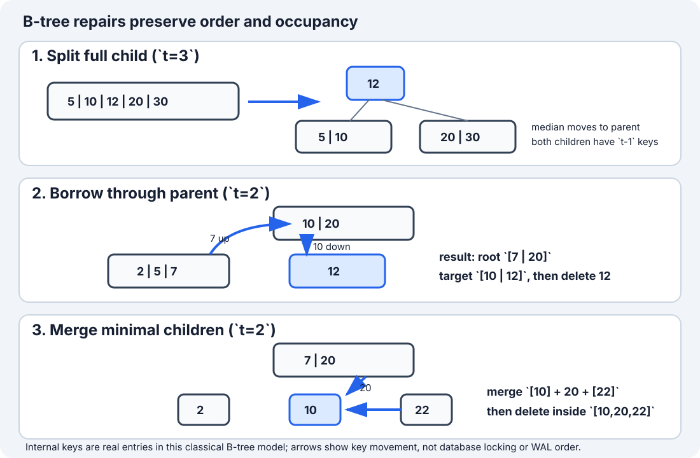

# B-Tree Insertion and Deletion: Split Before Descent

[Local study intake](../README.md) · [Java implementation](java/BTreeIntSet.java) · [Validation harness](java/BTreeIntSetCheck.java) · [B+ tree comparison](b-plus-tree-database-index.md)

This module enriches section 5 of the uploaded `Advanced_Trees_FAANG_Mermaid_Study_Guide.md`. The source supplies the minimum-degree convention, search/insertion outline and a 13-key insertion trace. Its Java snippet cannot compile because the `root` field is accidentally swallowed by a comment. The implementation here corrects that defect and adds complete set semantics, split-before-descent insertion, borrow/merge deletion, structural validation, four contract examples, correctness arguments, cost derivation, an original repair diagram and independent randomized tests.

This is a distinct teaching unit from the adjacent B+ tree guide: a classical B-tree can satisfy a search at an internal key and promotes the median **out of** a split child. The B+ module keeps entries in linked leaves and copies a routing boundary upward.

## 1. Simple definition and exact contract

A **B-tree** is a height-balanced multiway search tree. Every node holds several sorted keys, so each internal node can route to many children. All leaves have the same depth.

This Java 17 module implements a mutable set of distinct `int` keys:

- `add(key)` returns `true` only when a new key is inserted;
- `contains(key)` searches internal and leaf keys;
- `remove(key)` returns `true` only when an existing key is deleted;
- `toList()` constructs all keys in ascending order;
- `size()`, `isEmpty()` and `heightLevels()` expose state;
- `validate()` checks ordering, occupancy, child ranges, equal leaf depth and recorded size.

The model is an in-memory algorithm exercise. It does not implement disk pages, WAL, checksums, transactions, latches, duplicate records or crash recovery.

### Four concrete examples

| Starting state | Operation | Expected result | Concept |
|---|---|---|---|
| empty tree, minimum degree `t=3` | add `10,20,5,6,12,30` | root `[10]`; leaves `[5,6]`, `[12,20,30]` | a full root splits before insertion continues |
| tree contains internal key 10 | `contains(10)` | `true` without descending to a leaf | internal keys are searchable records here |
| tree already contains 20 | `add(20)` | `false`; size unchanged | this module has set semantics |
| tree contains `MIN_VALUE,0,MAX_VALUE` | remove `0`, then `toList()` | `[MIN_VALUE, MAX_VALUE]` | comparisons avoid subtraction overflow |

An empty tree is represented by one empty leaf. The minimum degree must be at least 2. A mathematically legal but unallocatable huge degree can still exhaust memory; the constructor only guards arithmetic overflow, not available heap capacity.

## 2. Minimum degree and occupancy

Let `t >= 2` be the **minimum degree**.

| Node property | Non-root requirement | Maximum |
|---|---:|---:|
| keys | `t - 1` | `2t - 1` |
| children when internal | `t` | `2t` |

An internal node with `k` keys has exactly `k + 1` active children. The root is special: an internal root needs at least one key, while an empty root may be a leaf with zero keys.

For keys `k0 < k1 < ... < k(m-1)`:

- child 0 contains keys `< k0`;
- child `i` contains keys strictly between `k(i-1)` and `ki`;
- child `m` contains keys `> k(m-1)`.

Because keys are real set entries, equality with `ki` finishes the search at the current node. This differs from the B+ guide's lower-bound-of-right-child separators, where equality routes right and only a leaf confirms membership.

## 3. Why multiway nodes help

A binary search tree branches at most two ways. A B-tree node can encode a page-sized search directory, reducing height and expensive page transitions. If useful occupancy gives average fan-out `F`, height is `O(log_F n)` rather than thinking only in base two.

The original Bayer–McCreight work organized large ordered indexes into page-oriented B-trees and derived logarithmic retrieval, insertion and deletion bounds. Modern engines use important variants and concurrency protocols, so the textbook arrays in this module teach structural mechanics, not an engine's physical format.

### Classical B-tree versus B+ tree

| Question | B-tree in this module | B+ tree companion module |
|---|---|---|
| Where can a record key live? | internal node or leaf | leaf entry; internal values route |
| What happens to split median? | moves to parent | leaf boundary is commonly copied upward |
| Can point search stop internally? | yes | no under the module's contract |
| Natural long range scan | in-order tree traversal | descend once, then follow linked leaves |
| Java focus | online add/remove and rebalancing | immutable bulk load, point/range reads |

## 4. Insertion invariant: never descend into a full child



The top-down insertion rule is:

> Before recursing into a child with `2t - 1` keys, split it. Then choose the left or right result.

For `t=3`, split full child `[5,10,12,20,30]`:

| Part | Keys after split |
|---|---|
| left child | `[5,10]` |
| promoted median | `12` |
| right child | `[20,30]` |

Both children now have `t-1=2` keys. The non-full parent gains the median and one child pointer. The recursive call is guaranteed to enter a non-full node, so a leaf always has space when the new key is shifted into position.

```java
if (node.children[index].keyCount == 2 * minimumDegree - 1) {
    splitChild(node, index);
    if (key > node.keys[index]) index++;
}
insertNonFull(node.children[index], key);
```

The comparison after the split is essential: promotion changed the parent and replaced one candidate child with two.

## 5. Full insertion dry run (`t=3`)

Insert `10,20,5,6,12,30,7,17,3,4,2,40,50`.

| Insert | Relevant state before | Structural action | State after |
|---:|---|---|---|
| 10 | empty root leaf | ordered leaf insert | `[10]` |
| 20 | `[10]` | append | `[10,20]` |
| 5 | `[10,20]` | shift right | `[5,10,20]` |
| 6 | `[5,10,20]` | shift | `[5,6,10,20]` |
| 12 | `[5,6,10,20]` | fills root | `[5,6,10,12,20]` |
| 30 | full root | split; promote 10; choose right | root `[10]`; leaves `[5,6]`, `[12,20,30]` |
| 7 | left leaf | insert | `[5,6,7]` |
| 17 | right leaf | insert | `[12,17,20,30]` |
| 3 | left leaf | insert | `[3,5,6,7]` |
| 4 | left leaf | fills child | `[3,4,5,6,7]` |
| 2 | target child full | split; promote 5; choose left | root `[5,10]`; left `[2,3,4]`, middle `[6,7]` |
| 40 | rightmost leaf | fills it | `[12,17,20,30,40]` |
| 50 | target child full | split; promote 20; choose right | root `[5,10,20]`; right `[30,40,50]` |

Final leaves are `[2,3,4]`, `[6,7]`, `[12,17]`, `[30,40,50]`. They all have the same depth and legal occupancy.

## 6. Deletion invariant: prepare a minimal child before descent

Deletion is harder because removing a key can make a node underfull. The top-down rule mirrors insertion:

> Before descending, make sure the chosen child has at least `t` keys—not merely the minimum `t-1`.

If the child has only `t-1` keys:

1. borrow through the parent from a sibling with at least `t` keys; otherwise
2. merge it with a sibling and one parent separator.

Then the recursive deletion can remove one key without leaving an illegal non-root node.

### Case A: delete from a leaf

If the target leaf already has at least `t` keys before deletion, shift later keys left. Example with `t=2`: `[12,15] - 12 => [15]`, which still has the legal minimum one key.

### Case B: delete an internal key

For root `[10,20]` with left child `[2,5,7]`, deleting internal key 10 can replace it with predecessor 7 because the left child has at least `t=2` keys. Then recursively delete 7 from that child. The symmetric case uses the successor from a sufficiently large right child.

If both adjacent children have only `t-1` keys, merge `left + separator + right`, then delete inside the merged node.

### Case C: borrow before descent (`t=2`)

Suppose root is `[10,20]`, left sibling `[2,5,7]`, target child `[12]`, and we must delete 12. The target has the minimum one key, so prepare it first:

| Movement | Result |
|---|---|
| parent 10 moves down to front of target | target becomes `[10,12]` |
| sibling maximum 7 moves up to parent | root boundary becomes `[7,20]` |
| delete 12 | target remains legal as `[10]` |

Borrowing is a three-way rotation through the parent, not a direct sibling-to-child copy.

### Case D: merge before descent (`t=2`)

Start with root `[7,20]` and minimal leaves `[2]`, `[10]`, `[22]`. Delete 10:

| Step | Root | Children |
|---:|---|---|
| before | `[7,20]` | `[2]`, `[10]`, `[22]` |
| merge target + separator 20 + right | `[7]` | `[2]`, `[10,20,22]` |
| delete 10 in merged leaf | `[7]` | `[2]`, `[20,22]` |

When an internal root finally has zero keys and one child, that child becomes the new root. This is the only deletion event that reduces height.

## 7. Complete Java 17 implementation

The runnable implementation is [BTreeIntSet.java](java/BTreeIntSet.java). It includes full insertion and deletion rather than leaving deletion as pseudocode.

Search binary-searches each node and can finish internally:

```java
public boolean contains(int key) {
    Node node = root;
    while (true) {
        int index = lowerBound(node, key);
        if (index < node.keyCount && node.keys[index] == key) return true;
        if (node.leaf) return false;
        node = node.children[index];
    }
}
```

Removal first verifies membership, performs top-down repair, then contracts an empty internal root:

```java
public boolean remove(int key) {
    if (!contains(key)) return false;
    delete(root, key);
    if (!root.leaf && root.keyCount == 0) root = root.children[0];
    size--;
    return true;
}
```

The precheck simplifies the public boolean contract and protects against reporting a size change for a missing key. It adds one extra logarithmic descent; an API optimized for fewer page visits would propagate a found/deleted result from the deletion routine instead.

`validate()` is deliberately part of the teaching API. Randomized tests invoke it repeatedly so a tree that returns the right answer while quietly breaking occupancy or leaf depth still fails.

## 8. Correctness arguments

**Search.** Sorted node keys divide the permitted key range into disjoint child ranges. Lower bound either finds equality at the node or identifies the only child whose range can contain the key. Each step moves down one level, and equal leaf depth ensures termination. Therefore `contains` returns true exactly for stored keys.

**Split.** A full node has `2t-1` ordered keys. Removing its median leaves `t-1` smaller keys on the left and `t-1` larger keys on the right. Moving the median into the parent preserves parent order and creates the required additional child pointer. Child subtrees move with their enclosing key ranges, so ordering and equal leaf depth remain valid.

**Insertion.** A full root is split first. At every internal step, a full target child is split before descent; therefore recursion enters a non-full node. At a leaf, shifting larger keys and inserting at lower bound preserves strict order without overflow. Splits do not change leaf depth, except a root split adds the same new level above every leaf. All occupancy and balance invariants hold.

**Deletion.** Before descent, `fill` guarantees the selected child has at least `t` keys by borrowing or merging. Removing one key therefore cannot underflow it. Borrow preserves total key order by rotating a parent separator and sibling boundary; merge combines two minimal children plus their separator into exactly `2t-1` keys. Internal-key replacement uses an ordered predecessor or successor and recursively removes its old copy. Root contraction changes the root exception but leaves every leaf one level closer. Thus deletion removes exactly the requested key and preserves all B-tree invariants.

**Traversal.** For each internal key `ki`, recursive traversal emits child `i` first, then `ki`, followed eventually by child `i+1`. The child-range invariant makes every emitted prefix smaller than the next key. Induction over node height proves `toList()` returns every stored key exactly once in ascending order.

## 9. Complexity, page visits and output construction

Let `n` be keys, `t` minimum degree and `h` height.

| Operation | Page/node visits | CPU in this array model | Auxiliary/output space |
|---|---:|---:|---:|
| `contains` | O(h) | O(h log t) via binary search | O(1) iterative |
| `add` | O(h) after duplicate precheck | O(ht) worst case because keys/pointers shift | O(h) recursion |
| `remove` | O(h) after membership precheck | O(ht) worst case for borrow/merge shifts | O(h) recursion |
| `toList` | visits every node/key | O(n) | O(h) stack + O(n) output |
| `validate` | visits every node/key | O(n) | O(h) stack |

For fixed page capacity, `t` is treated as a storage-layout constant, so search, insertion and deletion are conventionally O(log n). More precisely, useful occupancy gives `h = O(log_t n)`. The Java arrays expose per-node CPU work that a page-I/O analysis intentionally abstracts.

`toList()` cannot be sublinear because constructing `n` boxed `Integer` results already costs O(n) time and O(n) output space. A cursor-style visitor could stream results with O(h) traversal state, but total emitted work remains O(n).

The tree itself stores O(n) keys and child slots. Array capacity can be underfilled; minimum occupancy bounds the wasted fraction for non-root nodes.

## 10. Boundaries and common errors

- Let the source's `root` declaration remain inside a comment: the class does not compile.
- Descend into a full child and split after recursion: a leaf can overflow before repair. Split first.
- Promote the wrong index: for minimum degree `t`, median index is `t-1` in zero-based storage.
- Copy `t` keys to the right child: only `t-1` keys belong there; the median moves to the parent.
- Route equality downward as if this were the B+ separator convention: a classical internal key is itself a match.
- Reject duplicates only inside the destination leaf: the duplicate might already be an internal promoted key.
- Delete from a minimal child before borrowing/merging: this creates `t-2` keys and violates occupancy.
- Borrow directly between siblings: the moved values must rotate through the parent to preserve boundaries.
- Merge children without removing the parent separator and extra child pointer.
- Forget root contraction after its last separator is merged away.
- Compare integers by subtraction: overflow can corrupt ordering near `Integer.MIN_VALUE`/`MAX_VALUE`.
- Call this a database engine: production trees need byte-oriented page layouts, recovery, concurrency, duplicate/version semantics and failure handling.

Test empty and singleton trees, duplicate insertion, missing deletion, extreme integers, every deletion case, repeated root growth/contraction, minimum degree 2, larger degrees, adversarial sorted insertion and randomized mixed operations against an independent ordered set.

## 11. Trade-offs and interview variations

**2-3-4 tree.** A B-tree with `t=2` has one to three keys per non-root node and corresponds closely to red-black tree structure. The B-tree groups several conceptual binary nodes into one multiway node.

**B+ tree.** Move record entries to leaves, retain internal routing keys and link leaves. This improves sequential ranges and often internal fan-out; use the companion module for the exact separator convention.

**B* tree.** Redistribution before splitting can target denser occupancy, trading more complex sibling coordination for space utilization.

**Bulk loading.** Sorted input can fill leaves/pages sequentially instead of paying repeated online split work. The companion B+ model demonstrates immutable bulk construction.

**Duplicate keys.** A database may attach multiple record identifiers to one logical key. This set instead rejects duplicates, keeping strict child bounds and a simple boolean API.

**Concurrency.** Berkeley DB documents lock coupling while traversing B-tree pages. A real split may revisit or retain locks on pages; the single-threaded Java object has no such protocol.

**Interview prompt.** Given `t`, explain legal occupancy, write search, show split-before-descent insertion, then narrate predecessor/successor, borrow and merge deletion cases. Full deletion code is valuable, but naming and preserving the invariant is more important than memorizing array shifts.

## 12. Verification, sources and continuation

The Java 17 compiler module compiled the corrected implementation and independent harness. Tests cover the source's 13-key sequence, internal/leaf deletion, borrowing, merging, root contraction, invalid degree, extreme integers and duplicate/missing operations. They also perform 1,000 shuffled insert/delete permutations and 200,000 seeded mixed operations across minimum degrees 2–9, comparing results, sizes and ordered output with `TreeSet` while repeatedly validating every structural invariant.

Sources checked 2026-10-08:

- Uploaded `Advanced_Trees_FAANG_Mermaid_Study_Guide.md`, section 5, lines 636–781 (SHA-256 `86cb65f3d6d0f327e5d22c03b5d587144eb11cc9ff27a5b523b298b09ad7f5b1`): minimum-degree convention, insertion spine and dry-run sequence; the non-compiling `root` declaration was corrected rather than copied.
- [Bayer and McCreight, “Organization and Maintenance of Large Ordered Indexes”](https://doi.org/10.1007/BF00288683), *Acta Informatica* 1 (1972): original page-oriented B-tree design and analysis.
- [SQLite B-Tree Module — balancing algorithm](https://sqlite.org/btreemodule.html#the_b_tree_balancing_algorithm): production examples of root-deeper, root-shallower and specialized page balancing.
- [Oracle Berkeley DB — locking granularity](https://docs.oracle.com/cd/E17276_01/html/programmer_reference/lock_page.html): page traversal and lock-coupling boundary absent from the teaching model.
- [B+ Tree Database Index](b-plus-tree-database-index.html): related leaf-only routing/range module kept separate rather than duplicated here.

Next bounded source section: section 4, Red-Black Tree. Compare it with canonical Trees/BST coverage before publishing any focused module.
