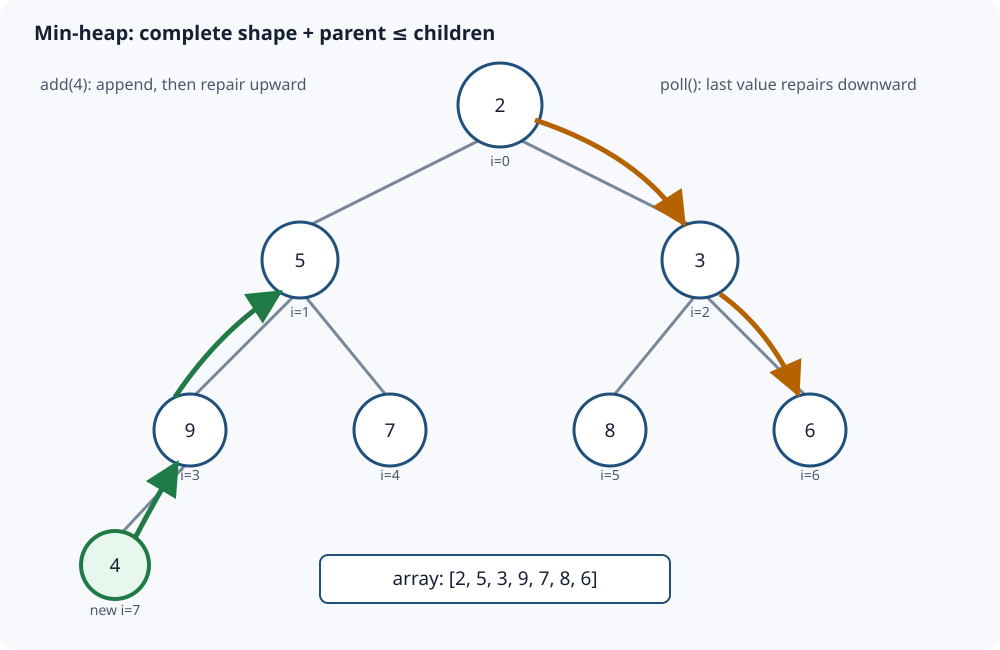

# Binary Heap and Priority Queue: Repair One Path

[Local study intake](../README.md) · [Java source](java/IntMinHeap.java) · [Validation harness](java/IntMinHeapCheck.java)

This module enriches section 7 of the uploaded `Advanced_Trees_FAANG_Mermaid_Study_Guide.md`. Its min-heap and two-operation trace are the source spine. The precise contract, four examples, invariants, linear heap construction, correctness proofs, Java API boundaries, diagram and independent randomized tests are added teaching material. Existing repository coverage uses a priority queue inside Dijkstra; it does not duplicate these heap internals.

## 1. Simple definition and exact contract

A **priority queue** is an abstract data type: add an item, inspect the highest-priority item, and remove that item. A **binary heap** is one efficient implementation of that contract.

This module implements an integer **min-heap**:

- `add(value)` inserts any signed `int`, including duplicates.
- `peek()` returns the smallest value without removal.
- `poll()` removes and returns one smallest value.
- `size()` and `isEmpty()` expose the current count.
- `new IntMinHeap(values)` copies an input array and heapifies it in O(n).

`peek` and `poll` throw `NoSuchElementException` on an empty heap. The caller's input array is never retained. Equal values have no stable first-in/first-out order; if ties need deterministic ordering, store a secondary sequence number and include it in the comparator.

### Four concrete examples

| Starting state | Operation | Result | Why it matters |
|---|---|---|---|
| `[2,5,3,9,7,8,6]` | add `4` | valid layout `[2,4,3,5,7,8,6,9]` | Append at the complete-tree position, then sift upward. |
| `[2,4,3,5,7,8,6,9]` | poll | returns `2`; one valid layout is `[3,4,6,5,7,8,9]` | Move the last value to the root, then sift downward. |
| empty heap | add `5,-2,5` then drain | `-2,5,5` | Negative values and duplicates are ordinary priorities. |
| Java `PriorityQueue` containing `1,7,3` | iterate or print backing order | not guaranteed sorted | Only the head is guaranteed least; polling repeatedly produces sorted order. |

The exact internal array is not unique when equal priorities exist. Correctness depends on the invariant, not on matching one drawing.

## 2. Two structural facts

A binary heap combines:

1. **Shape invariant:** it is a complete binary tree—all levels are full except perhaps the last, which fills from left to right.
2. **Min-heap order invariant:** every parent value is less than or equal to each child value.

The shape invariant lets an array encode the tree without pointers. For a zero-based node index `i`:

```text
parent(i) = (i - 1) / 2       when i > 0
left(i)   = 2i + 1
right(i)  = 2i + 2
```



The order invariant is deliberately weaker than sorting. A parent precedes its descendants by priority, but siblings and cousins need not be ordered. In `[2,5,3,9,7,8,6]`, value 5 appears before 3 in the array even though 3 is smaller; both are valid children of 2.

That weak promise is the advantage: only one root-to-leaf path can become invalid after insertion or root removal.

## 3. Insertion: append, then sift up

Insert `4` into `[2,5,3,9,7,8,6]`.

| Step | Index and comparison | Action | Array |
|---:|---|---|---|
| 1 | append at index 7 | preserves complete-tree shape | `[2,5,3,9,7,8,6,4]` |
| 2 | parent index 3 contains 9; `9 > 4` | move 9 down | `[2,5,3,4,7,8,6,9]` |
| 3 | parent index 1 contains 5; `5 > 4` | move 5 down | `[2,4,3,5,7,8,6,9]` |
| 4 | parent index 0 contains 2; `2 <= 4` | stop | unchanged |

Before insertion, all old edges obeyed heap order. Appending creates only one new edge—from the new leaf to its parent—that might be wrong. Each upward move repairs the lower edge and moves the possible violation one level toward the root.

The implementation holds the inserted value in a local variable and moves parents downward rather than swapping on every level:

```java
private void siftUp(int index) {
    int value = elements[index];
    while (index > 0) {
        int parent = (index - 1) / 2;
        if (elements[parent] <= value) break;
        elements[index] = elements[parent];
        index = parent;
    }
    elements[index] = value;
}
```

The stop line matters: once `parent <= value`, every ancestor is also no greater than that parent by the old invariant, so no higher comparison can require a move.

## 4. Remove-min: replace the root, then sift down

Poll `[2,4,3,5,7,8,6,9]`.

| Step | Candidate and children | Action | Logical array |
|---:|---|---|---|
| 1 | save root 2; remove last value 9 | place 9 at root | `[9,4,3,5,7,8,6]` |
| 2 | children are 4 and 3 | choose smaller child 3; move it up | `[3,4,9,5,7,8,6]` |
| 3 | candidate 9 has children 8 and 6 | choose 6; move it up | `[3,4,6,5,7,8,9]` |
| 4 | new index is a leaf | place 9; stop | unchanged |

Always compare with the **smaller child**. Swapping with the left child merely because it is smaller than the candidate can leave a still-smaller right child under the larger parent, immediately violating heap order.

```java
int smallerChild = left;
if (right < size && elements[right] < elements[left]) {
    smallerChild = right;
}
if (value <= elements[smallerChild]) break;
```

Only the path followed by the last value can be invalid. The untouched sibling subtrees preserve their previous heap order.

## 5. Build a heap in O(n), not O(n log n)

Repeatedly calling `add` is correct and costs O(n log n) in the worst case. Bottom-up heapify is faster:

1. Leaves already satisfy heap order because they have no children.
2. The last internal node is `n/2 - 1`.
3. Sift every internal node down, moving backward to the root.

```java
for (int index = size / 2 - 1; index >= 0; index--) {
    siftDown(index);
}
```

It is tempting to multiply n nodes by O(log n), but most nodes are near the bottom and move little or not at all. At most about `n/2^(h+1)` nodes have height `h`. The total work is bounded by:

```text
n * Σ(h / 2^(h+1)) = O(n)
```

The infinite weighted sum is constant. Thus bottom-up heapify is O(n), while sorting is O(n log n). Heapifying establishes priority access; it does not sort the array.

## 6. Complete Java 17 implementation

The runnable source is [IntMinHeap.java](java/IntMinHeap.java).

```java
import java.util.Arrays;
import java.util.NoSuchElementException;
import java.util.Objects;

public final class IntMinHeap {
    private int[] elements;
    private int size;

    public IntMinHeap() { elements = new int[16]; }

    public IntMinHeap(int[] values) {
        Objects.requireNonNull(values, "values");
        elements = Arrays.copyOf(values, Math.max(16, values.length));
        size = values.length;
        for (int i = size / 2 - 1; i >= 0; i--) siftDown(i);
    }

    public int size() { return size; }
    public boolean isEmpty() { return size == 0; }

    public void add(int value) {
        ensureCapacity();
        elements[size] = value;
        siftUp(size);
        size++;
    }

    public int peek() {
        if (size == 0) throw new NoSuchElementException("heap is empty");
        return elements[0];
    }

    public int poll() {
        int minimum = peek();
        int last = elements[--size];
        if (size > 0) {
            elements[0] = last;
            siftDown(0);
        }
        return minimum;
    }

    private void siftUp(int index) {
        int value = elements[index];
        while (index > 0) {
            int parent = (index - 1) / 2;
            if (elements[parent] <= value) break;
            elements[index] = elements[parent];
            index = parent;
        }
        elements[index] = value;
    }

    private void siftDown(int index) {
        int value = elements[index];
        int firstLeaf = size / 2;
        while (index < firstLeaf) {
            int left = index * 2 + 1;
            int right = left + 1;
            int smaller = left;
            if (right < size && elements[right] < elements[left]) smaller = right;
            if (value <= elements[smaller]) break;
            elements[index] = elements[smaller];
            index = smaller;
        }
        elements[index] = value;
    }

    private void ensureCapacity() {
        if (size < elements.length) return;
        int old = elements.length;
        int next = old + (old >>> 1) + 1;
        if (next < 0) throw new OutOfMemoryError("heap capacity overflow");
        elements = Arrays.copyOf(elements, next);
    }
}
```

The single-element `poll` case matters. After decrementing size to zero, do not call `siftDown(0)`; there is no logical root to repair.

## 7. Correctness

**Insertion.** Appending preserves the complete-tree shape. All old edges remain valid; only the new value and its ancestors can violate order. During sift-up, every moved parent is placed below a smaller value but remains above its unchanged children because it previously bounded that subtree. When the value reaches the root or a parent no greater than it, its incoming edge is valid. Therefore all parent-child edges satisfy heap order.

**Peek.** Repeatedly applying the order invariant along every root-to-node path shows the root is no greater than any node, so it is a minimum.

**Poll.** Removing the last position and moving it to the root preserves complete-tree shape. Only the replacement's downward path can violate order. Sift-down selects the smaller child; moving that child upward makes the current parent no greater than both children. When the replacement is no greater than its smaller child or reaches a leaf, its edge relationships are valid. Untouched subtrees were never modified, so the whole tree is a heap. The saved old root is a minimum by the peek argument.

**Heapify.** Process nodes from the last internal node to the root. Before processing index `i`, both child subtrees have already been heapified. Sift-down makes the subtree rooted at `i` a heap without breaking its child subtrees. Reverse induction leaves the root subtree—the entire array—a heap.

## 8. Complexity and output cost

| Operation | Time | Auxiliary space |
|---|---:|---:|
| construct empty heap | O(1) | O(initial capacity) |
| bottom-up constructor | O(n) | O(n) copied backing array |
| `peek`, `size`, `isEmpty` | O(1) | O(1) |
| `add` | O(log n) worst case; occasional O(n) resize | O(1), excluding backing growth |
| `poll` | O(log n) | O(1) |

Dynamic-array resizing makes insertion amortized O(log n): array copies are occasional, while the sift path is logarithmic. Storage is O(n).

The heap does not offer a sorted iteration output. Draining n items with repeated `poll` constructs sorted output in O(n log n) time and O(n) output space. Copying the internal heap order would cost O(n), but that output is only a heap layout, not sorted order. In-place heapsort uses O(n) heap construction plus O(n log n) removals and O(1) auxiliary array space; it is not stable.

## 9. Java `PriorityQueue` boundaries

Java's `PriorityQueue` is a min-priority heap by default. Its head is the least element under natural or comparator ordering. `offer`/`poll` are O(log n), `peek` is O(1), while `contains` and `remove(Object)` are linear. Its iterator and `toArray()` do not promise sorted order.

```java
PriorityQueue<Integer> min = new PriorityQueue<>();
PriorityQueue<Integer> max = new PriorityQueue<>(Comparator.reverseOrder());
```

For records, write a total comparator:

```java
record Task(int priority, long sequence, String id) {}
Comparator<Task> order = Comparator
        .comparingInt(Task::priority)
        .thenComparingLong(Task::sequence);
```

Do not write `(a,b) -> a.priority() - b.priority()`: subtraction can overflow and violate comparator ordering. Use `Integer.compare` or comparator factories.

Do not mutate fields that determine an element's priority while it is inside the queue. The queue is not notified and will not repair the element's position. Remove/reinsert it, use immutable entries, or insert a new version and skip stale entries—as section G-32 in the canonical [Graph DSA reader](../../striver-dsa/graph-dsa/html/index.html) does.

Java's `PriorityQueue` is not synchronized and rejects null. For concurrent mutation, choose a suitable concurrent design such as `PriorityBlockingQueue`, while still defining ordering and shutdown/backpressure semantics.

## 10. Choosing the right structure

| Need | Unsorted array/list | Sorted array/list | Balanced search tree | Binary heap |
|---|---:|---:|---:|---:|
| insert | O(1) amortized | O(n) | O(log n) | O(log n) |
| inspect minimum | O(n) | O(1) | O(log n) or O(1) with cached end | O(1) |
| remove minimum | O(n) | O(n) for array shift | O(log n) | O(log n) |
| search/remove arbitrary value | O(n) | O(log n) search + O(n) removal | O(log n) | O(n) without extra index |
| ordered traversal | sort first | already ordered | O(n) | repeated poll O(n log n) |

Use a heap when repeated best-item selection dominates. Use a balanced tree when predecessor/successor, ordered iteration or arbitrary ordered deletion matters. Use a deque for strict FIFO/LIFO behavior; priority is not arrival order.

## 11. Common errors and boundaries

- Assume the array is globally sorted: only parent-child relationships are guaranteed.
- Poll by shifting every array element left: this wastes O(n) and ignores complete-tree repair.
- Sift down through the left child without comparing the right child: the smaller right child may remain above its parent.
- Continue sifting after the invariant is restored: extra work risks corrupting a correct subtree.
- Use the wrong last-internal-node formula: zero-based heapify begins at `n/2 - 1`.
- Call repeated insertion “linear heap construction”: it is O(n log n) worst case; bottom-up heapify is O(n).
- Expect stable ties: equal-priority order is unspecified unless encoded explicitly.
- Iterate a Java `PriorityQueue` expecting ascending values: poll repeatedly or copy and sort.
- Use mutable comparator fields or subtraction comparators: ordering becomes stale or inconsistent.
- Confuse this data structure with the JVM memory heap: they share a word, not a purpose.

Test empty and singleton heaps, duplicates, negative/extreme integers, ascending and descending insertion, capacity growth, already-valid heaps, arbitrary arrays and long mixed operation sequences against an independent priority-queue oracle.

## 12. Interview patterns and extensions

**Top K largest.** Keep a min-heap of at most K items. When size exceeds K, remove the smallest. The root is the current kth largest; total time O(n log K), storage O(K). For K smallest, reverse the priority.

**Merge K sorted lists.** Put each list's current head in a min-heap keyed by value. Poll the smallest, append it, and add its successor. For total output N, time is O(N log K), and constructing the N-element answer costs O(N) output space.

**K-way streaming / external merge.** The same frontier idea merges sorted files without loading all records. The heap stores one candidate per input stream; I/O buffering becomes the dominant engineering concern.

**Running median.** Maintain a max-heap for the lower half and min-heap for the upper half. Preserve both ordering (`max(lower) <= min(upper)`) and size balance (difference at most one).

**Dijkstra / best-first search.** Insert newly improved states. Java lacks a general decrease-key handle, so stale entries may remain; compare a polled version/distance against current authoritative state before processing.

**Indexed heap.** Maintain item-to-index mappings to support decrease-key or arbitrary removal in O(log n). Every swap must update both the heap array and index map—one additional invariant that is easy to break.

**D-ary heap.** More children reduce height but increase the comparisons needed to find the best child. It can improve cache/branch trade-offs in workloads with many updates, but binary heaps remain the clearest interview baseline.

## Sources and continuation

- Uploaded `Advanced_Trees_FAANG_Mermaid_Study_Guide.md`, section 7, lines 834–913 (SHA-256 `86cb65f3d6d0f327e5d22c03b5d587144eb11cc9ff27a5b523b298b09ad7f5b1`): conceptual spine, custom min-heap and two-operation example.
- [Java SE 17 `PriorityQueue` API](https://docs.oracle.com/en/java/javase/17/docs/api/java.base/java/util/PriorityQueue.html): authoritative ordering, complexity, iteration and concurrency contracts.
- [Canonical Graph DSA reader](../../striver-dsa/graph-dsa/html/index.html), section G-32 Dijkstra — Priority Queue: existing application coverage retained rather than duplicated here.

Next bounded source section: section 6, B+ Tree. Compare it with database-index coverage before publishing. Later source sections remain queued rather than implicitly reviewed.
