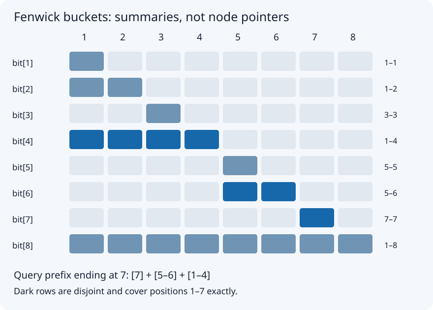

# Fenwick Tree: Fast Sums While Values Change

[Local study intake](../README.md) · [Java source](java/Fenwick.java)

This first batch enriches section 10 of the uploaded `Advanced_Trees_FAANG_Mermaid_Study_Guide.md`. The rest of that source remains queued. The source's constructor had been accidentally placed inside a comment; the standalone code below repairs it. Examples, proof, validation and picture are added teaching material.

## 1. The problem, before the data structure

You have an array of numbers and two kinds of request:

- Add a signed delta to one element.
- Return the sum of an inclusive range `[left,right]`.

A Fenwick tree, also called a Binary Indexed Tree, maintains selected sums so an update and a query visit only a logarithmic number of entries. The word tree describes a hierarchy of covered intervals; the implementation is just an array, without node objects or pointers.

Our public API uses zero-based indices. Internal buckets use one-based indices. `add(2,5)` means **increase the third element by 5**, not replace it with 5. `prefixSum(-1)` returns zero, so range formulas can include index zero. Empty trees have size zero and allow only that empty-prefix query. Invalid element indices and reversed ranges are rejected. Values and every intermediate sum must fit in signed `long`; this implementation does not detect arithmetic overflow.

### Four concrete examples

| Initial array | Operations | Answer | Meaning |
|---|---|---:|---|
| `[3,2,-1,6,5,4,-3,3]` | `prefixSum(6)` | 16 | Sum of the first seven elements |
| `[3,2,-1,6,5,4,-3,3]` | `add(2,5)`, then `rangeSum(2,5)` | 19 | Third element changes from -1 to 4 |
| `[0,0,0]` | `add(1,-7)`, then `rangeSum(0,2)` | -7 | Negative updates work for sums |
| `[2_000_000_000,2_000_000_000]` | `prefixSum(1)` | 4_000_000_000 | The answer exceeds int |

## 2. Why older approaches become expensive

An ordinary array makes an update constant time, but a wide query reads many elements. A prefix-sum array answers a range immediately, but changing element 2 changes every later prefix. Rebuilding those prefixes after each update repeats work.

| Structure | Build | Point addition | Range sum | Storage | Good situation |
|---|---:|---:|---:|---:|---|
| Ordinary array | O(n) | O(1) | O(n) worst case | O(n) | Few queries |
| Static prefix sums | O(n) | O(n) | O(1) | O(n) | Read-only or rarely changing data |
| Fenwick, built by repeated add | O(n log n) | O(log n) | O(log n) | O(n) | Many updates and sum queries |
| Fenwick, linear construction | O(n) | O(log n) | O(log n) | O(n) | Optional faster initialization |
| Segment tree | O(n) | O(log n) | O(log n) | O(n) | More general range summaries |

Fenwick trees solve the **dynamic prefix-summary problem**, not every range-query problem. Arbitrary min/max replacements cannot use ordinary prefix subtraction: knowing two minima does not reveal the minimum of the range between them. A segment tree is usually a better fit for arbitrary range min/max or custom merged node states. Specialized Fenwick minimum structures have additional restrictions; do not silently substitute them for the sum implementation.

## 3. What each bucket actually stores

For internal index `i`, define `lowbit(i) = i & -i`. Bucket `bit[i]` stores the sum of internal positions `[i-lowbit(i)+1,i]`.



For the eight-element example:

| i | Binary | lowbit | Internal positions covered | Initial sum |
|---:|---|---:|---|---:|
| 1 | 0001 | 1 | 1 | 3 |
| 2 | 0010 | 2 | 1–2 | 5 |
| 3 | 0011 | 1 | 3 | -1 |
| 4 | 0100 | 4 | 1–4 | 10 |
| 5 | 0101 | 1 | 5 | 5 |
| 6 | 0110 | 2 | 5–6 | 9 |
| 7 | 0111 | 1 | 7 | -3 |
| 8 | 1000 | 8 | 1–8 | 19 |

### Why `i & -i` isolates one bit

In two's-complement arithmetic, negation inverts the bits and adds one. The trailing zeros stay zero, the rightmost one stays one, and higher positions no longer have matching ones in both operands at that boundary. The AND therefore isolates the least significant set bit. For example, `6 = 0110`, and the low bit is `0010 = 2`.

This explanation applies to positive internal indices. Never start an update at internal zero: `lowbit(0)=0`, and repeatedly adding zero never progresses.

## 4. Prefix query: remove a completed block

To query public index 6, start at internal index 7. Read bucket 7, then subtract its lowbit. Read bucket 6, then bucket 4.

| Step | Internal i | Bucket interval | Add to total | Total | Next i |
|---:|---:|---|---:|---:|---:|
| 1 | 7 | 7–7 | -3 | -3 | 6 |
| 2 | 6 | 5–6 | 9 | 6 | 4 |
| 3 | 4 | 1–4 | 10 | 16 | 0 |

The selected intervals are disjoint and together cover 1–7. There is no double-counting. Subtracting `lowbit(i)` clears the lowest set bit; a positive integer has only O(log n) bits, so the query terminates after O(log n) visits.

**Query invariant:** the accumulated result covers the removed suffix of the desired prefix; the remaining prefix ends at the current internal index. Reading that index's bucket removes exactly the next disjoint suffix block.

## 5. Point update: repair every affected summary

For `add(2,5)`, start at internal index 3. Update buckets 3, 4 and 8. These are exactly the stored summary intervals containing that element.

| Bucket | Covered interval | Before | Delta | After |
|---:|---|---:|---:|---:|
| 3 | 3 | -1 | +5 | 4 |
| 4 | 1–4 | 10 | +5 | 15 |
| 8 | 1–8 | 19 | +5 | 24 |

Bucket 2 does not include internal position 3; bucket 6 covers 5–6. Neither should change. Adding lowbit moves to the next larger containing bucket; the hierarchy eventually leaves the array.

After the update, `rangeSum(2,5) = prefixSum(5)-prefixSum(1) = 24-5 = 19`. Public prefix 5 uses internal buckets 6 and 4: `9+15=24`.

**Update invariant:** every already-visited containing bucket has received the delta once; unvisited containing buckets are reached by the next upward jump. Other buckets remain correct because they do not summarize the changed element.

## 6. Complete Java 17 implementation

```java
public final class Fenwick {
    private final long[] bit;
    public Fenwick(int size) {
        if (size < 0 || size == Integer.MAX_VALUE)
            throw new IllegalArgumentException("Invalid size");
        bit = new long[size + 1];
    }
    public int size() { return bit.length - 1; }
    public void add(int index, long delta) {
        checkIndex(index);
        for (long i = index + 1L; i < bit.length; i += i & -i)
            bit[(int) i] += delta;
    }
    public long prefixSum(int index) {
        if (index < -1 || index >= size())
            throw new IndexOutOfBoundsException("Prefix index: " + index);
        long result = 0;
        for (int i = index + 1; i > 0; i -= i & -i)
            result += bit[i];
        return result;
    }
    public long rangeSum(int left, int right) {
        checkIndex(left);
        checkIndex(right);
        if (left > right) throw new IllegalArgumentException("left > right");
        return prefixSum(right) - prefixSum(left - 1);
    }
    private void checkIndex(int index) {
        if (index < 0 || index >= size())
            throw new IndexOutOfBoundsException("Element index: " + index);
    }
}
```

The update cursor uses `long` so the upward jump cannot wrap around an int at extremely large internal indices. The stored array indices remain int. Normal memory allocation limits still apply.

To build the sample, create `new Fenwick(values.length)` and call `add(i,values[i])` for each i. That simple construction is O(n log n), not O(n). A separate linear build propagates each initialized bucket to its next containing bucket; it is an optional follow-up, not implemented here.

### Adding versus replacing

If the old value is -1 and the desired new value is 4, call `add(index,5)`. Calling `add(index,4)` would produce 3. To support `set`, keep a parallel values array or query the singleton range to derive `newValue-oldValue`; the latter adds another logarithmic query. The delta itself must fit long.

## 7. Correctness and complexity

Initially all buckets summarize a zero array. Each point addition adjusts exactly the buckets containing that element, preserving their interval-sum meaning. A prefix query partitions the desired prefix into those correct, disjoint buckets, so it returns the correct sum. Subtracting the prefix ending immediately before left from the prefix ending at right leaves precisely the inclusive requested range.

Each query clears a set bit, and each update moves upward through logarithmically many bucket levels. Point addition and prefix/range queries take O(log n) time; the array requires O(n) storage. Each individual operation uses O(1) auxiliary space. Constructor zero-initialization costs O(n). No recursive memoization is needed: the bucket array already caches reusable summaries.

## 8. Pitfalls and boundaries

- Mix up public zero-based and internal one-based indices: updates hit the wrong positions or fail to progress.
- Treat `add` as replacement: your sums drift with every update.
- Include both endpoints incorrectly: the subtraction uses `left-1`, not left.
- Keep sums in int: even two large int values can overflow.
- Assume long cannot overflow: it is a wider fixed-width integer, not arbitrary precision.
- Use a Fenwick sum tree for arbitrary min/max updates: prefix subtraction does not apply.
- Call it thread-safe: concurrent updates and queries need an appropriate synchronization design.

Test n=0, singleton arrays, first/last indices, negative values, duplicate values, repeated updates, full ranges and invalid boundaries. The validation harness compares results with an independent ordinary-array oracle after random operations.

## 9. Interview patterns and extensions

**Count smaller numbers after self:** compress distinct sorted values to ranks; scan from right to left; query counts at smaller ranks, then add the current rank. Query before inserting the current item so it cannot count itself. Query through `rank-1` to exclude equal values. Coordinate compression preserves order, not numerical distances.

**Range add / point query:** use a difference array stored in a Fenwick tree. Add delta at left and -delta at right+1 when it exists. A prefix query recovers the value's accumulated increments.

**Range add / range sum:** use two Fenwick trees with a derived weighted-prefix formula. This requires extra algebra and is queued as a later section rather than asserted to be implemented above.

**Find the kth item by cumulative frequency:** binary lifting can locate the first prefix reaching a target if counts are nonnegative, making prefix totals monotonic. Arbitrary negative values break that search condition even though sum queries still work.

Memory cue: **query removes a low bit; update adds a low bit.** Explain the stored intervals before presenting that cue.

## Sources and continuation

- Uploaded advanced-trees guide, section 10: original conceptual spine and eight-value example.
- [CP-Algorithms: Fenwick Tree](https://cp-algorithms.com/data_structures/fenwick.html): cross-check for bucket operations, construction and variations.

Next batch: read and enrich section 9, Segment Tree + Lazy Propagation; compare range additions with point additions and derive a concrete lazy-tag dry run. The other uploaded chapters are queued, not imported as a supposedly completed book.
