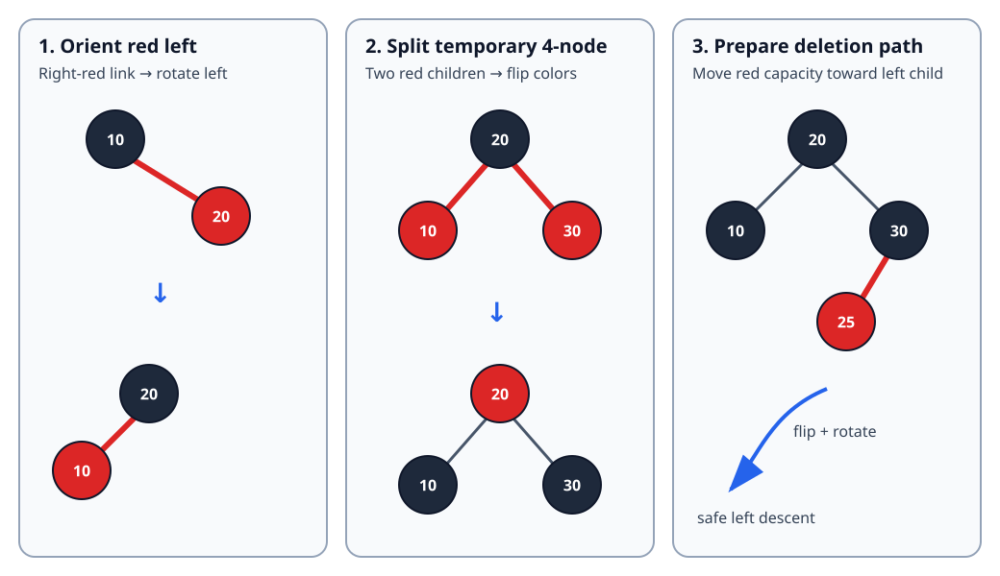

# Red-Black Tree: Color, Rotate, Preserve Black Height

[Local study intake](../README.md) · [Java implementation](java/RedBlackIntSet.java) · [Validation harness](java/RedBlackIntSetCheck.java) · [B-tree comparison](b-tree-insertion-deletion.md)

This module enriches section 4 of the uploaded `Advanced_Trees_FAANG_Mermaid_Study_Guide.md`. The source introduces red-black invariants, the 2–3-tree intuition and left-leaning insertion/deletion. Its Java cannot compile because the `Node` constructor is accidentally inside a comment, and its public removal wrapper can start deletion for an absent key. The version here corrects both problems, supplies a complete Java 17 set, verifies the stronger left-leaning invariants, and adds deletion mechanics, traces, proofs, boundaries and randomized tests.

The canonical Trees/BST guide had no red-black-tree section, so this is a focused advanced-tree unit rather than a duplicate textbook.

## 1. Simple definition and exact contract

A **red-black tree** is a binary search tree whose links carry a red/black bit. Color rules prevent any root-to-leaf path from becoming more than twice as long as another. Search remains ordinary BST search; insertion and deletion repair colors and links locally.

This module uses the **left-leaning red-black (LLRB)** representation of a 2–3 tree:

- red means “glued to the parent as one conceptual 3-node”;
- a red link must lean left;
- two red children, right-red links and consecutive left-red links are temporary states repaired during an update;
- keys are distinct, so `add` and `remove` return whether the set changed;
- `toList()` constructs ascending output;
- `validate()` checks ordering, root color, link orientation, red adjacency, equal black height and size.

This is an in-memory teaching structure. It is not synchronized and does not provide iterators, comparators, persistence or lock-free reads.

### Four concrete examples

| Start | Operation | Expected result | Lesson |
|---|---|---|---|
| empty | add `10,20,30` | in order `[10,20,30]`; root 20 is black | rotations and a color flip avoid a chain |
| `{1,5,10,15,20,25,30}` | add `15` | `false`; size stays 7 | set semantics reject duplicates |
| same set | remove `10` | `true`; sorted result `[1,5,15,20,25,30]` | internal deletion substitutes a successor |
| `{MIN_VALUE,0,MAX_VALUE}` | remove `0` | `[MIN_VALUE,MAX_VALUE]` | comparisons do not subtract and overflow |

Removing a missing key returns `false` without changing structure. An empty tree has height 0 and an empty output list.

## 2. Invariants: ordinary red-black plus left leaning

| Invariant | Meaning |
|---|---|
| BST order | every left key is smaller; every right key is larger |
| black root | the externally visible root is normalized to black |
| black nulls | every missing child is a conceptual black NIL leaf |
| no red-red | a red node cannot have a red child |
| equal black height | paths from one node to descendant NIL leaves contain the same black count |
| left leaning | no red right child; this canonicalizes the encoded 2–3 tree |

The first five are classical red-black properties. Left leaning is an additional representation choice, not a universal red-black-tree rule. Java's `TreeMap`, for example, uses a conventional parent-linked red-black tree rather than this recursive LLRB API.



## 3. Why the height is logarithmic

Let `bh(x)` be the number of black nodes on any path from node `x` down to a NIL leaf. Equal black height makes this well-defined.

1. No red node can have a red child, so at least half the nodes on a longest root-to-leaf path are black.
2. A subtree with black height `b` contains at least `2^b - 1` internal nodes: both children have black height at least `b-1`.
3. Therefore `b <= log2(n+1)`.
4. The ordinary height `h` is at most `2b`, so `h <= 2 log2(n+1)`.

That bound is looser than AVL's, but it is still worst-case logarithmic. The [OpenJDK `TreeMap` source](https://github.com/openjdk/jdk/blob/master/src/java.base/share/classes/java/util/TreeMap.java) documents guaranteed logarithmic `get`, `put`, `containsKey` and `remove` for its red-black implementation.

## 4. Insertion: repair while recursion unwinds

Insert a new key as a red leaf. Red preserves the path's black count, but it may create a right-leaning or consecutive red link. Apply these rules in order:

```java
if (isRed(node.right) && !isRed(node.left)) node = rotateLeft(node);
if (isRed(node.left) && isRed(node.left.left)) node = rotateRight(node);
if (isRed(node.left) && isRed(node.right)) flipColors(node);
```

| Observed local state | Repair | Interpretation |
|---|---|---|
| right child red, left child black | rotate left | orient the 3-node's red link left |
| left child and left grandchild red | rotate right | break a consecutive red chain |
| both children red | flip three colors | split a temporary 4-node and pass red upward |

Rotations preserve in-order key order. The promoted node inherits the old subtree-root color, while the demoted node becomes red; therefore the subtree's black contribution to every external path is unchanged.

### Dry run: `10,20,30,15,25,5,1`

| Insert | Raw/local condition | Repair | Stable in-order state |
|---:|---|---|---|
| 10 | new red root | force root black | `10B` |
| 20 | red right child of 10 | rotate left | `20B` with `10R` left |
| 30 | both children of 20 red | flip colors; root black | `10B,20B,30B` |
| 15 | red right child below 10 | rotate left at 10 | root 20; left subtree rooted at 15 with 10 red |
| 25 | red left child of 30 | no repair needed | red link already leans left |
| 5 | creates two red children below 15 | flip there | black height stays equal |
| 1 | red left-left chain | rotate right, then color flip | all invariants restored |

The final shape is not part of the public contract—several valid balanced shapes can represent the same set. Sorted order and invariants are the contract.

## 5. Deletion: never descend into a 2-node

Deleting a black node directly could reduce black height on only one path. LLRB deletion avoids that problem top-down:

> Before descending into a child that is a 2-node (a black node with no red child available on the descent side), move a red link into that child.

`moveRedLeft` flips colors. If the right sibling has an inner red child, a right rotation at the sibling followed by a left rotation at the parent transfers that red link across. `moveRedRight` is the mirror needed while descending right.

```java
private static Node moveRedLeft(Node node) {
    flipColors(node);
    if (isRed(node.right.left)) {
        node.right = rotateRight(node.right);
        node = rotateLeft(node);
        flipColors(node);
    }
    return node;
}
```

The implementation checks membership before changing the root color. This extra `O(log n)` search makes missing-key removal a strict no-op and keeps the recursive delete precondition simple.

### State trace: move a red link left

Consider conceptual 2–3 nodes represented by black `20`, black left child `10`, and black right child `30` with red left child `25`. We must delete somewhere below 10.

| Step | Relevant colors/shape | Purpose |
|---:|---|---|
| 1 | `20B`, `10B`, `30B <- 25R` | left child has no red capacity |
| 2 | flip around 20 | temporarily make 10 and 30 red; parent becomes red |
| 3 | rotate right at 30 | expose 25 as sibling boundary |
| 4 | rotate left at 20 | move boundary/red capacity toward left path |
| 5 | flip new local root | restore a legal encoding before descent |

After recursive deletion, `balance` applies the same rotation/color-normalization rules used after insertion.

### Internal-key deletion trace

For set `{1,5,10,15,20,25,30}`, remove 10:

1. Top-down color moves ensure the chosen path is not a fragile 2-node.
2. When deletion reaches key 10 with a right subtree, find its successor 15.
3. Replace the stored key 10 with 15.
4. Delete the minimum key from that right subtree.
5. Balance while returning, then force the root black.

The logical result is `[1,5,15,20,25,30]`; exactly one set key disappeared even though its value was relocated first.

## 6. Complete Java 17 implementation

The runnable [RedBlackIntSet.java](java/RedBlackIntSet.java) contains search, insertion, top-down deletion, sorted traversal, height and validation. The companion [RedBlackIntSetCheck.java](java/RedBlackIntSetCheck.java) is an independent oracle harness.

Key public wrapper:

```java
public boolean remove(int key) {
    if (!contains(key)) return false;
    if (!isRed(root.left) && !isRed(root.right)) root.color = RED;
    root = delete(root, key);
    size--;
    if (root != null) root.color = BLACK;
    return true;
}
```

Why may the root temporarily turn red? If both children are black 2-nodes, making the root red lets the top-down color-move machinery treat both sides uniformly. The public boundary always restores black afterward.

`validate()` checks the **stronger LLRB contract**. A conventional red-black tree may legally have a red right link, but this implementation may not.

## 7. Correctness arguments

**Search.** BST order identifies at most one child that can contain the key. Each comparison descends one level, so search finds exactly stored keys and terminates.

**Rotation.** A rotation changes only parent/child relationships among three ordered regions. Their in-order sequence is unchanged. Copying the former root color to the promoted node and coloring the demoted node red preserves the number of black nodes from the local root to every boundary path.

**Color flip.** Flipping a parent and both children converts one binary encoding of a 2–3-tree split/merge to another. All downward paths cross the parent and exactly one child, so each path's black count changes equally.

**Insertion.** A new red leaf does not change black height. The three repairs eliminate right-red links, consecutive red links and temporary two-red-child states without changing BST order or black height. Forcing the root black establishes every invariant.

**Deletion.** Before recursion enters a 2-node, `moveRedLeft` or `moveRedRight` transfers red capacity onto that path without changing order or relative black height. The target can then be removed without creating a persistent black deficit. Successor substitution preserves order and `deleteMinimum` removes the old copy. `balance` restores LLRB orientation on return; the root normalization completes the invariants.

**Traversal.** In-order recursion emits all left keys, the node, then all right keys. By BST order, induction over subtree height proves `toList()` emits every key exactly once in ascending order.

## 8. Complexity, including output cost

With `n` stored keys and height `h <= 2 log2(n+1)`:

| Operation | Time | Auxiliary/output space |
|---|---:|---:|
| `contains` | `O(log n)` | `O(1)` iterative |
| `add` | `O(log n)` | `O(log n)` recursion |
| `remove` | `O(log n)` including precheck | `O(log n)` recursion |
| `toList` | `O(n)` | `O(n)` output plus `O(log n)` call stack |
| `validate` | `O(n)` | `O(log n)` call stack |
| structure itself | — | `O(n)` nodes and one color bit/boolean per node |

Output construction cannot be called `O(1)`: returning `n` boxed `Integer` values costs `O(n)` result space. Java object/layout overhead is implementation-dependent and much larger than the abstract one-bit color model.

## 9. Boundaries and common errors

- Treat `null` as black. `isRed(null)` must be false.
- Guard missing-key deletion. Standard top-down helpers assume a target path exists.
- Do not reorder the three insertion repairs; each establishes the precondition for the next.
- A rotation must transfer the old root's color and color the demoted node red.
- A color flip requires both real children in these helpers; call sites establish that precondition.
- Do not use `keyA - keyB` as a comparison; extreme `int` values can overflow.
- Do not claim every red-black tree is left leaning. That restriction belongs to this variant.
- Do not expose mutable nodes unless callers are prevented from breaking color/order invariants.
- This class is not thread-safe. Concurrent updates require external synchronization or a different structure.

## 10. Choosing among ordered structures

| Need | Good baseline | Why |
|---|---|---|
| immutable values, prefix/range sums | prefix array / Fenwick tree | exploits numeric index domain |
| ordered in-memory map/set | red-black tree / `TreeMap` / `TreeSet` | worst-case logarithmic updates and ordered navigation |
| slightly tighter lookup height | AVL tree | stricter height balance, sometimes more update repair |
| page-oriented high fan-out index | B-tree/B+ tree | reduces page transitions; B+ leaves support scans |
| average constant-time membership, no order | hash table | ordering/navigation not required |

Oracle's [Java 17 API](https://docs.oracle.com/en/java/javase/17/docs/api/java.base/java/util/TreeMap.html) describes `TreeMap` as a red-black-tree `NavigableMap`; `TreeSet` is backed by a `TreeMap`. The [Linux kernel rbtree documentation](https://docs.kernel.org/core-api/rbtree.html) emphasizes sortable key/value workloads and embeds tree nodes inside user structures to reduce indirection and improve locality. Those are production examples, not evidence that this exact LLRB implementation is used there.

## 11. Interview variations

1. Prove the `2 log2(n+1)` height bound from black height.
2. Implement insertion only, then explain why deletion is harder.
3. Compare classical parent-pointer fix-up with recursive LLRB repair.
4. Add `floor`, `ceiling`, predecessor, successor or rank/select using subtree sizes.
5. Convert the set to a generic comparator-based map and define duplicate-key replacement.
6. Explain why B/B+ trees usually win for storage pages while red-black trees fit in-memory ordered containers.

## 12. Sources and provenance

- Candidate source actually read: `untitled/Advanced_Trees_FAANG_Mermaid_Study_Guide.md`, section 4, lines 449–635; archive SHA-256 and source SHA-256 are recorded in the intake manifest.
- Primary runtime reference: [OpenJDK `TreeMap.java`](https://github.com/openjdk/jdk/blob/master/src/java.base/share/classes/java/util/TreeMap.java).
- Primary API reference: [Java SE 17 `TreeMap`](https://docs.oracle.com/en/java/javase/17/docs/api/java.base/java/util/TreeMap.html).
- Primary systems reference: [Linux kernel red-black tree documentation](https://docs.kernel.org/core-api/rbtree.html).

The contract tables, traces, proof decomposition, corrected code, SVG and tests are original teaching additions. The module does not claim byte-for-byte equivalence with OpenJDK or Linux implementations.
