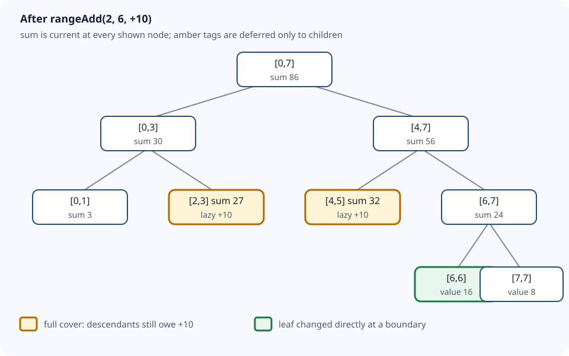

# Segment Tree with Lazy Propagation: Defer Work, Preserve Sums

[Local study intake](../README.md) · [Java source](java/LazySegmentTree.java) · [Validation harness](java/LazySegmentTreeCheck.java)

This module enriches section 9 of the uploaded `Advanced_Trees_FAANG_Mermaid_Study_Guide.md`. Its range-add/range-sum example is the source spine. The explicit contract, four examples, invariants, proof, comparisons, diagram, production-shaped Java and independent tests are added teaching material. It is a focused module, not a second copy of the uploaded book.

## 1. Exact problem and API contract

Maintain a **non-empty** array while requests arrive in any order:

- `rangeAdd(left,right,delta)` adds a signed `delta` to every element in the inclusive, zero-based interval `[left,right]`.
- `rangeSum(left,right)` returns the sum of that inclusive interval.

Both endpoints must be valid and `left <= right`. Construction copies the information into the tree, so later changes to the caller's input array do not change the data structure. Values, deltas, `delta * intervalLength`, and every sum must fit in signed `long`; Java integer arithmetic does not report ordinary overflow, so this is a precondition rather than a checked guarantee.

This is specifically a **range-add/range-sum** tree. A range-assignment tree needs a different lazy-tag composition rule: assignment overwrites an older assignment, while addition accumulates.

### Four concrete examples

| Initial logical array | Operation | Result | Point of the example |
|---|---|---:|---|
| `[2,1,3,4]` | `rangeSum(1,3)` | 8 | Query includes both endpoints. |
| `[2,1,3,4]` | add `+5` to `[1,2]`, then sum `[0,3]` | 20 | Logical array becomes `[2,6,8,4]`. |
| `[0,0,0]` | add `-7` to `[0,2]`, then sum `[1,1]` | -7 | Negative updates and singleton queries work. |
| `[2_000_000_000,2_000_000_000]` | sum `[0,1]` | 4,000,000,000 | Stored sums must be `long`, not `int`. |

## 2. Why a plain array or prefix sums are not enough

With an ordinary array, adding to a range touches every covered element. With static prefix sums, a query is constant time, but changing one element invalidates all later prefixes. Rebuilding after every range update can be linear.

A segment tree stores an aggregate for a hierarchy of intervals. A request descends only through intervals that meet a query boundary. When an update fully covers an interval, lazy propagation changes that node's sum immediately and records one pending per-element delta for its descendants. It does **not** visit all leaves.



The picture deliberately separates a node's exact aggregate from its children. For example, node `[2,3]` has sum 27 and lazy tag `+10`; its leaves may still store 3 and 4. The parent answer is current even though descendant detail is deferred.

## 3. Representation and two invariants

For node `v` representing `[low,high]`:

- `tree[v]` is the exact logical sum of every element in `[low,high]`, including all updates that fully covered this node.
- `lazy[v]` is a per-element increment already included in `tree[v]` but not yet copied into the two child nodes.

That wording prevents the most common misconception: a lazy tag is **not** an update missing from the current node. The current node is already correct. Only its children owe the update.

`apply(v,low,high,delta)` therefore performs both lines:

```java
tree[v] += delta * (high - low + 1L);
lazy[v] += delta;
```

The segment length matters because an increment of 10 over two elements raises their sum by 20. Tags accumulate because consecutive additions commute: owing `+4` and then `-1` is the same as owing `+3`.

`push` transfers the parent's pending delta to both children, updates their sums through `apply`, and clears the parent tag. Pushing preserves the parent sum: the left and right length increases add to exactly the parent's length increase.

## 4. The three overlap cases

At every recursive node, classify its interval against the requested interval:

1. **No overlap:** return the sum identity `0`, or do nothing for an update.
2. **Full cover:** for a query, return `tree[v]`; for an update, call `apply` and stop descending.
3. **Partial overlap:** push any pending tag, recurse into both children, then combine.

The full-cover stop is the optimization. A wide update is represented by a small number of canonical tree intervals rather than by all affected leaves.

For a partial update, after pushing and recursion, restore the merge invariant:

```java
tree[v] = tree[2 * v] + tree[2 * v + 1];
```

For a partial query, pushing is needed before inspecting children, but recomputing the parent is not: transferring a tag changes where the sum is stored, not the logical sum of the parent interval.

## 5. Full lazy-tag state trace

Start with `[2,1,3,4,5,7,6,8]`, whose total is 36. Add 10 to `[2,6]`.

| Visit | Overlap with `[2,6]` | Action | Relevant state afterward |
|---|---|---|---|
| `[0,7]` | partial | descend | root waits for recomputation |
| `[0,3]` | partial | skip `[0,1]`; visit `[2,3]` | left branch only partly changes |
| `[2,3]` | full | apply `+10` | `tree=27`, `lazy=10` |
| `[4,7]` | partial | visit both children | — |
| `[4,5]` | full | apply `+10` | `tree=32`, `lazy=10` |
| `[6,7]` | partial | update leaf `[6,6]`; skip `[7,7]` | `[6,6]` becomes 16 |
| ancestors | — | add child sums | root becomes 86 |

The logical array is now `[2,1,13,14,15,17,16,8]`, but leaves 2–5 need not have changed yet.

Now query `[1,5]`:

| Query fragment | Decision | Contribution / state change |
|---|---|---|
| `[0,1]` | partial | leaf 1 contributes 1 |
| `[2,3]` | full | return stored 27; no push needed |
| `[4,5]` | full | return stored 32; no push needed |
| `[6,7]` | outside | contribute 0 |

The result is `1 + 27 + 32 = 60`.

Suppose the next request is the singleton sum `[2,2]`. The query partially overlaps `[2,3]`, so `push` applies `+10` to leaves `[2,2]` and `[3,3]`, then clears `lazy[2,3]`. Leaf 2 returns 13. Before the push, the parent was 27; afterward its children are 13 and 14, still totaling 27. This is the central state transition to be able to explain in an interview.

## 6. Complete Java 17 implementation

The runnable source is [LazySegmentTree.java](java/LazySegmentTree.java).

```java
import java.util.Objects;

public final class LazySegmentTree {
    private final int size;
    private final long[] tree;
    private final long[] lazy;

    public LazySegmentTree(long[] values) {
        Objects.requireNonNull(values, "values");
        if (values.length == 0)
            throw new IllegalArgumentException("values must not be empty");
        size = values.length;
        tree = new long[Math.multiplyExact(4, size)];
        lazy = new long[tree.length];
        build(1, 0, size - 1, values);
    }

    public int size() { return size; }

    public void rangeAdd(int left, int right, long delta) {
        checkRange(left, right);
        rangeAdd(1, 0, size - 1, left, right, delta);
    }

    public long rangeSum(int left, int right) {
        checkRange(left, right);
        return rangeSum(1, 0, size - 1, left, right);
    }

    private void build(int v, int low, int high, long[] a) {
        if (low == high) { tree[v] = a[low]; return; }
        int mid = low + (high - low) / 2;
        build(2 * v, low, mid, a);
        build(2 * v + 1, mid + 1, high, a);
        tree[v] = tree[2 * v] + tree[2 * v + 1];
    }

    private void apply(int v, int low, int high, long delta) {
        tree[v] += delta * (high - low + 1L);
        lazy[v] += delta;
    }

    private void push(int v, int low, int high) {
        if (lazy[v] == 0 || low == high) return;
        int mid = low + (high - low) / 2;
        apply(2 * v, low, mid, lazy[v]);
        apply(2 * v + 1, mid + 1, high, lazy[v]);
        lazy[v] = 0;
    }

    private void rangeAdd(int v, int low, int high,
                          int ql, int qr, long delta) {
        if (qr < low || high < ql) return;
        if (ql <= low && high <= qr) { apply(v, low, high, delta); return; }
        push(v, low, high);
        int mid = low + (high - low) / 2;
        rangeAdd(2 * v, low, mid, ql, qr, delta);
        rangeAdd(2 * v + 1, mid + 1, high, ql, qr, delta);
        tree[v] = tree[2 * v] + tree[2 * v + 1];
    }

    private long rangeSum(int v, int low, int high, int ql, int qr) {
        if (qr < low || high < ql) return 0;
        if (ql <= low && high <= qr) return tree[v];
        push(v, low, high);
        int mid = low + (high - low) / 2;
        return rangeSum(2 * v, low, mid, ql, qr)
                + rangeSum(2 * v + 1, mid + 1, high, ql, qr);
    }

    private void checkRange(int left, int right) {
        if (left < 0 || right >= size)
            throw new IndexOutOfBoundsException("range outside array");
        if (left > right)
            throw new IllegalArgumentException("left must be <= right");
    }
}
```

The actual file has more informative exception text; the algorithm is identical. `low + (high-low)/2` avoids the addition form that can overflow for large endpoints. A `4n` allocation is a simple safe upper bound for this recursive layout; the exact number of tree nodes is linear but depends on how non-power-of-two intervals split.

## 7. Why the algorithm is correct

**Base state.** `build` stores each leaf value. Every internal node stores the sum of its two disjoint child intervals, so all interval sums are correct and every lazy tag is zero.

**Full-cover update.** `apply` adds `delta * intervalLength` to the node sum, exactly the logical change for that interval. Accumulating the tag records precisely what its children still owe, preserving both invariants without descending.

**Partial update.** `push` first makes both children correct and clears the parent's debt. Recursive calls correctly update the overlapping child portions; non-overlapping portions remain unchanged. Re-adding the two child sums therefore restores the exact parent sum.

**Query.** A no-overlap interval contributes the sum identity zero. A fully covered node returns its exact stored sum. For partial overlap, pushing makes child detail current; recursion returns the exact sums of two disjoint requested pieces. Adding them gives exactly the requested range. These cases cover every relative position, so every returned answer is correct.

## 8. Derived complexity, including output cost

`build` visits each represented node once, so it takes O(n) time and O(log n) recursion depth. The `tree` and `lazy` arrays are O(n).

At each depth, one-dimensional interval boundaries create only a constant number of partially overlapping nodes. Fully covered nodes stop. A range update or range query therefore visits O(log n) canonical-boundary nodes and takes O(log n) time, with O(log n) call-stack space in this recursive implementation.

`rangeSum` constructs one scalar output, so output construction is O(1). If a caller materializes the entire logical array by issuing n singleton queries, that separate output operation costs O(n log n) time and O(n) output space. A dedicated traversal that pushes tags can materialize it in O(n) time; that operation is not part of this API.

## 9. Choosing among related structures

| Structure | Build | Update | Range sum | Extra storage | Choose it when |
|---|---:|---:|---:|---:|---|
| Static prefix sums | O(n) | O(n) after a changed value | O(1) | O(n) | Data is effectively read-only. |
| Fenwick tree in this collection | O(n log n) as implemented | point add O(log n) | O(log n) | O(n) | You need compact dynamic prefix/range sums. |
| Ordinary segment tree | O(n) | point update O(log n) | O(log n) | O(n) | Aggregates or combinations are more general. |
| Lazy segment tree | O(n) | range add O(log n) | O(log n) | O(n) | Both updates and queries cover ranges. |

Two Fenwick trees can also support range-add/range-sum using a weighted-prefix derivation. That design is compact for sums but less direct to generalize. A lazy segment tree makes interval composition explicit and can be adapted to minima, maxima, assignments or richer node state—provided the node merge, tag application and tag composition are all re-derived together.

## 10. Boundaries and common failures

- Forget interval length in `apply`: the node sum changes by one delta instead of one per element.
- Overwrite `lazy[v]` for additive updates: an older deferred addition disappears; additive tags must accumulate.
- Push without updating child sums: full-cover child queries return stale aggregates.
- Recurse on partial overlap before pushing: descendants miss older updates.
- Mix inclusive and half-open intervals: boundary elements are skipped or counted twice.
- Use `0` as the no-overlap identity for min over arbitrary values: sum uses 0, but min needs positive infinity or an optional result.
- Assume the range-assignment tag composes like addition: assignment and addition need tag type/order information.
- Use `int` for sums, or assume `long` cannot overflow. The Java Language Specification says integer operators do not signal ordinary overflow.
- Share this mutable object between threads without synchronization: updates and queries are not atomic snapshots.

Test singleton/full ranges, first and last indices, negative deltas, repeated full-cover updates before a narrow query, invalid ranges, large sums, and randomized operations against an independent ordinary array.

## 11. Interview variations worth deriving

- **Range assignment + range sum:** store an optional pending assignment; it overrides older assignment and usually resets/absorbs an addition tag. Composition order matters.
- **Range add + range minimum/maximum:** the node aggregate shifts by `delta`, not `delta * length`; merge with min/max.
- **Affine updates:** represent each tag as `x -> ax+b`; compose functions in the correct chronological order and update stored sums using interval length.
- **First position whose prefix reaches a target:** descend using child sums only when values/frequencies preserve the required monotonicity.
- **Dynamic coordinates:** allocate nodes on demand when the coordinate universe is huge but updates are sparse; this changes constant factors and memory behavior.
- **Persistent segment tree:** path-copy changed nodes to preserve historical roots. Lazy tags make persistence more delicate because pushing creates additional changed nodes.

Before coding a variation, state three algebraic pieces: the node merge operation and identity, how a tag transforms a node aggregate, and how a newer tag composes with an older pending tag. Most subtle bugs are mismatches among those three rules.

## Sources and continuation

- Uploaded `Advanced_Trees_FAANG_Mermaid_Study_Guide.md`, section 9 (SHA-256 `86cb65f3d6d0f327e5d22c03b5d587144eb11cc9ff27a5b523b298b09ad7f5b1`): conceptual spine and the eight-element dry run.
- [Bentley and Friedman, “Data Structures for Range Searching,” ACM Computing Surveys 11(4), 1979](https://dl.acm.org/doi/10.1145/356789.356797): historical primary literature for hierarchical range-search structures; the guide's array/lazy implementation is teaching material, not copied from the paper.
- [Java Language Specification 17, §4.2.2 Integer Operations](https://docs.oracle.com/javase/specs/jls/se17/html/jls-4.html#jls-4.2.2): authoritative basis for the signed-integer and overflow boundary.

Next bounded source section: section 8, Trie / Prefix Tree. It should be compared against any richer canonical trie coverage before publishing; the archive's other sections remain queued rather than implicitly reviewed.
