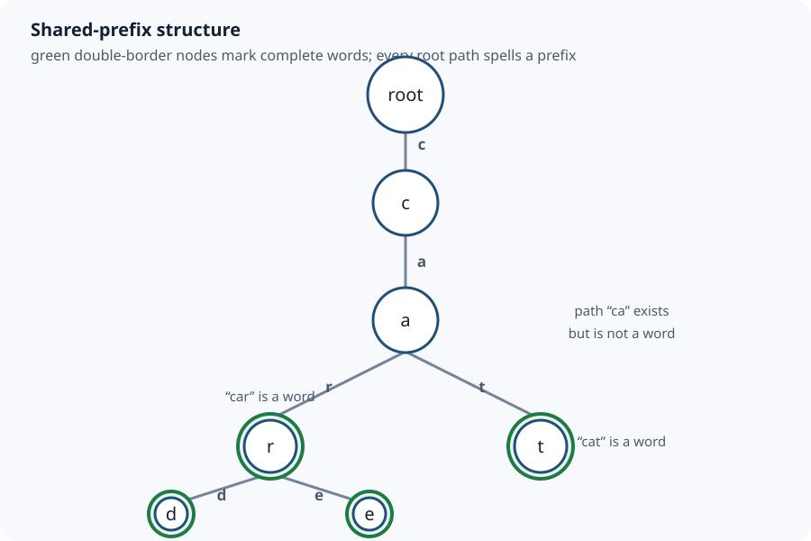

# Trie / Prefix Tree: Search One Character at a Time

[Local study intake](../README.md) · [Java source](java/LowercaseTrie.java) · [Validation harness](java/LowercaseTrieCheck.java)

This module enriches section 8 of the uploaded `Advanced_Trees_FAANG_Mermaid_Study_Guide.md`. Its lowercase-English trie is the source spine. The explicit API contract, examples, invariants, node trace, autocomplete operation, proof, diagram, runnable Java and independent tests are added teaching material. A repository-wide Markdown comparison found no existing canonical trie guide, so this focused module does not duplicate a richer repository edition.

## 1. Problem and exact contract

A trie stores a set of words by sharing their prefixes. Each edge consumes one symbol; the path from the root spells a prefix. This implementation supports:

- `insert(word)`: store a new word and report whether it was absent;
- `contains(word)`: test a complete word;
- `startsWith(prefix)`: test whether the prefix path exists;
- `autocomplete(prefix,limit)`: return at most `limit` stored words in ascending ASCII order.

Stored words must be non-empty strings containing only lowercase ASCII `a` through `z`. Prefixes may be empty: the empty prefix denotes the root, so `startsWith("")` is true and `autocomplete("",k)` enumerates the first `k` words. Null, uppercase, accented, punctuation and digit input is rejected. A production Unicode trie requires an explicit normalization and code-point policy; silently treating UTF-16 `char` values as user-perceived characters is not enough.

### Four concrete examples

| Stored words / operation | Result | What it demonstrates |
|---|---|---|
| insert `car`, `card`, `care`, `cat` | size 4 | Prefix nodes `c` and `ca` are shared. |
| `contains("car")`, `contains("ca")` | `true`, `false` | A path can exist without marking a complete word. |
| `startsWith("ca")`, `startsWith("cab")` | `true`, `false` | Prefix search stops at the first missing edge. |
| `autocomplete("car",2)` | `[car, card]` | The prefix itself comes first when it is a word; the limit stops traversal. |

Inserting `car` again returns false and does not change the size. The structure represents a set, not a multiset. If occurrence counts are required, store a terminal frequency rather than a boolean.

## 2. Why a trie instead of scanning or hashing

Suppose a dictionary has `N` words and a query prefix has length `P`.

- Scanning all strings and calling `startsWith` can inspect O(NP) characters before output construction.
- A hash set gives expected O(L) complete-word lookup for word length `L`, but it does not directly answer arbitrary prefixes or enumerate descendants.
- A balanced ordered set can locate a prefix range in O(P log N) comparison work plus output, depending on comparison costs.
- A trie walks the prefix in O(P), then traverses only the reachable subtree needed for results.

The trade-off is memory. A fixed 26-child array makes the next edge constant-time and preserves alphabetical traversal, but every node reserves 26 references even when it has one child. A map-backed node uses less space for sparse alphabets but adds hashing/tree-map overhead. A compressed/radix trie merges chains of one-child nodes and stores substrings on edges; it saves nodes but makes edge matching more complex.



## 3. Representation and invariants

Each node contains a 26-slot child array and a `word` flag. Slot `0` represents `a`; slot `25` represents `z`.

```java
private static final class Node {
    private final Node[] children = new Node[26];
    private boolean word;
}
```

Two invariants explain almost every operation:

1. **Path invariant:** after processing the first `i` characters of an input, `current` is the node reached by exactly that length-`i` prefix. If an edge is missing during a read, no stored path spells the input.
2. **Terminal invariant:** `node.word` is true exactly when the root-to-node path is a stored complete word. Descendants do not make the current prefix a word.

The second invariant is why `contains("ca")` is false even though `ca` is the shared path to four words. It is also why `contains("car")` remains true after adding longer words such as `card`.

## 4. Insertion dry run: `car`, `card`, `care`, `cat`

Start with only the root.

| Insert | Character transition | New node? | Terminal change |
|---|---|---|---|
| `car` | root → `c` | yes | no |
|  | `c` → `a` | yes | no |
|  | `ca` → `r` | yes | mark `car` |
| `card` | root → `c` → `a` → `r` | no; reuse all three | no |
|  | `car` → `d` | yes | mark `card` |
| `care` | root → `c` → `a` → `r` | no | no |
|  | `car` → `e` | yes | mark `care` |
| `cat` | root → `c` → `a` | no | no |
|  | `ca` → `t` | yes | mark `cat` |

The four words contain 13 characters in total, but only six non-root nodes are needed: `c`, `a`, `r`, `d`, `e`, `t`. Sharing grows when words have long common prefixes.

### Search trace

For `contains("ca")`, `walk` finds `c` and then `a`. The path invariant succeeds, but the terminal flag at `ca` is false, so complete-word search returns false.

For `startsWith("cab")`, `walk` reaches `ca`, then finds no `b` child. It returns null immediately. It does not scan unrelated `r` or `t` branches.

For `contains("car")`, the path exists and the `r` node is terminal, so the answer is true.

## 5. Autocomplete trace and output ordering

`autocomplete("car",10)` first walks to the `car` node. Depth-first enumeration then follows three rules:

1. Emit the current path first if its node is terminal.
2. Visit child slots from `a` to `z`.
3. Stop as soon as the result count reaches the limit.

| Visit | Terminal? | Output after visit |
|---|---:|---|
| `car` | yes | `[car]` |
| `card` via child `d` | yes | `[car, card]` |
| `care` via child `e` | yes | `[car, card, care]` |

The order is lexicographic for this lowercase ASCII contract because the prefix comes before its proper extensions and children are visited in alphabet order. No separate sort is needed.

The recursion uses one mutable `StringBuilder`. After returning from a child, this key line removes precisely the appended edge character:

```java
path.setLength(path.length() - 1);
```

Without that backtrack, the next sibling would inherit the previous sibling's characters—for example, `card` followed by the incorrect `carde` instead of `care`.

## 6. Complete Java 17 implementation

The runnable canonical source is [LowercaseTrie.java](java/LowercaseTrie.java).

```java
import java.util.ArrayList;
import java.util.List;
import java.util.Objects;

public final class LowercaseTrie {
    private static final int ALPHABET_SIZE = 26;
    private static final class Node {
        private final Node[] children = new Node[ALPHABET_SIZE];
        private boolean word;
    }

    private final Node root = new Node();
    private int wordCount;

    public int size() { return wordCount; }

    public boolean insert(String word) {
        validate(word, false, "word");
        Node current = root;
        for (int i = 0; i < word.length(); i++) {
            int index = word.charAt(i) - 'a';
            if (current.children[index] == null)
                current.children[index] = new Node();
            current = current.children[index];
        }
        if (current.word) return false;
        current.word = true;
        wordCount++;
        return true;
    }

    public boolean contains(String word) {
        validate(word, false, "word");
        Node node = walk(word);
        return node != null && node.word;
    }

    public boolean startsWith(String prefix) {
        validate(prefix, true, "prefix");
        return walk(prefix) != null;
    }

    public List<String> autocomplete(String prefix, int limit) {
        validate(prefix, true, "prefix");
        if (limit < 0) throw new IllegalArgumentException("negative limit");
        if (limit == 0) return List.of();
        Node start = walk(prefix);
        if (start == null) return List.of();
        List<String> result = new ArrayList<>(Math.min(limit, wordCount));
        collect(start, new StringBuilder(prefix), limit, result);
        return result;
    }

    private Node walk(String text) {
        Node current = root;
        for (int i = 0; i < text.length(); i++) {
            current = current.children[text.charAt(i) - 'a'];
            if (current == null) return null;
        }
        return current;
    }

    private void collect(Node node, StringBuilder path, int limit,
                         List<String> result) {
        if (node.word) {
            result.add(path.toString());
            if (result.size() == limit) return;
        }
        for (int index = 0; index < ALPHABET_SIZE; index++) {
            Node child = node.children[index];
            if (child == null) continue;
            path.append((char) ('a' + index));
            collect(child, path, limit, result);
            path.setLength(path.length() - 1);
            if (result.size() == limit) return;
        }
    }

    private static void validate(String text, boolean allowEmpty,
                                 String label) {
        Objects.requireNonNull(text, label);
        if (!allowEmpty && text.isEmpty())
            throw new IllegalArgumentException(label + " must not be empty");
        for (int i = 0; i < text.length(); i++) {
            char character = text.charAt(i);
            if (character < 'a' || character > 'z')
                throw new IllegalArgumentException("lowercase a-z required");
        }
    }
}
```

The actual source uses the same algorithm with more informative error messages. Validation must occur before subtracting `'a'`; otherwise uppercase or punctuation can create a negative/out-of-range child index.

## 7. Correctness

**Insertion.** Initially `current` is the root, which represents the empty prefix. At each character, insertion follows the corresponding edge, creating it if absent. Therefore the path invariant holds after every iteration. After the final character, setting `word=true` makes the terminal invariant true for exactly the inserted word. Re-insertion finds the same terminal flag and changes neither paths nor set size.

**Complete-word search.** `walk` returns null exactly when an input edge is absent. If it returns a node, the path invariant says that node spells the entire query. The terminal invariant then makes `node.word` equivalent to membership in the stored-word set.

**Prefix search.** A non-null result from `walk(prefix)` proves that the prefix path exists; a missing edge proves it does not. The empty prefix maps to the always-present root by contract.

**Autocomplete.** The initial walk restricts enumeration to paths beginning with the requested prefix. Depth-first traversal emits only terminal nodes, so every output is stored, and reaches every terminal descendant unless the requested limit is already met. Each child edge is visited in ascending letter order and a node is emitted before descendants, so outputs are in ascending ASCII lexicographic order. The early-return checks guarantee at most `limit` outputs.

## 8. Time, space and output-construction costs

Let `L` be an inserted/searched word length, `P` the prefix length, `M` the number of trie nodes, `V` the descendant nodes visited during enumeration, `D` the longest explored suffix depth, and `A` the total number of characters copied into returned strings.

| Operation | Time | Auxiliary / output space |
|---|---:|---:|
| `insert` | O(L) | O(L) new nodes worst case |
| `contains` | O(L) | O(1) |
| `startsWith` | O(P) | O(1) |
| `autocomplete` | O(P + V + A) | O(D) recursion/builder + O(A) returned text |

Autocomplete is not merely O(P + numberOfWords). Constructing each returned Java `String` copies its characters, so the output text itself costs O(A). A small result limit can reduce `V`, but an unlucky sparse subtree may still require visiting nonterminal nodes before finding enough words.

The data structure has at most `1 + sum(length of every distinct inserted word)` nodes, hence O(total inserted characters) nodes. This fixed-array representation reserves 26 child references per node, so its practical reference storage is O(26M), conventionally simplified to O(M) because 26 is constant. A map-backed Unicode design would instead depend on the number of actual edges plus map overhead.

Recursive enumeration consumes O(D) call-stack frames. Extremely long keys can overflow the Java stack; an explicit stack is safer when key length is untrusted.

## 9. Boundaries and common errors

- Return true from `contains` whenever a path exists: this confuses `ca` with stored word `car`.
- Mark every traversed node terminal during insertion: every prefix becomes a false word.
- Forget to reuse existing child nodes: shared prefixes disappear and earlier descendants can be lost.
- Convert `character-'a'` before validation: unsupported characters produce invalid indices.
- Forget autocomplete backtracking: sibling paths accumulate one another's characters.
- Sort autocomplete results after already walking an ordered child array: unnecessary O(K log K) work for K results.
- Claim lookup is O(1): it is independent of dictionary size under this representation but still reads all L input characters.
- Treat Java `char` as a full Unicode character: supplementary Unicode code points use surrogate pairs. Define normalization, case and code-point handling first.
- Delete by only clearing a terminal flag and assume memory is reclaimed: pruning requires walking back while preserving nodes shared by other words.
- Call the mutable implementation thread-safe: concurrent insertion and traversal require synchronization or immutable snapshots.

Test duplicate words, a word that is another word's prefix, missing middle/last edges, one-character words, empty prefixes, limit zero, unsupported characters, wide shared prefixes and deep chains.

## 10. Variations and interview follow-ups

**Deletion.** Clear the terminal marker, then prune a node only if it is nonterminal and has no children. Recursive deletion should return whether the parent may safely remove that child. Never prune a node still needed by another word.

**Wildcard search.** For `.` meaning any letter, a normal character follows one child; `.` branches across all non-null children. Worst-case time becomes exponential in the number of wildcards because the query genuinely denotes many paths.

**Word Search II.** Build a trie of dictionary words, DFS the board, and stop a board path immediately when its character prefix has no trie edge. Mark found terminal words to avoid duplicates. Complexity depends on board branching and pruning, not just dictionary lookup.

**Bitwise trie.** Store integer bits rather than letters. To maximize XOR, greedily prefer the opposite bit when it exists. Its depth is fixed by integer width, but signed-bit and duplicate-count rules must be explicit.

**Compressed/radix trie.** Merge every nonbranching chain into one edge label. Search compares substrings within edges; insertion may split an edge at the first mismatch. This reduces node overhead for sparse long keys.

**Ternary search trie.** Each node stores one character and low/equal/high links. It trades fixed alphabet arrays for character comparisons and usually lower sparse-node memory.

**Ranked autocomplete.** Store subtree maximum score or top candidates so a best-first traversal can prioritize popularity rather than alphabetic order. Updating scores then has a new invariant: every ancestor summary must reflect its descendants.

## 11. Unicode and normalization boundary

The executable module intentionally chooses lowercase ASCII. For general text, decide at least:

1. Whether canonically equivalent sequences normalize to one form, such as NFC.
2. Whether matching is case-sensitive and which locale rules apply.
3. Whether edges represent UTF-16 code units, Unicode code points or grapheme clusters.
4. Whether child storage is a hash map, ordered map or compressed edge table.

Java `String` provides code-point operations in addition to UTF-16 `char` access. Switching to code points changes the child key type and iteration logic; it is not a safe one-line expansion of the 26-slot array.

## Sources and continuation

- Uploaded `Advanced_Trees_FAANG_Mermaid_Study_Guide.md`, section 8, lines 914–977 (SHA-256 `86cb65f3d6d0f327e5d22c03b5d587144eb11cc9ff27a5b523b298b09ad7f5b1`): conceptual spine and lowercase child-array model.
- [Edward Fredkin, “Trie Memory,” Communications of the ACM 3(9), 1960](https://doi.org/10.1145/367390.367400): primary historical source for trie organization and terminology.
- [Java SE 17 `String` API](https://docs.oracle.com/en/java/javase/17/docs/api/java.base/java/lang/String.html): authoritative boundary for UTF-16 strings and code-point APIs.

Next bounded source section: section 7, Binary Heap / Priority Queue. Compare it with repository coverage before publishing. Later source sections remain queued rather than implicitly reviewed.
