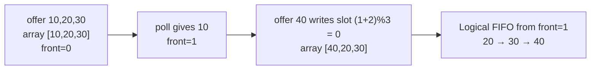
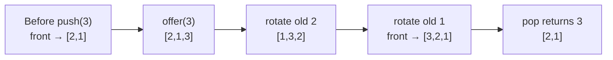

# Striver / Take U Forward — Stack & Queue Deep Study Guide

## Navigation and Index

> Use this as the home page for the book. Every card ends with a return link.

| ID | Topic | Jump |
|---|---|---|
| **S1** | Stack Using Array | [Jump](#s1-stack-using-array) |
| **S2** | Queue Using Circular Array | [Jump](#s2-queue-using-circular-array) |
| **S3** | Stack Using One Queue | [Jump](#s3-stack-using-one-queue) |
| **S4** | Queue Using Two Stacks | [Jump](#s4-queue-using-two-stacks) |
| **S5** | Stack Using Linked List | [Jump](#s5-stack-using-linked-list) |
| **S6** | Queue Using Linked List | [Jump](#s6-queue-using-linked-list) |
| **S7** | Balanced Parentheses | [Jump](#s7-balanced-parentheses) |
| **S8** | Min Stack | [Jump](#s8-min-stack) |
| **S9** | Infix to Postfix | [Jump](#s9-infix-to-postfix) |
| **S10** | Prefix to Infix | [Jump](#s10-prefix-to-infix) |
| **S11** | Prefix to Postfix | [Jump](#s11-prefix-to-postfix) |
| **S12** | Postfix to Prefix | [Jump](#s12-postfix-to-prefix) |
| **S13** | Postfix to Infix | [Jump](#s13-postfix-to-infix) |
| **S14** | Infix to Prefix | [Jump](#s14-infix-to-prefix) |
| **S15** | Next Greater Element | [Jump](#s15-next-greater-element) |
| **S16** | Next Greater Element II — Circular | [Jump](#s16-next-greater-element-ii-circular) |
| **S17** | Next Smaller Element | [Jump](#s17-next-smaller-element) |
| **S18** | Count Greater Elements to the Right for Queries | [Jump](#s18-count-greater-elements-to-the-right-for-queries) |
| **S19** | Trapping Rainwater | [Jump](#s19-trapping-rainwater) |
| **S20** | Sum of Subarray Minimums | [Jump](#s20-sum-of-subarray-minimums) |
| **S21** | Asteroid Collision | [Jump](#s21-asteroid-collision) |
| **S22** | Sum of Subarray Ranges | [Jump](#s22-sum-of-subarray-ranges) |
| **S23** | Remove K Digits | [Jump](#s23-remove-k-digits) |
| **S24** | Largest Rectangle in Histogram | [Jump](#s24-largest-rectangle-in-histogram) |
| **S25** | Maximal Rectangle | [Jump](#s25-maximal-rectangle) |
| **S26** | Sliding Window Maximum | [Jump](#s26-sliding-window-maximum) |
| **S27** | Stock Span | [Jump](#s27-stock-span) |
| **S28** | Celebrity Problem | [Jump](#s28-celebrity-problem) |
| **S29** | LRU Cache | [Jump](#s29-lru-cache) |
| **S30** | LFU Cache | [Jump](#s30-lfu-cache) |

## How to study this book

Stacks and queues encode which unresolved state should be revisited next. LIFO models nested/recent state, FIFO models layers/time, monotonic structures discard dominated candidates, and cache designs compose multiple structures because one container cannot satisfy every O(1) requirement.

**Required reading order:** requirement → examples → data picture → brute force → repeated-work diagnosis → invariant → optimized plan → dry run → Java → correctness → boundaries → complexity → memory trick → variations.

> **Source transparency:** topic ordering follows the retained Striver/Take U Forward study structure from this project. Extra examples, memory tricks, research notes and explanations are study-guide additions unless explicitly marked as verified from a creator/source.

## Pattern recognition cheat sheet

| Clue | Think about first |
|---|---|
| next/previous greater/smaller | monotonic stack |
| fixed-size best window | deque / sliding window |
| shortest unweighted path | BFS |
| nonnegative weighted shortest path | Dijkstra |
| negative edges | Bellman-Ford |
| dependencies | topological sort |
| repeated component merges | DSU |
| critical edge/vertex | low-link DFS |
| linked-list middle/cycle | slow/fast pointers |
| tree child summaries | postorder DP |
| repeated lookup/count | HashMap / HashSet |
| subarray sum/count with negatives | prefix state + HashMap |

<a id="s1-stack-using-array"></a>
## S1. Stack Using Array

[Index](#navigation-and-index) · [S2 →](#s2-queue-using-circular-array)

### Exact problem and API contract

Implement an integer **LIFO stack** backed by a fixed-capacity array. Constructor capacity may be zero but not negative. Implement **push(int)**, **pop()**, **peek()**, **size()**, **isEmpty()** without a built-in stack. Push on full throws **IllegalStateException**; pop or peek on empty throws **NoSuchElementException**. These exception choices are part of this guide's API, not universal online-judge rules.

### Four concrete input/output examples

| # | Operations | Output / behavior |
|---:|---|---|
| 1 | capacity 3; push(10), push(20), push(30), peek(), pop(), pop(), push(-7), pop(), pop() | peek=30; pops **30,20,-7,10** |
| 2 | capacity 0; isEmpty(), push(5), pop() | true; push throws **IllegalStateException**; pop throws **NoSuchElementException** |
| 3 | capacity 2; push(4), push(4), push(5), size() | third push throws; size remains **2** |
| 4 | capacity 1; push(-2147483648), peek(), pop(), isEmpty() | peek/pop = **-2147483648**, then true |

### Recognize pattern; baseline vs optimized approach

**Clue:** newest insertion is removed first. A naive array can place newest values at index 0, shifting existing elements on every push and pop (**O(n)**). Instead use the **end of the occupied array prefix** as top; then no element shifts. **Invariant:** 0 ≤ size ≤ capacity; live stack values occupy **data[0..size-1]** in bottom-to-top order; when nonempty the top is **data[size-1]**. Values beyond size are irrelevant.

### Mermaid state diagram

~~~mermaid
flowchart LR
  A["data: [10, 20, 30, _]; size=3"] -->|"pop: --size"| B["live: [10,20]; size=2; returned 30"]
  B -->|"push(40): data[size++]=40"| C["live: [10,20,40]; size=3"]
~~~

### Detailed dry run, capacity 3

| Step | Operation | Live prefix, bottom → top | size | Result |
|---:|---|---|---:|---|
| 0 | constructor(3) | [] | 0 | — |
| 1 | push(10) | [10] | 1 | — |
| 2 | push(20) | [10,20] | 2 | — |
| 3 | push(30) | [10,20,30] | 3 | — |
| 4 | peek() | [10,20,30] | 3 | 30 |
| 5 | pop() | [10,20] | 2 | 30 |
| 6 | pop() | [10] | 1 | 20 |
| 7 | push(-7) | [10,-7] | 2 | — |
| 8 | pop() | [10] | 1 | -7 |
| 9 | pop() | [] | 0 | 10 |

### Java 17 implementation

~~~java
import java.util.NoSuchElementException;

public final class ArrayStack {
    private final int[] data;
    private int size;

    public ArrayStack(int capacity) {
        if (capacity < 0) throw new IllegalArgumentException("capacity must be nonnegative");
        data = new int[capacity];
    }
    public void push(int value) {
        if (size == data.length) throw new IllegalStateException("stack full");
        data[size++] = value;
    }
    public int pop() {
        if (size == 0) throw new NoSuchElementException("stack empty");
        return data[--size];
    }
    public int peek() {
        if (size == 0) throw new NoSuchElementException("stack empty");
        return data[size - 1];
    }
    public int size() { return size; }
    public boolean isEmpty() { return size == 0; }
}
~~~

**Key lines:** **data[size++] = value** stores in the next free slot then increments the count; **data[--size]** first decreases the count then reads the former top. Using data[size] for peek or pre-incrementing push causes an off-by-one error.

### Correctness proof

Initially size=0, so the live prefix is empty. If a push succeeds, it writes after all previous live values and increments size, making the new value the top. A successful pop decreases size by one and returns precisely the last live value. Peek reads that same value without changing state. By induction, every legal operation preserves the invariant and LIFO ordering.

### Complexity, boundaries, and variations

**push/pop/peek/size/isEmpty:** O(1) worst-case time and O(1) extra space per call. **Constructor:** O(capacity) array initialization and O(capacity) storage. Check capacity 0/negative; full push leaves size unchanged; empty pop/peek; duplicate and extreme int values; reuse a freed slot after pop. A dynamically resized array provides amortized O(1) push but worst-case O(n) when growing. **Common mistakes:** mixing top index with element count, returning -1 as an empty sentinel, or assuming old physical values after pop remain live. **Interview extensions:** geometric resizing, minimum-stack augmentation, array vs linked list locality, and thread-safety.

> **Memory trick:** **SIZE IS THE NEXT FREE INDEX; TOP IS SIZE - 1.**

[↑ Back to Index](#navigation-and-index)

---

<a id="s2-queue-using-circular-array"></a>
## S2. Queue Using Circular Array

[← S1](#s1-stack-using-array) · [Index](#navigation-and-index) · [S3 →](#s3-stack-using-one-queue)

### Problem statement and API contract

Implement a **fixed-capacity FIFO queue** using a single integer array. The constructor accepts a **positive** capacity. Provide `offer(x)`, `poll()`, `peek()`, `size()` and `isEmpty()`. Offering when full throws `IllegalStateException`; polling/peeking when empty throws `NoSuchElementException`. If a platform uses return-value sentinels, adapt only the error-handling contract, not the circular invariant.

### Four concrete input/output examples

| # | Setup and operations | Exact output / behavior |
|---:|---|---|
| 1 | Capacity 3; `offer(10), offer(20), offer(30), peek(), poll(), offer(40), poll(), poll(), poll()` | `peek=10`; polls return `10,20,30,40` |
| 2 | Capacity 1; `offer(-7), poll(), offer(11), peek()` | `poll=-7`; `peek=11` |
| 3 | Capacity 2; `offer(5), offer(5), offer(9)` | Third offer throws `IllegalStateException`; size stays 2 |
| 4 | Capacity 3; `poll(), peek()` before any offer | Both throw `NoSuchElementException` |

### Pattern recognition, brute force, and optimization

**Clues:** FIFO, bounded capacity, and repeated insertions/removals without shifting. A simple linear array shifts all remaining values left on each poll: correct but **O(n) per poll**. A non-wrapping head/tail scheme eventually exhausts the array despite empty slots. The circular design reuses those slots with modulo arithmetic.

Keep `front` = physical index of oldest live element and `size` = count of live elements. For an insertion, the next free index is `(front + size) % capacity`. For removal, return `values[front]` and advance `front = (front + 1) % capacity`. Detect full using `size == capacity`, not `front == rear` (ambiguous between full and empty without extra state).

### Diagram — physical array versus logical FIFO



**Invariant:** for each `0 <= k < size`, the k-th oldest live element is `values[(front + k) % capacity]`. Also `0 <= front < capacity` and `0 <= size <= capacity`.

### Detailed dry run (capacity 3)

| Action | Return | front | size | Physical array | Logical queue |
|---|---:|---:|---:|---|---|
| start | — | 0 | 0 | `[_,_,_]` | `[]` |
| offer(10) | — | 0 | 1 | `[10,_,_]` | `[10]` |
| offer(20) | — | 0 | 2 | `[10,20,_]` | `[10,20]` |
| offer(30) | — | 0 | 3 | `[10,20,30]` | `[10,20,30]` |
| poll() | 10 | 1 | 2 | `[10,20,30]` | `[20,30]` |
| offer(40) | — | 1 | 3 | `[40,20,30]` | `[20,30,40]` |
| poll() | 20 | 2 | 2 | `[40,20,30]` | `[30,40]` |
| poll() | 30 | 0 | 1 | `[40,20,30]` | `[40]` |
| poll() | 40 | 1 | 0 | `[40,20,30]` | `[]` |

Stale array entries do not count as live data; `size` defines the live segment.

### Java 17 implementation (standalone source)

```java
import java.util.NoSuchElementException;

public final class CircularQueue {
    private final int[] values;
    private int front = 0, size = 0;

    public CircularQueue(int capacity) {
        if (capacity <= 0) throw new IllegalArgumentException("capacity must be positive");
        values = new int[capacity];
    }
    public void offer(int value) {
        if (size == values.length) throw new IllegalStateException("queue full");
        int rear = (front + size) % values.length; // next free slot
        values[rear] = value;
        size++;
    }
    public int poll() {
        if (size == 0) throw new NoSuchElementException("queue empty");
        int answer = values[front];
        front = (front + 1) % values.length; // discard exactly the oldest
        size--;
        return answer;
    }
    public int peek() {
        if (size == 0) throw new NoSuchElementException("queue empty");
        return values[front];
    }
    public int size() { return size; }
    public boolean isEmpty() { return size == 0; }
}
```

### Key lines, correctness proof, complexity

**Key lines:** `rear = (front + size) % values.length` identifies the first free circular slot; `front = (front + 1) % values.length` moves to the next oldest without shifting elements.

**Proof:** Initially `size=0`, so the invariant holds. If not full, an offer writes at logical offset `size`, after all existing elements; it does not overwrite any live cell. If not empty, poll returns logical offset 0; incrementing `front` makes former offset 1 the new oldest and preserves the relative order of all remaining cells. Thus FIFO and index bounds are maintained by induction. Peek and size queries do not change state.

**Time:** O(1) per operation (constant arithmetic and array accesses); constructing the backing array is O(C). **Space:** O(C) total for capacity C and O(1) per-operation auxiliary space.

### Boundary cases, mistakes, follow-ups

- Capacity 1 repeatedly wraps to index 0; duplicates and negative values work without sentinels.
- `front == rear` alone cannot distinguish empty from full; use `size`.
- Avoid shifting the array on poll; that destroys O(1) performance.
- The implementation is **not thread-safe**. For concurrency use appropriate synchronization or a concurrent queue.
- For theoretically huge Java arrays, `front + size` may overflow `int`; use `front >= values.length - size ? front - (values.length - size) : front + size` when constraints require overflow-safe indexing.
- **Follow-ups:** dynamically growing circular queue (copy live elements in logical order, reset front to 0), overwrite-oldest ring buffer, deque, and generic queue clearing stale references.

> **MEMORY TRICK —** FRONT = next OUT; FRONT + SIZE = next IN.

[↑ Back to Index](#navigation-and-index)

---

<a id="s3-stack-using-one-queue"></a>
## S3. Stack Using One Queue

[← S2](#s2-queue-using-circular-array) · [Index](#navigation-and-index) · [S4 →](#s4-queue-using-two-stacks)

### Problem statement and API contract

Implement a **LIFO stack using exactly one FIFO queue**, with only O(1) scalar bookkeeping. Support `push(x)`, `pop()`, `top()`, `size()`, `isEmpty()`. An empty `pop` or `top` throws `NoSuchElementException`. You may use Java's `Queue<Integer>` backed by `ArrayDeque`; do not use a second queue or stack to reorder elements.

### Four concrete examples

| # | Operations | Exact outputs |
|---:|---|---|
| 1 | `push(1), push(2), push(3), top(), pop(), top()` | `3,3,2` |
| 2 | `push(8), pop(), push(9), pop()` | `8,9` |
| 3 | `push(5), push(5), pop(), pop()` | `5,5` |
| 4 | `pop(), top()` on a new stack | Both throw `NoSuchElementException` |

### Recognize the pattern: reverse the access order

A queue removes its **oldest** element; a stack removes its **newest**. A baseline uses a second temporary queue to move n−1 elements aside and retrieve the last one, costing O(n) per pop and violating the one-queue restriction.

**One-queue strategy:** after enqueueing the new value, rotate exactly the *previous* n elements from the front to the rear. The newest element moves to the front. Thus `push` takes O(n), while `pop` and `top` take O(1).

### Visual — one queue, front shown on the left



**Invariant:** from queue **front to rear**, elements are ordered from **stack top to bottom**. Each completed push restores that invariant; transient rotation states need not satisfy it.

### Detailed dry run

| Operation / substep | Queue (front → rear) | Observation |
|---|---|---|
| start | `[]` | empty |
| push(1) | `[1]` | zero rotations |
| push(2): offer | `[1,2]` | new element temporarily at rear |
| rotate 1 | `[2,1]` | new top 2 |
| push(3): offer | `[2,1,3]` | transient |
| rotate old 2 | `[1,3,2]` | transient |
| rotate old 1 | `[3,2,1]` | new top 3 |
| top() | `[3,2,1]` | returns 3, unchanged |
| pop() | `[2,1]` | returns 3 |
| push(4): offer + 2 rotations | `[4,2,1]` | top 4 |
| pop(), pop(), pop() | `[]` | returns 4,2,1 |

### Java 17 implementation (standalone source)

```java
import java.util.ArrayDeque;
import java.util.NoSuchElementException;
import java.util.Queue;

public final class StackWithOneQueue {
    private final Queue<Integer> q = new ArrayDeque<>();

    public void push(int value) {
        q.offer(value);
        int oldCount = q.size() - 1;          // exclude new value
        for (int i = 0; i < oldCount; i++) {
            q.offer(q.remove());             // old front moves behind new
        }
    }
    public int pop() {
        if (q.isEmpty()) throw new NoSuchElementException("stack empty");
        return q.remove();                   // queue front is stack top
    }
    public int top() {
        if (q.isEmpty()) throw new NoSuchElementException("stack empty");
        return q.element();
    }
    public int size() { return q.size(); }
    public boolean isEmpty() { return q.isEmpty(); }
}
```

### Key line, correctness proof and derived complexity

**Key line:** `oldCount = q.size() - 1`. Rotating all `q.size()` elements would restore the old front, making the stack incorrect. Rotate **only** the old elements.

**Proof:** Initially the empty queue matches the empty stack. Assume its front-to-rear order equals stack top-to-bottom. On push, append the new item and rotate each of the n old items to the rear. The new item reaches the front while old items retain their relative order, preserving the invariant. Pop removes the front, exactly the most recently pushed surviving item. Top reads that item without mutation. Therefore all operations implement LIFO.

**Time:** pushing into n elements performs one enqueue plus n dequeue/enqueue rotations, O(n); pop/top/size/isEmpty are O(1). n pushes from empty take `0+1+...+(n−1)=n(n−1)/2` rotations, **O(n²)** total. **Space:** O(n) in the single underlying queue and O(1) auxiliary bookkeeping.

### Boundary cases, common errors, variations

- Empty stack: throw rather than returning an ambiguous integer sentinel.
- One element: zero rotations; duplicate values require no special treatment.
- Never rotate `q.size()` times: it would undo the rearrangement.
- Do not assume `Queue.remove()` removes the rear: it removes the front.
- **Alternative trade-off:** O(1) push and O(n) pop by rotating n−1 items just before removing the rear-most old item; useful when pushes greatly outnumber pops.
- **Interview follow-ups:** stack using two queues; queue using two stacks with amortized O(1) operations; discuss how operation frequency determines the best trade-off.

> **MEMORY TRICK —** Insert newest LAST, rotate OLD behind it, remove newest FIRST.

[↑ Back to Index](#navigation-and-index)

---

<a id="s4-queue-using-two-stacks"></a>
## S4. Queue Using Two Stacks

[← S3](#s3-stack-using-one-queue) · [Index](#navigation-and-index) · [S5 →](#s5-stack-using-linked-list)

### Detailed question understanding

Implement a **FIFO queue** using only the normal operations of **two LIFO stacks**.

The queue must support:

```text
push(x) / offer(x)  -> add x at the back
pop()               -> remove and return the front
peek()              -> return the front without removing it
empty()             -> whether no elements remain
```

The central mismatch is:

```text
Queue wants oldest item first.
Stack exposes newest item first.
```

The problem therefore asks us to use **one reversal of order to cancel another reversal**.

Canonical problem statements such as LeetCode 232 allow only stack-style operations: push to top, peek/pop from top, size, and emptiness checks. Take U Forward presents the same FIFO API with two stacks.

### Four examples before the algorithm

| # | Operations | Important states | Result |
|---:|---|---|---|
| 1 | push(4), push(8), pop(), peek() | oldest value 4 must leave before 8 | pop = 4, peek = 8 |
| 2 | push(1), push(2), push(3), pop(), pop() | one transfer should serve multiple pops | 1, then 2 |
| 3 | push(1), push(2), pop(), push(3), peek() | new pushes must not jump ahead of older items already waiting in output stack | peek = 2 |
| 4 | empty() on a new queue | both stacks are empty | true |

### Visual model

Use two stacks:

```text
          NEW ITEMS                           OLD ITEMS READY TO LEAVE
             in                                      out

push(1)      1
push(2)      2
             1
push(3)      3
             2
             1

When front is requested and out is empty:

move all in -> out

in: []                                      out:
                                               1  <- queue front
                                               2
                                               3

The transfer reverses the LIFO order,
so the oldest queue element becomes the stack top.
```

### Pattern recognition

Use this pattern when:

- a FIFO interface must be built from LIFO primitives;
- a costly reversal can be **deferred until needed**;
- after one expensive rebuild, many future operations can reuse the rebuilt state;
- the interviewer asks for **amortized O(1)** queue operations.

> **KEY INTUITION —** Keep new elements in one stack. Move them to the second stack **only when the second stack is empty**. Never disturb older elements that are already in dequeue order.

### Brute-force / eager two-stack approach

A straightforward two-stack solution can make every push expensive:

1. move every element from stack A to stack B;
2. push the new value into A;
3. move everything from B back to A.

Then A's top is always the queue front.

That works, but every push may move O(n) elements.

For n pushes:

```text
1 + 2 + 3 + ... + n = O(n^2)
```

The repeated work is obvious: the same old elements are moved back and forth after every insertion.

### Optimized lazy-transfer approach

Maintain:

```text
in  = newly pushed elements, newest on top
out = elements already reversed into queue-removal order
```

Rules:

1. **push(x)** -> push only into `in`.
2. **peek/pop**:
   - if `out` is nonempty, use it directly;
   - otherwise move every element from `in` to `out` once.
3. **empty()** -> both stacks must be empty.

### Invariant

At all times:

- every element in `out` is **older** than every element in `in`;
- the top of `out`, when it exists, is the queue front;
- transfer happens only when `out` is empty, so newly pushed items can never overtake older waiting items.

### Detailed dry run

Operations:

```text
push(10)
push(20)
push(30)
pop()
push(40)
peek()
pop()
pop()
peek()
```

| Step | Operation | in stack (top first) | out stack (top first) | What happens | Result |
|---:|---|---|---|---|---|
| 1 | push(10) | [10] | [] | append new item to in | — |
| 2 | push(20) | [20,10] | [] | append new item to in | — |
| 3 | push(30) | [30,20,10] | [] | append new item to in | — |
| 4 | pop() | [] | [10,20,30] -> [20,30] | out empty, transfer all once; pop oldest | 10 |
| 5 | push(40) | [40] | [20,30] | do **not** transfer; 20 is still older | — |
| 6 | peek() | [40] | [20,30] | read out top | 20 |
| 7 | pop() | [40] | [30] | pop out top | 20 |
| 8 | pop() | [40] | [] | pop out top | 30 |
| 9 | peek() | [] | [40] | out empty now, transfer in -> out | 40 |

The most important state is step 5:

```text
in  = [40]
out = [20,30]
```

It is **wrong** to transfer 40 into out here. Queue order says 20 and 30 must leave before 40.

### Java implementation

Use `ArrayDeque` as a stack through only stack operations `push/pop/peek`.

```java
import java.util.ArrayDeque;
import java.util.Deque;
import java.util.NoSuchElementException;

final class MyQueue {
    private final Deque<Integer> in = new ArrayDeque<>();
    private final Deque<Integer> out = new ArrayDeque<>();

    public void push(int x) {
        in.push(x);
    }

    public int pop() {
        moveIfNeeded();

        if (out.isEmpty()) {
            throw new NoSuchElementException("queue is empty");
        }

        return out.pop();
    }

    public int peek() {
        moveIfNeeded();

        if (out.isEmpty()) {
            throw new NoSuchElementException("queue is empty");
        }

        return out.peek();
    }

    public boolean empty() {
        return in.isEmpty() && out.isEmpty();
    }

    private void moveIfNeeded() {
        if (!out.isEmpty()) {
            return;
        }

        while (!in.isEmpty()) {
            out.push(in.pop());
        }
    }
}
```

### Key lines to highlight

```java
if (!out.isEmpty()) {
    return;
}
```

This is what makes the implementation **lazy**.

If we transferred whenever `in` contained something, a newly pushed value could interfere with older elements already in `out`.

And:

```java
while (!in.isEmpty()) {
    out.push(in.pop());
}
```

This reverses arrival order exactly once for that batch.

### Correctness reasoning

**Invariant:** if `out` is nonempty, its top is the oldest element in the entire queue.

- Initially both stacks are empty, so the invariant is true.
- `push(x)` places x in `in`. Because x is newest, it must come after every element already in `out`; the invariant remains true.
- If `out` is empty, transferring all of `in` reverses LIFO order. The oldest element from `in` becomes the top of `out`.
- `pop` removes exactly that oldest element.
- Since transfer occurs only when `out` is empty, no newer element can be placed ahead of an older element already waiting in `out`.

Therefore every pop/peek observes FIFO order.

### Complexity — amortized, not just worst-case

A single `pop()` may trigger a transfer of k elements, so **one call can be O(k)**.

But examine one element x over its entire lifetime:

```text
push into in       -> once
pop from in        -> at most once
push into out      -> at most once
pop from out       -> once
```

No element ever moves from `out` back to `in`.

Across m queue operations, each element pays for a constant number of stack operations.

Therefore:

```text
push       O(1) worst-case
peek/pop   O(1) amortized, O(n) worst-case for one transfer-triggering call
empty      O(1)
space      O(n)
```

### Boundary conditions

- **new queue** -> `empty() == true`;
- **one element** -> first pop returns it and both stacks become empty;
- **interleaved push after pop** -> do not transfer while `out` still contains older values;
- **peek followed by pop** -> both must return the same front value unless another mutation occurs;
- **empty pop/peek** -> decide API contract explicitly; this implementation throws `NoSuchElementException`;
- `ArrayDeque` does not permit null elements, which fits integer interview versions naturally.

### Common wrong approaches

1. **Move elements on every pop and move them back afterward.**  
   Correct but repeatedly re-reverses the same items.

2. **Transfer from in while out is nonempty.**  
   Breaks FIFO order because new elements can overtake old ones.

3. **Use queue operations on the deques.**  
   That violates the spirit of the problem; treat both deques strictly as stacks.

4. **Claim every pop is O(1) worst-case.**  
   The correct statement is O(1) **amortized**.

### Memory trick

> **IN collects. OUT serves. Transfer only when OUT is empty.**

Or even shorter:

```text
NEW -> IN
OLD -> OUT
EMPTY OUT? FLIP ONCE
```

### Interview follow-ups

- Implement the opposite transformation: **stack using queues**.
- Add `size()` in O(1) using `in.size() + out.size()`.
- Explain why this is an example of amortized analysis.
- Compare with a real `ArrayDeque` queue and explain why the two-stack version is educational rather than the preferred production queue representation.

[↑ Back to Index](#navigation-and-index)

---

<a id="s5-stack-using-linked-list"></a>
## S5. Stack Using Linked List

[← S4](#s4-queue-using-two-stacks) · [Index](#navigation-and-index) · [S6 →](#s6-queue-using-linked-list)

### Exact problem and API contract

Implement an integer **LIFO stack** using a **singly linked list**, without a fixed capacity. Provide **push(int)**, **pop()**, **peek()**, **size()**, **isEmpty()**. Pop and peek on empty throw **NoSuchElementException**. Each push allocates one node (subject to available memory).

### Four concrete input/output examples

| # | Operations | Output / behavior |
|---:|---|---|
| 1 | push(10), push(20), push(30), peek(), pop(), pop(), pop() | peek=30; pops **30,20,10** |
| 2 | pop(), peek() on new stack | both throw **NoSuchElementException** |
| 3 | push(-7), push(-7), size(), pop(), pop() | size=2; pops **-7,-7** |
| 4 | push(2147483647), pop(), push(5), peek(), isEmpty() | pop=2147483647; peek=5; false |

### Pattern recognition, baseline, and optimized invariant

**Clue:** dynamic size and newest-first removal. A naive singly linked list that pushes at its tail and keeps only a head pointer must scan for the tail's predecessor when popping: O(n). Instead treat **head as top**. Push **prepends** a node, pop **removes head**: both O(1). **Invariant:** following head → next → ... → null visits every live stack value in **top-to-bottom order**; size equals the number of reachable nodes, and head is null exactly when size is zero.

### Pointer diagram

~~~mermaid
flowchart LR
  H["head"] --> A["30"] --> B["20"] --> C["10"] --> N["null"]
  X["pop returns 30"] --> Y["head = old head.next"] --> Z["20 → 10 → null"]
~~~

### Detailed state trace

| Step | Operation | Head → tail | size | Result |
|---:|---|---|---:|---|
| 0 | initialize | null | 0 | — |
| 1 | push(10) | 10 → null | 1 | — |
| 2 | push(20) | 20 → 10 → null | 2 | — |
| 3 | push(30) | 30 → 20 → 10 → null | 3 | — |
| 4 | peek() | 30 → 20 → 10 → null | 3 | 30 |
| 5 | pop() | 20 → 10 → null | 2 | 30 |
| 6 | pop() | 10 → null | 1 | 20 |
| 7 | push(-7) | -7 → 10 → null | 2 | — |
| 8 | pop() | 10 → null | 1 | -7 |
| 9 | pop() | null | 0 | 10 |

### Java 17 implementation

~~~java
import java.util.NoSuchElementException;

public final class LinkedStack {
    private static final class Node {
        final int value;
        Node next;
        Node(int value, Node next) {
            this.value = value;
            this.next = next;
        }
    }
    private Node head;
    private int size;

    public void push(int value) {
        head = new Node(value, head);
        size++;
    }
    public int pop() {
        if (head == null) throw new NoSuchElementException("stack empty");
        int result = head.value;
        head = head.next;
        size--;
        return result;
    }
    public int peek() {
        if (head == null) throw new NoSuchElementException("stack empty");
        return head.value;
    }
    public int size() { return size; }
    public boolean isEmpty() { return head == null; }
}
~~~

**Key line:** **head = new Node(value, head)** retains the entire prior chain. On pop, save the value before moving head. The old node becomes garbage-collectible when no longer referenced.

### Correctness proof

Initially head=null and size=0 represent the empty stack. Prepending a node makes the latest value the head while preserving every prior value and its order. Removing head returns exactly that latest value and exposes the next newest node. Peek changes nothing. Updating size by one on push/pop maintains the count. Induction over the operation sequence proves LIFO behavior.

### Complexity, boundaries, and follow-ups

**push:** O(1) time and one O(1)-size node allocation; **pop/peek/size/isEmpty:** O(1) time and O(1) extra space; **n live elements:** O(n) memory. Check empty operations; one-node pop; repeated values; extreme integers; push after empty; memory exhaustion. **Common mistakes:** appending at tail then trying to pop in O(1) with only a singly linked head; dropping the old chain by assigning head without linking; decrementing size without moving head. Compared with S1, a linked stack grows without array resizing but incurs per-node allocations and pointer overhead. **Interview extensions:** generic stack, ArrayDeque comparison, lock-free stack ABA concerns, and why tail removal is not O(1) in a singly linked list without predecessor information.

> **Memory trick:** **HEAD IS TOP; PUSH PREPENDS, POP DETACHES.**

[↑ Back to Index](#navigation-and-index)

---

<a id="s6-queue-using-linked-list"></a>
## S6. Queue Using Linked List

[← S5](#s5-stack-using-linked-list) · [Index](#navigation-and-index) · [S7 →](#s7-balanced-parentheses)

### Detailed question understanding

**What is the problem/lesson asking?** Queue Using Linked List. Rewrite the exact input state, legal operation/relationship, and requested output before choosing a technique. Similar titles often hide materially different variants—for example nearest greater versus count of all greater values, four-direction versus eight-direction grid adjacency, or node identity versus equal node values.

### Three requirement-clarifying examples

| # | Input / setup | Output / observation | Why it matters |
|---:|---|---|---|
| 1 | `smallest valid input` | `trace base state` | base/boundary semantics |
| 2 | `typical nontrivial input` | `trace expected result` | core invariant |
| 3 | `boundary-shaped input` | `verify edge behavior` | protect implementation |

### Pattern recognition

**Primary pattern:** LIFO/FIFO invariant

> **KEY INTUITION —** Choose the representation whose natural endpoint matches the API operation.

### Brute-force / straightforward baseline

Start with the direct simulation/repeated scan that mirrors the statement. It is valuable because it exposes **what is being recomputed**. Then ask: *what exact fact from earlier work would make the next decision immediate?*

### Optimized reasoning

Name the invariant before code. The optimized solution for this family is derived from the intuition above. Every state change must preserve the invariant; if you cannot say what the working structure means after processing the first *i* items/nodes/states, the implementation is not ready.

### Detailed dry run

Write index/value, stack/queue/deque before, all pops/removals, insertion, and answer after each iteration.

For interview practice, include at least four snapshots: initial state, first nontrivial state change, the state where the central invariant does real work, and final state. Explain **why each mutation occurred**, not merely what the values became.

### Java implementation / template

```java
// Card-specific Java implementation is expanded during the scheduled deepening pass.
// Interview discipline:
// 1) define the state/invariant,
// 2) implement exactly one valid transition,
// 3) test empty/single/duplicate/extreme cases,
// 4) use long for sums/distances when constraints can overflow int.
```

### Key line to highlight

Find the line that changes the invariant: the monotonic `while`, a graph relaxation `if`, a pointer splice, a recursive return combination, or a HashMap lookup/update. Explain what would break if its comparison or ordering changed.

### Correctness checklist

1. State the invariant before the loop/recursion.
2. Show it is true initially.
3. Show every transition preserves it.
4. Explain why the terminal state implies the requested answer.
5. For greedy algorithms, identify the exchange/cut/monotonic argument that makes the local choice safe.

### Boundary conditions

- empty/null input when the platform permits it;
- one element/node/state;
- duplicates and strict-versus-nonstrict comparisons;
- monotone/skewed/disconnected shape where relevant;
- overflow in sums, products, distances and path counts—prefer `long` when needed;
- value vs index vs node identity;
- online/streaming input versus offline preprocessing;
- repeated queries may justify preprocessing that a one-shot query does not.

### Complexity — derive it instead of memorizing it

**Primitive operations O(1), total storage O(n) unless an emulation intentionally shifts work.**

Count how many times each element/node/edge can enter and leave the working structure, then multiply by the operation cost: array/index O(1), expected hash O(1), balanced tree/heap O(log n), full edge scan O(E).

### Memoization / repeated-work note

Memoization is useful only when the same logical state can be solved repeatedly. In many one-pass stack/list/tree problems there are no overlapping subproblems; the data structure itself stores the minimal reusable history. In graph, prefix-hash, and repeated-query problems, `visited`, `dist`, prefix maps, parent maps, or cached subtree metadata play the “do not recompute solved state” role.

> **MEMORY TRICK —** NAME THE ENDPOINT INVARIANT.

### Interview follow-ups and variations

1. Can auxiliary space be reduced, and what invariant replaces it?
2. What changes if equality/duplicate semantics change?
3. What changes if input arrives online?
4. What changes for many repeated queries?
5. Name two related problems that reuse this invariant with only one comparison or one state dimension changed.

[↑ Back to Index](#navigation-and-index)

---

<a id="s7-balanced-parentheses"></a>
## S7. Balanced Parentheses

[← S6](#s6-queue-using-linked-list) · [Index](#navigation-and-index) · [S8 →](#s8-min-stack)

### Detailed question understanding

**What is the problem/lesson asking?** Balanced Parentheses. Rewrite the exact input state, legal operation/relationship, and requested output before choosing a technique. Similar titles often hide materially different variants—for example nearest greater versus count of all greater values, four-direction versus eight-direction grid adjacency, or node identity versus equal node values.

### Three requirement-clarifying examples

| # | Input / setup | Output / observation | Why it matters |
|---:|---|---|---|
| 1 | `{[()]}` | `valid` | proper nesting |
| 2 | `([)]` | `invalid` | order matters |
| 3 | `(((` | `invalid` | unfinished openings |

### Pattern recognition

**Primary pattern:** Stack parsing

> **KEY INTUITION —** Nesting and precedence require remembering the most recent unresolved opening/operator/expression.

### Brute-force / straightforward baseline

Start with the direct simulation/repeated scan that mirrors the statement. It is valuable because it exposes **what is being recomputed**. Then ask: *what exact fact from earlier work would make the next decision immediate?*

### Optimized reasoning

Name the invariant before code. The optimized solution for this family is derived from the intuition above. Every state change must preserve the invariant; if you cannot say what the working structure means after processing the first *i* items/nodes/states, the implementation is not ready.

### Detailed dry run

Write index/value, stack/queue/deque before, all pops/removals, insertion, and answer after each iteration.

For interview practice, include at least four snapshots: initial state, first nontrivial state change, the state where the central invariant does real work, and final state. Explain **why each mutation occurred**, not merely what the values became.

### Java implementation / template

```java
static boolean valid(String s) {
    Deque<Character> st = new ArrayDeque<>();
    for (char c : s.toCharArray()) {
        if (c=='(' || c=='[' || c=='{') st.push(c);
        else {
            if (st.isEmpty()) return false;
            char o=st.pop();
            if ((c==')'&&o!='(')||(c==']'&&o!='[')||(c=='}'&&o!='{')) return false;
        }
    }
    return st.isEmpty();
}
```

### Key line to highlight

Find the line that changes the invariant: the monotonic `while`, a graph relaxation `if`, a pointer splice, a recursive return combination, or a HashMap lookup/update. Explain what would break if its comparison or ordering changed.

### Correctness checklist

1. State the invariant before the loop/recursion.
2. Show it is true initially.
3. Show every transition preserves it.
4. Explain why the terminal state implies the requested answer.
5. For greedy algorithms, identify the exchange/cut/monotonic argument that makes the local choice safe.

### Boundary conditions

- empty/null input when the platform permits it;
- one element/node/state;
- duplicates and strict-versus-nonstrict comparisons;
- monotone/skewed/disconnected shape where relevant;
- overflow in sums, products, distances and path counts—prefer `long` when needed;
- value vs index vs node identity;
- online/streaming input versus offline preprocessing;
- repeated queries may justify preprocessing that a one-shot query does not.

### Complexity — derive it instead of memorizing it

**O(n) time and O(n) stack.**

Count how many times each element/node/edge can enter and leave the working structure, then multiply by the operation cost: array/index O(1), expected hash O(1), balanced tree/heap O(log n), full edge scan O(E).

### Memoization / repeated-work note

Memoization is useful only when the same logical state can be solved repeatedly. In many one-pass stack/list/tree problems there are no overlapping subproblems; the data structure itself stores the minimal reusable history. In graph, prefix-hash, and repeated-query problems, `visited`, `dist`, prefix maps, parent maps, or cached subtree metadata play the “do not recompute solved state” role.

> **MEMORY TRICK —** MOST RECENT UNRESOLVED ITEM GOES ON THE STACK.

### Interview follow-ups and variations

1. Can auxiliary space be reduced, and what invariant replaces it?
2. What changes if equality/duplicate semantics change?
3. What changes if input arrives online?
4. What changes for many repeated queries?
5. Name two related problems that reuse this invariant with only one comparison or one state dimension changed.

[↑ Back to Index](#navigation-and-index)

---

<a id="s8-min-stack"></a>
## S8. Min Stack

[← S7](#s7-balanced-parentheses) · [Index](#navigation-and-index) · [S9 →](#s9-infix-to-postfix)

### Detailed question understanding

**What is the problem/lesson asking?** Min Stack. Rewrite the exact input state, legal operation/relationship, and requested output before choosing a technique. Similar titles often hide materially different variants—for example nearest greater versus count of all greater values, four-direction versus eight-direction grid adjacency, or node identity versus equal node values.

### Three requirement-clarifying examples

| # | Input / setup | Output / observation | Why it matters |
|---:|---|---|---|
| 1 | `smallest valid input` | `trace base state` | base/boundary semantics |
| 2 | `typical nontrivial input` | `trace expected result` | core invariant |
| 3 | `boundary-shaped input` | `verify edge behavior` | protect implementation |

### Pattern recognition

**Primary pattern:** LIFO/FIFO invariant

> **KEY INTUITION —** Choose the representation whose natural endpoint matches the API operation.

### Brute-force / straightforward baseline

Start with the direct simulation/repeated scan that mirrors the statement. It is valuable because it exposes **what is being recomputed**. Then ask: *what exact fact from earlier work would make the next decision immediate?*

### Optimized reasoning

Name the invariant before code. The optimized solution for this family is derived from the intuition above. Every state change must preserve the invariant; if you cannot say what the working structure means after processing the first *i* items/nodes/states, the implementation is not ready.

### Detailed dry run

Write index/value, stack/queue/deque before, all pops/removals, insertion, and answer after each iteration.

For interview practice, include at least four snapshots: initial state, first nontrivial state change, the state where the central invariant does real work, and final state. Explain **why each mutation occurred**, not merely what the values became.

### Java implementation / template

```java
// Card-specific Java implementation is expanded during the scheduled deepening pass.
// Interview discipline:
// 1) define the state/invariant,
// 2) implement exactly one valid transition,
// 3) test empty/single/duplicate/extreme cases,
// 4) use long for sums/distances when constraints can overflow int.
```

### Key line to highlight

Find the line that changes the invariant: the monotonic `while`, a graph relaxation `if`, a pointer splice, a recursive return combination, or a HashMap lookup/update. Explain what would break if its comparison or ordering changed.

### Correctness checklist

1. State the invariant before the loop/recursion.
2. Show it is true initially.
3. Show every transition preserves it.
4. Explain why the terminal state implies the requested answer.
5. For greedy algorithms, identify the exchange/cut/monotonic argument that makes the local choice safe.

### Boundary conditions

- empty/null input when the platform permits it;
- one element/node/state;
- duplicates and strict-versus-nonstrict comparisons;
- monotone/skewed/disconnected shape where relevant;
- overflow in sums, products, distances and path counts—prefer `long` when needed;
- value vs index vs node identity;
- online/streaming input versus offline preprocessing;
- repeated queries may justify preprocessing that a one-shot query does not.

### Complexity — derive it instead of memorizing it

**Primitive operations O(1), total storage O(n) unless an emulation intentionally shifts work.**

Count how many times each element/node/edge can enter and leave the working structure, then multiply by the operation cost: array/index O(1), expected hash O(1), balanced tree/heap O(log n), full edge scan O(E).

### Memoization / repeated-work note

Memoization is useful only when the same logical state can be solved repeatedly. In many one-pass stack/list/tree problems there are no overlapping subproblems; the data structure itself stores the minimal reusable history. In graph, prefix-hash, and repeated-query problems, `visited`, `dist`, prefix maps, parent maps, or cached subtree metadata play the “do not recompute solved state” role.

> **MEMORY TRICK —** NAME THE ENDPOINT INVARIANT.

### Interview follow-ups and variations

1. Can auxiliary space be reduced, and what invariant replaces it?
2. What changes if equality/duplicate semantics change?
3. What changes if input arrives online?
4. What changes for many repeated queries?
5. Name two related problems that reuse this invariant with only one comparison or one state dimension changed.

[↑ Back to Index](#navigation-and-index)

---

<a id="s9-infix-to-postfix"></a>
## S9. Infix to Postfix

[← S8](#s8-min-stack) · [Index](#navigation-and-index) · [S10 →](#s10-prefix-to-infix)

### Detailed question understanding

**What is the problem/lesson asking?** Infix to Postfix. Rewrite the exact input state, legal operation/relationship, and requested output before choosing a technique. Similar titles often hide materially different variants—for example nearest greater versus count of all greater values, four-direction versus eight-direction grid adjacency, or node identity versus equal node values.

### Three requirement-clarifying examples

| # | Input / setup | Output / observation | Why it matters |
|---:|---|---|---|
| 1 | `smallest valid input` | `trace base state` | base/boundary semantics |
| 2 | `typical nontrivial input` | `trace expected result` | core invariant |
| 3 | `boundary-shaped input` | `verify edge behavior` | protect implementation |

### Pattern recognition

**Primary pattern:** Stack parsing

> **KEY INTUITION —** Nesting and precedence require remembering the most recent unresolved opening/operator/expression.

### Brute-force / straightforward baseline

Start with the direct simulation/repeated scan that mirrors the statement. It is valuable because it exposes **what is being recomputed**. Then ask: *what exact fact from earlier work would make the next decision immediate?*

### Optimized reasoning

Name the invariant before code. The optimized solution for this family is derived from the intuition above. Every state change must preserve the invariant; if you cannot say what the working structure means after processing the first *i* items/nodes/states, the implementation is not ready.

### Detailed dry run

Write index/value, stack/queue/deque before, all pops/removals, insertion, and answer after each iteration.

For interview practice, include at least four snapshots: initial state, first nontrivial state change, the state where the central invariant does real work, and final state. Explain **why each mutation occurred**, not merely what the values became.

### Java implementation / template

```java
// Card-specific Java implementation is expanded during the scheduled deepening pass.
// Interview discipline:
// 1) define the state/invariant,
// 2) implement exactly one valid transition,
// 3) test empty/single/duplicate/extreme cases,
// 4) use long for sums/distances when constraints can overflow int.
```

### Key line to highlight

Find the line that changes the invariant: the monotonic `while`, a graph relaxation `if`, a pointer splice, a recursive return combination, or a HashMap lookup/update. Explain what would break if its comparison or ordering changed.

### Correctness checklist

1. State the invariant before the loop/recursion.
2. Show it is true initially.
3. Show every transition preserves it.
4. Explain why the terminal state implies the requested answer.
5. For greedy algorithms, identify the exchange/cut/monotonic argument that makes the local choice safe.

### Boundary conditions

- empty/null input when the platform permits it;
- one element/node/state;
- duplicates and strict-versus-nonstrict comparisons;
- monotone/skewed/disconnected shape where relevant;
- overflow in sums, products, distances and path counts—prefer `long` when needed;
- value vs index vs node identity;
- online/streaming input versus offline preprocessing;
- repeated queries may justify preprocessing that a one-shot query does not.

### Complexity — derive it instead of memorizing it

**O(n) time and O(n) stack.**

Count how many times each element/node/edge can enter and leave the working structure, then multiply by the operation cost: array/index O(1), expected hash O(1), balanced tree/heap O(log n), full edge scan O(E).

### Memoization / repeated-work note

Memoization is useful only when the same logical state can be solved repeatedly. In many one-pass stack/list/tree problems there are no overlapping subproblems; the data structure itself stores the minimal reusable history. In graph, prefix-hash, and repeated-query problems, `visited`, `dist`, prefix maps, parent maps, or cached subtree metadata play the “do not recompute solved state” role.

> **MEMORY TRICK —** MOST RECENT UNRESOLVED ITEM GOES ON THE STACK.

### Interview follow-ups and variations

1. Can auxiliary space be reduced, and what invariant replaces it?
2. What changes if equality/duplicate semantics change?
3. What changes if input arrives online?
4. What changes for many repeated queries?
5. Name two related problems that reuse this invariant with only one comparison or one state dimension changed.

[↑ Back to Index](#navigation-and-index)

---

<a id="s10-prefix-to-infix"></a>
## S10. Prefix to Infix

[← S9](#s9-infix-to-postfix) · [Index](#navigation-and-index) · [S11 →](#s11-prefix-to-postfix)

### Detailed question understanding

**What is the problem/lesson asking?** Prefix to Infix. Rewrite the exact input state, legal operation/relationship, and requested output before choosing a technique. Similar titles often hide materially different variants—for example nearest greater versus count of all greater values, four-direction versus eight-direction grid adjacency, or node identity versus equal node values.

### Three requirement-clarifying examples

| # | Input / setup | Output / observation | Why it matters |
|---:|---|---|---|
| 1 | `smallest valid input` | `trace base state` | base/boundary semantics |
| 2 | `typical nontrivial input` | `trace expected result` | core invariant |
| 3 | `boundary-shaped input` | `verify edge behavior` | protect implementation |

### Pattern recognition

**Primary pattern:** Stack parsing

> **KEY INTUITION —** Nesting and precedence require remembering the most recent unresolved opening/operator/expression.

### Brute-force / straightforward baseline

Start with the direct simulation/repeated scan that mirrors the statement. It is valuable because it exposes **what is being recomputed**. Then ask: *what exact fact from earlier work would make the next decision immediate?*

### Optimized reasoning

Name the invariant before code. The optimized solution for this family is derived from the intuition above. Every state change must preserve the invariant; if you cannot say what the working structure means after processing the first *i* items/nodes/states, the implementation is not ready.

### Detailed dry run

Write index/value, stack/queue/deque before, all pops/removals, insertion, and answer after each iteration.

For interview practice, include at least four snapshots: initial state, first nontrivial state change, the state where the central invariant does real work, and final state. Explain **why each mutation occurred**, not merely what the values became.

### Java implementation / template

```java
// Card-specific Java implementation is expanded during the scheduled deepening pass.
// Interview discipline:
// 1) define the state/invariant,
// 2) implement exactly one valid transition,
// 3) test empty/single/duplicate/extreme cases,
// 4) use long for sums/distances when constraints can overflow int.
```

### Key line to highlight

Find the line that changes the invariant: the monotonic `while`, a graph relaxation `if`, a pointer splice, a recursive return combination, or a HashMap lookup/update. Explain what would break if its comparison or ordering changed.

### Correctness checklist

1. State the invariant before the loop/recursion.
2. Show it is true initially.
3. Show every transition preserves it.
4. Explain why the terminal state implies the requested answer.
5. For greedy algorithms, identify the exchange/cut/monotonic argument that makes the local choice safe.

### Boundary conditions

- empty/null input when the platform permits it;
- one element/node/state;
- duplicates and strict-versus-nonstrict comparisons;
- monotone/skewed/disconnected shape where relevant;
- overflow in sums, products, distances and path counts—prefer `long` when needed;
- value vs index vs node identity;
- online/streaming input versus offline preprocessing;
- repeated queries may justify preprocessing that a one-shot query does not.

### Complexity — derive it instead of memorizing it

**O(n) time and O(n) stack.**

Count how many times each element/node/edge can enter and leave the working structure, then multiply by the operation cost: array/index O(1), expected hash O(1), balanced tree/heap O(log n), full edge scan O(E).

### Memoization / repeated-work note

Memoization is useful only when the same logical state can be solved repeatedly. In many one-pass stack/list/tree problems there are no overlapping subproblems; the data structure itself stores the minimal reusable history. In graph, prefix-hash, and repeated-query problems, `visited`, `dist`, prefix maps, parent maps, or cached subtree metadata play the “do not recompute solved state” role.

> **MEMORY TRICK —** MOST RECENT UNRESOLVED ITEM GOES ON THE STACK.

### Interview follow-ups and variations

1. Can auxiliary space be reduced, and what invariant replaces it?
2. What changes if equality/duplicate semantics change?
3. What changes if input arrives online?
4. What changes for many repeated queries?
5. Name two related problems that reuse this invariant with only one comparison or one state dimension changed.

[↑ Back to Index](#navigation-and-index)

---

<a id="s11-prefix-to-postfix"></a>
## S11. Prefix to Postfix

[← S10](#s10-prefix-to-infix) · [Index](#navigation-and-index) · [S12 →](#s12-postfix-to-prefix)

### Detailed question understanding

**What is the problem/lesson asking?** Prefix to Postfix. Rewrite the exact input state, legal operation/relationship, and requested output before choosing a technique. Similar titles often hide materially different variants—for example nearest greater versus count of all greater values, four-direction versus eight-direction grid adjacency, or node identity versus equal node values.

### Three requirement-clarifying examples

| # | Input / setup | Output / observation | Why it matters |
|---:|---|---|---|
| 1 | `smallest valid input` | `trace base state` | base/boundary semantics |
| 2 | `typical nontrivial input` | `trace expected result` | core invariant |
| 3 | `boundary-shaped input` | `verify edge behavior` | protect implementation |

### Pattern recognition

**Primary pattern:** Stack parsing

> **KEY INTUITION —** Nesting and precedence require remembering the most recent unresolved opening/operator/expression.

### Brute-force / straightforward baseline

Start with the direct simulation/repeated scan that mirrors the statement. It is valuable because it exposes **what is being recomputed**. Then ask: *what exact fact from earlier work would make the next decision immediate?*

### Optimized reasoning

Name the invariant before code. The optimized solution for this family is derived from the intuition above. Every state change must preserve the invariant; if you cannot say what the working structure means after processing the first *i* items/nodes/states, the implementation is not ready.

### Detailed dry run

Write index/value, stack/queue/deque before, all pops/removals, insertion, and answer after each iteration.

For interview practice, include at least four snapshots: initial state, first nontrivial state change, the state where the central invariant does real work, and final state. Explain **why each mutation occurred**, not merely what the values became.

### Java implementation / template

```java
// Card-specific Java implementation is expanded during the scheduled deepening pass.
// Interview discipline:
// 1) define the state/invariant,
// 2) implement exactly one valid transition,
// 3) test empty/single/duplicate/extreme cases,
// 4) use long for sums/distances when constraints can overflow int.
```

### Key line to highlight

Find the line that changes the invariant: the monotonic `while`, a graph relaxation `if`, a pointer splice, a recursive return combination, or a HashMap lookup/update. Explain what would break if its comparison or ordering changed.

### Correctness checklist

1. State the invariant before the loop/recursion.
2. Show it is true initially.
3. Show every transition preserves it.
4. Explain why the terminal state implies the requested answer.
5. For greedy algorithms, identify the exchange/cut/monotonic argument that makes the local choice safe.

### Boundary conditions

- empty/null input when the platform permits it;
- one element/node/state;
- duplicates and strict-versus-nonstrict comparisons;
- monotone/skewed/disconnected shape where relevant;
- overflow in sums, products, distances and path counts—prefer `long` when needed;
- value vs index vs node identity;
- online/streaming input versus offline preprocessing;
- repeated queries may justify preprocessing that a one-shot query does not.

### Complexity — derive it instead of memorizing it

**O(n) time and O(n) stack.**

Count how many times each element/node/edge can enter and leave the working structure, then multiply by the operation cost: array/index O(1), expected hash O(1), balanced tree/heap O(log n), full edge scan O(E).

### Memoization / repeated-work note

Memoization is useful only when the same logical state can be solved repeatedly. In many one-pass stack/list/tree problems there are no overlapping subproblems; the data structure itself stores the minimal reusable history. In graph, prefix-hash, and repeated-query problems, `visited`, `dist`, prefix maps, parent maps, or cached subtree metadata play the “do not recompute solved state” role.

> **MEMORY TRICK —** MOST RECENT UNRESOLVED ITEM GOES ON THE STACK.

### Interview follow-ups and variations

1. Can auxiliary space be reduced, and what invariant replaces it?
2. What changes if equality/duplicate semantics change?
3. What changes if input arrives online?
4. What changes for many repeated queries?
5. Name two related problems that reuse this invariant with only one comparison or one state dimension changed.

[↑ Back to Index](#navigation-and-index)

---

<a id="s12-postfix-to-prefix"></a>
## S12. Postfix to Prefix

[← S11](#s11-prefix-to-postfix) · [Index](#navigation-and-index) · [S13 →](#s13-postfix-to-infix)

### Detailed question understanding

**What is the problem/lesson asking?** Postfix to Prefix. Rewrite the exact input state, legal operation/relationship, and requested output before choosing a technique. Similar titles often hide materially different variants—for example nearest greater versus count of all greater values, four-direction versus eight-direction grid adjacency, or node identity versus equal node values.

### Three requirement-clarifying examples

| # | Input / setup | Output / observation | Why it matters |
|---:|---|---|---|
| 1 | `smallest valid input` | `trace base state` | base/boundary semantics |
| 2 | `typical nontrivial input` | `trace expected result` | core invariant |
| 3 | `boundary-shaped input` | `verify edge behavior` | protect implementation |

### Pattern recognition

**Primary pattern:** Stack parsing

> **KEY INTUITION —** Nesting and precedence require remembering the most recent unresolved opening/operator/expression.

### Brute-force / straightforward baseline

Start with the direct simulation/repeated scan that mirrors the statement. It is valuable because it exposes **what is being recomputed**. Then ask: *what exact fact from earlier work would make the next decision immediate?*

### Optimized reasoning

Name the invariant before code. The optimized solution for this family is derived from the intuition above. Every state change must preserve the invariant; if you cannot say what the working structure means after processing the first *i* items/nodes/states, the implementation is not ready.

### Detailed dry run

Write index/value, stack/queue/deque before, all pops/removals, insertion, and answer after each iteration.

For interview practice, include at least four snapshots: initial state, first nontrivial state change, the state where the central invariant does real work, and final state. Explain **why each mutation occurred**, not merely what the values became.

### Java implementation / template

```java
// Card-specific Java implementation is expanded during the scheduled deepening pass.
// Interview discipline:
// 1) define the state/invariant,
// 2) implement exactly one valid transition,
// 3) test empty/single/duplicate/extreme cases,
// 4) use long for sums/distances when constraints can overflow int.
```

### Key line to highlight

Find the line that changes the invariant: the monotonic `while`, a graph relaxation `if`, a pointer splice, a recursive return combination, or a HashMap lookup/update. Explain what would break if its comparison or ordering changed.

### Correctness checklist

1. State the invariant before the loop/recursion.
2. Show it is true initially.
3. Show every transition preserves it.
4. Explain why the terminal state implies the requested answer.
5. For greedy algorithms, identify the exchange/cut/monotonic argument that makes the local choice safe.

### Boundary conditions

- empty/null input when the platform permits it;
- one element/node/state;
- duplicates and strict-versus-nonstrict comparisons;
- monotone/skewed/disconnected shape where relevant;
- overflow in sums, products, distances and path counts—prefer `long` when needed;
- value vs index vs node identity;
- online/streaming input versus offline preprocessing;
- repeated queries may justify preprocessing that a one-shot query does not.

### Complexity — derive it instead of memorizing it

**O(n) time and O(n) stack.**

Count how many times each element/node/edge can enter and leave the working structure, then multiply by the operation cost: array/index O(1), expected hash O(1), balanced tree/heap O(log n), full edge scan O(E).

### Memoization / repeated-work note

Memoization is useful only when the same logical state can be solved repeatedly. In many one-pass stack/list/tree problems there are no overlapping subproblems; the data structure itself stores the minimal reusable history. In graph, prefix-hash, and repeated-query problems, `visited`, `dist`, prefix maps, parent maps, or cached subtree metadata play the “do not recompute solved state” role.

> **MEMORY TRICK —** MOST RECENT UNRESOLVED ITEM GOES ON THE STACK.

### Interview follow-ups and variations

1. Can auxiliary space be reduced, and what invariant replaces it?
2. What changes if equality/duplicate semantics change?
3. What changes if input arrives online?
4. What changes for many repeated queries?
5. Name two related problems that reuse this invariant with only one comparison or one state dimension changed.

[↑ Back to Index](#navigation-and-index)

---

<a id="s13-postfix-to-infix"></a>
## S13. Postfix to Infix

[← S12](#s12-postfix-to-prefix) · [Index](#navigation-and-index) · [S14 →](#s14-infix-to-prefix)

### Detailed question understanding

**What is the problem/lesson asking?** Postfix to Infix. Rewrite the exact input state, legal operation/relationship, and requested output before choosing a technique. Similar titles often hide materially different variants—for example nearest greater versus count of all greater values, four-direction versus eight-direction grid adjacency, or node identity versus equal node values.

### Three requirement-clarifying examples

| # | Input / setup | Output / observation | Why it matters |
|---:|---|---|---|
| 1 | `smallest valid input` | `trace base state` | base/boundary semantics |
| 2 | `typical nontrivial input` | `trace expected result` | core invariant |
| 3 | `boundary-shaped input` | `verify edge behavior` | protect implementation |

### Pattern recognition

**Primary pattern:** Stack parsing

> **KEY INTUITION —** Nesting and precedence require remembering the most recent unresolved opening/operator/expression.

### Brute-force / straightforward baseline

Start with the direct simulation/repeated scan that mirrors the statement. It is valuable because it exposes **what is being recomputed**. Then ask: *what exact fact from earlier work would make the next decision immediate?*

### Optimized reasoning

Name the invariant before code. The optimized solution for this family is derived from the intuition above. Every state change must preserve the invariant; if you cannot say what the working structure means after processing the first *i* items/nodes/states, the implementation is not ready.

### Detailed dry run

Write index/value, stack/queue/deque before, all pops/removals, insertion, and answer after each iteration.

For interview practice, include at least four snapshots: initial state, first nontrivial state change, the state where the central invariant does real work, and final state. Explain **why each mutation occurred**, not merely what the values became.

### Java implementation / template

```java
// Card-specific Java implementation is expanded during the scheduled deepening pass.
// Interview discipline:
// 1) define the state/invariant,
// 2) implement exactly one valid transition,
// 3) test empty/single/duplicate/extreme cases,
// 4) use long for sums/distances when constraints can overflow int.
```

### Key line to highlight

Find the line that changes the invariant: the monotonic `while`, a graph relaxation `if`, a pointer splice, a recursive return combination, or a HashMap lookup/update. Explain what would break if its comparison or ordering changed.

### Correctness checklist

1. State the invariant before the loop/recursion.
2. Show it is true initially.
3. Show every transition preserves it.
4. Explain why the terminal state implies the requested answer.
5. For greedy algorithms, identify the exchange/cut/monotonic argument that makes the local choice safe.

### Boundary conditions

- empty/null input when the platform permits it;
- one element/node/state;
- duplicates and strict-versus-nonstrict comparisons;
- monotone/skewed/disconnected shape where relevant;
- overflow in sums, products, distances and path counts—prefer `long` when needed;
- value vs index vs node identity;
- online/streaming input versus offline preprocessing;
- repeated queries may justify preprocessing that a one-shot query does not.

### Complexity — derive it instead of memorizing it

**O(n) time and O(n) stack.**

Count how many times each element/node/edge can enter and leave the working structure, then multiply by the operation cost: array/index O(1), expected hash O(1), balanced tree/heap O(log n), full edge scan O(E).

### Memoization / repeated-work note

Memoization is useful only when the same logical state can be solved repeatedly. In many one-pass stack/list/tree problems there are no overlapping subproblems; the data structure itself stores the minimal reusable history. In graph, prefix-hash, and repeated-query problems, `visited`, `dist`, prefix maps, parent maps, or cached subtree metadata play the “do not recompute solved state” role.

> **MEMORY TRICK —** MOST RECENT UNRESOLVED ITEM GOES ON THE STACK.

### Interview follow-ups and variations

1. Can auxiliary space be reduced, and what invariant replaces it?
2. What changes if equality/duplicate semantics change?
3. What changes if input arrives online?
4. What changes for many repeated queries?
5. Name two related problems that reuse this invariant with only one comparison or one state dimension changed.

[↑ Back to Index](#navigation-and-index)

---

<a id="s14-infix-to-prefix"></a>
## S14. Infix to Prefix

[← S13](#s13-postfix-to-infix) · [Index](#navigation-and-index) · [S15 →](#s15-next-greater-element)

### Detailed question understanding

**What is the problem/lesson asking?** Infix to Prefix. Rewrite the exact input state, legal operation/relationship, and requested output before choosing a technique. Similar titles often hide materially different variants—for example nearest greater versus count of all greater values, four-direction versus eight-direction grid adjacency, or node identity versus equal node values.

### Three requirement-clarifying examples

| # | Input / setup | Output / observation | Why it matters |
|---:|---|---|---|
| 1 | `smallest valid input` | `trace base state` | base/boundary semantics |
| 2 | `typical nontrivial input` | `trace expected result` | core invariant |
| 3 | `boundary-shaped input` | `verify edge behavior` | protect implementation |

### Pattern recognition

**Primary pattern:** Stack parsing

> **KEY INTUITION —** Nesting and precedence require remembering the most recent unresolved opening/operator/expression.

### Brute-force / straightforward baseline

Start with the direct simulation/repeated scan that mirrors the statement. It is valuable because it exposes **what is being recomputed**. Then ask: *what exact fact from earlier work would make the next decision immediate?*

### Optimized reasoning

Name the invariant before code. The optimized solution for this family is derived from the intuition above. Every state change must preserve the invariant; if you cannot say what the working structure means after processing the first *i* items/nodes/states, the implementation is not ready.

### Detailed dry run

Write index/value, stack/queue/deque before, all pops/removals, insertion, and answer after each iteration.

For interview practice, include at least four snapshots: initial state, first nontrivial state change, the state where the central invariant does real work, and final state. Explain **why each mutation occurred**, not merely what the values became.

### Java implementation / template

```java
// Card-specific Java implementation is expanded during the scheduled deepening pass.
// Interview discipline:
// 1) define the state/invariant,
// 2) implement exactly one valid transition,
// 3) test empty/single/duplicate/extreme cases,
// 4) use long for sums/distances when constraints can overflow int.
```

### Key line to highlight

Find the line that changes the invariant: the monotonic `while`, a graph relaxation `if`, a pointer splice, a recursive return combination, or a HashMap lookup/update. Explain what would break if its comparison or ordering changed.

### Correctness checklist

1. State the invariant before the loop/recursion.
2. Show it is true initially.
3. Show every transition preserves it.
4. Explain why the terminal state implies the requested answer.
5. For greedy algorithms, identify the exchange/cut/monotonic argument that makes the local choice safe.

### Boundary conditions

- empty/null input when the platform permits it;
- one element/node/state;
- duplicates and strict-versus-nonstrict comparisons;
- monotone/skewed/disconnected shape where relevant;
- overflow in sums, products, distances and path counts—prefer `long` when needed;
- value vs index vs node identity;
- online/streaming input versus offline preprocessing;
- repeated queries may justify preprocessing that a one-shot query does not.

### Complexity — derive it instead of memorizing it

**O(n) time and O(n) stack.**

Count how many times each element/node/edge can enter and leave the working structure, then multiply by the operation cost: array/index O(1), expected hash O(1), balanced tree/heap O(log n), full edge scan O(E).

### Memoization / repeated-work note

Memoization is useful only when the same logical state can be solved repeatedly. In many one-pass stack/list/tree problems there are no overlapping subproblems; the data structure itself stores the minimal reusable history. In graph, prefix-hash, and repeated-query problems, `visited`, `dist`, prefix maps, parent maps, or cached subtree metadata play the “do not recompute solved state” role.

> **MEMORY TRICK —** MOST RECENT UNRESOLVED ITEM GOES ON THE STACK.

### Interview follow-ups and variations

1. Can auxiliary space be reduced, and what invariant replaces it?
2. What changes if equality/duplicate semantics change?
3. What changes if input arrives online?
4. What changes for many repeated queries?
5. Name two related problems that reuse this invariant with only one comparison or one state dimension changed.

[↑ Back to Index](#navigation-and-index)

---

<a id="s15-next-greater-element"></a>
## S15. Next Greater Element

[← S14](#s14-infix-to-prefix) · [Index](#navigation-and-index) · [S16 →](#s16-next-greater-element-ii-circular)

### Detailed question understanding

**What is the problem/lesson asking?** Next Greater Element. Rewrite the exact input state, legal operation/relationship, and requested output before choosing a technique. Similar titles often hide materially different variants—for example nearest greater versus count of all greater values, four-direction versus eight-direction grid adjacency, or node identity versus equal node values.

### Three requirement-clarifying examples

| # | Input / setup | Output / observation | Why it matters |
|---:|---|---|---|
| 1 | `[4,5,2,10]` | `[5,10,10,-1]` | first greater |
| 2 | `[3,2,1]` | `[-1,-1,-1]` | decreasing |
| 3 | `[1,3,2,4]` | `[3,4,4,-1]` | nearest qualifier |

### Pattern recognition

**Primary pattern:** Monotonic stack

> **KEY INTUITION —** Discard dominated candidates permanently. The surviving stack is exactly the set of unresolved candidates.

### Brute-force / straightforward baseline

Start with the direct simulation/repeated scan that mirrors the statement. It is valuable because it exposes **what is being recomputed**. Then ask: *what exact fact from earlier work would make the next decision immediate?*

### Optimized reasoning

Name the invariant before code. The optimized solution for this family is derived from the intuition above. Every state change must preserve the invariant; if you cannot say what the working structure means after processing the first *i* items/nodes/states, the implementation is not ready.

### Detailed dry run

Write index/value, stack/queue/deque before, all pops/removals, insertion, and answer after each iteration.

For interview practice, include at least four snapshots: initial state, first nontrivial state change, the state where the central invariant does real work, and final state. Explain **why each mutation occurred**, not merely what the values became.

### Java implementation / template

```java
static int[] nextGreater(int[] a) {
    int[] ans=new int[a.length]; Arrays.fill(ans,-1);
    Deque<Integer> st=new ArrayDeque<>();
    for(int i=a.length-1;i>=0;i--){
        while(!st.isEmpty() && st.peek()<=a[i]) st.pop();
        if(!st.isEmpty()) ans[i]=st.peek();
        st.push(a[i]);
    }
    return ans;
}
```

### Key line to highlight

Find the line that changes the invariant: the monotonic `while`, a graph relaxation `if`, a pointer splice, a recursive return combination, or a HashMap lookup/update. Explain what would break if its comparison or ordering changed.

### Correctness checklist

1. State the invariant before the loop/recursion.
2. Show it is true initially.
3. Show every transition preserves it.
4. Explain why the terminal state implies the requested answer.
5. For greedy algorithms, identify the exchange/cut/monotonic argument that makes the local choice safe.

### Boundary conditions

- empty/null input when the platform permits it;
- one element/node/state;
- duplicates and strict-versus-nonstrict comparisons;
- monotone/skewed/disconnected shape where relevant;
- overflow in sums, products, distances and path counts—prefer `long` when needed;
- value vs index vs node identity;
- online/streaming input versus offline preprocessing;
- repeated queries may justify preprocessing that a one-shot query does not.

### Complexity — derive it instead of memorizing it

**Each index is pushed once and popped at most once → O(n) amortized; O(n) stack.**

Count how many times each element/node/edge can enter and leave the working structure, then multiply by the operation cost: array/index O(1), expected hash O(1), balanced tree/heap O(log n), full edge scan O(E).

### Memoization / repeated-work note

Memoization is useful only when the same logical state can be solved repeatedly. In many one-pass stack/list/tree problems there are no overlapping subproblems; the data structure itself stores the minimal reusable history. In graph, prefix-hash, and repeated-query problems, `visited`, `dist`, prefix maps, parent maps, or cached subtree metadata play the “do not recompute solved state” role.

> **MEMORY TRICK —** DOMINATED CANDIDATES NEVER NEED TO RETURN.

### Interview follow-ups and variations

1. Can auxiliary space be reduced, and what invariant replaces it?
2. What changes if equality/duplicate semantics change?
3. What changes if input arrives online?
4. What changes for many repeated queries?
5. Name two related problems that reuse this invariant with only one comparison or one state dimension changed.

[↑ Back to Index](#navigation-and-index)

---

<a id="s16-next-greater-element-ii-circular"></a>
## S16. Next Greater Element II — Circular

[← S15](#s15-next-greater-element) · [Index](#navigation-and-index) · [S17 →](#s17-next-smaller-element)

### Detailed question understanding

**What is the problem/lesson asking?** Next Greater Element II — Circular. Rewrite the exact input state, legal operation/relationship, and requested output before choosing a technique. Similar titles often hide materially different variants—for example nearest greater versus count of all greater values, four-direction versus eight-direction grid adjacency, or node identity versus equal node values.

### Three requirement-clarifying examples

| # | Input / setup | Output / observation | Why it matters |
|---:|---|---|---|
| 1 | `smallest valid input` | `trace base state` | base/boundary semantics |
| 2 | `typical nontrivial input` | `trace expected result` | core invariant |
| 3 | `boundary-shaped input` | `verify edge behavior` | protect implementation |

### Pattern recognition

**Primary pattern:** Monotonic stack

> **KEY INTUITION —** Discard dominated candidates permanently. The surviving stack is exactly the set of unresolved candidates.

### Brute-force / straightforward baseline

Start with the direct simulation/repeated scan that mirrors the statement. It is valuable because it exposes **what is being recomputed**. Then ask: *what exact fact from earlier work would make the next decision immediate?*

### Optimized reasoning

Name the invariant before code. The optimized solution for this family is derived from the intuition above. Every state change must preserve the invariant; if you cannot say what the working structure means after processing the first *i* items/nodes/states, the implementation is not ready.

### Detailed dry run

Write index/value, stack/queue/deque before, all pops/removals, insertion, and answer after each iteration.

For interview practice, include at least four snapshots: initial state, first nontrivial state change, the state where the central invariant does real work, and final state. Explain **why each mutation occurred**, not merely what the values became.

### Java implementation / template

```java
// Card-specific Java implementation is expanded during the scheduled deepening pass.
// Interview discipline:
// 1) define the state/invariant,
// 2) implement exactly one valid transition,
// 3) test empty/single/duplicate/extreme cases,
// 4) use long for sums/distances when constraints can overflow int.
```

### Key line to highlight

Find the line that changes the invariant: the monotonic `while`, a graph relaxation `if`, a pointer splice, a recursive return combination, or a HashMap lookup/update. Explain what would break if its comparison or ordering changed.

### Correctness checklist

1. State the invariant before the loop/recursion.
2. Show it is true initially.
3. Show every transition preserves it.
4. Explain why the terminal state implies the requested answer.
5. For greedy algorithms, identify the exchange/cut/monotonic argument that makes the local choice safe.

### Boundary conditions

- empty/null input when the platform permits it;
- one element/node/state;
- duplicates and strict-versus-nonstrict comparisons;
- monotone/skewed/disconnected shape where relevant;
- overflow in sums, products, distances and path counts—prefer `long` when needed;
- value vs index vs node identity;
- online/streaming input versus offline preprocessing;
- repeated queries may justify preprocessing that a one-shot query does not.

### Complexity — derive it instead of memorizing it

**Each index is pushed once and popped at most once → O(n) amortized; O(n) stack.**

Count how many times each element/node/edge can enter and leave the working structure, then multiply by the operation cost: array/index O(1), expected hash O(1), balanced tree/heap O(log n), full edge scan O(E).

### Memoization / repeated-work note

Memoization is useful only when the same logical state can be solved repeatedly. In many one-pass stack/list/tree problems there are no overlapping subproblems; the data structure itself stores the minimal reusable history. In graph, prefix-hash, and repeated-query problems, `visited`, `dist`, prefix maps, parent maps, or cached subtree metadata play the “do not recompute solved state” role.

> **MEMORY TRICK —** DOMINATED CANDIDATES NEVER NEED TO RETURN.

### Interview follow-ups and variations

1. Can auxiliary space be reduced, and what invariant replaces it?
2. What changes if equality/duplicate semantics change?
3. What changes if input arrives online?
4. What changes for many repeated queries?
5. Name two related problems that reuse this invariant with only one comparison or one state dimension changed.

[↑ Back to Index](#navigation-and-index)

---

<a id="s17-next-smaller-element"></a>
## S17. Next Smaller Element

[← S16](#s16-next-greater-element-ii-circular) · [Index](#navigation-and-index) · [S18 →](#s18-count-greater-elements-to-the-right-for-queries)

### Detailed question understanding

**What is the problem/lesson asking?** Next Smaller Element. Rewrite the exact input state, legal operation/relationship, and requested output before choosing a technique. Similar titles often hide materially different variants—for example nearest greater versus count of all greater values, four-direction versus eight-direction grid adjacency, or node identity versus equal node values.

### Three requirement-clarifying examples

| # | Input / setup | Output / observation | Why it matters |
|---:|---|---|---|
| 1 | `smallest valid input` | `trace base state` | base/boundary semantics |
| 2 | `typical nontrivial input` | `trace expected result` | core invariant |
| 3 | `boundary-shaped input` | `verify edge behavior` | protect implementation |

### Pattern recognition

**Primary pattern:** Monotonic stack

> **KEY INTUITION —** Discard dominated candidates permanently. The surviving stack is exactly the set of unresolved candidates.

### Brute-force / straightforward baseline

Start with the direct simulation/repeated scan that mirrors the statement. It is valuable because it exposes **what is being recomputed**. Then ask: *what exact fact from earlier work would make the next decision immediate?*

### Optimized reasoning

Name the invariant before code. The optimized solution for this family is derived from the intuition above. Every state change must preserve the invariant; if you cannot say what the working structure means after processing the first *i* items/nodes/states, the implementation is not ready.

### Detailed dry run

Write index/value, stack/queue/deque before, all pops/removals, insertion, and answer after each iteration.

For interview practice, include at least four snapshots: initial state, first nontrivial state change, the state where the central invariant does real work, and final state. Explain **why each mutation occurred**, not merely what the values became.

### Java implementation / template

```java
// Card-specific Java implementation is expanded during the scheduled deepening pass.
// Interview discipline:
// 1) define the state/invariant,
// 2) implement exactly one valid transition,
// 3) test empty/single/duplicate/extreme cases,
// 4) use long for sums/distances when constraints can overflow int.
```

### Key line to highlight

Find the line that changes the invariant: the monotonic `while`, a graph relaxation `if`, a pointer splice, a recursive return combination, or a HashMap lookup/update. Explain what would break if its comparison or ordering changed.

### Correctness checklist

1. State the invariant before the loop/recursion.
2. Show it is true initially.
3. Show every transition preserves it.
4. Explain why the terminal state implies the requested answer.
5. For greedy algorithms, identify the exchange/cut/monotonic argument that makes the local choice safe.

### Boundary conditions

- empty/null input when the platform permits it;
- one element/node/state;
- duplicates and strict-versus-nonstrict comparisons;
- monotone/skewed/disconnected shape where relevant;
- overflow in sums, products, distances and path counts—prefer `long` when needed;
- value vs index vs node identity;
- online/streaming input versus offline preprocessing;
- repeated queries may justify preprocessing that a one-shot query does not.

### Complexity — derive it instead of memorizing it

**Each index is pushed once and popped at most once → O(n) amortized; O(n) stack.**

Count how many times each element/node/edge can enter and leave the working structure, then multiply by the operation cost: array/index O(1), expected hash O(1), balanced tree/heap O(log n), full edge scan O(E).

### Memoization / repeated-work note

Memoization is useful only when the same logical state can be solved repeatedly. In many one-pass stack/list/tree problems there are no overlapping subproblems; the data structure itself stores the minimal reusable history. In graph, prefix-hash, and repeated-query problems, `visited`, `dist`, prefix maps, parent maps, or cached subtree metadata play the “do not recompute solved state” role.

> **MEMORY TRICK —** DOMINATED CANDIDATES NEVER NEED TO RETURN.

### Interview follow-ups and variations

1. Can auxiliary space be reduced, and what invariant replaces it?
2. What changes if equality/duplicate semantics change?
3. What changes if input arrives online?
4. What changes for many repeated queries?
5. Name two related problems that reuse this invariant with only one comparison or one state dimension changed.

[↑ Back to Index](#navigation-and-index)

---

<a id="s18-count-greater-elements-to-the-right-for-queries"></a>
## S18. Count Greater Elements to the Right for Queries

[← S17](#s17-next-smaller-element) · [Index](#navigation-and-index) · [S19 →](#s19-trapping-rainwater)

### Detailed question understanding

**What is the problem/lesson asking?** Count Greater Elements to the Right for Queries. Rewrite the exact input state, legal operation/relationship, and requested output before choosing a technique. Similar titles often hide materially different variants—for example nearest greater versus count of all greater values, four-direction versus eight-direction grid adjacency, or node identity versus equal node values.

### Three requirement-clarifying examples

| # | Input / setup | Output / observation | Why it matters |
|---:|---|---|---|
| 1 | `smallest valid input` | `trace base state` | base/boundary semantics |
| 2 | `typical nontrivial input` | `trace expected result` | core invariant |
| 3 | `boundary-shaped input` | `verify edge behavior` | protect implementation |

### Pattern recognition

**Primary pattern:** LIFO/FIFO invariant

> **KEY INTUITION —** Choose the representation whose natural endpoint matches the API operation.

### Brute-force / straightforward baseline

Start with the direct simulation/repeated scan that mirrors the statement. It is valuable because it exposes **what is being recomputed**. Then ask: *what exact fact from earlier work would make the next decision immediate?*

### Optimized reasoning

Name the invariant before code. The optimized solution for this family is derived from the intuition above. Every state change must preserve the invariant; if you cannot say what the working structure means after processing the first *i* items/nodes/states, the implementation is not ready.

### Detailed dry run

Write index/value, stack/queue/deque before, all pops/removals, insertion, and answer after each iteration.

For interview practice, include at least four snapshots: initial state, first nontrivial state change, the state where the central invariant does real work, and final state. Explain **why each mutation occurred**, not merely what the values became.

### Java implementation / template

```java
// Card-specific Java implementation is expanded during the scheduled deepening pass.
// Interview discipline:
// 1) define the state/invariant,
// 2) implement exactly one valid transition,
// 3) test empty/single/duplicate/extreme cases,
// 4) use long for sums/distances when constraints can overflow int.
```

### Key line to highlight

Find the line that changes the invariant: the monotonic `while`, a graph relaxation `if`, a pointer splice, a recursive return combination, or a HashMap lookup/update. Explain what would break if its comparison or ordering changed.

### Correctness checklist

1. State the invariant before the loop/recursion.
2. Show it is true initially.
3. Show every transition preserves it.
4. Explain why the terminal state implies the requested answer.
5. For greedy algorithms, identify the exchange/cut/monotonic argument that makes the local choice safe.

### Boundary conditions

- empty/null input when the platform permits it;
- one element/node/state;
- duplicates and strict-versus-nonstrict comparisons;
- monotone/skewed/disconnected shape where relevant;
- overflow in sums, products, distances and path counts—prefer `long` when needed;
- value vs index vs node identity;
- online/streaming input versus offline preprocessing;
- repeated queries may justify preprocessing that a one-shot query does not.

### Complexity — derive it instead of memorizing it

**Primitive operations O(1), total storage O(n) unless an emulation intentionally shifts work.**

Count how many times each element/node/edge can enter and leave the working structure, then multiply by the operation cost: array/index O(1), expected hash O(1), balanced tree/heap O(log n), full edge scan O(E).

### Memoization / repeated-work note

Memoization is useful only when the same logical state can be solved repeatedly. In many one-pass stack/list/tree problems there are no overlapping subproblems; the data structure itself stores the minimal reusable history. In graph, prefix-hash, and repeated-query problems, `visited`, `dist`, prefix maps, parent maps, or cached subtree metadata play the “do not recompute solved state” role.

> **MEMORY TRICK —** NAME THE ENDPOINT INVARIANT.

### Interview follow-ups and variations

1. Can auxiliary space be reduced, and what invariant replaces it?
2. What changes if equality/duplicate semantics change?
3. What changes if input arrives online?
4. What changes for many repeated queries?
5. Name two related problems that reuse this invariant with only one comparison or one state dimension changed.

[↑ Back to Index](#navigation-and-index)

---

<a id="s19-trapping-rainwater"></a>
## S19. Trapping Rainwater

[← S18](#s18-count-greater-elements-to-the-right-for-queries) · [Index](#navigation-and-index) · [S20 →](#s20-sum-of-subarray-minimums)

### Detailed question understanding

**What is the problem/lesson asking?** Trapping Rainwater. Rewrite the exact input state, legal operation/relationship, and requested output before choosing a technique. Similar titles often hide materially different variants—for example nearest greater versus count of all greater values, four-direction versus eight-direction grid adjacency, or node identity versus equal node values.

### Three requirement-clarifying examples

| # | Input / setup | Output / observation | Why it matters |
|---:|---|---|---|
| 1 | `[3,0,2,0,4]` | `7` | multiple basins |
| 2 | `[4,2,0,3,2,5]` | `9` | different depths |
| 3 | `[1,2,3]` | `0` | no basin |

### Pattern recognition

**Primary pattern:** LIFO/FIFO invariant

> **KEY INTUITION —** Choose the representation whose natural endpoint matches the API operation.

### Brute-force / straightforward baseline

Start with the direct simulation/repeated scan that mirrors the statement. It is valuable because it exposes **what is being recomputed**. Then ask: *what exact fact from earlier work would make the next decision immediate?*

### Optimized reasoning

Name the invariant before code. The optimized solution for this family is derived from the intuition above. Every state change must preserve the invariant; if you cannot say what the working structure means after processing the first *i* items/nodes/states, the implementation is not ready.

### Detailed dry run

Write index/value, stack/queue/deque before, all pops/removals, insertion, and answer after each iteration.

For interview practice, include at least four snapshots: initial state, first nontrivial state change, the state where the central invariant does real work, and final state. Explain **why each mutation occurred**, not merely what the values became.

### Java implementation / template

```java
// Card-specific Java implementation is expanded during the scheduled deepening pass.
// Interview discipline:
// 1) define the state/invariant,
// 2) implement exactly one valid transition,
// 3) test empty/single/duplicate/extreme cases,
// 4) use long for sums/distances when constraints can overflow int.
```

### Key line to highlight

Find the line that changes the invariant: the monotonic `while`, a graph relaxation `if`, a pointer splice, a recursive return combination, or a HashMap lookup/update. Explain what would break if its comparison or ordering changed.

### Correctness checklist

1. State the invariant before the loop/recursion.
2. Show it is true initially.
3. Show every transition preserves it.
4. Explain why the terminal state implies the requested answer.
5. For greedy algorithms, identify the exchange/cut/monotonic argument that makes the local choice safe.

### Boundary conditions

- empty/null input when the platform permits it;
- one element/node/state;
- duplicates and strict-versus-nonstrict comparisons;
- monotone/skewed/disconnected shape where relevant;
- overflow in sums, products, distances and path counts—prefer `long` when needed;
- value vs index vs node identity;
- online/streaming input versus offline preprocessing;
- repeated queries may justify preprocessing that a one-shot query does not.

### Complexity — derive it instead of memorizing it

**Primitive operations O(1), total storage O(n) unless an emulation intentionally shifts work.**

Count how many times each element/node/edge can enter and leave the working structure, then multiply by the operation cost: array/index O(1), expected hash O(1), balanced tree/heap O(log n), full edge scan O(E).

### Memoization / repeated-work note

Memoization is useful only when the same logical state can be solved repeatedly. In many one-pass stack/list/tree problems there are no overlapping subproblems; the data structure itself stores the minimal reusable history. In graph, prefix-hash, and repeated-query problems, `visited`, `dist`, prefix maps, parent maps, or cached subtree metadata play the “do not recompute solved state” role.

> **MEMORY TRICK —** NAME THE ENDPOINT INVARIANT.

### Interview follow-ups and variations

1. Can auxiliary space be reduced, and what invariant replaces it?
2. What changes if equality/duplicate semantics change?
3. What changes if input arrives online?
4. What changes for many repeated queries?
5. Name two related problems that reuse this invariant with only one comparison or one state dimension changed.

[↑ Back to Index](#navigation-and-index)

---

<a id="s20-sum-of-subarray-minimums"></a>
## S20. Sum of Subarray Minimums

[← S19](#s19-trapping-rainwater) · [Index](#navigation-and-index) · [S21 →](#s21-asteroid-collision)

### Detailed question understanding

**What is the problem/lesson asking?** Sum of Subarray Minimums. Rewrite the exact input state, legal operation/relationship, and requested output before choosing a technique. Similar titles often hide materially different variants—for example nearest greater versus count of all greater values, four-direction versus eight-direction grid adjacency, or node identity versus equal node values.

### Three requirement-clarifying examples

| # | Input / setup | Output / observation | Why it matters |
|---:|---|---|---|
| 1 | `smallest valid input` | `trace base state` | base/boundary semantics |
| 2 | `typical nontrivial input` | `trace expected result` | core invariant |
| 3 | `boundary-shaped input` | `verify edge behavior` | protect implementation |

### Pattern recognition

**Primary pattern:** Contribution counting

> **KEY INTUITION —** Count how many subarrays choose each index as min/max instead of enumerating all subarrays.

### Brute-force / straightforward baseline

Start with the direct simulation/repeated scan that mirrors the statement. It is valuable because it exposes **what is being recomputed**. Then ask: *what exact fact from earlier work would make the next decision immediate?*

### Optimized reasoning

Name the invariant before code. The optimized solution for this family is derived from the intuition above. Every state change must preserve the invariant; if you cannot say what the working structure means after processing the first *i* items/nodes/states, the implementation is not ready.

### Detailed dry run

Write index/value, stack/queue/deque before, all pops/removals, insertion, and answer after each iteration.

For interview practice, include at least four snapshots: initial state, first nontrivial state change, the state where the central invariant does real work, and final state. Explain **why each mutation occurred**, not merely what the values became.

### Java implementation / template

```java
// Card-specific Java implementation is expanded during the scheduled deepening pass.
// Interview discipline:
// 1) define the state/invariant,
// 2) implement exactly one valid transition,
// 3) test empty/single/duplicate/extreme cases,
// 4) use long for sums/distances when constraints can overflow int.
```

### Key line to highlight

Find the line that changes the invariant: the monotonic `while`, a graph relaxation `if`, a pointer splice, a recursive return combination, or a HashMap lookup/update. Explain what would break if its comparison or ordering changed.

### Correctness checklist

1. State the invariant before the loop/recursion.
2. Show it is true initially.
3. Show every transition preserves it.
4. Explain why the terminal state implies the requested answer.
5. For greedy algorithms, identify the exchange/cut/monotonic argument that makes the local choice safe.

### Boundary conditions

- empty/null input when the platform permits it;
- one element/node/state;
- duplicates and strict-versus-nonstrict comparisons;
- monotone/skewed/disconnected shape where relevant;
- overflow in sums, products, distances and path counts—prefer `long` when needed;
- value vs index vs node identity;
- online/streaming input versus offline preprocessing;
- repeated queries may justify preprocessing that a one-shot query does not.

### Complexity — derive it instead of memorizing it

**O(n) monotonic-boundary passes; O(n) stack/arrays.**

Count how many times each element/node/edge can enter and leave the working structure, then multiply by the operation cost: array/index O(1), expected hash O(1), balanced tree/heap O(log n), full edge scan O(E).

### Memoization / repeated-work note

Memoization is useful only when the same logical state can be solved repeatedly. In many one-pass stack/list/tree problems there are no overlapping subproblems; the data structure itself stores the minimal reusable history. In graph, prefix-hash, and repeated-query problems, `visited`, `dist`, prefix maps, parent maps, or cached subtree metadata play the “do not recompute solved state” role.

> **MEMORY TRICK —** COUNT OWNERSHIP, NOT SUBARRAYS.

### Interview follow-ups and variations

1. Can auxiliary space be reduced, and what invariant replaces it?
2. What changes if equality/duplicate semantics change?
3. What changes if input arrives online?
4. What changes for many repeated queries?
5. Name two related problems that reuse this invariant with only one comparison or one state dimension changed.

[↑ Back to Index](#navigation-and-index)

---

<a id="s21-asteroid-collision"></a>
## S21. Asteroid Collision

[← S20](#s20-sum-of-subarray-minimums) · [Index](#navigation-and-index) · [S22 →](#s22-sum-of-subarray-ranges)

### Detailed question understanding

**What is the problem/lesson asking?** Asteroid Collision. Rewrite the exact input state, legal operation/relationship, and requested output before choosing a technique. Similar titles often hide materially different variants—for example nearest greater versus count of all greater values, four-direction versus eight-direction grid adjacency, or node identity versus equal node values.

### Three requirement-clarifying examples

| # | Input / setup | Output / observation | Why it matters |
|---:|---|---|---|
| 1 | `smallest valid input` | `trace base state` | base/boundary semantics |
| 2 | `typical nontrivial input` | `trace expected result` | core invariant |
| 3 | `boundary-shaped input` | `verify edge behavior` | protect implementation |

### Pattern recognition

**Primary pattern:** LIFO/FIFO invariant

> **KEY INTUITION —** Choose the representation whose natural endpoint matches the API operation.

### Brute-force / straightforward baseline

Start with the direct simulation/repeated scan that mirrors the statement. It is valuable because it exposes **what is being recomputed**. Then ask: *what exact fact from earlier work would make the next decision immediate?*

### Optimized reasoning

Name the invariant before code. The optimized solution for this family is derived from the intuition above. Every state change must preserve the invariant; if you cannot say what the working structure means after processing the first *i* items/nodes/states, the implementation is not ready.

### Detailed dry run

Write index/value, stack/queue/deque before, all pops/removals, insertion, and answer after each iteration.

For interview practice, include at least four snapshots: initial state, first nontrivial state change, the state where the central invariant does real work, and final state. Explain **why each mutation occurred**, not merely what the values became.

### Java implementation / template

```java
// Card-specific Java implementation is expanded during the scheduled deepening pass.
// Interview discipline:
// 1) define the state/invariant,
// 2) implement exactly one valid transition,
// 3) test empty/single/duplicate/extreme cases,
// 4) use long for sums/distances when constraints can overflow int.
```

### Key line to highlight

Find the line that changes the invariant: the monotonic `while`, a graph relaxation `if`, a pointer splice, a recursive return combination, or a HashMap lookup/update. Explain what would break if its comparison or ordering changed.

### Correctness checklist

1. State the invariant before the loop/recursion.
2. Show it is true initially.
3. Show every transition preserves it.
4. Explain why the terminal state implies the requested answer.
5. For greedy algorithms, identify the exchange/cut/monotonic argument that makes the local choice safe.

### Boundary conditions

- empty/null input when the platform permits it;
- one element/node/state;
- duplicates and strict-versus-nonstrict comparisons;
- monotone/skewed/disconnected shape where relevant;
- overflow in sums, products, distances and path counts—prefer `long` when needed;
- value vs index vs node identity;
- online/streaming input versus offline preprocessing;
- repeated queries may justify preprocessing that a one-shot query does not.

### Complexity — derive it instead of memorizing it

**Primitive operations O(1), total storage O(n) unless an emulation intentionally shifts work.**

Count how many times each element/node/edge can enter and leave the working structure, then multiply by the operation cost: array/index O(1), expected hash O(1), balanced tree/heap O(log n), full edge scan O(E).

### Memoization / repeated-work note

Memoization is useful only when the same logical state can be solved repeatedly. In many one-pass stack/list/tree problems there are no overlapping subproblems; the data structure itself stores the minimal reusable history. In graph, prefix-hash, and repeated-query problems, `visited`, `dist`, prefix maps, parent maps, or cached subtree metadata play the “do not recompute solved state” role.

> **MEMORY TRICK —** NAME THE ENDPOINT INVARIANT.

### Interview follow-ups and variations

1. Can auxiliary space be reduced, and what invariant replaces it?
2. What changes if equality/duplicate semantics change?
3. What changes if input arrives online?
4. What changes for many repeated queries?
5. Name two related problems that reuse this invariant with only one comparison or one state dimension changed.

[↑ Back to Index](#navigation-and-index)

---

<a id="s22-sum-of-subarray-ranges"></a>
## S22. Sum of Subarray Ranges

[← S21](#s21-asteroid-collision) · [Index](#navigation-and-index) · [S23 →](#s23-remove-k-digits)

### Detailed question understanding

**What is the problem/lesson asking?** Sum of Subarray Ranges. Rewrite the exact input state, legal operation/relationship, and requested output before choosing a technique. Similar titles often hide materially different variants—for example nearest greater versus count of all greater values, four-direction versus eight-direction grid adjacency, or node identity versus equal node values.

### Three requirement-clarifying examples

| # | Input / setup | Output / observation | Why it matters |
|---:|---|---|---|
| 1 | `smallest valid input` | `trace base state` | base/boundary semantics |
| 2 | `typical nontrivial input` | `trace expected result` | core invariant |
| 3 | `boundary-shaped input` | `verify edge behavior` | protect implementation |

### Pattern recognition

**Primary pattern:** Contribution counting

> **KEY INTUITION —** Count how many subarrays choose each index as min/max instead of enumerating all subarrays.

### Brute-force / straightforward baseline

Start with the direct simulation/repeated scan that mirrors the statement. It is valuable because it exposes **what is being recomputed**. Then ask: *what exact fact from earlier work would make the next decision immediate?*

### Optimized reasoning

Name the invariant before code. The optimized solution for this family is derived from the intuition above. Every state change must preserve the invariant; if you cannot say what the working structure means after processing the first *i* items/nodes/states, the implementation is not ready.

### Detailed dry run

Write index/value, stack/queue/deque before, all pops/removals, insertion, and answer after each iteration.

For interview practice, include at least four snapshots: initial state, first nontrivial state change, the state where the central invariant does real work, and final state. Explain **why each mutation occurred**, not merely what the values became.

### Java implementation / template

```java
// Card-specific Java implementation is expanded during the scheduled deepening pass.
// Interview discipline:
// 1) define the state/invariant,
// 2) implement exactly one valid transition,
// 3) test empty/single/duplicate/extreme cases,
// 4) use long for sums/distances when constraints can overflow int.
```

### Key line to highlight

Find the line that changes the invariant: the monotonic `while`, a graph relaxation `if`, a pointer splice, a recursive return combination, or a HashMap lookup/update. Explain what would break if its comparison or ordering changed.

### Correctness checklist

1. State the invariant before the loop/recursion.
2. Show it is true initially.
3. Show every transition preserves it.
4. Explain why the terminal state implies the requested answer.
5. For greedy algorithms, identify the exchange/cut/monotonic argument that makes the local choice safe.

### Boundary conditions

- empty/null input when the platform permits it;
- one element/node/state;
- duplicates and strict-versus-nonstrict comparisons;
- monotone/skewed/disconnected shape where relevant;
- overflow in sums, products, distances and path counts—prefer `long` when needed;
- value vs index vs node identity;
- online/streaming input versus offline preprocessing;
- repeated queries may justify preprocessing that a one-shot query does not.

### Complexity — derive it instead of memorizing it

**O(n) monotonic-boundary passes; O(n) stack/arrays.**

Count how many times each element/node/edge can enter and leave the working structure, then multiply by the operation cost: array/index O(1), expected hash O(1), balanced tree/heap O(log n), full edge scan O(E).

### Memoization / repeated-work note

Memoization is useful only when the same logical state can be solved repeatedly. In many one-pass stack/list/tree problems there are no overlapping subproblems; the data structure itself stores the minimal reusable history. In graph, prefix-hash, and repeated-query problems, `visited`, `dist`, prefix maps, parent maps, or cached subtree metadata play the “do not recompute solved state” role.

> **MEMORY TRICK —** COUNT OWNERSHIP, NOT SUBARRAYS.

### Interview follow-ups and variations

1. Can auxiliary space be reduced, and what invariant replaces it?
2. What changes if equality/duplicate semantics change?
3. What changes if input arrives online?
4. What changes for many repeated queries?
5. Name two related problems that reuse this invariant with only one comparison or one state dimension changed.

[↑ Back to Index](#navigation-and-index)

---

<a id="s23-remove-k-digits"></a>
## S23. Remove K Digits

[← S22](#s22-sum-of-subarray-ranges) · [Index](#navigation-and-index) · [S24 →](#s24-largest-rectangle-in-histogram)

### Detailed question understanding

**What is the problem/lesson asking?** Remove K Digits. Rewrite the exact input state, legal operation/relationship, and requested output before choosing a technique. Similar titles often hide materially different variants—for example nearest greater versus count of all greater values, four-direction versus eight-direction grid adjacency, or node identity versus equal node values.

### Three requirement-clarifying examples

| # | Input / setup | Output / observation | Why it matters |
|---:|---|---|---|
| 1 | `smallest valid input` | `trace base state` | base/boundary semantics |
| 2 | `typical nontrivial input` | `trace expected result` | core invariant |
| 3 | `boundary-shaped input` | `verify edge behavior` | protect implementation |

### Pattern recognition

**Primary pattern:** LIFO/FIFO invariant

> **KEY INTUITION —** Choose the representation whose natural endpoint matches the API operation.

### Brute-force / straightforward baseline

Start with the direct simulation/repeated scan that mirrors the statement. It is valuable because it exposes **what is being recomputed**. Then ask: *what exact fact from earlier work would make the next decision immediate?*

### Optimized reasoning

Name the invariant before code. The optimized solution for this family is derived from the intuition above. Every state change must preserve the invariant; if you cannot say what the working structure means after processing the first *i* items/nodes/states, the implementation is not ready.

### Detailed dry run

Write index/value, stack/queue/deque before, all pops/removals, insertion, and answer after each iteration.

For interview practice, include at least four snapshots: initial state, first nontrivial state change, the state where the central invariant does real work, and final state. Explain **why each mutation occurred**, not merely what the values became.

### Java implementation / template

```java
// Card-specific Java implementation is expanded during the scheduled deepening pass.
// Interview discipline:
// 1) define the state/invariant,
// 2) implement exactly one valid transition,
// 3) test empty/single/duplicate/extreme cases,
// 4) use long for sums/distances when constraints can overflow int.
```

### Key line to highlight

Find the line that changes the invariant: the monotonic `while`, a graph relaxation `if`, a pointer splice, a recursive return combination, or a HashMap lookup/update. Explain what would break if its comparison or ordering changed.

### Correctness checklist

1. State the invariant before the loop/recursion.
2. Show it is true initially.
3. Show every transition preserves it.
4. Explain why the terminal state implies the requested answer.
5. For greedy algorithms, identify the exchange/cut/monotonic argument that makes the local choice safe.

### Boundary conditions

- empty/null input when the platform permits it;
- one element/node/state;
- duplicates and strict-versus-nonstrict comparisons;
- monotone/skewed/disconnected shape where relevant;
- overflow in sums, products, distances and path counts—prefer `long` when needed;
- value vs index vs node identity;
- online/streaming input versus offline preprocessing;
- repeated queries may justify preprocessing that a one-shot query does not.

### Complexity — derive it instead of memorizing it

**Primitive operations O(1), total storage O(n) unless an emulation intentionally shifts work.**

Count how many times each element/node/edge can enter and leave the working structure, then multiply by the operation cost: array/index O(1), expected hash O(1), balanced tree/heap O(log n), full edge scan O(E).

### Memoization / repeated-work note

Memoization is useful only when the same logical state can be solved repeatedly. In many one-pass stack/list/tree problems there are no overlapping subproblems; the data structure itself stores the minimal reusable history. In graph, prefix-hash, and repeated-query problems, `visited`, `dist`, prefix maps, parent maps, or cached subtree metadata play the “do not recompute solved state” role.

> **MEMORY TRICK —** NAME THE ENDPOINT INVARIANT.

### Interview follow-ups and variations

1. Can auxiliary space be reduced, and what invariant replaces it?
2. What changes if equality/duplicate semantics change?
3. What changes if input arrives online?
4. What changes for many repeated queries?
5. Name two related problems that reuse this invariant with only one comparison or one state dimension changed.

[↑ Back to Index](#navigation-and-index)

---

<a id="s24-largest-rectangle-in-histogram"></a>
## S24. Largest Rectangle in Histogram

[← S23](#s23-remove-k-digits) · [Index](#navigation-and-index) · [S25 →](#s25-maximal-rectangle)

### Detailed question understanding

**What is the problem/lesson asking?** Largest Rectangle in Histogram. Rewrite the exact input state, legal operation/relationship, and requested output before choosing a technique. Similar titles often hide materially different variants—for example nearest greater versus count of all greater values, four-direction versus eight-direction grid adjacency, or node identity versus equal node values.

### Three requirement-clarifying examples

| # | Input / setup | Output / observation | Why it matters |
|---:|---|---|---|
| 1 | `[2,1,5,6,2,3]` | `10` | classic boundary pop |
| 2 | `[2,4]` | `4` | whole width |
| 3 | `[1]` | `1` | single bar |

### Pattern recognition

**Primary pattern:** Monotonic stack

> **KEY INTUITION —** Discard dominated candidates permanently. The surviving stack is exactly the set of unresolved candidates.

### Brute-force / straightforward baseline

Start with the direct simulation/repeated scan that mirrors the statement. It is valuable because it exposes **what is being recomputed**. Then ask: *what exact fact from earlier work would make the next decision immediate?*

### Optimized reasoning

Name the invariant before code. The optimized solution for this family is derived from the intuition above. Every state change must preserve the invariant; if you cannot say what the working structure means after processing the first *i* items/nodes/states, the implementation is not ready.

### Detailed dry run

Write index/value, stack/queue/deque before, all pops/removals, insertion, and answer after each iteration.

For interview practice, include at least four snapshots: initial state, first nontrivial state change, the state where the central invariant does real work, and final state. Explain **why each mutation occurred**, not merely what the values became.

### Java implementation / template

```java
// Card-specific Java implementation is expanded during the scheduled deepening pass.
// Interview discipline:
// 1) define the state/invariant,
// 2) implement exactly one valid transition,
// 3) test empty/single/duplicate/extreme cases,
// 4) use long for sums/distances when constraints can overflow int.
```

### Key line to highlight

Find the line that changes the invariant: the monotonic `while`, a graph relaxation `if`, a pointer splice, a recursive return combination, or a HashMap lookup/update. Explain what would break if its comparison or ordering changed.

### Correctness checklist

1. State the invariant before the loop/recursion.
2. Show it is true initially.
3. Show every transition preserves it.
4. Explain why the terminal state implies the requested answer.
5. For greedy algorithms, identify the exchange/cut/monotonic argument that makes the local choice safe.

### Boundary conditions

- empty/null input when the platform permits it;
- one element/node/state;
- duplicates and strict-versus-nonstrict comparisons;
- monotone/skewed/disconnected shape where relevant;
- overflow in sums, products, distances and path counts—prefer `long` when needed;
- value vs index vs node identity;
- online/streaming input versus offline preprocessing;
- repeated queries may justify preprocessing that a one-shot query does not.

### Complexity — derive it instead of memorizing it

**Each index is pushed once and popped at most once → O(n) amortized; O(n) stack.**

Count how many times each element/node/edge can enter and leave the working structure, then multiply by the operation cost: array/index O(1), expected hash O(1), balanced tree/heap O(log n), full edge scan O(E).

### Memoization / repeated-work note

Memoization is useful only when the same logical state can be solved repeatedly. In many one-pass stack/list/tree problems there are no overlapping subproblems; the data structure itself stores the minimal reusable history. In graph, prefix-hash, and repeated-query problems, `visited`, `dist`, prefix maps, parent maps, or cached subtree metadata play the “do not recompute solved state” role.

> **MEMORY TRICK —** DOMINATED CANDIDATES NEVER NEED TO RETURN.

### Interview follow-ups and variations

1. Can auxiliary space be reduced, and what invariant replaces it?
2. What changes if equality/duplicate semantics change?
3. What changes if input arrives online?
4. What changes for many repeated queries?
5. Name two related problems that reuse this invariant with only one comparison or one state dimension changed.

[↑ Back to Index](#navigation-and-index)

---

<a id="s25-maximal-rectangle"></a>
## S25. Maximal Rectangle

[← S24](#s24-largest-rectangle-in-histogram) · [Index](#navigation-and-index) · [S26 →](#s26-sliding-window-maximum)

### Detailed question understanding

**What is the problem/lesson asking?** Maximal Rectangle. Rewrite the exact input state, legal operation/relationship, and requested output before choosing a technique. Similar titles often hide materially different variants—for example nearest greater versus count of all greater values, four-direction versus eight-direction grid adjacency, or node identity versus equal node values.

### Three requirement-clarifying examples

| # | Input / setup | Output / observation | Why it matters |
|---:|---|---|---|
| 1 | `smallest valid input` | `trace base state` | base/boundary semantics |
| 2 | `typical nontrivial input` | `trace expected result` | core invariant |
| 3 | `boundary-shaped input` | `verify edge behavior` | protect implementation |

### Pattern recognition

**Primary pattern:** LIFO/FIFO invariant

> **KEY INTUITION —** Choose the representation whose natural endpoint matches the API operation.

### Brute-force / straightforward baseline

Start with the direct simulation/repeated scan that mirrors the statement. It is valuable because it exposes **what is being recomputed**. Then ask: *what exact fact from earlier work would make the next decision immediate?*

### Optimized reasoning

Name the invariant before code. The optimized solution for this family is derived from the intuition above. Every state change must preserve the invariant; if you cannot say what the working structure means after processing the first *i* items/nodes/states, the implementation is not ready.

### Detailed dry run

Write index/value, stack/queue/deque before, all pops/removals, insertion, and answer after each iteration.

For interview practice, include at least four snapshots: initial state, first nontrivial state change, the state where the central invariant does real work, and final state. Explain **why each mutation occurred**, not merely what the values became.

### Java implementation / template

```java
// Card-specific Java implementation is expanded during the scheduled deepening pass.
// Interview discipline:
// 1) define the state/invariant,
// 2) implement exactly one valid transition,
// 3) test empty/single/duplicate/extreme cases,
// 4) use long for sums/distances when constraints can overflow int.
```

### Key line to highlight

Find the line that changes the invariant: the monotonic `while`, a graph relaxation `if`, a pointer splice, a recursive return combination, or a HashMap lookup/update. Explain what would break if its comparison or ordering changed.

### Correctness checklist

1. State the invariant before the loop/recursion.
2. Show it is true initially.
3. Show every transition preserves it.
4. Explain why the terminal state implies the requested answer.
5. For greedy algorithms, identify the exchange/cut/monotonic argument that makes the local choice safe.

### Boundary conditions

- empty/null input when the platform permits it;
- one element/node/state;
- duplicates and strict-versus-nonstrict comparisons;
- monotone/skewed/disconnected shape where relevant;
- overflow in sums, products, distances and path counts—prefer `long` when needed;
- value vs index vs node identity;
- online/streaming input versus offline preprocessing;
- repeated queries may justify preprocessing that a one-shot query does not.

### Complexity — derive it instead of memorizing it

**Primitive operations O(1), total storage O(n) unless an emulation intentionally shifts work.**

Count how many times each element/node/edge can enter and leave the working structure, then multiply by the operation cost: array/index O(1), expected hash O(1), balanced tree/heap O(log n), full edge scan O(E).

### Memoization / repeated-work note

Memoization is useful only when the same logical state can be solved repeatedly. In many one-pass stack/list/tree problems there are no overlapping subproblems; the data structure itself stores the minimal reusable history. In graph, prefix-hash, and repeated-query problems, `visited`, `dist`, prefix maps, parent maps, or cached subtree metadata play the “do not recompute solved state” role.

> **MEMORY TRICK —** NAME THE ENDPOINT INVARIANT.

### Interview follow-ups and variations

1. Can auxiliary space be reduced, and what invariant replaces it?
2. What changes if equality/duplicate semantics change?
3. What changes if input arrives online?
4. What changes for many repeated queries?
5. Name two related problems that reuse this invariant with only one comparison or one state dimension changed.

[↑ Back to Index](#navigation-and-index)

---

<a id="s26-sliding-window-maximum"></a>
## S26. Sliding Window Maximum

### Requirement and examples

Given an integer array and a valid window length `k`, return one maximum for each contiguous window, ordered by its starting index. Windows overlap; elements are not removed from the input. This method rejects null arrays and `k < 1` or `k > n`.

| Input | k | Result | Reason |
|---|---:|---|---|
| `[1,3,-1,-3,5,3,6,7]` | 3 | `[3,3,5,5,6,7]` | Six overlapping windows |
| `[2,2,2]` | 2 | `[2,2]` | Equal maxima are valid |
| `[4,3,2,1]` | 2 | `[4,3,2]` | Old maxima expire |
| `[-4,-2,-5]` | 1 | `[-4,-2,-5]` | Each element is its own window |

### Brute force and the work to reuse

Scanning every window costs `O((n-k+1)k)`. Adjacent windows share `k-1` values. Store only candidates that can still become a maximum. A later value at least as large as an earlier candidate dominates it: it is better or equal and expires later.

### Invariant, dominance proof, and key lines

The deque stores **indices**, increasing from front to back; their values strictly decrease. Every index belongs to the current window. Any discarded live index has a later, at-least-as-large candidate, so it cannot change the maximum. Thus the front is the answer. First expire indices `<= i-k`, then remove dominated values from the back, then append `i`.

`a[dq.peekLast()] <= a[i]` retains the newer equal value. Using `<` is also correct but keeps equal candidates. Storing just values makes expiry ambiguous when duplicates occur.

### Detailed dry run

For `[1,3,-1,-3,5,3,6,7]`, `k=3`, entries below are `index:value` after insertion.

| i | Expired / dominated | Deque | Answer emitted |
|---:|---|---|---:|
| 0 | none | `[0:1]` | — |
| 1 | dominate `0:1` | `[1:3]` | — |
| 2 | none | `[1:3,2:-1]` | 3 |
| 3 | none | `[1:3,2:-1,3:-3]` | 3 |
| 4 | expire `1:3`; dominate `3:-3,2:-1` | `[4:5]` | 5 |
| 5 | none | `[4:5,5:3]` | 5 |
| 6 | dominate `5:3,4:5` | `[6:6]` | 6 |
| 7 | dominate `6:6` | `[7:7]` | 7 |

### Complete Java implementation

```java
import java.util.ArrayDeque;
import java.util.Deque;

public final class WindowMaximum {
    public static int[] maxSlidingWindow(int[] a, int k) {
        if (a == null || k < 1 || k > a.length)
            throw new IllegalArgumentException("Require 1 <= k <= length");
        int[] result = new int[a.length - k + 1];
        Deque<Integer> dq = new ArrayDeque<>();
        for (int i = 0; i < a.length; i++) {
            while (!dq.isEmpty() && dq.peekFirst() <= i - k)
                dq.removeFirst();
            while (!dq.isEmpty() && a[dq.peekLast()] <= a[i])
                dq.removeLast();
            dq.addLast(i);
            if (i >= k - 1) result[i - k + 1] = a[dq.peekFirst()];
        }
        return result;
    }
}
```

### Complexity, boundaries, and interview variations

Each index enters once and leaves at most once, so the nested `while` loops total `O(n)` deque operations. Java deque endpoint operations are amortized constant time. Auxiliary space is `O(k)`; the result uses `O(n-k+1)` additional space. No memoization table is needed: the deque retains exactly the reusable candidates.

Test increasing/decreasing data, equal values, negative values, `k=1`, and `k=n`. Do not emit answers before the first complete window. A lazy-deletion heap is an alternative, but stale entries can accumulate to `O(n)` storage and give `O(n log n)` time; claiming `O(k)` needs explicit deletion or compaction. Follow-ups: window minimum, bounded-range windows using two deques, and online streams. Memory cue: **expire front, dominate back, read front**.

Sources: [canonical problem](https://leetcode.com/problems/sliding-window-maximum/), [Oracle ArrayDeque](https://docs.oracle.com/en/java/javase/21/docs/api/java.base/java/util/ArrayDeque.html). Dry run and proof are added study explanations.

[↑ Back to Index](#navigation-and-index)

---

<a id="s27-stock-span"></a>
## S27. Stock Span

[← S26](#s26-sliding-window-maximum) · [Index](#navigation-and-index) · [S28 →](#s28-celebrity-problem)

### Detailed question understanding

**What is the problem/lesson asking?** Stock Span. Rewrite the exact input state, legal operation/relationship, and requested output before choosing a technique. Similar titles often hide materially different variants—for example nearest greater versus count of all greater values, four-direction versus eight-direction grid adjacency, or node identity versus equal node values.

### Three requirement-clarifying examples

| # | Input / setup | Output / observation | Why it matters |
|---:|---|---|---|
| 1 | `smallest valid input` | `trace base state` | base/boundary semantics |
| 2 | `typical nontrivial input` | `trace expected result` | core invariant |
| 3 | `boundary-shaped input` | `verify edge behavior` | protect implementation |

### Pattern recognition

**Primary pattern:** Monotonic stack

> **KEY INTUITION —** Discard dominated candidates permanently. The surviving stack is exactly the set of unresolved candidates.

### Brute-force / straightforward baseline

Start with the direct simulation/repeated scan that mirrors the statement. It is valuable because it exposes **what is being recomputed**. Then ask: *what exact fact from earlier work would make the next decision immediate?*

### Optimized reasoning

Name the invariant before code. The optimized solution for this family is derived from the intuition above. Every state change must preserve the invariant; if you cannot say what the working structure means after processing the first *i* items/nodes/states, the implementation is not ready.

### Detailed dry run

Write index/value, stack/queue/deque before, all pops/removals, insertion, and answer after each iteration.

For interview practice, include at least four snapshots: initial state, first nontrivial state change, the state where the central invariant does real work, and final state. Explain **why each mutation occurred**, not merely what the values became.

### Java implementation / template

```java
// Card-specific Java implementation is expanded during the scheduled deepening pass.
// Interview discipline:
// 1) define the state/invariant,
// 2) implement exactly one valid transition,
// 3) test empty/single/duplicate/extreme cases,
// 4) use long for sums/distances when constraints can overflow int.
```

### Key line to highlight

Find the line that changes the invariant: the monotonic `while`, a graph relaxation `if`, a pointer splice, a recursive return combination, or a HashMap lookup/update. Explain what would break if its comparison or ordering changed.

### Correctness checklist

1. State the invariant before the loop/recursion.
2. Show it is true initially.
3. Show every transition preserves it.
4. Explain why the terminal state implies the requested answer.
5. For greedy algorithms, identify the exchange/cut/monotonic argument that makes the local choice safe.

### Boundary conditions

- empty/null input when the platform permits it;
- one element/node/state;
- duplicates and strict-versus-nonstrict comparisons;
- monotone/skewed/disconnected shape where relevant;
- overflow in sums, products, distances and path counts—prefer `long` when needed;
- value vs index vs node identity;
- online/streaming input versus offline preprocessing;
- repeated queries may justify preprocessing that a one-shot query does not.

### Complexity — derive it instead of memorizing it

**Each index is pushed once and popped at most once → O(n) amortized; O(n) stack.**

Count how many times each element/node/edge can enter and leave the working structure, then multiply by the operation cost: array/index O(1), expected hash O(1), balanced tree/heap O(log n), full edge scan O(E).

### Memoization / repeated-work note

Memoization is useful only when the same logical state can be solved repeatedly. In many one-pass stack/list/tree problems there are no overlapping subproblems; the data structure itself stores the minimal reusable history. In graph, prefix-hash, and repeated-query problems, `visited`, `dist`, prefix maps, parent maps, or cached subtree metadata play the “do not recompute solved state” role.

> **MEMORY TRICK —** DOMINATED CANDIDATES NEVER NEED TO RETURN.

### Interview follow-ups and variations

1. Can auxiliary space be reduced, and what invariant replaces it?
2. What changes if equality/duplicate semantics change?
3. What changes if input arrives online?
4. What changes for many repeated queries?
5. Name two related problems that reuse this invariant with only one comparison or one state dimension changed.

[↑ Back to Index](#navigation-and-index)

---

<a id="s28-celebrity-problem"></a>
## S28. Celebrity Problem

[← S27](#s27-stock-span) · [Index](#navigation-and-index) · [S29 →](#s29-lru-cache)

### Detailed question understanding

**What is the problem/lesson asking?** Celebrity Problem. Rewrite the exact input state, legal operation/relationship, and requested output before choosing a technique. Similar titles often hide materially different variants—for example nearest greater versus count of all greater values, four-direction versus eight-direction grid adjacency, or node identity versus equal node values.

### Three requirement-clarifying examples

| # | Input / setup | Output / observation | Why it matters |
|---:|---|---|---|
| 1 | `smallest valid input` | `trace base state` | base/boundary semantics |
| 2 | `typical nontrivial input` | `trace expected result` | core invariant |
| 3 | `boundary-shaped input` | `verify edge behavior` | protect implementation |

### Pattern recognition

**Primary pattern:** LIFO/FIFO invariant

> **KEY INTUITION —** Choose the representation whose natural endpoint matches the API operation.

### Brute-force / straightforward baseline

Start with the direct simulation/repeated scan that mirrors the statement. It is valuable because it exposes **what is being recomputed**. Then ask: *what exact fact from earlier work would make the next decision immediate?*

### Optimized reasoning

Name the invariant before code. The optimized solution for this family is derived from the intuition above. Every state change must preserve the invariant; if you cannot say what the working structure means after processing the first *i* items/nodes/states, the implementation is not ready.

### Detailed dry run

Write index/value, stack/queue/deque before, all pops/removals, insertion, and answer after each iteration.

For interview practice, include at least four snapshots: initial state, first nontrivial state change, the state where the central invariant does real work, and final state. Explain **why each mutation occurred**, not merely what the values became.

### Java implementation / template

```java
// Card-specific Java implementation is expanded during the scheduled deepening pass.
// Interview discipline:
// 1) define the state/invariant,
// 2) implement exactly one valid transition,
// 3) test empty/single/duplicate/extreme cases,
// 4) use long for sums/distances when constraints can overflow int.
```

### Key line to highlight

Find the line that changes the invariant: the monotonic `while`, a graph relaxation `if`, a pointer splice, a recursive return combination, or a HashMap lookup/update. Explain what would break if its comparison or ordering changed.

### Correctness checklist

1. State the invariant before the loop/recursion.
2. Show it is true initially.
3. Show every transition preserves it.
4. Explain why the terminal state implies the requested answer.
5. For greedy algorithms, identify the exchange/cut/monotonic argument that makes the local choice safe.

### Boundary conditions

- empty/null input when the platform permits it;
- one element/node/state;
- duplicates and strict-versus-nonstrict comparisons;
- monotone/skewed/disconnected shape where relevant;
- overflow in sums, products, distances and path counts—prefer `long` when needed;
- value vs index vs node identity;
- online/streaming input versus offline preprocessing;
- repeated queries may justify preprocessing that a one-shot query does not.

### Complexity — derive it instead of memorizing it

**Primitive operations O(1), total storage O(n) unless an emulation intentionally shifts work.**

Count how many times each element/node/edge can enter and leave the working structure, then multiply by the operation cost: array/index O(1), expected hash O(1), balanced tree/heap O(log n), full edge scan O(E).

### Memoization / repeated-work note

Memoization is useful only when the same logical state can be solved repeatedly. In many one-pass stack/list/tree problems there are no overlapping subproblems; the data structure itself stores the minimal reusable history. In graph, prefix-hash, and repeated-query problems, `visited`, `dist`, prefix maps, parent maps, or cached subtree metadata play the “do not recompute solved state” role.

> **MEMORY TRICK —** NAME THE ENDPOINT INVARIANT.

### Interview follow-ups and variations

1. Can auxiliary space be reduced, and what invariant replaces it?
2. What changes if equality/duplicate semantics change?
3. What changes if input arrives online?
4. What changes for many repeated queries?
5. Name two related problems that reuse this invariant with only one comparison or one state dimension changed.

[↑ Back to Index](#navigation-and-index)

---

<a id="s29-lru-cache"></a>
## S29. LRU Cache

[← S28](#s28-celebrity-problem) · [Index](#navigation-and-index) · [S30 →](#s30-lfu-cache)

### Detailed question understanding

**What is the problem/lesson asking?** LRU Cache. Rewrite the exact input state, legal operation/relationship, and requested output before choosing a technique. Similar titles often hide materially different variants—for example nearest greater versus count of all greater values, four-direction versus eight-direction grid adjacency, or node identity versus equal node values.

### Three requirement-clarifying examples

| # | Input / setup | Output / observation | Why it matters |
|---:|---|---|---|
| 1 | `smallest valid input` | `trace base state` | base/boundary semantics |
| 2 | `typical nontrivial input` | `trace expected result` | core invariant |
| 3 | `boundary-shaped input` | `verify edge behavior` | protect implementation |

### Pattern recognition

**Primary pattern:** Multi-index design

> **KEY INTUITION —** HashMap locates entries; linked frequency/recency structures maintain eviction order in O(1).

### Brute-force / straightforward baseline

Start with the direct simulation/repeated scan that mirrors the statement. It is valuable because it exposes **what is being recomputed**. Then ask: *what exact fact from earlier work would make the next decision immediate?*

### Optimized reasoning

Name the invariant before code. The optimized solution for this family is derived from the intuition above. Every state change must preserve the invariant; if you cannot say what the working structure means after processing the first *i* items/nodes/states, the implementation is not ready.

### Detailed dry run

Write index/value, stack/queue/deque before, all pops/removals, insertion, and answer after each iteration.

For interview practice, include at least four snapshots: initial state, first nontrivial state change, the state where the central invariant does real work, and final state. Explain **why each mutation occurred**, not merely what the values became.

### Java implementation / template

```java
// Card-specific Java implementation is expanded during the scheduled deepening pass.
// Interview discipline:
// 1) define the state/invariant,
// 2) implement exactly one valid transition,
// 3) test empty/single/duplicate/extreme cases,
// 4) use long for sums/distances when constraints can overflow int.
```

### Key line to highlight

Find the line that changes the invariant: the monotonic `while`, a graph relaxation `if`, a pointer splice, a recursive return combination, or a HashMap lookup/update. Explain what would break if its comparison or ordering changed.

### Correctness checklist

1. State the invariant before the loop/recursion.
2. Show it is true initially.
3. Show every transition preserves it.
4. Explain why the terminal state implies the requested answer.
5. For greedy algorithms, identify the exchange/cut/monotonic argument that makes the local choice safe.

### Boundary conditions

- empty/null input when the platform permits it;
- one element/node/state;
- duplicates and strict-versus-nonstrict comparisons;
- monotone/skewed/disconnected shape where relevant;
- overflow in sums, products, distances and path counts—prefer `long` when needed;
- value vs index vs node identity;
- online/streaming input versus offline preprocessing;
- repeated queries may justify preprocessing that a one-shot query does not.

### Complexity — derive it instead of memorizing it

**Expected O(1) get/put; O(capacity) memory.**

Count how many times each element/node/edge can enter and leave the working structure, then multiply by the operation cost: array/index O(1), expected hash O(1), balanced tree/heap O(log n), full edge scan O(E).

### Memoization / repeated-work note

Memoization is useful only when the same logical state can be solved repeatedly. In many one-pass stack/list/tree problems there are no overlapping subproblems; the data structure itself stores the minimal reusable history. In graph, prefix-hash, and repeated-query problems, `visited`, `dist`, prefix maps, parent maps, or cached subtree metadata play the “do not recompute solved state” role.

> **MEMORY TRICK —** MAP FINDS; LINKED STRUCTURE ORDERS.

### Interview follow-ups and variations

1. Can auxiliary space be reduced, and what invariant replaces it?
2. What changes if equality/duplicate semantics change?
3. What changes if input arrives online?
4. What changes for many repeated queries?
5. Name two related problems that reuse this invariant with only one comparison or one state dimension changed.

[↑ Back to Index](#navigation-and-index)

---

<a id="s30-lfu-cache"></a>
## S30. LFU Cache

[← S29](#s29-lru-cache) · [Index](#navigation-and-index)

### Detailed question understanding

**What is the problem/lesson asking?** LFU Cache. Rewrite the exact input state, legal operation/relationship, and requested output before choosing a technique. Similar titles often hide materially different variants—for example nearest greater versus count of all greater values, four-direction versus eight-direction grid adjacency, or node identity versus equal node values.

### Three requirement-clarifying examples

| # | Input / setup | Output / observation | Why it matters |
|---:|---|---|---|
| 1 | `smallest valid input` | `trace base state` | base/boundary semantics |
| 2 | `typical nontrivial input` | `trace expected result` | core invariant |
| 3 | `boundary-shaped input` | `verify edge behavior` | protect implementation |

### Pattern recognition

**Primary pattern:** Multi-index design

> **KEY INTUITION —** HashMap locates entries; linked frequency/recency structures maintain eviction order in O(1).

### Brute-force / straightforward baseline

Start with the direct simulation/repeated scan that mirrors the statement. It is valuable because it exposes **what is being recomputed**. Then ask: *what exact fact from earlier work would make the next decision immediate?*

### Optimized reasoning

Name the invariant before code. The optimized solution for this family is derived from the intuition above. Every state change must preserve the invariant; if you cannot say what the working structure means after processing the first *i* items/nodes/states, the implementation is not ready.

### Detailed dry run

Write index/value, stack/queue/deque before, all pops/removals, insertion, and answer after each iteration.

For interview practice, include at least four snapshots: initial state, first nontrivial state change, the state where the central invariant does real work, and final state. Explain **why each mutation occurred**, not merely what the values became.

### Java implementation / template

```java
// Card-specific Java implementation is expanded during the scheduled deepening pass.
// Interview discipline:
// 1) define the state/invariant,
// 2) implement exactly one valid transition,
// 3) test empty/single/duplicate/extreme cases,
// 4) use long for sums/distances when constraints can overflow int.
```

### Key line to highlight

Find the line that changes the invariant: the monotonic `while`, a graph relaxation `if`, a pointer splice, a recursive return combination, or a HashMap lookup/update. Explain what would break if its comparison or ordering changed.

### Correctness checklist

1. State the invariant before the loop/recursion.
2. Show it is true initially.
3. Show every transition preserves it.
4. Explain why the terminal state implies the requested answer.
5. For greedy algorithms, identify the exchange/cut/monotonic argument that makes the local choice safe.

### Boundary conditions

- empty/null input when the platform permits it;
- one element/node/state;
- duplicates and strict-versus-nonstrict comparisons;
- monotone/skewed/disconnected shape where relevant;
- overflow in sums, products, distances and path counts—prefer `long` when needed;
- value vs index vs node identity;
- online/streaming input versus offline preprocessing;
- repeated queries may justify preprocessing that a one-shot query does not.

### Complexity — derive it instead of memorizing it

**Expected O(1) get/put; O(capacity) memory.**

Count how many times each element/node/edge can enter and leave the working structure, then multiply by the operation cost: array/index O(1), expected hash O(1), balanced tree/heap O(log n), full edge scan O(E).

### Memoization / repeated-work note

Memoization is useful only when the same logical state can be solved repeatedly. In many one-pass stack/list/tree problems there are no overlapping subproblems; the data structure itself stores the minimal reusable history. In graph, prefix-hash, and repeated-query problems, `visited`, `dist`, prefix maps, parent maps, or cached subtree metadata play the “do not recompute solved state” role.

> **MEMORY TRICK —** MAP FINDS; LINKED STRUCTURE ORDERS.

### Interview follow-ups and variations

1. Can auxiliary space be reduced, and what invariant replaces it?
2. What changes if equality/duplicate semantics change?
3. What changes if input arrives online?
4. What changes for many repeated queries?
5. Name two related problems that reuse this invariant with only one comparison or one state dimension changed.

[↑ Back to Index](#navigation-and-index)

---

## Final Revision

### What I must be able to do without notes

1. Explain the requirement before naming the algorithm.
2. State the invariant in one sentence.
3. Produce a dry run with visible state transitions.
4. Explain exactly why brute force repeats work.
5. Derive time/space complexity from operation counts.
6. Name edge cases that change strictness, ownership or reachability.
7. Explain whether memoization is useful and what the memo key would be.
8. Give at least two related problems using the same pattern.

### Source hierarchy used for continued enrichment

1. Take U Forward / Striver A2Z and official topic pages for course spine.
2. CP-Algorithms for graph/data-structure invariants, proofs and complexity.
3. Oracle/OpenJDK for Java collection behavior.
4. Canonical problem statements (e.g. LeetCode/GFG) for variants and test semantics.
5. Clearly labeled added study explanations for intuition, memory tricks and extra dry runs.

[↑ Navigation and Index](#navigation-and-index)
