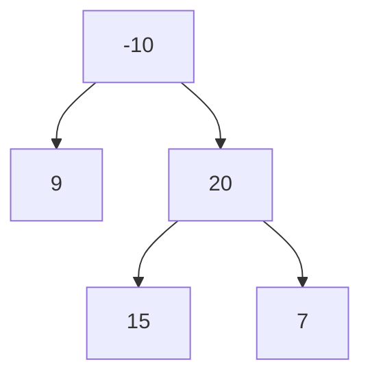
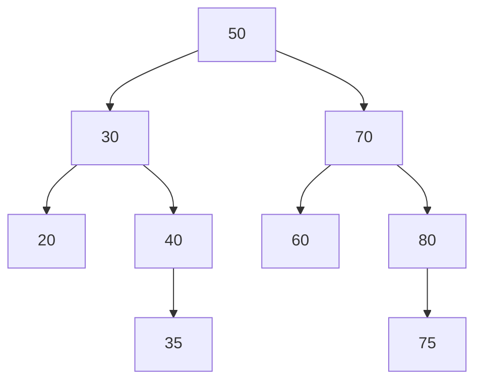

# Striver / Take U Forward — Trees & BST Deep Study Guide

## Navigation and Index

> Use this as the home page for the book. Every card ends with a return link.

| ID | Topic | Jump |
|---|---|---|
| **BT-1** | Introduction to Trees | [Jump](#bt-1-introduction-to-trees) |
| **BT-2** | Binary Tree Representation in Java | [Jump](#bt-2-binary-tree-representation-in-java) |
| **BT-3** | Tree Traversal — One DFS Frame, Three Processing Moments | [Jump](#bt-3-tree-traversal-one-dfs-frame-three-processing-moments) |
| **BT-4** | Recursive Preorder Traversal | [Jump](#bt-4-recursive-preorder-traversal) |
| **BT-5** | Recursive Inorder Traversal | [Jump](#bt-5-recursive-inorder-traversal) |
| **BT-6** | Recursive Postorder Traversal | [Jump](#bt-6-recursive-postorder-traversal) |
| **BT-7** | Level Order Traversal — BFS on a Tree | [Jump](#bt-7-level-order-traversal-bfs-on-a-tree) |
| **BT-8** | Iterative Preorder Traversal | [Jump](#bt-8-iterative-preorder-traversal) |
| **BT-9** | Iterative Inorder Traversal | [Jump](#bt-9-iterative-inorder-traversal) |
| **BT-10** | Iterative Postorder Using Two Stacks | [Jump](#bt-10-iterative-postorder-using-two-stacks) |
| **BT-11** | Iterative Postorder Using One Stack | [Jump](#bt-11-iterative-postorder-using-one-stack) |
| **BT-12** | Preorder + Inorder + Postorder in One Iterative Traversal | [Jump](#bt-12-preorder-inorder-postorder-in-one-iterative-traversal) |
| **BT-13** | Maximum Depth / Height of a Binary Tree | [Jump](#bt-13-maximum-depth-height-of-a-binary-tree) |
| **BT-14** | Check if a Binary Tree is Height-Balanced | [Jump](#bt-14-check-if-a-binary-tree-is-height-balanced) |
| **BT-15** | Diameter of a Binary Tree | [Jump](#bt-15-diameter-of-a-binary-tree) |
| **BT-16** | Maximum Path Sum in a Binary Tree | [Jump](#bt-16-maximum-path-sum-in-a-binary-tree) |
| **BT-17** | Check if Two Binary Trees are Identical | [Jump](#bt-17-check-if-two-binary-trees-are-identical) |
| **BT-18** | Zigzag Level Order Traversal | [Jump](#bt-18-zigzag-level-order-traversal) |
| **BT-19** | Boundary Traversal | [Jump](#bt-19-boundary-traversal) |
| **BT-20** | Vertical Order Traversal | [Jump](#bt-20-vertical-order-traversal) |
| **BT-21** | Top View of a Binary Tree | [Jump](#bt-21-top-view-of-a-binary-tree) |
| **BT-22** | Bottom View of a Binary Tree | [Jump](#bt-22-bottom-view-of-a-binary-tree) |
| **BT-23** | Right View and Left View | [Jump](#bt-23-right-view-and-left-view) |
| **BT-24** | Check if a Binary Tree is Symmetric | [Jump](#bt-24-check-if-a-binary-tree-is-symmetric) |
| **BT-25** | Root-to-Node Path | [Jump](#bt-25-root-to-node-path) |
| **BT-26** | Lowest Common Ancestor in a Binary Tree | [Jump](#bt-26-lowest-common-ancestor-in-a-binary-tree) |
| **BT-27** | Maximum Width of a Binary Tree | [Jump](#bt-27-maximum-width-of-a-binary-tree) |
| **BT-28** | Children Sum Property | [Jump](#bt-28-children-sum-property) |
| **BT-29** | Nodes at Distance K from a Target | [Jump](#bt-29-nodes-at-distance-k-from-a-target) |
| **BT-30** | Minimum Time to Burn a Binary Tree | [Jump](#bt-30-minimum-time-to-burn-a-binary-tree) |
| **BT-31** | Count Nodes in a Complete Binary Tree | [Jump](#bt-31-count-nodes-in-a-complete-binary-tree) |
| **BT-32** | Requirements for a Unique Binary Tree | [Jump](#bt-32-requirements-for-a-unique-binary-tree) |
| **BT-33** | Construct Binary Tree from Preorder and Inorder | [Jump](#bt-33-construct-binary-tree-from-preorder-and-inorder) |
| **BT-34** | Construct Binary Tree from Postorder and Inorder | [Jump](#bt-34-construct-binary-tree-from-postorder-and-inorder) |
| **BT-35** | Serialize and Deserialize a Binary Tree | [Jump](#bt-35-serialize-and-deserialize-a-binary-tree) |
| **BT-36** | Morris Preorder Traversal | [Jump](#bt-36-morris-preorder-traversal) |
| **BT-37** | Morris Inorder Traversal | [Jump](#bt-37-morris-inorder-traversal) |
| **BT-38** | Flatten Binary Tree to Linked List | [Jump](#bt-38-flatten-binary-tree-to-linked-list) |
| **BST-1** | Introduction to Binary Search Trees | [Jump](#bst-1-introduction-to-binary-search-trees) |
| **BST-2** | Search in a BST | [Jump](#bst-2-search-in-a-bst) |
| **BST-3** | Minimum and Maximum in a BST | [Jump](#bst-3-minimum-and-maximum-in-a-bst) |
| **BST-4** | Ceil in a BST | [Jump](#bst-4-ceil-in-a-bst) |
| **BST-5** | Floor in a BST | [Jump](#bst-5-floor-in-a-bst) |
| **BST-6** | Insert into a BST | [Jump](#bst-6-insert-into-a-bst) |
| **BST-7** | Delete a Node from BST | [Jump](#bst-7-delete-a-node-from-bst) |
| **BST-8** | K-th Smallest / K-th Largest | [Jump](#bst-8-k-th-smallest-k-th-largest) |
| **BST-9** | Validate a Binary Search Tree | [Jump](#bst-9-validate-a-binary-search-tree) |
| **BST-10** | Lowest Common Ancestor in BST | [Jump](#bst-10-lowest-common-ancestor-in-bst) |
| **BST-11** | Construct BST from Preorder | [Jump](#bst-11-construct-bst-from-preorder) |
| **BST-12** | Inorder Successor and Predecessor | [Jump](#bst-12-inorder-successor-and-predecessor) |
| **BST-13** | Merge Two BSTs | [Jump](#bst-13-merge-two-bsts) |
| **BST-14** | Two Sum in a BST | [Jump](#bst-14-two-sum-in-a-bst) |
| **BST-15** | Recover a BST with Two Swapped Nodes | [Jump](#bst-15-recover-a-bst-with-two-swapped-nodes) |
| **BST-16** | Largest BST Subtree in a Binary Tree | [Jump](#bst-16-largest-bst-subtree-in-a-binary-tree) |

## How to study this book

The highest-value tree question is: what does dfs(node) return to its parent? Information can flow downward as bounds/context, upward as subtree summaries, or horizontally through BFS levels/coordinates. BST operations are O(height), not automatically O(log n).

**Required reading order:** requirement → examples → data picture → brute force → repeated-work diagnosis → invariant → optimized plan → dry run → Java → correctness → boundaries → complexity → memory trick → variations.

> **Source transparency:** topic ordering follows the retained Striver/Take U Forward study structure from this project. Extra examples, memory tricks, research notes and explanations are study-guide additions unless explicitly marked as verified from a creator/source.

## Pattern recognition cheat sheet

| Clue | Think about first |
|---|---|
| next/previous greater/smaller | monotonic stack |
| fixed-size best window | deque / sliding window |
| shortest unweighted path | BFS |
| nonnegative weighted shortest path | Dijkstra |
| negative edges | Bellman-Ford |
| dependencies | topological sort |
| repeated component merges | DSU |
| critical edge/vertex | low-link DFS |
| linked-list middle/cycle | slow/fast pointers |
| tree child summaries | postorder DP |
| repeated lookup/count | HashMap / HashSet |
| subarray sum/count with negatives | prefix state + HashMap |

<a id="bt-1-introduction-to-trees"></a>
## BT-1. Introduction to Trees

[Index](#navigation-and-index) · [BT-2 →](#bt-2-binary-tree-representation-in-java)

### Detailed question understanding

**What is the problem/lesson asking?** Introduction to Trees. Rewrite the exact input state, legal operation/relationship, and requested output before choosing a technique. Similar titles often hide materially different variants—for example nearest greater versus count of all greater values, four-direction versus eight-direction grid adjacency, or node identity versus equal node values.

### Three requirement-clarifying examples

| # | Input / setup | Output / observation | Why it matters |
|---:|---|---|---|
| 1 | `smallest valid input` | `trace base state` | base/boundary semantics |
| 2 | `typical nontrivial input` | `trace expected result` | core invariant |
| 3 | `boundary-shaped input` | `verify edge behavior` | protect implementation |

### Pattern recognition

**Primary pattern:** Recursion contract

> **KEY INTUITION —** Before coding, state exactly what dfs(node) returns upward or what context is passed downward.

### Brute-force / straightforward baseline

Start with the direct simulation/repeated scan that mirrors the statement. It is valuable because it exposes **what is being recomputed**. Then ask: *what exact fact from earlier work would make the next decision immediate?*

### Optimized reasoning

Name the invariant before code. The optimized solution for this family is derived from the intuition above. Every state change must preserve the invariant; if you cannot say what the working structure means after processing the first *i* items/nodes/states, the implementation is not ready.

### Detailed dry run

Annotate recursive return values or the BFS queue after each level. Separate information returned upward from answers scored locally.

For interview practice, include at least four snapshots: initial state, first nontrivial state change, the state where the central invariant does real work, and final state. Explain **why each mutation occurred**, not merely what the values became.

### Java implementation / template

```java
// Card-specific Java implementation is expanded during the scheduled deepening pass.
// Interview discipline:
// 1) define the state/invariant,
// 2) implement exactly one valid transition,
// 3) test empty/single/duplicate/extreme cases,
// 4) use long for sums/distances when constraints can overflow int.
```

### Key line to highlight

Find the line that changes the invariant: the monotonic `while`, a graph relaxation `if`, a pointer splice, a recursive return combination, or a HashMap lookup/update. Explain what would break if its comparison or ordering changed.

### Correctness checklist

1. State the invariant before the loop/recursion.
2. Show it is true initially.
3. Show every transition preserves it.
4. Explain why the terminal state implies the requested answer.
5. For greedy algorithms, identify the exchange/cut/monotonic argument that makes the local choice safe.

### Boundary conditions

- empty/null input when the platform permits it;
- one element/node/state;
- duplicates and strict-versus-nonstrict comparisons;
- monotone/skewed/disconnected shape where relevant;
- overflow in sums, products, distances and path counts—prefer `long` when needed;
- value vs index vs node identity;
- online/streaming input versus offline preprocessing;
- repeated queries may justify preprocessing that a one-shot query does not.

### Complexity — derive it instead of memorizing it

**Full traversal O(n); recursion O(h), BFS frontier O(w).**

Count how many times each element/node/edge can enter and leave the working structure, then multiply by the operation cost: array/index O(1), expected hash O(1), balanced tree/heap O(log n), full edge scan O(E).

### Memoization / repeated-work note

Memoization is useful only when the same logical state can be solved repeatedly. In many one-pass stack/list/tree problems there are no overlapping subproblems; the data structure itself stores the minimal reusable history. In graph, prefix-hash, and repeated-query problems, `visited`, `dist`, prefix maps, parent maps, or cached subtree metadata play the “do not recompute solved state” role.

> **MEMORY TRICK —** WHAT DOES THIS CALL PROMISE ITS PARENT?

### Interview follow-ups and variations

1. Can auxiliary space be reduced, and what invariant replaces it?
2. What changes if equality/duplicate semantics change?
3. What changes if input arrives online?
4. What changes for many repeated queries?
5. Name two related problems that reuse this invariant with only one comparison or one state dimension changed.

[↑ Back to Index](#navigation-and-index)

---

<a id="bt-2-binary-tree-representation-in-java"></a>
## BT-2. Binary Tree Representation in Java

[← BT-1](#bt-1-introduction-to-trees) · [Index](#navigation-and-index) · [BT-3 →](#bt-3-tree-traversal-one-dfs-frame-three-processing-moments)

### Detailed question understanding

**What is the problem/lesson asking?** Binary Tree Representation in Java. Rewrite the exact input state, legal operation/relationship, and requested output before choosing a technique. Similar titles often hide materially different variants—for example nearest greater versus count of all greater values, four-direction versus eight-direction grid adjacency, or node identity versus equal node values.

### Three requirement-clarifying examples

| # | Input / setup | Output / observation | Why it matters |
|---:|---|---|---|
| 1 | `smallest valid input` | `trace base state` | base/boundary semantics |
| 2 | `typical nontrivial input` | `trace expected result` | core invariant |
| 3 | `boundary-shaped input` | `verify edge behavior` | protect implementation |

### Pattern recognition

**Primary pattern:** Recursion contract

> **KEY INTUITION —** Before coding, state exactly what dfs(node) returns upward or what context is passed downward.

### Brute-force / straightforward baseline

Start with the direct simulation/repeated scan that mirrors the statement. It is valuable because it exposes **what is being recomputed**. Then ask: *what exact fact from earlier work would make the next decision immediate?*

### Optimized reasoning

Name the invariant before code. The optimized solution for this family is derived from the intuition above. Every state change must preserve the invariant; if you cannot say what the working structure means after processing the first *i* items/nodes/states, the implementation is not ready.

### Detailed dry run

Annotate recursive return values or the BFS queue after each level. Separate information returned upward from answers scored locally.

For interview practice, include at least four snapshots: initial state, first nontrivial state change, the state where the central invariant does real work, and final state. Explain **why each mutation occurred**, not merely what the values became.

### Java implementation / template

```java
// Card-specific Java implementation is expanded during the scheduled deepening pass.
// Interview discipline:
// 1) define the state/invariant,
// 2) implement exactly one valid transition,
// 3) test empty/single/duplicate/extreme cases,
// 4) use long for sums/distances when constraints can overflow int.
```

### Key line to highlight

Find the line that changes the invariant: the monotonic `while`, a graph relaxation `if`, a pointer splice, a recursive return combination, or a HashMap lookup/update. Explain what would break if its comparison or ordering changed.

### Correctness checklist

1. State the invariant before the loop/recursion.
2. Show it is true initially.
3. Show every transition preserves it.
4. Explain why the terminal state implies the requested answer.
5. For greedy algorithms, identify the exchange/cut/monotonic argument that makes the local choice safe.

### Boundary conditions

- empty/null input when the platform permits it;
- one element/node/state;
- duplicates and strict-versus-nonstrict comparisons;
- monotone/skewed/disconnected shape where relevant;
- overflow in sums, products, distances and path counts—prefer `long` when needed;
- value vs index vs node identity;
- online/streaming input versus offline preprocessing;
- repeated queries may justify preprocessing that a one-shot query does not.

### Complexity — derive it instead of memorizing it

**Full traversal O(n); recursion O(h), BFS frontier O(w).**

Count how many times each element/node/edge can enter and leave the working structure, then multiply by the operation cost: array/index O(1), expected hash O(1), balanced tree/heap O(log n), full edge scan O(E).

### Memoization / repeated-work note

Memoization is useful only when the same logical state can be solved repeatedly. In many one-pass stack/list/tree problems there are no overlapping subproblems; the data structure itself stores the minimal reusable history. In graph, prefix-hash, and repeated-query problems, `visited`, `dist`, prefix maps, parent maps, or cached subtree metadata play the “do not recompute solved state” role.

> **MEMORY TRICK —** WHAT DOES THIS CALL PROMISE ITS PARENT?

### Interview follow-ups and variations

1. Can auxiliary space be reduced, and what invariant replaces it?
2. What changes if equality/duplicate semantics change?
3. What changes if input arrives online?
4. What changes for many repeated queries?
5. Name two related problems that reuse this invariant with only one comparison or one state dimension changed.

[↑ Back to Index](#navigation-and-index)

---

<a id="bt-3-tree-traversal-one-dfs-frame-three-processing-moments"></a>
## BT-3. Tree Traversal — One DFS Frame, Three Processing Moments

[← BT-2](#bt-2-binary-tree-representation-in-java) · [Index](#navigation-and-index) · [BT-4 →](#bt-4-recursive-preorder-traversal)

### Detailed question understanding

**What is the problem/lesson asking?** Tree Traversal — One DFS Frame, Three Processing Moments. Rewrite the exact input state, legal operation/relationship, and requested output before choosing a technique. Similar titles often hide materially different variants—for example nearest greater versus count of all greater values, four-direction versus eight-direction grid adjacency, or node identity versus equal node values.

### Three requirement-clarifying examples

| # | Input / setup | Output / observation | Why it matters |
|---:|---|---|---|
| 1 | `smallest valid input` | `trace base state` | base/boundary semantics |
| 2 | `typical nontrivial input` | `trace expected result` | core invariant |
| 3 | `boundary-shaped input` | `verify edge behavior` | protect implementation |

### Pattern recognition

**Primary pattern:** Recursion contract

> **KEY INTUITION —** Before coding, state exactly what dfs(node) returns upward or what context is passed downward.

### Brute-force / straightforward baseline

Start with the direct simulation/repeated scan that mirrors the statement. It is valuable because it exposes **what is being recomputed**. Then ask: *what exact fact from earlier work would make the next decision immediate?*

### Optimized reasoning

Name the invariant before code. The optimized solution for this family is derived from the intuition above. Every state change must preserve the invariant; if you cannot say what the working structure means after processing the first *i* items/nodes/states, the implementation is not ready.

### Detailed dry run

Annotate recursive return values or the BFS queue after each level. Separate information returned upward from answers scored locally.

For interview practice, include at least four snapshots: initial state, first nontrivial state change, the state where the central invariant does real work, and final state. Explain **why each mutation occurred**, not merely what the values became.

### Java implementation / template

```java
// Card-specific Java implementation is expanded during the scheduled deepening pass.
// Interview discipline:
// 1) define the state/invariant,
// 2) implement exactly one valid transition,
// 3) test empty/single/duplicate/extreme cases,
// 4) use long for sums/distances when constraints can overflow int.
```

### Key line to highlight

Find the line that changes the invariant: the monotonic `while`, a graph relaxation `if`, a pointer splice, a recursive return combination, or a HashMap lookup/update. Explain what would break if its comparison or ordering changed.

### Correctness checklist

1. State the invariant before the loop/recursion.
2. Show it is true initially.
3. Show every transition preserves it.
4. Explain why the terminal state implies the requested answer.
5. For greedy algorithms, identify the exchange/cut/monotonic argument that makes the local choice safe.

### Boundary conditions

- empty/null input when the platform permits it;
- one element/node/state;
- duplicates and strict-versus-nonstrict comparisons;
- monotone/skewed/disconnected shape where relevant;
- overflow in sums, products, distances and path counts—prefer `long` when needed;
- value vs index vs node identity;
- online/streaming input versus offline preprocessing;
- repeated queries may justify preprocessing that a one-shot query does not.

### Complexity — derive it instead of memorizing it

**Full traversal O(n); recursion O(h), BFS frontier O(w).**

Count how many times each element/node/edge can enter and leave the working structure, then multiply by the operation cost: array/index O(1), expected hash O(1), balanced tree/heap O(log n), full edge scan O(E).

### Memoization / repeated-work note

Memoization is useful only when the same logical state can be solved repeatedly. In many one-pass stack/list/tree problems there are no overlapping subproblems; the data structure itself stores the minimal reusable history. In graph, prefix-hash, and repeated-query problems, `visited`, `dist`, prefix maps, parent maps, or cached subtree metadata play the “do not recompute solved state” role.

> **MEMORY TRICK —** WHAT DOES THIS CALL PROMISE ITS PARENT?

### Interview follow-ups and variations

1. Can auxiliary space be reduced, and what invariant replaces it?
2. What changes if equality/duplicate semantics change?
3. What changes if input arrives online?
4. What changes for many repeated queries?
5. Name two related problems that reuse this invariant with only one comparison or one state dimension changed.

[↑ Back to Index](#navigation-and-index)

---

<a id="bt-4-recursive-preorder-traversal"></a>
## BT-4. Recursive Preorder Traversal

[← BT-3](#bt-3-tree-traversal-one-dfs-frame-three-processing-moments) · [Index](#navigation-and-index) · [BT-5 →](#bt-5-recursive-inorder-traversal)

### Detailed question understanding

**What is the problem/lesson asking?** Recursive Preorder Traversal. Rewrite the exact input state, legal operation/relationship, and requested output before choosing a technique. Similar titles often hide materially different variants—for example nearest greater versus count of all greater values, four-direction versus eight-direction grid adjacency, or node identity versus equal node values.

### Three requirement-clarifying examples

| # | Input / setup | Output / observation | Why it matters |
|---:|---|---|---|
| 1 | `smallest valid input` | `trace base state` | base/boundary semantics |
| 2 | `typical nontrivial input` | `trace expected result` | core invariant |
| 3 | `boundary-shaped input` | `verify edge behavior` | protect implementation |

### Pattern recognition

**Primary pattern:** Recursion contract

> **KEY INTUITION —** Before coding, state exactly what dfs(node) returns upward or what context is passed downward.

### Brute-force / straightforward baseline

Start with the direct simulation/repeated scan that mirrors the statement. It is valuable because it exposes **what is being recomputed**. Then ask: *what exact fact from earlier work would make the next decision immediate?*

### Optimized reasoning

Name the invariant before code. The optimized solution for this family is derived from the intuition above. Every state change must preserve the invariant; if you cannot say what the working structure means after processing the first *i* items/nodes/states, the implementation is not ready.

### Detailed dry run

Annotate recursive return values or the BFS queue after each level. Separate information returned upward from answers scored locally.

For interview practice, include at least four snapshots: initial state, first nontrivial state change, the state where the central invariant does real work, and final state. Explain **why each mutation occurred**, not merely what the values became.

### Java implementation / template

```java
// Card-specific Java implementation is expanded during the scheduled deepening pass.
// Interview discipline:
// 1) define the state/invariant,
// 2) implement exactly one valid transition,
// 3) test empty/single/duplicate/extreme cases,
// 4) use long for sums/distances when constraints can overflow int.
```

### Key line to highlight

Find the line that changes the invariant: the monotonic `while`, a graph relaxation `if`, a pointer splice, a recursive return combination, or a HashMap lookup/update. Explain what would break if its comparison or ordering changed.

### Correctness checklist

1. State the invariant before the loop/recursion.
2. Show it is true initially.
3. Show every transition preserves it.
4. Explain why the terminal state implies the requested answer.
5. For greedy algorithms, identify the exchange/cut/monotonic argument that makes the local choice safe.

### Boundary conditions

- empty/null input when the platform permits it;
- one element/node/state;
- duplicates and strict-versus-nonstrict comparisons;
- monotone/skewed/disconnected shape where relevant;
- overflow in sums, products, distances and path counts—prefer `long` when needed;
- value vs index vs node identity;
- online/streaming input versus offline preprocessing;
- repeated queries may justify preprocessing that a one-shot query does not.

### Complexity — derive it instead of memorizing it

**Full traversal O(n); recursion O(h), BFS frontier O(w).**

Count how many times each element/node/edge can enter and leave the working structure, then multiply by the operation cost: array/index O(1), expected hash O(1), balanced tree/heap O(log n), full edge scan O(E).

### Memoization / repeated-work note

Memoization is useful only when the same logical state can be solved repeatedly. In many one-pass stack/list/tree problems there are no overlapping subproblems; the data structure itself stores the minimal reusable history. In graph, prefix-hash, and repeated-query problems, `visited`, `dist`, prefix maps, parent maps, or cached subtree metadata play the “do not recompute solved state” role.

> **MEMORY TRICK —** WHAT DOES THIS CALL PROMISE ITS PARENT?

### Interview follow-ups and variations

1. Can auxiliary space be reduced, and what invariant replaces it?
2. What changes if equality/duplicate semantics change?
3. What changes if input arrives online?
4. What changes for many repeated queries?
5. Name two related problems that reuse this invariant with only one comparison or one state dimension changed.

[↑ Back to Index](#navigation-and-index)

---

<a id="bt-5-recursive-inorder-traversal"></a>
## BT-5. Recursive Inorder Traversal

[← BT-4](#bt-4-recursive-preorder-traversal) · [Index](#navigation-and-index) · [BT-6 →](#bt-6-recursive-postorder-traversal)

### Detailed question understanding

**What is the problem/lesson asking?** Recursive Inorder Traversal. Rewrite the exact input state, legal operation/relationship, and requested output before choosing a technique. Similar titles often hide materially different variants—for example nearest greater versus count of all greater values, four-direction versus eight-direction grid adjacency, or node identity versus equal node values.

### Three requirement-clarifying examples

| # | Input / setup | Output / observation | Why it matters |
|---:|---|---|---|
| 1 | `smallest valid input` | `trace base state` | base/boundary semantics |
| 2 | `typical nontrivial input` | `trace expected result` | core invariant |
| 3 | `boundary-shaped input` | `verify edge behavior` | protect implementation |

### Pattern recognition

**Primary pattern:** Recursion contract

> **KEY INTUITION —** Before coding, state exactly what dfs(node) returns upward or what context is passed downward.

### Brute-force / straightforward baseline

Start with the direct simulation/repeated scan that mirrors the statement. It is valuable because it exposes **what is being recomputed**. Then ask: *what exact fact from earlier work would make the next decision immediate?*

### Optimized reasoning

Name the invariant before code. The optimized solution for this family is derived from the intuition above. Every state change must preserve the invariant; if you cannot say what the working structure means after processing the first *i* items/nodes/states, the implementation is not ready.

### Detailed dry run

Annotate recursive return values or the BFS queue after each level. Separate information returned upward from answers scored locally.

For interview practice, include at least four snapshots: initial state, first nontrivial state change, the state where the central invariant does real work, and final state. Explain **why each mutation occurred**, not merely what the values became.

### Java implementation / template

```java
// Card-specific Java implementation is expanded during the scheduled deepening pass.
// Interview discipline:
// 1) define the state/invariant,
// 2) implement exactly one valid transition,
// 3) test empty/single/duplicate/extreme cases,
// 4) use long for sums/distances when constraints can overflow int.
```

### Key line to highlight

Find the line that changes the invariant: the monotonic `while`, a graph relaxation `if`, a pointer splice, a recursive return combination, or a HashMap lookup/update. Explain what would break if its comparison or ordering changed.

### Correctness checklist

1. State the invariant before the loop/recursion.
2. Show it is true initially.
3. Show every transition preserves it.
4. Explain why the terminal state implies the requested answer.
5. For greedy algorithms, identify the exchange/cut/monotonic argument that makes the local choice safe.

### Boundary conditions

- empty/null input when the platform permits it;
- one element/node/state;
- duplicates and strict-versus-nonstrict comparisons;
- monotone/skewed/disconnected shape where relevant;
- overflow in sums, products, distances and path counts—prefer `long` when needed;
- value vs index vs node identity;
- online/streaming input versus offline preprocessing;
- repeated queries may justify preprocessing that a one-shot query does not.

### Complexity — derive it instead of memorizing it

**Full traversal O(n); recursion O(h), BFS frontier O(w).**

Count how many times each element/node/edge can enter and leave the working structure, then multiply by the operation cost: array/index O(1), expected hash O(1), balanced tree/heap O(log n), full edge scan O(E).

### Memoization / repeated-work note

Memoization is useful only when the same logical state can be solved repeatedly. In many one-pass stack/list/tree problems there are no overlapping subproblems; the data structure itself stores the minimal reusable history. In graph, prefix-hash, and repeated-query problems, `visited`, `dist`, prefix maps, parent maps, or cached subtree metadata play the “do not recompute solved state” role.

> **MEMORY TRICK —** WHAT DOES THIS CALL PROMISE ITS PARENT?

### Interview follow-ups and variations

1. Can auxiliary space be reduced, and what invariant replaces it?
2. What changes if equality/duplicate semantics change?
3. What changes if input arrives online?
4. What changes for many repeated queries?
5. Name two related problems that reuse this invariant with only one comparison or one state dimension changed.

[↑ Back to Index](#navigation-and-index)

---

<a id="bt-6-recursive-postorder-traversal"></a>
## BT-6. Recursive Postorder Traversal

[← BT-5](#bt-5-recursive-inorder-traversal) · [Index](#navigation-and-index) · [BT-7 →](#bt-7-level-order-traversal-bfs-on-a-tree)

### Detailed question understanding

**What is the problem/lesson asking?** Recursive Postorder Traversal. Rewrite the exact input state, legal operation/relationship, and requested output before choosing a technique. Similar titles often hide materially different variants—for example nearest greater versus count of all greater values, four-direction versus eight-direction grid adjacency, or node identity versus equal node values.

### Three requirement-clarifying examples

| # | Input / setup | Output / observation | Why it matters |
|---:|---|---|---|
| 1 | `smallest valid input` | `trace base state` | base/boundary semantics |
| 2 | `typical nontrivial input` | `trace expected result` | core invariant |
| 3 | `boundary-shaped input` | `verify edge behavior` | protect implementation |

### Pattern recognition

**Primary pattern:** Recursion contract

> **KEY INTUITION —** Before coding, state exactly what dfs(node) returns upward or what context is passed downward.

### Brute-force / straightforward baseline

Start with the direct simulation/repeated scan that mirrors the statement. It is valuable because it exposes **what is being recomputed**. Then ask: *what exact fact from earlier work would make the next decision immediate?*

### Optimized reasoning

Name the invariant before code. The optimized solution for this family is derived from the intuition above. Every state change must preserve the invariant; if you cannot say what the working structure means after processing the first *i* items/nodes/states, the implementation is not ready.

### Detailed dry run

Annotate recursive return values or the BFS queue after each level. Separate information returned upward from answers scored locally.

For interview practice, include at least four snapshots: initial state, first nontrivial state change, the state where the central invariant does real work, and final state. Explain **why each mutation occurred**, not merely what the values became.

### Java implementation / template

```java
// Card-specific Java implementation is expanded during the scheduled deepening pass.
// Interview discipline:
// 1) define the state/invariant,
// 2) implement exactly one valid transition,
// 3) test empty/single/duplicate/extreme cases,
// 4) use long for sums/distances when constraints can overflow int.
```

### Key line to highlight

Find the line that changes the invariant: the monotonic `while`, a graph relaxation `if`, a pointer splice, a recursive return combination, or a HashMap lookup/update. Explain what would break if its comparison or ordering changed.

### Correctness checklist

1. State the invariant before the loop/recursion.
2. Show it is true initially.
3. Show every transition preserves it.
4. Explain why the terminal state implies the requested answer.
5. For greedy algorithms, identify the exchange/cut/monotonic argument that makes the local choice safe.

### Boundary conditions

- empty/null input when the platform permits it;
- one element/node/state;
- duplicates and strict-versus-nonstrict comparisons;
- monotone/skewed/disconnected shape where relevant;
- overflow in sums, products, distances and path counts—prefer `long` when needed;
- value vs index vs node identity;
- online/streaming input versus offline preprocessing;
- repeated queries may justify preprocessing that a one-shot query does not.

### Complexity — derive it instead of memorizing it

**Full traversal O(n); recursion O(h), BFS frontier O(w).**

Count how many times each element/node/edge can enter and leave the working structure, then multiply by the operation cost: array/index O(1), expected hash O(1), balanced tree/heap O(log n), full edge scan O(E).

### Memoization / repeated-work note

Memoization is useful only when the same logical state can be solved repeatedly. In many one-pass stack/list/tree problems there are no overlapping subproblems; the data structure itself stores the minimal reusable history. In graph, prefix-hash, and repeated-query problems, `visited`, `dist`, prefix maps, parent maps, or cached subtree metadata play the “do not recompute solved state” role.

> **MEMORY TRICK —** WHAT DOES THIS CALL PROMISE ITS PARENT?

### Interview follow-ups and variations

1. Can auxiliary space be reduced, and what invariant replaces it?
2. What changes if equality/duplicate semantics change?
3. What changes if input arrives online?
4. What changes for many repeated queries?
5. Name two related problems that reuse this invariant with only one comparison or one state dimension changed.

[↑ Back to Index](#navigation-and-index)

---

<a id="bt-7-level-order-traversal-bfs-on-a-tree"></a>
## BT-7. Level Order Traversal — BFS on a Tree

[← BT-6](#bt-6-recursive-postorder-traversal) · [Index](#navigation-and-index) · [BT-8 →](#bt-8-iterative-preorder-traversal)

### Detailed question understanding

**What is the problem/lesson asking?** Level Order Traversal — BFS on a Tree. Rewrite the exact input state, legal operation/relationship, and requested output before choosing a technique. Similar titles often hide materially different variants—for example nearest greater versus count of all greater values, four-direction versus eight-direction grid adjacency, or node identity versus equal node values.

### Three requirement-clarifying examples

| # | Input / setup | Output / observation | Why it matters |
|---:|---|---|---|
| 1 | `smallest valid input` | `trace base state` | base/boundary semantics |
| 2 | `typical nontrivial input` | `trace expected result` | core invariant |
| 3 | `boundary-shaped input` | `verify edge behavior` | protect implementation |

### Pattern recognition

**Primary pattern:** Recursion contract

> **KEY INTUITION —** Before coding, state exactly what dfs(node) returns upward or what context is passed downward.

### Brute-force / straightforward baseline

Start with the direct simulation/repeated scan that mirrors the statement. It is valuable because it exposes **what is being recomputed**. Then ask: *what exact fact from earlier work would make the next decision immediate?*

### Optimized reasoning

Name the invariant before code. The optimized solution for this family is derived from the intuition above. Every state change must preserve the invariant; if you cannot say what the working structure means after processing the first *i* items/nodes/states, the implementation is not ready.

### Detailed dry run

Annotate recursive return values or the BFS queue after each level. Separate information returned upward from answers scored locally.

For interview practice, include at least four snapshots: initial state, first nontrivial state change, the state where the central invariant does real work, and final state. Explain **why each mutation occurred**, not merely what the values became.

### Java implementation / template

```java
// Card-specific Java implementation is expanded during the scheduled deepening pass.
// Interview discipline:
// 1) define the state/invariant,
// 2) implement exactly one valid transition,
// 3) test empty/single/duplicate/extreme cases,
// 4) use long for sums/distances when constraints can overflow int.
```

### Key line to highlight

Find the line that changes the invariant: the monotonic `while`, a graph relaxation `if`, a pointer splice, a recursive return combination, or a HashMap lookup/update. Explain what would break if its comparison or ordering changed.

### Correctness checklist

1. State the invariant before the loop/recursion.
2. Show it is true initially.
3. Show every transition preserves it.
4. Explain why the terminal state implies the requested answer.
5. For greedy algorithms, identify the exchange/cut/monotonic argument that makes the local choice safe.

### Boundary conditions

- empty/null input when the platform permits it;
- one element/node/state;
- duplicates and strict-versus-nonstrict comparisons;
- monotone/skewed/disconnected shape where relevant;
- overflow in sums, products, distances and path counts—prefer `long` when needed;
- value vs index vs node identity;
- online/streaming input versus offline preprocessing;
- repeated queries may justify preprocessing that a one-shot query does not.

### Complexity — derive it instead of memorizing it

**Full traversal O(n); recursion O(h), BFS frontier O(w).**

Count how many times each element/node/edge can enter and leave the working structure, then multiply by the operation cost: array/index O(1), expected hash O(1), balanced tree/heap O(log n), full edge scan O(E).

### Memoization / repeated-work note

Memoization is useful only when the same logical state can be solved repeatedly. In many one-pass stack/list/tree problems there are no overlapping subproblems; the data structure itself stores the minimal reusable history. In graph, prefix-hash, and repeated-query problems, `visited`, `dist`, prefix maps, parent maps, or cached subtree metadata play the “do not recompute solved state” role.

> **MEMORY TRICK —** WHAT DOES THIS CALL PROMISE ITS PARENT?

### Interview follow-ups and variations

1. Can auxiliary space be reduced, and what invariant replaces it?
2. What changes if equality/duplicate semantics change?
3. What changes if input arrives online?
4. What changes for many repeated queries?
5. Name two related problems that reuse this invariant with only one comparison or one state dimension changed.

[↑ Back to Index](#navigation-and-index)

---

<a id="bt-8-iterative-preorder-traversal"></a>
## BT-8. Iterative Preorder Traversal

[← BT-7](#bt-7-level-order-traversal-bfs-on-a-tree) · [Index](#navigation-and-index) · [BT-9 →](#bt-9-iterative-inorder-traversal)

### Detailed question understanding

**What is the problem/lesson asking?** Iterative Preorder Traversal. Rewrite the exact input state, legal operation/relationship, and requested output before choosing a technique. Similar titles often hide materially different variants—for example nearest greater versus count of all greater values, four-direction versus eight-direction grid adjacency, or node identity versus equal node values.

### Three requirement-clarifying examples

| # | Input / setup | Output / observation | Why it matters |
|---:|---|---|---|
| 1 | `smallest valid input` | `trace base state` | base/boundary semantics |
| 2 | `typical nontrivial input` | `trace expected result` | core invariant |
| 3 | `boundary-shaped input` | `verify edge behavior` | protect implementation |

### Pattern recognition

**Primary pattern:** Recursion contract

> **KEY INTUITION —** Before coding, state exactly what dfs(node) returns upward or what context is passed downward.

### Brute-force / straightforward baseline

Start with the direct simulation/repeated scan that mirrors the statement. It is valuable because it exposes **what is being recomputed**. Then ask: *what exact fact from earlier work would make the next decision immediate?*

### Optimized reasoning

Name the invariant before code. The optimized solution for this family is derived from the intuition above. Every state change must preserve the invariant; if you cannot say what the working structure means after processing the first *i* items/nodes/states, the implementation is not ready.

### Detailed dry run

Annotate recursive return values or the BFS queue after each level. Separate information returned upward from answers scored locally.

For interview practice, include at least four snapshots: initial state, first nontrivial state change, the state where the central invariant does real work, and final state. Explain **why each mutation occurred**, not merely what the values became.

### Java implementation / template

```java
// Card-specific Java implementation is expanded during the scheduled deepening pass.
// Interview discipline:
// 1) define the state/invariant,
// 2) implement exactly one valid transition,
// 3) test empty/single/duplicate/extreme cases,
// 4) use long for sums/distances when constraints can overflow int.
```

### Key line to highlight

Find the line that changes the invariant: the monotonic `while`, a graph relaxation `if`, a pointer splice, a recursive return combination, or a HashMap lookup/update. Explain what would break if its comparison or ordering changed.

### Correctness checklist

1. State the invariant before the loop/recursion.
2. Show it is true initially.
3. Show every transition preserves it.
4. Explain why the terminal state implies the requested answer.
5. For greedy algorithms, identify the exchange/cut/monotonic argument that makes the local choice safe.

### Boundary conditions

- empty/null input when the platform permits it;
- one element/node/state;
- duplicates and strict-versus-nonstrict comparisons;
- monotone/skewed/disconnected shape where relevant;
- overflow in sums, products, distances and path counts—prefer `long` when needed;
- value vs index vs node identity;
- online/streaming input versus offline preprocessing;
- repeated queries may justify preprocessing that a one-shot query does not.

### Complexity — derive it instead of memorizing it

**Full traversal O(n); recursion O(h), BFS frontier O(w).**

Count how many times each element/node/edge can enter and leave the working structure, then multiply by the operation cost: array/index O(1), expected hash O(1), balanced tree/heap O(log n), full edge scan O(E).

### Memoization / repeated-work note

Memoization is useful only when the same logical state can be solved repeatedly. In many one-pass stack/list/tree problems there are no overlapping subproblems; the data structure itself stores the minimal reusable history. In graph, prefix-hash, and repeated-query problems, `visited`, `dist`, prefix maps, parent maps, or cached subtree metadata play the “do not recompute solved state” role.

> **MEMORY TRICK —** WHAT DOES THIS CALL PROMISE ITS PARENT?

### Interview follow-ups and variations

1. Can auxiliary space be reduced, and what invariant replaces it?
2. What changes if equality/duplicate semantics change?
3. What changes if input arrives online?
4. What changes for many repeated queries?
5. Name two related problems that reuse this invariant with only one comparison or one state dimension changed.

[↑ Back to Index](#navigation-and-index)

---

<a id="bt-9-iterative-inorder-traversal"></a>
## BT-9. Iterative Inorder Traversal

[← BT-8](#bt-8-iterative-preorder-traversal) · [Index](#navigation-and-index) · [BT-10 →](#bt-10-iterative-postorder-using-two-stacks)

### Detailed question understanding

**What is the problem/lesson asking?** Iterative Inorder Traversal. Rewrite the exact input state, legal operation/relationship, and requested output before choosing a technique. Similar titles often hide materially different variants—for example nearest greater versus count of all greater values, four-direction versus eight-direction grid adjacency, or node identity versus equal node values.

### Three requirement-clarifying examples

| # | Input / setup | Output / observation | Why it matters |
|---:|---|---|---|
| 1 | `smallest valid input` | `trace base state` | base/boundary semantics |
| 2 | `typical nontrivial input` | `trace expected result` | core invariant |
| 3 | `boundary-shaped input` | `verify edge behavior` | protect implementation |

### Pattern recognition

**Primary pattern:** Recursion contract

> **KEY INTUITION —** Before coding, state exactly what dfs(node) returns upward or what context is passed downward.

### Brute-force / straightforward baseline

Start with the direct simulation/repeated scan that mirrors the statement. It is valuable because it exposes **what is being recomputed**. Then ask: *what exact fact from earlier work would make the next decision immediate?*

### Optimized reasoning

Name the invariant before code. The optimized solution for this family is derived from the intuition above. Every state change must preserve the invariant; if you cannot say what the working structure means after processing the first *i* items/nodes/states, the implementation is not ready.

### Detailed dry run

Annotate recursive return values or the BFS queue after each level. Separate information returned upward from answers scored locally.

For interview practice, include at least four snapshots: initial state, first nontrivial state change, the state where the central invariant does real work, and final state. Explain **why each mutation occurred**, not merely what the values became.

### Java implementation / template

```java
// Card-specific Java implementation is expanded during the scheduled deepening pass.
// Interview discipline:
// 1) define the state/invariant,
// 2) implement exactly one valid transition,
// 3) test empty/single/duplicate/extreme cases,
// 4) use long for sums/distances when constraints can overflow int.
```

### Key line to highlight

Find the line that changes the invariant: the monotonic `while`, a graph relaxation `if`, a pointer splice, a recursive return combination, or a HashMap lookup/update. Explain what would break if its comparison or ordering changed.

### Correctness checklist

1. State the invariant before the loop/recursion.
2. Show it is true initially.
3. Show every transition preserves it.
4. Explain why the terminal state implies the requested answer.
5. For greedy algorithms, identify the exchange/cut/monotonic argument that makes the local choice safe.

### Boundary conditions

- empty/null input when the platform permits it;
- one element/node/state;
- duplicates and strict-versus-nonstrict comparisons;
- monotone/skewed/disconnected shape where relevant;
- overflow in sums, products, distances and path counts—prefer `long` when needed;
- value vs index vs node identity;
- online/streaming input versus offline preprocessing;
- repeated queries may justify preprocessing that a one-shot query does not.

### Complexity — derive it instead of memorizing it

**Full traversal O(n); recursion O(h), BFS frontier O(w).**

Count how many times each element/node/edge can enter and leave the working structure, then multiply by the operation cost: array/index O(1), expected hash O(1), balanced tree/heap O(log n), full edge scan O(E).

### Memoization / repeated-work note

Memoization is useful only when the same logical state can be solved repeatedly. In many one-pass stack/list/tree problems there are no overlapping subproblems; the data structure itself stores the minimal reusable history. In graph, prefix-hash, and repeated-query problems, `visited`, `dist`, prefix maps, parent maps, or cached subtree metadata play the “do not recompute solved state” role.

> **MEMORY TRICK —** WHAT DOES THIS CALL PROMISE ITS PARENT?

### Interview follow-ups and variations

1. Can auxiliary space be reduced, and what invariant replaces it?
2. What changes if equality/duplicate semantics change?
3. What changes if input arrives online?
4. What changes for many repeated queries?
5. Name two related problems that reuse this invariant with only one comparison or one state dimension changed.

[↑ Back to Index](#navigation-and-index)

---

<a id="bt-10-iterative-postorder-using-two-stacks"></a>
## BT-10. Iterative Postorder Using Two Stacks

[← BT-9](#bt-9-iterative-inorder-traversal) · [Index](#navigation-and-index) · [BT-11 →](#bt-11-iterative-postorder-using-one-stack)

### Detailed question understanding

**What is the problem/lesson asking?** Iterative Postorder Using Two Stacks. Rewrite the exact input state, legal operation/relationship, and requested output before choosing a technique. Similar titles often hide materially different variants—for example nearest greater versus count of all greater values, four-direction versus eight-direction grid adjacency, or node identity versus equal node values.

### Three requirement-clarifying examples

| # | Input / setup | Output / observation | Why it matters |
|---:|---|---|---|
| 1 | `smallest valid input` | `trace base state` | base/boundary semantics |
| 2 | `typical nontrivial input` | `trace expected result` | core invariant |
| 3 | `boundary-shaped input` | `verify edge behavior` | protect implementation |

### Pattern recognition

**Primary pattern:** Recursion contract

> **KEY INTUITION —** Before coding, state exactly what dfs(node) returns upward or what context is passed downward.

### Brute-force / straightforward baseline

Start with the direct simulation/repeated scan that mirrors the statement. It is valuable because it exposes **what is being recomputed**. Then ask: *what exact fact from earlier work would make the next decision immediate?*

### Optimized reasoning

Name the invariant before code. The optimized solution for this family is derived from the intuition above. Every state change must preserve the invariant; if you cannot say what the working structure means after processing the first *i* items/nodes/states, the implementation is not ready.

### Detailed dry run

Annotate recursive return values or the BFS queue after each level. Separate information returned upward from answers scored locally.

For interview practice, include at least four snapshots: initial state, first nontrivial state change, the state where the central invariant does real work, and final state. Explain **why each mutation occurred**, not merely what the values became.

### Java implementation / template

```java
// Card-specific Java implementation is expanded during the scheduled deepening pass.
// Interview discipline:
// 1) define the state/invariant,
// 2) implement exactly one valid transition,
// 3) test empty/single/duplicate/extreme cases,
// 4) use long for sums/distances when constraints can overflow int.
```

### Key line to highlight

Find the line that changes the invariant: the monotonic `while`, a graph relaxation `if`, a pointer splice, a recursive return combination, or a HashMap lookup/update. Explain what would break if its comparison or ordering changed.

### Correctness checklist

1. State the invariant before the loop/recursion.
2. Show it is true initially.
3. Show every transition preserves it.
4. Explain why the terminal state implies the requested answer.
5. For greedy algorithms, identify the exchange/cut/monotonic argument that makes the local choice safe.

### Boundary conditions

- empty/null input when the platform permits it;
- one element/node/state;
- duplicates and strict-versus-nonstrict comparisons;
- monotone/skewed/disconnected shape where relevant;
- overflow in sums, products, distances and path counts—prefer `long` when needed;
- value vs index vs node identity;
- online/streaming input versus offline preprocessing;
- repeated queries may justify preprocessing that a one-shot query does not.

### Complexity — derive it instead of memorizing it

**Full traversal O(n); recursion O(h), BFS frontier O(w).**

Count how many times each element/node/edge can enter and leave the working structure, then multiply by the operation cost: array/index O(1), expected hash O(1), balanced tree/heap O(log n), full edge scan O(E).

### Memoization / repeated-work note

Memoization is useful only when the same logical state can be solved repeatedly. In many one-pass stack/list/tree problems there are no overlapping subproblems; the data structure itself stores the minimal reusable history. In graph, prefix-hash, and repeated-query problems, `visited`, `dist`, prefix maps, parent maps, or cached subtree metadata play the “do not recompute solved state” role.

> **MEMORY TRICK —** WHAT DOES THIS CALL PROMISE ITS PARENT?

### Interview follow-ups and variations

1. Can auxiliary space be reduced, and what invariant replaces it?
2. What changes if equality/duplicate semantics change?
3. What changes if input arrives online?
4. What changes for many repeated queries?
5. Name two related problems that reuse this invariant with only one comparison or one state dimension changed.

[↑ Back to Index](#navigation-and-index)

---

<a id="bt-11-iterative-postorder-using-one-stack"></a>
## BT-11. Iterative Postorder Using One Stack

[← BT-10](#bt-10-iterative-postorder-using-two-stacks) · [Index](#navigation-and-index) · [BT-12 →](#bt-12-preorder-inorder-postorder-in-one-iterative-traversal)

### Detailed question understanding

**What is the problem/lesson asking?** Iterative Postorder Using One Stack. Rewrite the exact input state, legal operation/relationship, and requested output before choosing a technique. Similar titles often hide materially different variants—for example nearest greater versus count of all greater values, four-direction versus eight-direction grid adjacency, or node identity versus equal node values.

### Three requirement-clarifying examples

| # | Input / setup | Output / observation | Why it matters |
|---:|---|---|---|
| 1 | `smallest valid input` | `trace base state` | base/boundary semantics |
| 2 | `typical nontrivial input` | `trace expected result` | core invariant |
| 3 | `boundary-shaped input` | `verify edge behavior` | protect implementation |

### Pattern recognition

**Primary pattern:** Recursion contract

> **KEY INTUITION —** Before coding, state exactly what dfs(node) returns upward or what context is passed downward.

### Brute-force / straightforward baseline

Start with the direct simulation/repeated scan that mirrors the statement. It is valuable because it exposes **what is being recomputed**. Then ask: *what exact fact from earlier work would make the next decision immediate?*

### Optimized reasoning

Name the invariant before code. The optimized solution for this family is derived from the intuition above. Every state change must preserve the invariant; if you cannot say what the working structure means after processing the first *i* items/nodes/states, the implementation is not ready.

### Detailed dry run

Annotate recursive return values or the BFS queue after each level. Separate information returned upward from answers scored locally.

For interview practice, include at least four snapshots: initial state, first nontrivial state change, the state where the central invariant does real work, and final state. Explain **why each mutation occurred**, not merely what the values became.

### Java implementation / template

```java
// Card-specific Java implementation is expanded during the scheduled deepening pass.
// Interview discipline:
// 1) define the state/invariant,
// 2) implement exactly one valid transition,
// 3) test empty/single/duplicate/extreme cases,
// 4) use long for sums/distances when constraints can overflow int.
```

### Key line to highlight

Find the line that changes the invariant: the monotonic `while`, a graph relaxation `if`, a pointer splice, a recursive return combination, or a HashMap lookup/update. Explain what would break if its comparison or ordering changed.

### Correctness checklist

1. State the invariant before the loop/recursion.
2. Show it is true initially.
3. Show every transition preserves it.
4. Explain why the terminal state implies the requested answer.
5. For greedy algorithms, identify the exchange/cut/monotonic argument that makes the local choice safe.

### Boundary conditions

- empty/null input when the platform permits it;
- one element/node/state;
- duplicates and strict-versus-nonstrict comparisons;
- monotone/skewed/disconnected shape where relevant;
- overflow in sums, products, distances and path counts—prefer `long` when needed;
- value vs index vs node identity;
- online/streaming input versus offline preprocessing;
- repeated queries may justify preprocessing that a one-shot query does not.

### Complexity — derive it instead of memorizing it

**Full traversal O(n); recursion O(h), BFS frontier O(w).**

Count how many times each element/node/edge can enter and leave the working structure, then multiply by the operation cost: array/index O(1), expected hash O(1), balanced tree/heap O(log n), full edge scan O(E).

### Memoization / repeated-work note

Memoization is useful only when the same logical state can be solved repeatedly. In many one-pass stack/list/tree problems there are no overlapping subproblems; the data structure itself stores the minimal reusable history. In graph, prefix-hash, and repeated-query problems, `visited`, `dist`, prefix maps, parent maps, or cached subtree metadata play the “do not recompute solved state” role.

> **MEMORY TRICK —** WHAT DOES THIS CALL PROMISE ITS PARENT?

### Interview follow-ups and variations

1. Can auxiliary space be reduced, and what invariant replaces it?
2. What changes if equality/duplicate semantics change?
3. What changes if input arrives online?
4. What changes for many repeated queries?
5. Name two related problems that reuse this invariant with only one comparison or one state dimension changed.

[↑ Back to Index](#navigation-and-index)

---

<a id="bt-12-preorder-inorder-postorder-in-one-iterative-traversal"></a>
## BT-12. Preorder + Inorder + Postorder in One Iterative Traversal

[← BT-11](#bt-11-iterative-postorder-using-one-stack) · [Index](#navigation-and-index) · [BT-13 →](#bt-13-maximum-depth-height-of-a-binary-tree)

### Detailed question understanding

**What is the problem/lesson asking?** Preorder + Inorder + Postorder in One Iterative Traversal. Rewrite the exact input state, legal operation/relationship, and requested output before choosing a technique. Similar titles often hide materially different variants—for example nearest greater versus count of all greater values, four-direction versus eight-direction grid adjacency, or node identity versus equal node values.

### Three requirement-clarifying examples

| # | Input / setup | Output / observation | Why it matters |
|---:|---|---|---|
| 1 | `smallest valid input` | `trace base state` | base/boundary semantics |
| 2 | `typical nontrivial input` | `trace expected result` | core invariant |
| 3 | `boundary-shaped input` | `verify edge behavior` | protect implementation |

### Pattern recognition

**Primary pattern:** Recursion contract

> **KEY INTUITION —** Before coding, state exactly what dfs(node) returns upward or what context is passed downward.

### Brute-force / straightforward baseline

Start with the direct simulation/repeated scan that mirrors the statement. It is valuable because it exposes **what is being recomputed**. Then ask: *what exact fact from earlier work would make the next decision immediate?*

### Optimized reasoning

Name the invariant before code. The optimized solution for this family is derived from the intuition above. Every state change must preserve the invariant; if you cannot say what the working structure means after processing the first *i* items/nodes/states, the implementation is not ready.

### Detailed dry run

Annotate recursive return values or the BFS queue after each level. Separate information returned upward from answers scored locally.

For interview practice, include at least four snapshots: initial state, first nontrivial state change, the state where the central invariant does real work, and final state. Explain **why each mutation occurred**, not merely what the values became.

### Java implementation / template

```java
// Card-specific Java implementation is expanded during the scheduled deepening pass.
// Interview discipline:
// 1) define the state/invariant,
// 2) implement exactly one valid transition,
// 3) test empty/single/duplicate/extreme cases,
// 4) use long for sums/distances when constraints can overflow int.
```

### Key line to highlight

Find the line that changes the invariant: the monotonic `while`, a graph relaxation `if`, a pointer splice, a recursive return combination, or a HashMap lookup/update. Explain what would break if its comparison or ordering changed.

### Correctness checklist

1. State the invariant before the loop/recursion.
2. Show it is true initially.
3. Show every transition preserves it.
4. Explain why the terminal state implies the requested answer.
5. For greedy algorithms, identify the exchange/cut/monotonic argument that makes the local choice safe.

### Boundary conditions

- empty/null input when the platform permits it;
- one element/node/state;
- duplicates and strict-versus-nonstrict comparisons;
- monotone/skewed/disconnected shape where relevant;
- overflow in sums, products, distances and path counts—prefer `long` when needed;
- value vs index vs node identity;
- online/streaming input versus offline preprocessing;
- repeated queries may justify preprocessing that a one-shot query does not.

### Complexity — derive it instead of memorizing it

**Full traversal O(n); recursion O(h), BFS frontier O(w).**

Count how many times each element/node/edge can enter and leave the working structure, then multiply by the operation cost: array/index O(1), expected hash O(1), balanced tree/heap O(log n), full edge scan O(E).

### Memoization / repeated-work note

Memoization is useful only when the same logical state can be solved repeatedly. In many one-pass stack/list/tree problems there are no overlapping subproblems; the data structure itself stores the minimal reusable history. In graph, prefix-hash, and repeated-query problems, `visited`, `dist`, prefix maps, parent maps, or cached subtree metadata play the “do not recompute solved state” role.

> **MEMORY TRICK —** WHAT DOES THIS CALL PROMISE ITS PARENT?

### Interview follow-ups and variations

1. Can auxiliary space be reduced, and what invariant replaces it?
2. What changes if equality/duplicate semantics change?
3. What changes if input arrives online?
4. What changes for many repeated queries?
5. Name two related problems that reuse this invariant with only one comparison or one state dimension changed.

[↑ Back to Index](#navigation-and-index)

---

<a id="bt-13-maximum-depth-height-of-a-binary-tree"></a>
## BT-13. Maximum Depth / Height of a Binary Tree

[← BT-12](#bt-12-preorder-inorder-postorder-in-one-iterative-traversal) · [Index](#navigation-and-index) · [BT-14 →](#bt-14-check-if-a-binary-tree-is-height-balanced)

### Requirement — precisely what must be returned?

Given a reference to the **root of a binary tree**, return the **number of nodes** on the longest root-to-leaf path (LeetCode 104). A leaf has no children. The empty tree has depth **0**, and a single node has depth **1**. Node values, negative values, duplicates, and BST ordering do **not** affect depth; only the child pointers matter.

**Terminology trap:** In some textbooks *height in edges* means longest path edge count: a one-node tree has edge-height 0, and an empty tree may have edge-height −1. Here the required output is **node count**, not edge count. Confirm the convention before answering a differently worded interview problem.

**Recognition trigger:** “deepest level”, “longest root-to-leaf path”, “tree height” → tree DFS returning a subtree summary, or BFS counting levels. Do **not** add both subtree depths: a path chooses only **one** branch at each node.

### Four concrete request/response examples

| # | Level-order input (null = absent child) | Expected depth | Reason |
|---:|---|---:|---|
| 1 | [] | **0** | No nodes, no path. |
| 2 | [42] | **1** | Root is also the leaf. |
| 3 | [3,9,20,null,null,15,7] | **3** | Path 3→20→15 or 3→20→7 has three nodes. |
| 4 | [1,null,2,null,3,null,4] | **4** | A right-skewed chain has four levels; values are irrelevant. |

For a complete tree with seven nodes, depth is 3, not 7; for a chain with seven nodes, depth is 7. This distinguishes **depth** from **node count**.

### Visual — child summaries combine at their parent

~~~mermaid
flowchart TD
  A["3 | return 3"] --> B["9 | return 1"]
  A --> C["20 | return 2"]
  C --> D["15 | return 1"]
  C --> E["7 | return 1"]
  B -. "missing children return 0" .-> Z["null: 0"]
~~~

**Read bottom-up:** both 15 and 7 return 1; 20 returns 1 + max(1,1) = 2; 9 returns 1; root 3 returns 1 + max(1,2) = **3**. This is **postorder reasoning** even though no node values are printed.

### Straightforward baseline — explicitly enumerate full paths

A literal translation of “find the longest root-to-leaf path” is to **copy and extend the current path** at every node, then inspect path length at leaves. It works but copies up to h entries at each of n nodes: **O(nh) time**, and O(nh) total transient allocation over the run (with O(h²) possible live path-copy storage on a chain); h is tree height in nodes. In a skewed tree, n = h, so this is **O(n²) time**. A simple backtracking implementation without copies would already be O(n); the expensive part here is repeated path copying, not the requirement to visit leaves.

~~~java
import java.util.*;
class DepthBaseline {
    static final class TreeNode {
        int val; TreeNode left, right;
        TreeNode(int val) { this.val = val; }
    }
    static int enumerate(TreeNode root) {
        return visit(root, new ArrayList<>());
    }
    private static int visit(TreeNode node, List<Integer> path) {
        if (node == null) return 0;
        List<Integer> copy = new ArrayList<>(path); // repeated O(depth) copy
        copy.add(node.val);
        if (node.left == null && node.right == null) return copy.size();
        return Math.max(visit(node.left, copy), visit(node.right, copy));
    }
}
~~~

### Optimized DFS — one scalar returned from each subtree

**Recursion contract:** depth(node) returns the maximum **number of nodes** in any downward path beginning at node and ending at a leaf; depth(null) = 0. A parent needs only its children's depths, not their complete paths. **Key line:** return 1 + max(left, right). There is no shared mutable global maximum.

~~~java
class Solution {
    static final class TreeNode {
        int val; TreeNode left, right;
        TreeNode(int val) { this.val = val; }
    }
    static int maxDepth(TreeNode root) {
        if (root == null) return 0;              // empty subtree contributes 0
        int left = maxDepth(root.left);           // postorder: obtain child facts
        int right = maxDepth(root.right);
        return 1 + Math.max(left, right);         // one node + ONE longer branch
    }
}
~~~

**Why correct (structural induction):** For a null subtree, no nodes exist, so 0 is correct. Suppose recursive calls correctly return depths for both children. Every root-to-leaf path from a non-null node must go through **exactly one** child after visiting the current node. Its maximum length is therefore 1 + max(left depth, right depth). The formula returns that maximum. Induction over subtree size proves the root result.

### Detailed DFS dry run — [3,9,20,null,null,15,7]

| Return order | Call / subtree | Left depth | Right depth | Returned | Why |
|---:|---|---:|---:|---:|---|
| 1 | 9 | 0 | 0 | 1 | Leaf: only itself. |
| 2 | 15 | 0 | 0 | 1 | Leaf. |
| 3 | 7 | 0 | 0 | 1 | Leaf. |
| 4 | 20 | 1 | 1 | 2 | Choose one child; add 20. |
| 5 | 3 | 1 | 2 | **3** | Longer path runs through 20. |

Call order differs from **return** order: recurse into children first, then combine. If you write 1 + left + right, the example incorrectly returns 5 (the number of nodes), exposing the bug.

### Alternative optimized BFS — count queue levels

BFS is often preferable if the input may be a **very deep skewed tree**, because recursion can overflow the Java call stack. Each outer loop iteration consumes exactly one depth level; capture the current queue size before enqueuing children.

~~~java
import java.util.*;
class DepthBfs {
    static final class TreeNode {
        int val; TreeNode left, right;
        TreeNode(int val) { this.val = val; }
    }
    static int maxDepth(TreeNode root) {
        if (root == null) return 0;
        Deque<TreeNode> q = new ArrayDeque<>();
        q.offer(root);
        int levels = 0;
        while (!q.isEmpty()) {
            int nodesThisLevel = q.size();        // freeze level boundary
            for (int i = 0; i < nodesThisLevel; i++) {
                TreeNode node = q.remove();
                if (node.left != null) q.offer(node.left);
                if (node.right != null) q.offer(node.right);
            }
            levels++;
        }
        return levels;
    }
}
~~~

**BFS trace:** queue [3] → process level 1, queue [9,20] → process level 2, queue [15,7] → process level 3, queue [] → answer **3**. The loop invariant is that the queue holds exactly the unprocessed nodes of the current level when its size is captured.

### Complexity derivation, repeated work and boundaries

- **Optimized DFS:** Each of n nodes is entered once, does two child calls and constant arithmetic → **O(n) time**. The deepest active call chain is h → **O(h) stack space** (balanced h = O(log n); skewed h = n). A null root is O(1).
- **Optimized BFS:** Each node is enqueued once and dequeued once → **O(n) time**. Queue stores at most w nodes, the maximum level width → **O(w) auxiliary space**; on a perfect tree w ≈ n/2, while on a chain w = 1.
- **Baseline with path copies:** each visit copies up to h entries → **O(nh) time**; copies allocate repeatedly. The optimized return value eliminates this repeated work. **Memoization is not needed**: a genuine tree has no shared subtree reachable by multiple parent paths, and each recursive subtree is solved exactly once. Repeated *external queries* on a static tree could justify cached heights, but changing a subtree invalidates ancestor caches.
- **Boundary checks:** null root → 0; leaf → 1; only-left or only-right child → correct path; all-negative node values → unchanged; duplicates → unchanged; 10,000-node chain → consider BFS/explicit stack to avoid stack overflow. A cyclic or shared-child graph is **not** a tree and violates this contract.

> **Memory trick:** **ONE node + ONE longer child**. **Postorder = children report, parent decides.** The BFS alternative is **one completed queue layer = one depth**.

### Related variations / interview follow-ups

1. **Minimum depth:** stop at a true leaf; if only one child exists, do **not** take min(0, otherDepth).
2. **Balanced tree:** return both height and validity in one postorder; naïvely calling height separately at every node can repeat subtree scans.
3. **Diameter:** at each node consider leftDepth + rightDepth (an edge-count candidate), while returning 1 + max(left,right) upward. Different answer vs return contracts!
4. **Maximum path sum:** combine both child gains to score a path through the node, but return only one branch to its parent.
5. **Iterative DFS:** carry (node, depth) pairs on a stack to avoid recursion while preserving O(n) time.

**Attribution boundaries:** The problem definition and examples follow [LeetCode 104](https://leetcode.com/problems/maximum-depth-of-binary-tree/); [Take U Forward L14](https://www.youtube.com/watch?v=eD3tmO66aBA) provides the course lesson. The path-copy baseline, induction, trace, Mermaid drawing, memory tricks, and Java 17 teaching implementations above are original study-guide explanations, not quotations or claimed video transcripts.

[↑ Back to Index](#navigation-and-index) · [↑ Top](#striver-take-u-forward-trees-and-bst-deep-study-guide) · [← BT-12](#bt-12-preorder-inorder-postorder-in-one-iterative-traversal) · [BT-14 →](#bt-14-check-if-a-binary-tree-is-height-balanced)

---

<a id="bt-14-check-if-a-binary-tree-is-height-balanced"></a>
## BT-14. Check if a Binary Tree is Height-Balanced

[← BT-13](#bt-13-maximum-depth-height-of-a-binary-tree) · [Index](#navigation-and-index) · [BT-15 →](#bt-15-diameter-of-a-binary-tree)

### Detailed question understanding

**What is the problem/lesson asking?** Check if a Binary Tree is Height-Balanced. Rewrite the exact input state, legal operation/relationship, and requested output before choosing a technique. Similar titles often hide materially different variants—for example nearest greater versus count of all greater values, four-direction versus eight-direction grid adjacency, or node identity versus equal node values.

### Three requirement-clarifying examples

| # | Input / setup | Output / observation | Why it matters |
|---:|---|---|---|
| 1 | `smallest valid input` | `trace base state` | base/boundary semantics |
| 2 | `typical nontrivial input` | `trace expected result` | core invariant |
| 3 | `boundary-shaped input` | `verify edge behavior` | protect implementation |

### Pattern recognition

**Primary pattern:** Height-or-failure

> **KEY INTUITION —** Return height when valid and a failure sentinel as soon as a subtree is unbalanced, eliminating repeated height scans.

### Brute-force / straightforward baseline

Start with the direct simulation/repeated scan that mirrors the statement. It is valuable because it exposes **what is being recomputed**. Then ask: *what exact fact from earlier work would make the next decision immediate?*

### Optimized reasoning

Name the invariant before code. The optimized solution for this family is derived from the intuition above. Every state change must preserve the invariant; if you cannot say what the working structure means after processing the first *i* items/nodes/states, the implementation is not ready.

### Detailed dry run

Annotate recursive return values or the BFS queue after each level. Separate information returned upward from answers scored locally.

For interview practice, include at least four snapshots: initial state, first nontrivial state change, the state where the central invariant does real work, and final state. Explain **why each mutation occurred**, not merely what the values became.

### Java implementation / template

```java
// Card-specific Java implementation is expanded during the scheduled deepening pass.
// Interview discipline:
// 1) define the state/invariant,
// 2) implement exactly one valid transition,
// 3) test empty/single/duplicate/extreme cases,
// 4) use long for sums/distances when constraints can overflow int.
```

### Key line to highlight

Find the line that changes the invariant: the monotonic `while`, a graph relaxation `if`, a pointer splice, a recursive return combination, or a HashMap lookup/update. Explain what would break if its comparison or ordering changed.

### Correctness checklist

1. State the invariant before the loop/recursion.
2. Show it is true initially.
3. Show every transition preserves it.
4. Explain why the terminal state implies the requested answer.
5. For greedy algorithms, identify the exchange/cut/monotonic argument that makes the local choice safe.

### Boundary conditions

- empty/null input when the platform permits it;
- one element/node/state;
- duplicates and strict-versus-nonstrict comparisons;
- monotone/skewed/disconnected shape where relevant;
- overflow in sums, products, distances and path counts—prefer `long` when needed;
- value vs index vs node identity;
- online/streaming input versus offline preprocessing;
- repeated queries may justify preprocessing that a one-shot query does not.

### Complexity — derive it instead of memorizing it

**O(n); O(h).**

Count how many times each element/node/edge can enter and leave the working structure, then multiply by the operation cost: array/index O(1), expected hash O(1), balanced tree/heap O(log n), full edge scan O(E).

### Memoization / repeated-work note

Memoization is useful only when the same logical state can be solved repeatedly. In many one-pass stack/list/tree problems there are no overlapping subproblems; the data structure itself stores the minimal reusable history. In graph, prefix-hash, and repeated-query problems, `visited`, `dist`, prefix maps, parent maps, or cached subtree metadata play the “do not recompute solved state” role.

> **MEMORY TRICK —** RETURN HEIGHT OR FAILURE.

### Interview follow-ups and variations

1. Can auxiliary space be reduced, and what invariant replaces it?
2. What changes if equality/duplicate semantics change?
3. What changes if input arrives online?
4. What changes for many repeated queries?
5. Name two related problems that reuse this invariant with only one comparison or one state dimension changed.

[↑ Back to Index](#navigation-and-index)

---

<a id="bt-15-diameter-of-a-binary-tree"></a>
## BT-15. Diameter of a Binary Tree

[← BT-14](#bt-14-check-if-a-binary-tree-is-height-balanced) · [Index](#navigation-and-index) · [BT-16 →](#bt-16-maximum-path-sum-in-a-binary-tree)

### Detailed question understanding

**What is the problem/lesson asking?** Diameter of a Binary Tree. Rewrite the exact input state, legal operation/relationship, and requested output before choosing a technique. Similar titles often hide materially different variants—for example nearest greater versus count of all greater values, four-direction versus eight-direction grid adjacency, or node identity versus equal node values.

### Three requirement-clarifying examples

| # | Input / setup | Output / observation | Why it matters |
|---:|---|---|---|
| 1 | `smallest valid input` | `trace base state` | base/boundary semantics |
| 2 | `typical nontrivial input` | `trace expected result` | core invariant |
| 3 | `boundary-shaped input` | `verify edge behavior` | protect implementation |

### Pattern recognition

**Primary pattern:** Postorder tree DP

> **KEY INTUITION —** Return one extendable height to the parent, but score a complete path through both children locally.

### Brute-force / straightforward baseline

Start with the direct simulation/repeated scan that mirrors the statement. It is valuable because it exposes **what is being recomputed**. Then ask: *what exact fact from earlier work would make the next decision immediate?*

### Optimized reasoning

Name the invariant before code. The optimized solution for this family is derived from the intuition above. Every state change must preserve the invariant; if you cannot say what the working structure means after processing the first *i* items/nodes/states, the implementation is not ready.

### Detailed dry run

Annotate recursive return values or the BFS queue after each level. Separate information returned upward from answers scored locally.

For interview practice, include at least four snapshots: initial state, first nontrivial state change, the state where the central invariant does real work, and final state. Explain **why each mutation occurred**, not merely what the values became.

### Java implementation / template

```java
// Card-specific Java implementation is expanded during the scheduled deepening pass.
// Interview discipline:
// 1) define the state/invariant,
// 2) implement exactly one valid transition,
// 3) test empty/single/duplicate/extreme cases,
// 4) use long for sums/distances when constraints can overflow int.
```

### Key line to highlight

Find the line that changes the invariant: the monotonic `while`, a graph relaxation `if`, a pointer splice, a recursive return combination, or a HashMap lookup/update. Explain what would break if its comparison or ordering changed.

### Correctness checklist

1. State the invariant before the loop/recursion.
2. Show it is true initially.
3. Show every transition preserves it.
4. Explain why the terminal state implies the requested answer.
5. For greedy algorithms, identify the exchange/cut/monotonic argument that makes the local choice safe.

### Boundary conditions

- empty/null input when the platform permits it;
- one element/node/state;
- duplicates and strict-versus-nonstrict comparisons;
- monotone/skewed/disconnected shape where relevant;
- overflow in sums, products, distances and path counts—prefer `long` when needed;
- value vs index vs node identity;
- online/streaming input versus offline preprocessing;
- repeated queries may justify preprocessing that a one-shot query does not.

### Complexity — derive it instead of memorizing it

**O(n) time; O(h) recursion.**

Count how many times each element/node/edge can enter and leave the working structure, then multiply by the operation cost: array/index O(1), expected hash O(1), balanced tree/heap O(log n), full edge scan O(E).

### Memoization / repeated-work note

Memoization is useful only when the same logical state can be solved repeatedly. In many one-pass stack/list/tree problems there are no overlapping subproblems; the data structure itself stores the minimal reusable history. In graph, prefix-hash, and repeated-query problems, `visited`, `dist`, prefix maps, parent maps, or cached subtree metadata play the “do not recompute solved state” role.

> **MEMORY TRICK —** RETURN ONE ARM; SCORE BOTH ARMS.

### Interview follow-ups and variations

1. Can auxiliary space be reduced, and what invariant replaces it?
2. What changes if equality/duplicate semantics change?
3. What changes if input arrives online?
4. What changes for many repeated queries?
5. Name two related problems that reuse this invariant with only one comparison or one state dimension changed.

[↑ Back to Index](#navigation-and-index)

---

<a id="bt-16-maximum-path-sum-in-a-binary-tree"></a>
## BT-16. Maximum Path Sum in a Binary Tree

### Requirement and clarifying examples

A path is a nonempty sequence of adjacent tree nodes with no repeated node. It may start and end anywhere and need not pass through the root. Return the greatest sum of node values on such a path. This implementation returns `long` and rejects an empty tree.

| Tree, in level order | Result | Winning path |
|---|---:|---|
| `[1,2,3]` | 6 | `2 → 1 → 3` |
| `[-10,9,20,null,null,15,7]` | 42 | `15 → 20 → 7` |
| `[-3]` | -3 | singleton node |
| `[-2,-1,-3]` | -1 | best single node |

The two nulls in the second row mean that node 9 has no children; 15 and 7 are children of 20.

### Baseline and the two different answers at a node

Enumerating paths from each possible start revisits subtrees and can take `O(n²)`. A postorder traversal computes reusable child summaries once.

`gain(node)` is the best sum of a **nonempty downward path beginning at node**. The parent may extend only one branch, since a simple path cannot fork. Thus return `node.value + max(0,leftGain,rightGain)`. Separately, a complete candidate whose highest node is `node` can use both children: `node.value + max(0,leftGain) + max(0,rightGain)`. Update the global best with that complete candidate, but never return it to the parent.



### Postorder dry run

For the pictured tree, initialize best to `Long.MIN_VALUE`.

| Node | Clamped left / right | Complete candidate | Returned gain | Best so far |
|---:|---|---:|---:|---:|
| 9 | 0 / 0 | 9 | 9 | 9 |
| 15 | 0 / 0 | 15 | 15 | 15 |
| 7 | 0 / 0 | 7 | 7 | 15 |
| 20 | 15 / 7 | 42 | 35 | 42 |
| -10 | 9 / 35 | 34 | 25 | 42 |

Returning 42 from node 20 would let its parent combine a forked structure, not a legal path. For an all-negative tree, clamping child gains does not remove the current node; the best remains the largest negative value rather than zero.

### Complete Java implementation

```java
public final class MaximumTreePath {
    public static final class Node {
        public final int value;
        public Node left, right;
        public Node(int value) { this.value = value; }
    }
    public static long maxPathSum(Node root) {
        if (root == null) throw new IllegalArgumentException("Nonempty tree required");
        long[] best = {Long.MIN_VALUE}; // fresh for every call
        gain(root, best);
        return best[0];
    }
    private static long gain(Node node, long[] best) {
        if (node == null) return 0;
        long left = Math.max(0L, gain(node.left, best));
        long right = Math.max(0L, gain(node.right, best));
        best[0] = Math.max(best[0], (long) node.value + left + right);
        return (long) node.value + Math.max(left, right);
    }
}
```

### Correctness, complexity, and follow-ups

Inductively each child returns its best extendable downward path. Choosing the larger nonnegative child produces the best extendable path for the parent. Every simple path has one highest node, where it consists of at most a left branch and a right branch. That node's complete candidate is at least as good as the path, and itself describes a valid path, so the maximum of candidates is optimal.

Each node is visited once: `O(n)` time and `O(h)` call-stack space, worst-case `O(n)` on a chain. Recursion can overflow the Java stack for a sufficiently deep tree; an explicit postorder stack is the follow-up. Sums use long; their total must still fit long. A true tree has no shared subtrees, so caching by node would add space without eliminating repeated work. Avoid a persistent static best across calls. To reconstruct the path, retain which child supplied each gain and the node with the winning complete candidate. Variants: root-to-leaf sum, diameter (count edges), and maximum path constrained to end at two leaves. These have different endpoint rules.

Source: [canonical path definition](https://leetcode.com/problems/binary-tree-maximum-path-sum/). Recurrence proof and dry run are added explanations.

[↑ Back to Index](#navigation-and-index)

---

<a id="bt-17-check-if-two-binary-trees-are-identical"></a>
## BT-17. Check if Two Binary Trees are Identical

[← BT-16](#bt-16-maximum-path-sum-in-a-binary-tree) · [Index](#navigation-and-index) · [BT-18 →](#bt-18-zigzag-level-order-traversal)

### Detailed question understanding

**What is the problem/lesson asking?** Check if Two Binary Trees are Identical. Rewrite the exact input state, legal operation/relationship, and requested output before choosing a technique. Similar titles often hide materially different variants—for example nearest greater versus count of all greater values, four-direction versus eight-direction grid adjacency, or node identity versus equal node values.

### Three requirement-clarifying examples

| # | Input / setup | Output / observation | Why it matters |
|---:|---|---|---|
| 1 | `smallest valid input` | `trace base state` | base/boundary semantics |
| 2 | `typical nontrivial input` | `trace expected result` | core invariant |
| 3 | `boundary-shaped input` | `verify edge behavior` | protect implementation |

### Pattern recognition

**Primary pattern:** Recursion contract

> **KEY INTUITION —** Before coding, state exactly what dfs(node) returns upward or what context is passed downward.

### Brute-force / straightforward baseline

Start with the direct simulation/repeated scan that mirrors the statement. It is valuable because it exposes **what is being recomputed**. Then ask: *what exact fact from earlier work would make the next decision immediate?*

### Optimized reasoning

Name the invariant before code. The optimized solution for this family is derived from the intuition above. Every state change must preserve the invariant; if you cannot say what the working structure means after processing the first *i* items/nodes/states, the implementation is not ready.

### Detailed dry run

Annotate recursive return values or the BFS queue after each level. Separate information returned upward from answers scored locally.

For interview practice, include at least four snapshots: initial state, first nontrivial state change, the state where the central invariant does real work, and final state. Explain **why each mutation occurred**, not merely what the values became.

### Java implementation / template

```java
// Card-specific Java implementation is expanded during the scheduled deepening pass.
// Interview discipline:
// 1) define the state/invariant,
// 2) implement exactly one valid transition,
// 3) test empty/single/duplicate/extreme cases,
// 4) use long for sums/distances when constraints can overflow int.
```

### Key line to highlight

Find the line that changes the invariant: the monotonic `while`, a graph relaxation `if`, a pointer splice, a recursive return combination, or a HashMap lookup/update. Explain what would break if its comparison or ordering changed.

### Correctness checklist

1. State the invariant before the loop/recursion.
2. Show it is true initially.
3. Show every transition preserves it.
4. Explain why the terminal state implies the requested answer.
5. For greedy algorithms, identify the exchange/cut/monotonic argument that makes the local choice safe.

### Boundary conditions

- empty/null input when the platform permits it;
- one element/node/state;
- duplicates and strict-versus-nonstrict comparisons;
- monotone/skewed/disconnected shape where relevant;
- overflow in sums, products, distances and path counts—prefer `long` when needed;
- value vs index vs node identity;
- online/streaming input versus offline preprocessing;
- repeated queries may justify preprocessing that a one-shot query does not.

### Complexity — derive it instead of memorizing it

**Full traversal O(n); recursion O(h), BFS frontier O(w).**

Count how many times each element/node/edge can enter and leave the working structure, then multiply by the operation cost: array/index O(1), expected hash O(1), balanced tree/heap O(log n), full edge scan O(E).

### Memoization / repeated-work note

Memoization is useful only when the same logical state can be solved repeatedly. In many one-pass stack/list/tree problems there are no overlapping subproblems; the data structure itself stores the minimal reusable history. In graph, prefix-hash, and repeated-query problems, `visited`, `dist`, prefix maps, parent maps, or cached subtree metadata play the “do not recompute solved state” role.

> **MEMORY TRICK —** WHAT DOES THIS CALL PROMISE ITS PARENT?

### Interview follow-ups and variations

1. Can auxiliary space be reduced, and what invariant replaces it?
2. What changes if equality/duplicate semantics change?
3. What changes if input arrives online?
4. What changes for many repeated queries?
5. Name two related problems that reuse this invariant with only one comparison or one state dimension changed.

[↑ Back to Index](#navigation-and-index)

---

<a id="bt-18-zigzag-level-order-traversal"></a>
## BT-18. Zigzag Level Order Traversal

[← BT-17](#bt-17-check-if-two-binary-trees-are-identical) · [Index](#navigation-and-index) · [BT-19 →](#bt-19-boundary-traversal)

### Detailed question understanding

**What is the problem/lesson asking?** Zigzag Level Order Traversal. Rewrite the exact input state, legal operation/relationship, and requested output before choosing a technique. Similar titles often hide materially different variants—for example nearest greater versus count of all greater values, four-direction versus eight-direction grid adjacency, or node identity versus equal node values.

### Three requirement-clarifying examples

| # | Input / setup | Output / observation | Why it matters |
|---:|---|---|---|
| 1 | `smallest valid input` | `trace base state` | base/boundary semantics |
| 2 | `typical nontrivial input` | `trace expected result` | core invariant |
| 3 | `boundary-shaped input` | `verify edge behavior` | protect implementation |

### Pattern recognition

**Primary pattern:** Recursion contract

> **KEY INTUITION —** Before coding, state exactly what dfs(node) returns upward or what context is passed downward.

### Brute-force / straightforward baseline

Start with the direct simulation/repeated scan that mirrors the statement. It is valuable because it exposes **what is being recomputed**. Then ask: *what exact fact from earlier work would make the next decision immediate?*

### Optimized reasoning

Name the invariant before code. The optimized solution for this family is derived from the intuition above. Every state change must preserve the invariant; if you cannot say what the working structure means after processing the first *i* items/nodes/states, the implementation is not ready.

### Detailed dry run

Annotate recursive return values or the BFS queue after each level. Separate information returned upward from answers scored locally.

For interview practice, include at least four snapshots: initial state, first nontrivial state change, the state where the central invariant does real work, and final state. Explain **why each mutation occurred**, not merely what the values became.

### Java implementation / template

```java
// Card-specific Java implementation is expanded during the scheduled deepening pass.
// Interview discipline:
// 1) define the state/invariant,
// 2) implement exactly one valid transition,
// 3) test empty/single/duplicate/extreme cases,
// 4) use long for sums/distances when constraints can overflow int.
```

### Key line to highlight

Find the line that changes the invariant: the monotonic `while`, a graph relaxation `if`, a pointer splice, a recursive return combination, or a HashMap lookup/update. Explain what would break if its comparison or ordering changed.

### Correctness checklist

1. State the invariant before the loop/recursion.
2. Show it is true initially.
3. Show every transition preserves it.
4. Explain why the terminal state implies the requested answer.
5. For greedy algorithms, identify the exchange/cut/monotonic argument that makes the local choice safe.

### Boundary conditions

- empty/null input when the platform permits it;
- one element/node/state;
- duplicates and strict-versus-nonstrict comparisons;
- monotone/skewed/disconnected shape where relevant;
- overflow in sums, products, distances and path counts—prefer `long` when needed;
- value vs index vs node identity;
- online/streaming input versus offline preprocessing;
- repeated queries may justify preprocessing that a one-shot query does not.

### Complexity — derive it instead of memorizing it

**Full traversal O(n); recursion O(h), BFS frontier O(w).**

Count how many times each element/node/edge can enter and leave the working structure, then multiply by the operation cost: array/index O(1), expected hash O(1), balanced tree/heap O(log n), full edge scan O(E).

### Memoization / repeated-work note

Memoization is useful only when the same logical state can be solved repeatedly. In many one-pass stack/list/tree problems there are no overlapping subproblems; the data structure itself stores the minimal reusable history. In graph, prefix-hash, and repeated-query problems, `visited`, `dist`, prefix maps, parent maps, or cached subtree metadata play the “do not recompute solved state” role.

> **MEMORY TRICK —** WHAT DOES THIS CALL PROMISE ITS PARENT?

### Interview follow-ups and variations

1. Can auxiliary space be reduced, and what invariant replaces it?
2. What changes if equality/duplicate semantics change?
3. What changes if input arrives online?
4. What changes for many repeated queries?
5. Name two related problems that reuse this invariant with only one comparison or one state dimension changed.

[↑ Back to Index](#navigation-and-index)

---

<a id="bt-19-boundary-traversal"></a>
## BT-19. Boundary Traversal

[← BT-18](#bt-18-zigzag-level-order-traversal) · [Index](#navigation-and-index) · [BT-20 →](#bt-20-vertical-order-traversal)

### Detailed question understanding

**What is the problem/lesson asking?** Boundary Traversal. Rewrite the exact input state, legal operation/relationship, and requested output before choosing a technique. Similar titles often hide materially different variants—for example nearest greater versus count of all greater values, four-direction versus eight-direction grid adjacency, or node identity versus equal node values.

### Three requirement-clarifying examples

| # | Input / setup | Output / observation | Why it matters |
|---:|---|---|---|
| 1 | `smallest valid input` | `trace base state` | base/boundary semantics |
| 2 | `typical nontrivial input` | `trace expected result` | core invariant |
| 3 | `boundary-shaped input` | `verify edge behavior` | protect implementation |

### Pattern recognition

**Primary pattern:** Recursion contract

> **KEY INTUITION —** Before coding, state exactly what dfs(node) returns upward or what context is passed downward.

### Brute-force / straightforward baseline

Start with the direct simulation/repeated scan that mirrors the statement. It is valuable because it exposes **what is being recomputed**. Then ask: *what exact fact from earlier work would make the next decision immediate?*

### Optimized reasoning

Name the invariant before code. The optimized solution for this family is derived from the intuition above. Every state change must preserve the invariant; if you cannot say what the working structure means after processing the first *i* items/nodes/states, the implementation is not ready.

### Detailed dry run

Annotate recursive return values or the BFS queue after each level. Separate information returned upward from answers scored locally.

For interview practice, include at least four snapshots: initial state, first nontrivial state change, the state where the central invariant does real work, and final state. Explain **why each mutation occurred**, not merely what the values became.

### Java implementation / template

```java
// Card-specific Java implementation is expanded during the scheduled deepening pass.
// Interview discipline:
// 1) define the state/invariant,
// 2) implement exactly one valid transition,
// 3) test empty/single/duplicate/extreme cases,
// 4) use long for sums/distances when constraints can overflow int.
```

### Key line to highlight

Find the line that changes the invariant: the monotonic `while`, a graph relaxation `if`, a pointer splice, a recursive return combination, or a HashMap lookup/update. Explain what would break if its comparison or ordering changed.

### Correctness checklist

1. State the invariant before the loop/recursion.
2. Show it is true initially.
3. Show every transition preserves it.
4. Explain why the terminal state implies the requested answer.
5. For greedy algorithms, identify the exchange/cut/monotonic argument that makes the local choice safe.

### Boundary conditions

- empty/null input when the platform permits it;
- one element/node/state;
- duplicates and strict-versus-nonstrict comparisons;
- monotone/skewed/disconnected shape where relevant;
- overflow in sums, products, distances and path counts—prefer `long` when needed;
- value vs index vs node identity;
- online/streaming input versus offline preprocessing;
- repeated queries may justify preprocessing that a one-shot query does not.

### Complexity — derive it instead of memorizing it

**Full traversal O(n); recursion O(h), BFS frontier O(w).**

Count how many times each element/node/edge can enter and leave the working structure, then multiply by the operation cost: array/index O(1), expected hash O(1), balanced tree/heap O(log n), full edge scan O(E).

### Memoization / repeated-work note

Memoization is useful only when the same logical state can be solved repeatedly. In many one-pass stack/list/tree problems there are no overlapping subproblems; the data structure itself stores the minimal reusable history. In graph, prefix-hash, and repeated-query problems, `visited`, `dist`, prefix maps, parent maps, or cached subtree metadata play the “do not recompute solved state” role.

> **MEMORY TRICK —** WHAT DOES THIS CALL PROMISE ITS PARENT?

### Interview follow-ups and variations

1. Can auxiliary space be reduced, and what invariant replaces it?
2. What changes if equality/duplicate semantics change?
3. What changes if input arrives online?
4. What changes for many repeated queries?
5. Name two related problems that reuse this invariant with only one comparison or one state dimension changed.

[↑ Back to Index](#navigation-and-index)

---

<a id="bt-20-vertical-order-traversal"></a>
## BT-20. Vertical Order Traversal

[← BT-19](#bt-19-boundary-traversal) · [Index](#navigation-and-index) · [BT-21 →](#bt-21-top-view-of-a-binary-tree)

### Detailed question understanding

**What is the problem/lesson asking?** Vertical Order Traversal. Rewrite the exact input state, legal operation/relationship, and requested output before choosing a technique. Similar titles often hide materially different variants—for example nearest greater versus count of all greater values, four-direction versus eight-direction grid adjacency, or node identity versus equal node values.

### Three requirement-clarifying examples

| # | Input / setup | Output / observation | Why it matters |
|---:|---|---|---|
| 1 | `smallest valid input` | `trace base state` | base/boundary semantics |
| 2 | `typical nontrivial input` | `trace expected result` | core invariant |
| 3 | `boundary-shaped input` | `verify edge behavior` | protect implementation |

### Pattern recognition

**Primary pattern:** Coordinates / BFS

> **KEY INTUITION —** Make geometry explicit using row, column, depth, or conceptual complete-tree index.

### Brute-force / straightforward baseline

Start with the direct simulation/repeated scan that mirrors the statement. It is valuable because it exposes **what is being recomputed**. Then ask: *what exact fact from earlier work would make the next decision immediate?*

### Optimized reasoning

Name the invariant before code. The optimized solution for this family is derived from the intuition above. Every state change must preserve the invariant; if you cannot say what the working structure means after processing the first *i* items/nodes/states, the implementation is not ready.

### Detailed dry run

Annotate recursive return values or the BFS queue after each level. Separate information returned upward from answers scored locally.

For interview practice, include at least four snapshots: initial state, first nontrivial state change, the state where the central invariant does real work, and final state. Explain **why each mutation occurred**, not merely what the values became.

### Java implementation / template

```java
// Card-specific Java implementation is expanded during the scheduled deepening pass.
// Interview discipline:
// 1) define the state/invariant,
// 2) implement exactly one valid transition,
// 3) test empty/single/duplicate/extreme cases,
// 4) use long for sums/distances when constraints can overflow int.
```

### Key line to highlight

Find the line that changes the invariant: the monotonic `while`, a graph relaxation `if`, a pointer splice, a recursive return combination, or a HashMap lookup/update. Explain what would break if its comparison or ordering changed.

### Correctness checklist

1. State the invariant before the loop/recursion.
2. Show it is true initially.
3. Show every transition preserves it.
4. Explain why the terminal state implies the requested answer.
5. For greedy algorithms, identify the exchange/cut/monotonic argument that makes the local choice safe.

### Boundary conditions

- empty/null input when the platform permits it;
- one element/node/state;
- duplicates and strict-versus-nonstrict comparisons;
- monotone/skewed/disconnected shape where relevant;
- overflow in sums, products, distances and path counts—prefer `long` when needed;
- value vs index vs node identity;
- online/streaming input versus offline preprocessing;
- repeated queries may justify preprocessing that a one-shot query does not.

### Complexity — derive it instead of memorizing it

**Usually O(n); vertical sorting can add O(n log n).**

Count how many times each element/node/edge can enter and leave the working structure, then multiply by the operation cost: array/index O(1), expected hash O(1), balanced tree/heap O(log n), full edge scan O(E).

### Memoization / repeated-work note

Memoization is useful only when the same logical state can be solved repeatedly. In many one-pass stack/list/tree problems there are no overlapping subproblems; the data structure itself stores the minimal reusable history. In graph, prefix-hash, and repeated-query problems, `visited`, `dist`, prefix maps, parent maps, or cached subtree metadata play the “do not recompute solved state” role.

> **MEMORY TRICK —** NAME THE COORDINATES.

### Interview follow-ups and variations

1. Can auxiliary space be reduced, and what invariant replaces it?
2. What changes if equality/duplicate semantics change?
3. What changes if input arrives online?
4. What changes for many repeated queries?
5. Name two related problems that reuse this invariant with only one comparison or one state dimension changed.

[↑ Back to Index](#navigation-and-index)

---

<a id="bt-21-top-view-of-a-binary-tree"></a>
## BT-21. Top View of a Binary Tree

[← BT-20](#bt-20-vertical-order-traversal) · [Index](#navigation-and-index) · [BT-22 →](#bt-22-bottom-view-of-a-binary-tree)

### Detailed question understanding

**What is the problem/lesson asking?** Top View of a Binary Tree. Rewrite the exact input state, legal operation/relationship, and requested output before choosing a technique. Similar titles often hide materially different variants—for example nearest greater versus count of all greater values, four-direction versus eight-direction grid adjacency, or node identity versus equal node values.

### Three requirement-clarifying examples

| # | Input / setup | Output / observation | Why it matters |
|---:|---|---|---|
| 1 | `smallest valid input` | `trace base state` | base/boundary semantics |
| 2 | `typical nontrivial input` | `trace expected result` | core invariant |
| 3 | `boundary-shaped input` | `verify edge behavior` | protect implementation |

### Pattern recognition

**Primary pattern:** Coordinates / BFS

> **KEY INTUITION —** Make geometry explicit using row, column, depth, or conceptual complete-tree index.

### Brute-force / straightforward baseline

Start with the direct simulation/repeated scan that mirrors the statement. It is valuable because it exposes **what is being recomputed**. Then ask: *what exact fact from earlier work would make the next decision immediate?*

### Optimized reasoning

Name the invariant before code. The optimized solution for this family is derived from the intuition above. Every state change must preserve the invariant; if you cannot say what the working structure means after processing the first *i* items/nodes/states, the implementation is not ready.

### Detailed dry run

Annotate recursive return values or the BFS queue after each level. Separate information returned upward from answers scored locally.

For interview practice, include at least four snapshots: initial state, first nontrivial state change, the state where the central invariant does real work, and final state. Explain **why each mutation occurred**, not merely what the values became.

### Java implementation / template

```java
// Card-specific Java implementation is expanded during the scheduled deepening pass.
// Interview discipline:
// 1) define the state/invariant,
// 2) implement exactly one valid transition,
// 3) test empty/single/duplicate/extreme cases,
// 4) use long for sums/distances when constraints can overflow int.
```

### Key line to highlight

Find the line that changes the invariant: the monotonic `while`, a graph relaxation `if`, a pointer splice, a recursive return combination, or a HashMap lookup/update. Explain what would break if its comparison or ordering changed.

### Correctness checklist

1. State the invariant before the loop/recursion.
2. Show it is true initially.
3. Show every transition preserves it.
4. Explain why the terminal state implies the requested answer.
5. For greedy algorithms, identify the exchange/cut/monotonic argument that makes the local choice safe.

### Boundary conditions

- empty/null input when the platform permits it;
- one element/node/state;
- duplicates and strict-versus-nonstrict comparisons;
- monotone/skewed/disconnected shape where relevant;
- overflow in sums, products, distances and path counts—prefer `long` when needed;
- value vs index vs node identity;
- online/streaming input versus offline preprocessing;
- repeated queries may justify preprocessing that a one-shot query does not.

### Complexity — derive it instead of memorizing it

**Usually O(n); vertical sorting can add O(n log n).**

Count how many times each element/node/edge can enter and leave the working structure, then multiply by the operation cost: array/index O(1), expected hash O(1), balanced tree/heap O(log n), full edge scan O(E).

### Memoization / repeated-work note

Memoization is useful only when the same logical state can be solved repeatedly. In many one-pass stack/list/tree problems there are no overlapping subproblems; the data structure itself stores the minimal reusable history. In graph, prefix-hash, and repeated-query problems, `visited`, `dist`, prefix maps, parent maps, or cached subtree metadata play the “do not recompute solved state” role.

> **MEMORY TRICK —** NAME THE COORDINATES.

### Interview follow-ups and variations

1. Can auxiliary space be reduced, and what invariant replaces it?
2. What changes if equality/duplicate semantics change?
3. What changes if input arrives online?
4. What changes for many repeated queries?
5. Name two related problems that reuse this invariant with only one comparison or one state dimension changed.

[↑ Back to Index](#navigation-and-index)

---

<a id="bt-22-bottom-view-of-a-binary-tree"></a>
## BT-22. Bottom View of a Binary Tree

[← BT-21](#bt-21-top-view-of-a-binary-tree) · [Index](#navigation-and-index) · [BT-23 →](#bt-23-right-view-and-left-view)

### Detailed question understanding

**What is the problem/lesson asking?** Bottom View of a Binary Tree. Rewrite the exact input state, legal operation/relationship, and requested output before choosing a technique. Similar titles often hide materially different variants—for example nearest greater versus count of all greater values, four-direction versus eight-direction grid adjacency, or node identity versus equal node values.

### Three requirement-clarifying examples

| # | Input / setup | Output / observation | Why it matters |
|---:|---|---|---|
| 1 | `smallest valid input` | `trace base state` | base/boundary semantics |
| 2 | `typical nontrivial input` | `trace expected result` | core invariant |
| 3 | `boundary-shaped input` | `verify edge behavior` | protect implementation |

### Pattern recognition

**Primary pattern:** Coordinates / BFS

> **KEY INTUITION —** Make geometry explicit using row, column, depth, or conceptual complete-tree index.

### Brute-force / straightforward baseline

Start with the direct simulation/repeated scan that mirrors the statement. It is valuable because it exposes **what is being recomputed**. Then ask: *what exact fact from earlier work would make the next decision immediate?*

### Optimized reasoning

Name the invariant before code. The optimized solution for this family is derived from the intuition above. Every state change must preserve the invariant; if you cannot say what the working structure means after processing the first *i* items/nodes/states, the implementation is not ready.

### Detailed dry run

Annotate recursive return values or the BFS queue after each level. Separate information returned upward from answers scored locally.

For interview practice, include at least four snapshots: initial state, first nontrivial state change, the state where the central invariant does real work, and final state. Explain **why each mutation occurred**, not merely what the values became.

### Java implementation / template

```java
// Card-specific Java implementation is expanded during the scheduled deepening pass.
// Interview discipline:
// 1) define the state/invariant,
// 2) implement exactly one valid transition,
// 3) test empty/single/duplicate/extreme cases,
// 4) use long for sums/distances when constraints can overflow int.
```

### Key line to highlight

Find the line that changes the invariant: the monotonic `while`, a graph relaxation `if`, a pointer splice, a recursive return combination, or a HashMap lookup/update. Explain what would break if its comparison or ordering changed.

### Correctness checklist

1. State the invariant before the loop/recursion.
2. Show it is true initially.
3. Show every transition preserves it.
4. Explain why the terminal state implies the requested answer.
5. For greedy algorithms, identify the exchange/cut/monotonic argument that makes the local choice safe.

### Boundary conditions

- empty/null input when the platform permits it;
- one element/node/state;
- duplicates and strict-versus-nonstrict comparisons;
- monotone/skewed/disconnected shape where relevant;
- overflow in sums, products, distances and path counts—prefer `long` when needed;
- value vs index vs node identity;
- online/streaming input versus offline preprocessing;
- repeated queries may justify preprocessing that a one-shot query does not.

### Complexity — derive it instead of memorizing it

**Usually O(n); vertical sorting can add O(n log n).**

Count how many times each element/node/edge can enter and leave the working structure, then multiply by the operation cost: array/index O(1), expected hash O(1), balanced tree/heap O(log n), full edge scan O(E).

### Memoization / repeated-work note

Memoization is useful only when the same logical state can be solved repeatedly. In many one-pass stack/list/tree problems there are no overlapping subproblems; the data structure itself stores the minimal reusable history. In graph, prefix-hash, and repeated-query problems, `visited`, `dist`, prefix maps, parent maps, or cached subtree metadata play the “do not recompute solved state” role.

> **MEMORY TRICK —** NAME THE COORDINATES.

### Interview follow-ups and variations

1. Can auxiliary space be reduced, and what invariant replaces it?
2. What changes if equality/duplicate semantics change?
3. What changes if input arrives online?
4. What changes for many repeated queries?
5. Name two related problems that reuse this invariant with only one comparison or one state dimension changed.

[↑ Back to Index](#navigation-and-index)

---

<a id="bt-23-right-view-and-left-view"></a>
## BT-23. Right View and Left View

[← BT-22](#bt-22-bottom-view-of-a-binary-tree) · [Index](#navigation-and-index) · [BT-24 →](#bt-24-check-if-a-binary-tree-is-symmetric)

### Detailed question understanding

**What is the problem/lesson asking?** Right View and Left View. Rewrite the exact input state, legal operation/relationship, and requested output before choosing a technique. Similar titles often hide materially different variants—for example nearest greater versus count of all greater values, four-direction versus eight-direction grid adjacency, or node identity versus equal node values.

### Three requirement-clarifying examples

| # | Input / setup | Output / observation | Why it matters |
|---:|---|---|---|
| 1 | `smallest valid input` | `trace base state` | base/boundary semantics |
| 2 | `typical nontrivial input` | `trace expected result` | core invariant |
| 3 | `boundary-shaped input` | `verify edge behavior` | protect implementation |

### Pattern recognition

**Primary pattern:** Coordinates / BFS

> **KEY INTUITION —** Make geometry explicit using row, column, depth, or conceptual complete-tree index.

### Brute-force / straightforward baseline

Start with the direct simulation/repeated scan that mirrors the statement. It is valuable because it exposes **what is being recomputed**. Then ask: *what exact fact from earlier work would make the next decision immediate?*

### Optimized reasoning

Name the invariant before code. The optimized solution for this family is derived from the intuition above. Every state change must preserve the invariant; if you cannot say what the working structure means after processing the first *i* items/nodes/states, the implementation is not ready.

### Detailed dry run

Annotate recursive return values or the BFS queue after each level. Separate information returned upward from answers scored locally.

For interview practice, include at least four snapshots: initial state, first nontrivial state change, the state where the central invariant does real work, and final state. Explain **why each mutation occurred**, not merely what the values became.

### Java implementation / template

```java
// Card-specific Java implementation is expanded during the scheduled deepening pass.
// Interview discipline:
// 1) define the state/invariant,
// 2) implement exactly one valid transition,
// 3) test empty/single/duplicate/extreme cases,
// 4) use long for sums/distances when constraints can overflow int.
```

### Key line to highlight

Find the line that changes the invariant: the monotonic `while`, a graph relaxation `if`, a pointer splice, a recursive return combination, or a HashMap lookup/update. Explain what would break if its comparison or ordering changed.

### Correctness checklist

1. State the invariant before the loop/recursion.
2. Show it is true initially.
3. Show every transition preserves it.
4. Explain why the terminal state implies the requested answer.
5. For greedy algorithms, identify the exchange/cut/monotonic argument that makes the local choice safe.

### Boundary conditions

- empty/null input when the platform permits it;
- one element/node/state;
- duplicates and strict-versus-nonstrict comparisons;
- monotone/skewed/disconnected shape where relevant;
- overflow in sums, products, distances and path counts—prefer `long` when needed;
- value vs index vs node identity;
- online/streaming input versus offline preprocessing;
- repeated queries may justify preprocessing that a one-shot query does not.

### Complexity — derive it instead of memorizing it

**Usually O(n); vertical sorting can add O(n log n).**

Count how many times each element/node/edge can enter and leave the working structure, then multiply by the operation cost: array/index O(1), expected hash O(1), balanced tree/heap O(log n), full edge scan O(E).

### Memoization / repeated-work note

Memoization is useful only when the same logical state can be solved repeatedly. In many one-pass stack/list/tree problems there are no overlapping subproblems; the data structure itself stores the minimal reusable history. In graph, prefix-hash, and repeated-query problems, `visited`, `dist`, prefix maps, parent maps, or cached subtree metadata play the “do not recompute solved state” role.

> **MEMORY TRICK —** NAME THE COORDINATES.

### Interview follow-ups and variations

1. Can auxiliary space be reduced, and what invariant replaces it?
2. What changes if equality/duplicate semantics change?
3. What changes if input arrives online?
4. What changes for many repeated queries?
5. Name two related problems that reuse this invariant with only one comparison or one state dimension changed.

[↑ Back to Index](#navigation-and-index)

---

<a id="bt-24-check-if-a-binary-tree-is-symmetric"></a>
## BT-24. Check if a Binary Tree is Symmetric

[← BT-23](#bt-23-right-view-and-left-view) · [Index](#navigation-and-index) · [BT-25 →](#bt-25-root-to-node-path)

### Detailed question understanding

**What is the problem/lesson asking?** Check if a Binary Tree is Symmetric. Rewrite the exact input state, legal operation/relationship, and requested output before choosing a technique. Similar titles often hide materially different variants—for example nearest greater versus count of all greater values, four-direction versus eight-direction grid adjacency, or node identity versus equal node values.

### Three requirement-clarifying examples

| # | Input / setup | Output / observation | Why it matters |
|---:|---|---|---|
| 1 | `smallest valid input` | `trace base state` | base/boundary semantics |
| 2 | `typical nontrivial input` | `trace expected result` | core invariant |
| 3 | `boundary-shaped input` | `verify edge behavior` | protect implementation |

### Pattern recognition

**Primary pattern:** Recursion contract

> **KEY INTUITION —** Before coding, state exactly what dfs(node) returns upward or what context is passed downward.

### Brute-force / straightforward baseline

Start with the direct simulation/repeated scan that mirrors the statement. It is valuable because it exposes **what is being recomputed**. Then ask: *what exact fact from earlier work would make the next decision immediate?*

### Optimized reasoning

Name the invariant before code. The optimized solution for this family is derived from the intuition above. Every state change must preserve the invariant; if you cannot say what the working structure means after processing the first *i* items/nodes/states, the implementation is not ready.

### Detailed dry run

Annotate recursive return values or the BFS queue after each level. Separate information returned upward from answers scored locally.

For interview practice, include at least four snapshots: initial state, first nontrivial state change, the state where the central invariant does real work, and final state. Explain **why each mutation occurred**, not merely what the values became.

### Java implementation / template

```java
// Card-specific Java implementation is expanded during the scheduled deepening pass.
// Interview discipline:
// 1) define the state/invariant,
// 2) implement exactly one valid transition,
// 3) test empty/single/duplicate/extreme cases,
// 4) use long for sums/distances when constraints can overflow int.
```

### Key line to highlight

Find the line that changes the invariant: the monotonic `while`, a graph relaxation `if`, a pointer splice, a recursive return combination, or a HashMap lookup/update. Explain what would break if its comparison or ordering changed.

### Correctness checklist

1. State the invariant before the loop/recursion.
2. Show it is true initially.
3. Show every transition preserves it.
4. Explain why the terminal state implies the requested answer.
5. For greedy algorithms, identify the exchange/cut/monotonic argument that makes the local choice safe.

### Boundary conditions

- empty/null input when the platform permits it;
- one element/node/state;
- duplicates and strict-versus-nonstrict comparisons;
- monotone/skewed/disconnected shape where relevant;
- overflow in sums, products, distances and path counts—prefer `long` when needed;
- value vs index vs node identity;
- online/streaming input versus offline preprocessing;
- repeated queries may justify preprocessing that a one-shot query does not.

### Complexity — derive it instead of memorizing it

**Full traversal O(n); recursion O(h), BFS frontier O(w).**

Count how many times each element/node/edge can enter and leave the working structure, then multiply by the operation cost: array/index O(1), expected hash O(1), balanced tree/heap O(log n), full edge scan O(E).

### Memoization / repeated-work note

Memoization is useful only when the same logical state can be solved repeatedly. In many one-pass stack/list/tree problems there are no overlapping subproblems; the data structure itself stores the minimal reusable history. In graph, prefix-hash, and repeated-query problems, `visited`, `dist`, prefix maps, parent maps, or cached subtree metadata play the “do not recompute solved state” role.

> **MEMORY TRICK —** WHAT DOES THIS CALL PROMISE ITS PARENT?

### Interview follow-ups and variations

1. Can auxiliary space be reduced, and what invariant replaces it?
2. What changes if equality/duplicate semantics change?
3. What changes if input arrives online?
4. What changes for many repeated queries?
5. Name two related problems that reuse this invariant with only one comparison or one state dimension changed.

[↑ Back to Index](#navigation-and-index)

---

<a id="bt-25-root-to-node-path"></a>
## BT-25. Root-to-Node Path

[← BT-24](#bt-24-check-if-a-binary-tree-is-symmetric) · [Index](#navigation-and-index) · [BT-26 →](#bt-26-lowest-common-ancestor-in-a-binary-tree)

### Detailed question understanding

**What is the problem/lesson asking?** Root-to-Node Path. Rewrite the exact input state, legal operation/relationship, and requested output before choosing a technique. Similar titles often hide materially different variants—for example nearest greater versus count of all greater values, four-direction versus eight-direction grid adjacency, or node identity versus equal node values.

### Three requirement-clarifying examples

| # | Input / setup | Output / observation | Why it matters |
|---:|---|---|---|
| 1 | `smallest valid input` | `trace base state` | base/boundary semantics |
| 2 | `typical nontrivial input` | `trace expected result` | core invariant |
| 3 | `boundary-shaped input` | `verify edge behavior` | protect implementation |

### Pattern recognition

**Primary pattern:** Recursion contract

> **KEY INTUITION —** Before coding, state exactly what dfs(node) returns upward or what context is passed downward.

### Brute-force / straightforward baseline

Start with the direct simulation/repeated scan that mirrors the statement. It is valuable because it exposes **what is being recomputed**. Then ask: *what exact fact from earlier work would make the next decision immediate?*

### Optimized reasoning

Name the invariant before code. The optimized solution for this family is derived from the intuition above. Every state change must preserve the invariant; if you cannot say what the working structure means after processing the first *i* items/nodes/states, the implementation is not ready.

### Detailed dry run

Annotate recursive return values or the BFS queue after each level. Separate information returned upward from answers scored locally.

For interview practice, include at least four snapshots: initial state, first nontrivial state change, the state where the central invariant does real work, and final state. Explain **why each mutation occurred**, not merely what the values became.

### Java implementation / template

```java
// Card-specific Java implementation is expanded during the scheduled deepening pass.
// Interview discipline:
// 1) define the state/invariant,
// 2) implement exactly one valid transition,
// 3) test empty/single/duplicate/extreme cases,
// 4) use long for sums/distances when constraints can overflow int.
```

### Key line to highlight

Find the line that changes the invariant: the monotonic `while`, a graph relaxation `if`, a pointer splice, a recursive return combination, or a HashMap lookup/update. Explain what would break if its comparison or ordering changed.

### Correctness checklist

1. State the invariant before the loop/recursion.
2. Show it is true initially.
3. Show every transition preserves it.
4. Explain why the terminal state implies the requested answer.
5. For greedy algorithms, identify the exchange/cut/monotonic argument that makes the local choice safe.

### Boundary conditions

- empty/null input when the platform permits it;
- one element/node/state;
- duplicates and strict-versus-nonstrict comparisons;
- monotone/skewed/disconnected shape where relevant;
- overflow in sums, products, distances and path counts—prefer `long` when needed;
- value vs index vs node identity;
- online/streaming input versus offline preprocessing;
- repeated queries may justify preprocessing that a one-shot query does not.

### Complexity — derive it instead of memorizing it

**Full traversal O(n); recursion O(h), BFS frontier O(w).**

Count how many times each element/node/edge can enter and leave the working structure, then multiply by the operation cost: array/index O(1), expected hash O(1), balanced tree/heap O(log n), full edge scan O(E).

### Memoization / repeated-work note

Memoization is useful only when the same logical state can be solved repeatedly. In many one-pass stack/list/tree problems there are no overlapping subproblems; the data structure itself stores the minimal reusable history. In graph, prefix-hash, and repeated-query problems, `visited`, `dist`, prefix maps, parent maps, or cached subtree metadata play the “do not recompute solved state” role.

> **MEMORY TRICK —** WHAT DOES THIS CALL PROMISE ITS PARENT?

### Interview follow-ups and variations

1. Can auxiliary space be reduced, and what invariant replaces it?
2. What changes if equality/duplicate semantics change?
3. What changes if input arrives online?
4. What changes for many repeated queries?
5. Name two related problems that reuse this invariant with only one comparison or one state dimension changed.

[↑ Back to Index](#navigation-and-index)

---

<a id="bt-26-lowest-common-ancestor-in-a-binary-tree"></a>
## BT-26. Lowest Common Ancestor in a Binary Tree

[← BT-25](#bt-25-root-to-node-path) · [Index](#navigation-and-index) · [BT-27 →](#bt-27-maximum-width-of-a-binary-tree)

### Detailed question understanding

**What is the problem/lesson asking?** Lowest Common Ancestor in a Binary Tree. Rewrite the exact input state, legal operation/relationship, and requested output before choosing a technique. Similar titles often hide materially different variants—for example nearest greater versus count of all greater values, four-direction versus eight-direction grid adjacency, or node identity versus equal node values.

### Three requirement-clarifying examples

| # | Input / setup | Output / observation | Why it matters |
|---:|---|---|---|
| 1 | `smallest valid input` | `trace base state` | base/boundary semantics |
| 2 | `typical nontrivial input` | `trace expected result` | core invariant |
| 3 | `boundary-shaped input` | `verify edge behavior` | protect implementation |

### Pattern recognition

**Primary pattern:** Subtree signals

> **KEY INTUITION —** If the two child subtrees return different target signals, their first meeting node is the lowest common ancestor.

### Brute-force / straightforward baseline

Start with the direct simulation/repeated scan that mirrors the statement. It is valuable because it exposes **what is being recomputed**. Then ask: *what exact fact from earlier work would make the next decision immediate?*

### Optimized reasoning

Name the invariant before code. The optimized solution for this family is derived from the intuition above. Every state change must preserve the invariant; if you cannot say what the working structure means after processing the first *i* items/nodes/states, the implementation is not ready.

### Detailed dry run

Annotate recursive return values or the BFS queue after each level. Separate information returned upward from answers scored locally.

For interview practice, include at least four snapshots: initial state, first nontrivial state change, the state where the central invariant does real work, and final state. Explain **why each mutation occurred**, not merely what the values became.

### Java implementation / template

```java
// Card-specific Java implementation is expanded during the scheduled deepening pass.
// Interview discipline:
// 1) define the state/invariant,
// 2) implement exactly one valid transition,
// 3) test empty/single/duplicate/extreme cases,
// 4) use long for sums/distances when constraints can overflow int.
```

### Key line to highlight

Find the line that changes the invariant: the monotonic `while`, a graph relaxation `if`, a pointer splice, a recursive return combination, or a HashMap lookup/update. Explain what would break if its comparison or ordering changed.

### Correctness checklist

1. State the invariant before the loop/recursion.
2. Show it is true initially.
3. Show every transition preserves it.
4. Explain why the terminal state implies the requested answer.
5. For greedy algorithms, identify the exchange/cut/monotonic argument that makes the local choice safe.

### Boundary conditions

- empty/null input when the platform permits it;
- one element/node/state;
- duplicates and strict-versus-nonstrict comparisons;
- monotone/skewed/disconnected shape where relevant;
- overflow in sums, products, distances and path counts—prefer `long` when needed;
- value vs index vs node identity;
- online/streaming input versus offline preprocessing;
- repeated queries may justify preprocessing that a one-shot query does not.

### Complexity — derive it instead of memorizing it

**Generic tree O(n); BST LCA O(h).**

Count how many times each element/node/edge can enter and leave the working structure, then multiply by the operation cost: array/index O(1), expected hash O(1), balanced tree/heap O(log n), full edge scan O(E).

### Memoization / repeated-work note

Memoization is useful only when the same logical state can be solved repeatedly. In many one-pass stack/list/tree problems there are no overlapping subproblems; the data structure itself stores the minimal reusable history. In graph, prefix-hash, and repeated-query problems, `visited`, `dist`, prefix maps, parent maps, or cached subtree metadata play the “do not recompute solved state” role.

> **MEMORY TRICK —** LCA = LOWEST PLACE WHERE TARGET SIGNALS MEET.

### Interview follow-ups and variations

1. Can auxiliary space be reduced, and what invariant replaces it?
2. What changes if equality/duplicate semantics change?
3. What changes if input arrives online?
4. What changes for many repeated queries?
5. Name two related problems that reuse this invariant with only one comparison or one state dimension changed.

[↑ Back to Index](#navigation-and-index)

---

<a id="bt-27-maximum-width-of-a-binary-tree"></a>
## BT-27. Maximum Width of a Binary Tree

[← BT-26](#bt-26-lowest-common-ancestor-in-a-binary-tree) · [Index](#navigation-and-index) · [BT-28 →](#bt-28-children-sum-property)

### Detailed question understanding

**What is the problem/lesson asking?** Maximum Width of a Binary Tree. Rewrite the exact input state, legal operation/relationship, and requested output before choosing a technique. Similar titles often hide materially different variants—for example nearest greater versus count of all greater values, four-direction versus eight-direction grid adjacency, or node identity versus equal node values.

### Three requirement-clarifying examples

| # | Input / setup | Output / observation | Why it matters |
|---:|---|---|---|
| 1 | `smallest valid input` | `trace base state` | base/boundary semantics |
| 2 | `typical nontrivial input` | `trace expected result` | core invariant |
| 3 | `boundary-shaped input` | `verify edge behavior` | protect implementation |

### Pattern recognition

**Primary pattern:** Coordinates / BFS

> **KEY INTUITION —** Make geometry explicit using row, column, depth, or conceptual complete-tree index.

### Brute-force / straightforward baseline

Start with the direct simulation/repeated scan that mirrors the statement. It is valuable because it exposes **what is being recomputed**. Then ask: *what exact fact from earlier work would make the next decision immediate?*

### Optimized reasoning

Name the invariant before code. The optimized solution for this family is derived from the intuition above. Every state change must preserve the invariant; if you cannot say what the working structure means after processing the first *i* items/nodes/states, the implementation is not ready.

### Detailed dry run

Annotate recursive return values or the BFS queue after each level. Separate information returned upward from answers scored locally.

For interview practice, include at least four snapshots: initial state, first nontrivial state change, the state where the central invariant does real work, and final state. Explain **why each mutation occurred**, not merely what the values became.

### Java implementation / template

```java
// Card-specific Java implementation is expanded during the scheduled deepening pass.
// Interview discipline:
// 1) define the state/invariant,
// 2) implement exactly one valid transition,
// 3) test empty/single/duplicate/extreme cases,
// 4) use long for sums/distances when constraints can overflow int.
```

### Key line to highlight

Find the line that changes the invariant: the monotonic `while`, a graph relaxation `if`, a pointer splice, a recursive return combination, or a HashMap lookup/update. Explain what would break if its comparison or ordering changed.

### Correctness checklist

1. State the invariant before the loop/recursion.
2. Show it is true initially.
3. Show every transition preserves it.
4. Explain why the terminal state implies the requested answer.
5. For greedy algorithms, identify the exchange/cut/monotonic argument that makes the local choice safe.

### Boundary conditions

- empty/null input when the platform permits it;
- one element/node/state;
- duplicates and strict-versus-nonstrict comparisons;
- monotone/skewed/disconnected shape where relevant;
- overflow in sums, products, distances and path counts—prefer `long` when needed;
- value vs index vs node identity;
- online/streaming input versus offline preprocessing;
- repeated queries may justify preprocessing that a one-shot query does not.

### Complexity — derive it instead of memorizing it

**Usually O(n); vertical sorting can add O(n log n).**

Count how many times each element/node/edge can enter and leave the working structure, then multiply by the operation cost: array/index O(1), expected hash O(1), balanced tree/heap O(log n), full edge scan O(E).

### Memoization / repeated-work note

Memoization is useful only when the same logical state can be solved repeatedly. In many one-pass stack/list/tree problems there are no overlapping subproblems; the data structure itself stores the minimal reusable history. In graph, prefix-hash, and repeated-query problems, `visited`, `dist`, prefix maps, parent maps, or cached subtree metadata play the “do not recompute solved state” role.

> **MEMORY TRICK —** NAME THE COORDINATES.

### Interview follow-ups and variations

1. Can auxiliary space be reduced, and what invariant replaces it?
2. What changes if equality/duplicate semantics change?
3. What changes if input arrives online?
4. What changes for many repeated queries?
5. Name two related problems that reuse this invariant with only one comparison or one state dimension changed.

[↑ Back to Index](#navigation-and-index)

---

<a id="bt-28-children-sum-property"></a>
## BT-28. Children Sum Property

[← BT-27](#bt-27-maximum-width-of-a-binary-tree) · [Index](#navigation-and-index) · [BT-29 →](#bt-29-nodes-at-distance-k-from-a-target)

### Detailed question understanding

**What is the problem/lesson asking?** Children Sum Property. Rewrite the exact input state, legal operation/relationship, and requested output before choosing a technique. Similar titles often hide materially different variants—for example nearest greater versus count of all greater values, four-direction versus eight-direction grid adjacency, or node identity versus equal node values.

### Three requirement-clarifying examples

| # | Input / setup | Output / observation | Why it matters |
|---:|---|---|---|
| 1 | `smallest valid input` | `trace base state` | base/boundary semantics |
| 2 | `typical nontrivial input` | `trace expected result` | core invariant |
| 3 | `boundary-shaped input` | `verify edge behavior` | protect implementation |

### Pattern recognition

**Primary pattern:** Recursion contract

> **KEY INTUITION —** Before coding, state exactly what dfs(node) returns upward or what context is passed downward.

### Brute-force / straightforward baseline

Start with the direct simulation/repeated scan that mirrors the statement. It is valuable because it exposes **what is being recomputed**. Then ask: *what exact fact from earlier work would make the next decision immediate?*

### Optimized reasoning

Name the invariant before code. The optimized solution for this family is derived from the intuition above. Every state change must preserve the invariant; if you cannot say what the working structure means after processing the first *i* items/nodes/states, the implementation is not ready.

### Detailed dry run

Annotate recursive return values or the BFS queue after each level. Separate information returned upward from answers scored locally.

For interview practice, include at least four snapshots: initial state, first nontrivial state change, the state where the central invariant does real work, and final state. Explain **why each mutation occurred**, not merely what the values became.

### Java implementation / template

```java
// Card-specific Java implementation is expanded during the scheduled deepening pass.
// Interview discipline:
// 1) define the state/invariant,
// 2) implement exactly one valid transition,
// 3) test empty/single/duplicate/extreme cases,
// 4) use long for sums/distances when constraints can overflow int.
```

### Key line to highlight

Find the line that changes the invariant: the monotonic `while`, a graph relaxation `if`, a pointer splice, a recursive return combination, or a HashMap lookup/update. Explain what would break if its comparison or ordering changed.

### Correctness checklist

1. State the invariant before the loop/recursion.
2. Show it is true initially.
3. Show every transition preserves it.
4. Explain why the terminal state implies the requested answer.
5. For greedy algorithms, identify the exchange/cut/monotonic argument that makes the local choice safe.

### Boundary conditions

- empty/null input when the platform permits it;
- one element/node/state;
- duplicates and strict-versus-nonstrict comparisons;
- monotone/skewed/disconnected shape where relevant;
- overflow in sums, products, distances and path counts—prefer `long` when needed;
- value vs index vs node identity;
- online/streaming input versus offline preprocessing;
- repeated queries may justify preprocessing that a one-shot query does not.

### Complexity — derive it instead of memorizing it

**Full traversal O(n); recursion O(h), BFS frontier O(w).**

Count how many times each element/node/edge can enter and leave the working structure, then multiply by the operation cost: array/index O(1), expected hash O(1), balanced tree/heap O(log n), full edge scan O(E).

### Memoization / repeated-work note

Memoization is useful only when the same logical state can be solved repeatedly. In many one-pass stack/list/tree problems there are no overlapping subproblems; the data structure itself stores the minimal reusable history. In graph, prefix-hash, and repeated-query problems, `visited`, `dist`, prefix maps, parent maps, or cached subtree metadata play the “do not recompute solved state” role.

> **MEMORY TRICK —** WHAT DOES THIS CALL PROMISE ITS PARENT?

### Interview follow-ups and variations

1. Can auxiliary space be reduced, and what invariant replaces it?
2. What changes if equality/duplicate semantics change?
3. What changes if input arrives online?
4. What changes for many repeated queries?
5. Name two related problems that reuse this invariant with only one comparison or one state dimension changed.

[↑ Back to Index](#navigation-and-index)

---

<a id="bt-29-nodes-at-distance-k-from-a-target"></a>
## BT-29. Nodes at Distance K from a Target

[← BT-28](#bt-28-children-sum-property) · [Index](#navigation-and-index) · [BT-30 →](#bt-30-minimum-time-to-burn-a-binary-tree)

### Detailed question understanding

**What is the problem/lesson asking?** Nodes at Distance K from a Target. Rewrite the exact input state, legal operation/relationship, and requested output before choosing a technique. Similar titles often hide materially different variants—for example nearest greater versus count of all greater values, four-direction versus eight-direction grid adjacency, or node identity versus equal node values.

### Three requirement-clarifying examples

| # | Input / setup | Output / observation | Why it matters |
|---:|---|---|---|
| 1 | `smallest valid input` | `trace base state` | base/boundary semantics |
| 2 | `typical nontrivial input` | `trace expected result` | core invariant |
| 3 | `boundary-shaped input` | `verify edge behavior` | protect implementation |

### Pattern recognition

**Primary pattern:** Tree to undirected graph

> **KEY INTUITION —** Add parent links, then BFS from the arbitrary target exactly as in a graph.

### Brute-force / straightforward baseline

Start with the direct simulation/repeated scan that mirrors the statement. It is valuable because it exposes **what is being recomputed**. Then ask: *what exact fact from earlier work would make the next decision immediate?*

### Optimized reasoning

Name the invariant before code. The optimized solution for this family is derived from the intuition above. Every state change must preserve the invariant; if you cannot say what the working structure means after processing the first *i* items/nodes/states, the implementation is not ready.

### Detailed dry run

Annotate recursive return values or the BFS queue after each level. Separate information returned upward from answers scored locally.

For interview practice, include at least four snapshots: initial state, first nontrivial state change, the state where the central invariant does real work, and final state. Explain **why each mutation occurred**, not merely what the values became.

### Java implementation / template

```java
// Card-specific Java implementation is expanded during the scheduled deepening pass.
// Interview discipline:
// 1) define the state/invariant,
// 2) implement exactly one valid transition,
// 3) test empty/single/duplicate/extreme cases,
// 4) use long for sums/distances when constraints can overflow int.
```

### Key line to highlight

Find the line that changes the invariant: the monotonic `while`, a graph relaxation `if`, a pointer splice, a recursive return combination, or a HashMap lookup/update. Explain what would break if its comparison or ordering changed.

### Correctness checklist

1. State the invariant before the loop/recursion.
2. Show it is true initially.
3. Show every transition preserves it.
4. Explain why the terminal state implies the requested answer.
5. For greedy algorithms, identify the exchange/cut/monotonic argument that makes the local choice safe.

### Boundary conditions

- empty/null input when the platform permits it;
- one element/node/state;
- duplicates and strict-versus-nonstrict comparisons;
- monotone/skewed/disconnected shape where relevant;
- overflow in sums, products, distances and path counts—prefer `long` when needed;
- value vs index vs node identity;
- online/streaming input versus offline preprocessing;
- repeated queries may justify preprocessing that a one-shot query does not.

### Complexity — derive it instead of memorizing it

**O(n) time and O(n) parent/visited/queue state.**

Count how many times each element/node/edge can enter and leave the working structure, then multiply by the operation cost: array/index O(1), expected hash O(1), balanced tree/heap O(log n), full edge scan O(E).

### Memoization / repeated-work note

Memoization is useful only when the same logical state can be solved repeatedly. In many one-pass stack/list/tree problems there are no overlapping subproblems; the data structure itself stores the minimal reusable history. In graph, prefix-hash, and repeated-query problems, `visited`, `dist`, prefix maps, parent maps, or cached subtree metadata play the “do not recompute solved state” role.

> **MEMORY TRICK —** ADD PARENT EDGES, THEN BFS.

### Interview follow-ups and variations

1. Can auxiliary space be reduced, and what invariant replaces it?
2. What changes if equality/duplicate semantics change?
3. What changes if input arrives online?
4. What changes for many repeated queries?
5. Name two related problems that reuse this invariant with only one comparison or one state dimension changed.

[↑ Back to Index](#navigation-and-index)

---

<a id="bt-30-minimum-time-to-burn-a-binary-tree"></a>
## BT-30. Minimum Time to Burn a Binary Tree

[← BT-29](#bt-29-nodes-at-distance-k-from-a-target) · [Index](#navigation-and-index) · [BT-31 →](#bt-31-count-nodes-in-a-complete-binary-tree)

### Detailed question understanding

**What is the problem/lesson asking?** Minimum Time to Burn a Binary Tree. Rewrite the exact input state, legal operation/relationship, and requested output before choosing a technique. Similar titles often hide materially different variants—for example nearest greater versus count of all greater values, four-direction versus eight-direction grid adjacency, or node identity versus equal node values.

### Three requirement-clarifying examples

| # | Input / setup | Output / observation | Why it matters |
|---:|---|---|---|
| 1 | `smallest valid input` | `trace base state` | base/boundary semantics |
| 2 | `typical nontrivial input` | `trace expected result` | core invariant |
| 3 | `boundary-shaped input` | `verify edge behavior` | protect implementation |

### Pattern recognition

**Primary pattern:** Tree to undirected graph

> **KEY INTUITION —** Add parent links, then BFS from the arbitrary target exactly as in a graph.

### Brute-force / straightforward baseline

Start with the direct simulation/repeated scan that mirrors the statement. It is valuable because it exposes **what is being recomputed**. Then ask: *what exact fact from earlier work would make the next decision immediate?*

### Optimized reasoning

Name the invariant before code. The optimized solution for this family is derived from the intuition above. Every state change must preserve the invariant; if you cannot say what the working structure means after processing the first *i* items/nodes/states, the implementation is not ready.

### Detailed dry run

Annotate recursive return values or the BFS queue after each level. Separate information returned upward from answers scored locally.

For interview practice, include at least four snapshots: initial state, first nontrivial state change, the state where the central invariant does real work, and final state. Explain **why each mutation occurred**, not merely what the values became.

### Java implementation / template

```java
// Card-specific Java implementation is expanded during the scheduled deepening pass.
// Interview discipline:
// 1) define the state/invariant,
// 2) implement exactly one valid transition,
// 3) test empty/single/duplicate/extreme cases,
// 4) use long for sums/distances when constraints can overflow int.
```

### Key line to highlight

Find the line that changes the invariant: the monotonic `while`, a graph relaxation `if`, a pointer splice, a recursive return combination, or a HashMap lookup/update. Explain what would break if its comparison or ordering changed.

### Correctness checklist

1. State the invariant before the loop/recursion.
2. Show it is true initially.
3. Show every transition preserves it.
4. Explain why the terminal state implies the requested answer.
5. For greedy algorithms, identify the exchange/cut/monotonic argument that makes the local choice safe.

### Boundary conditions

- empty/null input when the platform permits it;
- one element/node/state;
- duplicates and strict-versus-nonstrict comparisons;
- monotone/skewed/disconnected shape where relevant;
- overflow in sums, products, distances and path counts—prefer `long` when needed;
- value vs index vs node identity;
- online/streaming input versus offline preprocessing;
- repeated queries may justify preprocessing that a one-shot query does not.

### Complexity — derive it instead of memorizing it

**O(n) time and O(n) parent/visited/queue state.**

Count how many times each element/node/edge can enter and leave the working structure, then multiply by the operation cost: array/index O(1), expected hash O(1), balanced tree/heap O(log n), full edge scan O(E).

### Memoization / repeated-work note

Memoization is useful only when the same logical state can be solved repeatedly. In many one-pass stack/list/tree problems there are no overlapping subproblems; the data structure itself stores the minimal reusable history. In graph, prefix-hash, and repeated-query problems, `visited`, `dist`, prefix maps, parent maps, or cached subtree metadata play the “do not recompute solved state” role.

> **MEMORY TRICK —** ADD PARENT EDGES, THEN BFS.

### Interview follow-ups and variations

1. Can auxiliary space be reduced, and what invariant replaces it?
2. What changes if equality/duplicate semantics change?
3. What changes if input arrives online?
4. What changes for many repeated queries?
5. Name two related problems that reuse this invariant with only one comparison or one state dimension changed.

[↑ Back to Index](#navigation-and-index)

---

<a id="bt-31-count-nodes-in-a-complete-binary-tree"></a>
## BT-31. Count Nodes in a Complete Binary Tree

[← BT-30](#bt-30-minimum-time-to-burn-a-binary-tree) · [Index](#navigation-and-index) · [BT-32 →](#bt-32-requirements-for-a-unique-binary-tree)

### Detailed question understanding

**What is the problem/lesson asking?** Count Nodes in a Complete Binary Tree. Rewrite the exact input state, legal operation/relationship, and requested output before choosing a technique. Similar titles often hide materially different variants—for example nearest greater versus count of all greater values, four-direction versus eight-direction grid adjacency, or node identity versus equal node values.

### Three requirement-clarifying examples

| # | Input / setup | Output / observation | Why it matters |
|---:|---|---|---|
| 1 | `smallest valid input` | `trace base state` | base/boundary semantics |
| 2 | `typical nontrivial input` | `trace expected result` | core invariant |
| 3 | `boundary-shaped input` | `verify edge behavior` | protect implementation |

### Pattern recognition

**Primary pattern:** Recursion contract

> **KEY INTUITION —** Before coding, state exactly what dfs(node) returns upward or what context is passed downward.

### Brute-force / straightforward baseline

Start with the direct simulation/repeated scan that mirrors the statement. It is valuable because it exposes **what is being recomputed**. Then ask: *what exact fact from earlier work would make the next decision immediate?*

### Optimized reasoning

Name the invariant before code. The optimized solution for this family is derived from the intuition above. Every state change must preserve the invariant; if you cannot say what the working structure means after processing the first *i* items/nodes/states, the implementation is not ready.

### Detailed dry run

Annotate recursive return values or the BFS queue after each level. Separate information returned upward from answers scored locally.

For interview practice, include at least four snapshots: initial state, first nontrivial state change, the state where the central invariant does real work, and final state. Explain **why each mutation occurred**, not merely what the values became.

### Java implementation / template

```java
// Card-specific Java implementation is expanded during the scheduled deepening pass.
// Interview discipline:
// 1) define the state/invariant,
// 2) implement exactly one valid transition,
// 3) test empty/single/duplicate/extreme cases,
// 4) use long for sums/distances when constraints can overflow int.
```

### Key line to highlight

Find the line that changes the invariant: the monotonic `while`, a graph relaxation `if`, a pointer splice, a recursive return combination, or a HashMap lookup/update. Explain what would break if its comparison or ordering changed.

### Correctness checklist

1. State the invariant before the loop/recursion.
2. Show it is true initially.
3. Show every transition preserves it.
4. Explain why the terminal state implies the requested answer.
5. For greedy algorithms, identify the exchange/cut/monotonic argument that makes the local choice safe.

### Boundary conditions

- empty/null input when the platform permits it;
- one element/node/state;
- duplicates and strict-versus-nonstrict comparisons;
- monotone/skewed/disconnected shape where relevant;
- overflow in sums, products, distances and path counts—prefer `long` when needed;
- value vs index vs node identity;
- online/streaming input versus offline preprocessing;
- repeated queries may justify preprocessing that a one-shot query does not.

### Complexity — derive it instead of memorizing it

**Full traversal O(n); recursion O(h), BFS frontier O(w).**

Count how many times each element/node/edge can enter and leave the working structure, then multiply by the operation cost: array/index O(1), expected hash O(1), balanced tree/heap O(log n), full edge scan O(E).

### Memoization / repeated-work note

Memoization is useful only when the same logical state can be solved repeatedly. In many one-pass stack/list/tree problems there are no overlapping subproblems; the data structure itself stores the minimal reusable history. In graph, prefix-hash, and repeated-query problems, `visited`, `dist`, prefix maps, parent maps, or cached subtree metadata play the “do not recompute solved state” role.

> **MEMORY TRICK —** WHAT DOES THIS CALL PROMISE ITS PARENT?

### Interview follow-ups and variations

1. Can auxiliary space be reduced, and what invariant replaces it?
2. What changes if equality/duplicate semantics change?
3. What changes if input arrives online?
4. What changes for many repeated queries?
5. Name two related problems that reuse this invariant with only one comparison or one state dimension changed.

[↑ Back to Index](#navigation-and-index)

---

<a id="bt-32-requirements-for-a-unique-binary-tree"></a>
## BT-32. Requirements for a Unique Binary Tree

[← BT-31](#bt-31-count-nodes-in-a-complete-binary-tree) · [Index](#navigation-and-index) · [BT-33 →](#bt-33-construct-binary-tree-from-preorder-and-inorder)

### Detailed question understanding

**What is the problem/lesson asking?** Requirements for a Unique Binary Tree. Rewrite the exact input state, legal operation/relationship, and requested output before choosing a technique. Similar titles often hide materially different variants—for example nearest greater versus count of all greater values, four-direction versus eight-direction grid adjacency, or node identity versus equal node values.

### Three requirement-clarifying examples

| # | Input / setup | Output / observation | Why it matters |
|---:|---|---|---|
| 1 | `smallest valid input` | `trace base state` | base/boundary semantics |
| 2 | `typical nontrivial input` | `trace expected result` | core invariant |
| 3 | `boundary-shaped input` | `verify edge behavior` | protect implementation |

### Pattern recognition

**Primary pattern:** Recursion contract

> **KEY INTUITION —** Before coding, state exactly what dfs(node) returns upward or what context is passed downward.

### Brute-force / straightforward baseline

Start with the direct simulation/repeated scan that mirrors the statement. It is valuable because it exposes **what is being recomputed**. Then ask: *what exact fact from earlier work would make the next decision immediate?*

### Optimized reasoning

Name the invariant before code. The optimized solution for this family is derived from the intuition above. Every state change must preserve the invariant; if you cannot say what the working structure means after processing the first *i* items/nodes/states, the implementation is not ready.

### Detailed dry run

Annotate recursive return values or the BFS queue after each level. Separate information returned upward from answers scored locally.

For interview practice, include at least four snapshots: initial state, first nontrivial state change, the state where the central invariant does real work, and final state. Explain **why each mutation occurred**, not merely what the values became.

### Java implementation / template

```java
// Card-specific Java implementation is expanded during the scheduled deepening pass.
// Interview discipline:
// 1) define the state/invariant,
// 2) implement exactly one valid transition,
// 3) test empty/single/duplicate/extreme cases,
// 4) use long for sums/distances when constraints can overflow int.
```

### Key line to highlight

Find the line that changes the invariant: the monotonic `while`, a graph relaxation `if`, a pointer splice, a recursive return combination, or a HashMap lookup/update. Explain what would break if its comparison or ordering changed.

### Correctness checklist

1. State the invariant before the loop/recursion.
2. Show it is true initially.
3. Show every transition preserves it.
4. Explain why the terminal state implies the requested answer.
5. For greedy algorithms, identify the exchange/cut/monotonic argument that makes the local choice safe.

### Boundary conditions

- empty/null input when the platform permits it;
- one element/node/state;
- duplicates and strict-versus-nonstrict comparisons;
- monotone/skewed/disconnected shape where relevant;
- overflow in sums, products, distances and path counts—prefer `long` when needed;
- value vs index vs node identity;
- online/streaming input versus offline preprocessing;
- repeated queries may justify preprocessing that a one-shot query does not.

### Complexity — derive it instead of memorizing it

**Full traversal O(n); recursion O(h), BFS frontier O(w).**

Count how many times each element/node/edge can enter and leave the working structure, then multiply by the operation cost: array/index O(1), expected hash O(1), balanced tree/heap O(log n), full edge scan O(E).

### Memoization / repeated-work note

Memoization is useful only when the same logical state can be solved repeatedly. In many one-pass stack/list/tree problems there are no overlapping subproblems; the data structure itself stores the minimal reusable history. In graph, prefix-hash, and repeated-query problems, `visited`, `dist`, prefix maps, parent maps, or cached subtree metadata play the “do not recompute solved state” role.

> **MEMORY TRICK —** WHAT DOES THIS CALL PROMISE ITS PARENT?

### Interview follow-ups and variations

1. Can auxiliary space be reduced, and what invariant replaces it?
2. What changes if equality/duplicate semantics change?
3. What changes if input arrives online?
4. What changes for many repeated queries?
5. Name two related problems that reuse this invariant with only one comparison or one state dimension changed.

[↑ Back to Index](#navigation-and-index)

---

<a id="bt-33-construct-binary-tree-from-preorder-and-inorder"></a>
## BT-33. Construct Binary Tree from Preorder and Inorder

[← BT-32](#bt-32-requirements-for-a-unique-binary-tree) · [Index](#navigation-and-index) · [BT-34 →](#bt-34-construct-binary-tree-from-postorder-and-inorder)

### Detailed question understanding

**What is the problem/lesson asking?** Construct Binary Tree from Preorder and Inorder. Rewrite the exact input state, legal operation/relationship, and requested output before choosing a technique. Similar titles often hide materially different variants—for example nearest greater versus count of all greater values, four-direction versus eight-direction grid adjacency, or node identity versus equal node values.

### Three requirement-clarifying examples

| # | Input / setup | Output / observation | Why it matters |
|---:|---|---|---|
| 1 | `smallest valid input` | `trace base state` | base/boundary semantics |
| 2 | `typical nontrivial input` | `trace expected result` | core invariant |
| 3 | `boundary-shaped input` | `verify edge behavior` | protect implementation |

### Pattern recognition

**Primary pattern:** Traversal-range recursion

> **KEY INTUITION —** Pre/post supplies the root; inorder gives the exact left/right split. Hash value→inorder index to avoid rescans.

### Brute-force / straightforward baseline

Start with the direct simulation/repeated scan that mirrors the statement. It is valuable because it exposes **what is being recomputed**. Then ask: *what exact fact from earlier work would make the next decision immediate?*

### Optimized reasoning

Name the invariant before code. The optimized solution for this family is derived from the intuition above. Every state change must preserve the invariant; if you cannot say what the working structure means after processing the first *i* items/nodes/states, the implementation is not ready.

### Detailed dry run

Annotate recursive return values or the BFS queue after each level. Separate information returned upward from answers scored locally.

For interview practice, include at least four snapshots: initial state, first nontrivial state change, the state where the central invariant does real work, and final state. Explain **why each mutation occurred**, not merely what the values became.

### Java implementation / template

```java
// Card-specific Java implementation is expanded during the scheduled deepening pass.
// Interview discipline:
// 1) define the state/invariant,
// 2) implement exactly one valid transition,
// 3) test empty/single/duplicate/extreme cases,
// 4) use long for sums/distances when constraints can overflow int.
```

### Key line to highlight

Find the line that changes the invariant: the monotonic `while`, a graph relaxation `if`, a pointer splice, a recursive return combination, or a HashMap lookup/update. Explain what would break if its comparison or ordering changed.

### Correctness checklist

1. State the invariant before the loop/recursion.
2. Show it is true initially.
3. Show every transition preserves it.
4. Explain why the terminal state implies the requested answer.
5. For greedy algorithms, identify the exchange/cut/monotonic argument that makes the local choice safe.

### Boundary conditions

- empty/null input when the platform permits it;
- one element/node/state;
- duplicates and strict-versus-nonstrict comparisons;
- monotone/skewed/disconnected shape where relevant;
- overflow in sums, products, distances and path counts—prefer `long` when needed;
- value vs index vs node identity;
- online/streaming input versus offline preprocessing;
- repeated queries may justify preprocessing that a one-shot query does not.

### Complexity — derive it instead of memorizing it

**O(n) with index map; O(h) recursion.**

Count how many times each element/node/edge can enter and leave the working structure, then multiply by the operation cost: array/index O(1), expected hash O(1), balanced tree/heap O(log n), full edge scan O(E).

### Memoization / repeated-work note

Memoization is useful only when the same logical state can be solved repeatedly. In many one-pass stack/list/tree problems there are no overlapping subproblems; the data structure itself stores the minimal reusable history. In graph, prefix-hash, and repeated-query problems, `visited`, `dist`, prefix maps, parent maps, or cached subtree metadata play the “do not recompute solved state” role.

> **MEMORY TRICK —** ROOT SOURCE + INORDER SPLIT.

### Interview follow-ups and variations

1. Can auxiliary space be reduced, and what invariant replaces it?
2. What changes if equality/duplicate semantics change?
3. What changes if input arrives online?
4. What changes for many repeated queries?
5. Name two related problems that reuse this invariant with only one comparison or one state dimension changed.

[↑ Back to Index](#navigation-and-index)

---

<a id="bt-34-construct-binary-tree-from-postorder-and-inorder"></a>
## BT-34. Construct Binary Tree from Postorder and Inorder

[← BT-33](#bt-33-construct-binary-tree-from-preorder-and-inorder) · [Index](#navigation-and-index) · [BT-35 →](#bt-35-serialize-and-deserialize-a-binary-tree)

### Detailed question understanding

**What is the problem/lesson asking?** Construct Binary Tree from Postorder and Inorder. Rewrite the exact input state, legal operation/relationship, and requested output before choosing a technique. Similar titles often hide materially different variants—for example nearest greater versus count of all greater values, four-direction versus eight-direction grid adjacency, or node identity versus equal node values.

### Three requirement-clarifying examples

| # | Input / setup | Output / observation | Why it matters |
|---:|---|---|---|
| 1 | `smallest valid input` | `trace base state` | base/boundary semantics |
| 2 | `typical nontrivial input` | `trace expected result` | core invariant |
| 3 | `boundary-shaped input` | `verify edge behavior` | protect implementation |

### Pattern recognition

**Primary pattern:** Traversal-range recursion

> **KEY INTUITION —** Pre/post supplies the root; inorder gives the exact left/right split. Hash value→inorder index to avoid rescans.

### Brute-force / straightforward baseline

Start with the direct simulation/repeated scan that mirrors the statement. It is valuable because it exposes **what is being recomputed**. Then ask: *what exact fact from earlier work would make the next decision immediate?*

### Optimized reasoning

Name the invariant before code. The optimized solution for this family is derived from the intuition above. Every state change must preserve the invariant; if you cannot say what the working structure means after processing the first *i* items/nodes/states, the implementation is not ready.

### Detailed dry run

Annotate recursive return values or the BFS queue after each level. Separate information returned upward from answers scored locally.

For interview practice, include at least four snapshots: initial state, first nontrivial state change, the state where the central invariant does real work, and final state. Explain **why each mutation occurred**, not merely what the values became.

### Java implementation / template

```java
// Card-specific Java implementation is expanded during the scheduled deepening pass.
// Interview discipline:
// 1) define the state/invariant,
// 2) implement exactly one valid transition,
// 3) test empty/single/duplicate/extreme cases,
// 4) use long for sums/distances when constraints can overflow int.
```

### Key line to highlight

Find the line that changes the invariant: the monotonic `while`, a graph relaxation `if`, a pointer splice, a recursive return combination, or a HashMap lookup/update. Explain what would break if its comparison or ordering changed.

### Correctness checklist

1. State the invariant before the loop/recursion.
2. Show it is true initially.
3. Show every transition preserves it.
4. Explain why the terminal state implies the requested answer.
5. For greedy algorithms, identify the exchange/cut/monotonic argument that makes the local choice safe.

### Boundary conditions

- empty/null input when the platform permits it;
- one element/node/state;
- duplicates and strict-versus-nonstrict comparisons;
- monotone/skewed/disconnected shape where relevant;
- overflow in sums, products, distances and path counts—prefer `long` when needed;
- value vs index vs node identity;
- online/streaming input versus offline preprocessing;
- repeated queries may justify preprocessing that a one-shot query does not.

### Complexity — derive it instead of memorizing it

**O(n) with index map; O(h) recursion.**

Count how many times each element/node/edge can enter and leave the working structure, then multiply by the operation cost: array/index O(1), expected hash O(1), balanced tree/heap O(log n), full edge scan O(E).

### Memoization / repeated-work note

Memoization is useful only when the same logical state can be solved repeatedly. In many one-pass stack/list/tree problems there are no overlapping subproblems; the data structure itself stores the minimal reusable history. In graph, prefix-hash, and repeated-query problems, `visited`, `dist`, prefix maps, parent maps, or cached subtree metadata play the “do not recompute solved state” role.

> **MEMORY TRICK —** ROOT SOURCE + INORDER SPLIT.

### Interview follow-ups and variations

1. Can auxiliary space be reduced, and what invariant replaces it?
2. What changes if equality/duplicate semantics change?
3. What changes if input arrives online?
4. What changes for many repeated queries?
5. Name two related problems that reuse this invariant with only one comparison or one state dimension changed.

[↑ Back to Index](#navigation-and-index)

---

<a id="bt-35-serialize-and-deserialize-a-binary-tree"></a>
## BT-35. Serialize and Deserialize a Binary Tree

[← BT-34](#bt-34-construct-binary-tree-from-postorder-and-inorder) · [Index](#navigation-and-index) · [BT-36 →](#bt-36-morris-preorder-traversal)

### Detailed question understanding

**What is the problem/lesson asking?** Serialize and Deserialize a Binary Tree. Rewrite the exact input state, legal operation/relationship, and requested output before choosing a technique. Similar titles often hide materially different variants—for example nearest greater versus count of all greater values, four-direction versus eight-direction grid adjacency, or node identity versus equal node values.

### Three requirement-clarifying examples

| # | Input / setup | Output / observation | Why it matters |
|---:|---|---|---|
| 1 | `smallest valid input` | `trace base state` | base/boundary semantics |
| 2 | `typical nontrivial input` | `trace expected result` | core invariant |
| 3 | `boundary-shaped input` | `verify edge behavior` | protect implementation |

### Pattern recognition

**Primary pattern:** Recursion contract

> **KEY INTUITION —** Before coding, state exactly what dfs(node) returns upward or what context is passed downward.

### Brute-force / straightforward baseline

Start with the direct simulation/repeated scan that mirrors the statement. It is valuable because it exposes **what is being recomputed**. Then ask: *what exact fact from earlier work would make the next decision immediate?*

### Optimized reasoning

Name the invariant before code. The optimized solution for this family is derived from the intuition above. Every state change must preserve the invariant; if you cannot say what the working structure means after processing the first *i* items/nodes/states, the implementation is not ready.

### Detailed dry run

Annotate recursive return values or the BFS queue after each level. Separate information returned upward from answers scored locally.

For interview practice, include at least four snapshots: initial state, first nontrivial state change, the state where the central invariant does real work, and final state. Explain **why each mutation occurred**, not merely what the values became.

### Java implementation / template

```java
// Card-specific Java implementation is expanded during the scheduled deepening pass.
// Interview discipline:
// 1) define the state/invariant,
// 2) implement exactly one valid transition,
// 3) test empty/single/duplicate/extreme cases,
// 4) use long for sums/distances when constraints can overflow int.
```

### Key line to highlight

Find the line that changes the invariant: the monotonic `while`, a graph relaxation `if`, a pointer splice, a recursive return combination, or a HashMap lookup/update. Explain what would break if its comparison or ordering changed.

### Correctness checklist

1. State the invariant before the loop/recursion.
2. Show it is true initially.
3. Show every transition preserves it.
4. Explain why the terminal state implies the requested answer.
5. For greedy algorithms, identify the exchange/cut/monotonic argument that makes the local choice safe.

### Boundary conditions

- empty/null input when the platform permits it;
- one element/node/state;
- duplicates and strict-versus-nonstrict comparisons;
- monotone/skewed/disconnected shape where relevant;
- overflow in sums, products, distances and path counts—prefer `long` when needed;
- value vs index vs node identity;
- online/streaming input versus offline preprocessing;
- repeated queries may justify preprocessing that a one-shot query does not.

### Complexity — derive it instead of memorizing it

**Full traversal O(n); recursion O(h), BFS frontier O(w).**

Count how many times each element/node/edge can enter and leave the working structure, then multiply by the operation cost: array/index O(1), expected hash O(1), balanced tree/heap O(log n), full edge scan O(E).

### Memoization / repeated-work note

Memoization is useful only when the same logical state can be solved repeatedly. In many one-pass stack/list/tree problems there are no overlapping subproblems; the data structure itself stores the minimal reusable history. In graph, prefix-hash, and repeated-query problems, `visited`, `dist`, prefix maps, parent maps, or cached subtree metadata play the “do not recompute solved state” role.

> **MEMORY TRICK —** WHAT DOES THIS CALL PROMISE ITS PARENT?

### Interview follow-ups and variations

1. Can auxiliary space be reduced, and what invariant replaces it?
2. What changes if equality/duplicate semantics change?
3. What changes if input arrives online?
4. What changes for many repeated queries?
5. Name two related problems that reuse this invariant with only one comparison or one state dimension changed.

[↑ Back to Index](#navigation-and-index)

---

<a id="bt-36-morris-preorder-traversal"></a>
## BT-36. Morris Preorder Traversal

[← BT-35](#bt-35-serialize-and-deserialize-a-binary-tree) · [Index](#navigation-and-index) · [BT-37 →](#bt-37-morris-inorder-traversal)

### Detailed question understanding

**What is the problem/lesson asking?** Morris Preorder Traversal. Rewrite the exact input state, legal operation/relationship, and requested output before choosing a technique. Similar titles often hide materially different variants—for example nearest greater versus count of all greater values, four-direction versus eight-direction grid adjacency, or node identity versus equal node values.

### Three requirement-clarifying examples

| # | Input / setup | Output / observation | Why it matters |
|---:|---|---|---|
| 1 | `smallest valid input` | `trace base state` | base/boundary semantics |
| 2 | `typical nontrivial input` | `trace expected result` | core invariant |
| 3 | `boundary-shaped input` | `verify edge behavior` | protect implementation |

### Pattern recognition

**Primary pattern:** Temporary threading

> **KEY INTUITION —** Borrow a predecessor null pointer as the return address that recursion/stack would normally store, then restore it.

### Brute-force / straightforward baseline

Start with the direct simulation/repeated scan that mirrors the statement. It is valuable because it exposes **what is being recomputed**. Then ask: *what exact fact from earlier work would make the next decision immediate?*

### Optimized reasoning

Name the invariant before code. The optimized solution for this family is derived from the intuition above. Every state change must preserve the invariant; if you cannot say what the working structure means after processing the first *i* items/nodes/states, the implementation is not ready.

### Detailed dry run

Annotate recursive return values or the BFS queue after each level. Separate information returned upward from answers scored locally.

For interview practice, include at least four snapshots: initial state, first nontrivial state change, the state where the central invariant does real work, and final state. Explain **why each mutation occurred**, not merely what the values became.

### Java implementation / template

```java
// Card-specific Java implementation is expanded during the scheduled deepening pass.
// Interview discipline:
// 1) define the state/invariant,
// 2) implement exactly one valid transition,
// 3) test empty/single/duplicate/extreme cases,
// 4) use long for sums/distances when constraints can overflow int.
```

### Key line to highlight

Find the line that changes the invariant: the monotonic `while`, a graph relaxation `if`, a pointer splice, a recursive return combination, or a HashMap lookup/update. Explain what would break if its comparison or ordering changed.

### Correctness checklist

1. State the invariant before the loop/recursion.
2. Show it is true initially.
3. Show every transition preserves it.
4. Explain why the terminal state implies the requested answer.
5. For greedy algorithms, identify the exchange/cut/monotonic argument that makes the local choice safe.

### Boundary conditions

- empty/null input when the platform permits it;
- one element/node/state;
- duplicates and strict-versus-nonstrict comparisons;
- monotone/skewed/disconnected shape where relevant;
- overflow in sums, products, distances and path counts—prefer `long` when needed;
- value vs index vs node identity;
- online/streaming input versus offline preprocessing;
- repeated queries may justify preprocessing that a one-shot query does not.

### Complexity — derive it instead of memorizing it

**O(n) time; O(1) auxiliary space.**

Count how many times each element/node/edge can enter and leave the working structure, then multiply by the operation cost: array/index O(1), expected hash O(1), balanced tree/heap O(log n), full edge scan O(E).

### Memoization / repeated-work note

Memoization is useful only when the same logical state can be solved repeatedly. In many one-pass stack/list/tree problems there are no overlapping subproblems; the data structure itself stores the minimal reusable history. In graph, prefix-hash, and repeated-query problems, `visited`, `dist`, prefix maps, parent maps, or cached subtree metadata play the “do not recompute solved state” role.

> **MEMORY TRICK —** THREAD NULL POINTERS, THEN RESTORE THEM.

### Interview follow-ups and variations

1. Can auxiliary space be reduced, and what invariant replaces it?
2. What changes if equality/duplicate semantics change?
3. What changes if input arrives online?
4. What changes for many repeated queries?
5. Name two related problems that reuse this invariant with only one comparison or one state dimension changed.

[↑ Back to Index](#navigation-and-index)

---

<a id="bt-37-morris-inorder-traversal"></a>
## BT-37. Morris Inorder Traversal

[← BT-36](#bt-36-morris-preorder-traversal) · [Index](#navigation-and-index) · [BT-38 →](#bt-38-flatten-binary-tree-to-linked-list)

### Detailed question understanding

**What is the problem/lesson asking?** Morris Inorder Traversal. Rewrite the exact input state, legal operation/relationship, and requested output before choosing a technique. Similar titles often hide materially different variants—for example nearest greater versus count of all greater values, four-direction versus eight-direction grid adjacency, or node identity versus equal node values.

### Three requirement-clarifying examples

| # | Input / setup | Output / observation | Why it matters |
|---:|---|---|---|
| 1 | `smallest valid input` | `trace base state` | base/boundary semantics |
| 2 | `typical nontrivial input` | `trace expected result` | core invariant |
| 3 | `boundary-shaped input` | `verify edge behavior` | protect implementation |

### Pattern recognition

**Primary pattern:** Temporary threading

> **KEY INTUITION —** Borrow a predecessor null pointer as the return address that recursion/stack would normally store, then restore it.

### Brute-force / straightforward baseline

Start with the direct simulation/repeated scan that mirrors the statement. It is valuable because it exposes **what is being recomputed**. Then ask: *what exact fact from earlier work would make the next decision immediate?*

### Optimized reasoning

Name the invariant before code. The optimized solution for this family is derived from the intuition above. Every state change must preserve the invariant; if you cannot say what the working structure means after processing the first *i* items/nodes/states, the implementation is not ready.

### Detailed dry run

Annotate recursive return values or the BFS queue after each level. Separate information returned upward from answers scored locally.

For interview practice, include at least four snapshots: initial state, first nontrivial state change, the state where the central invariant does real work, and final state. Explain **why each mutation occurred**, not merely what the values became.

### Java implementation / template

```java
// Card-specific Java implementation is expanded during the scheduled deepening pass.
// Interview discipline:
// 1) define the state/invariant,
// 2) implement exactly one valid transition,
// 3) test empty/single/duplicate/extreme cases,
// 4) use long for sums/distances when constraints can overflow int.
```

### Key line to highlight

Find the line that changes the invariant: the monotonic `while`, a graph relaxation `if`, a pointer splice, a recursive return combination, or a HashMap lookup/update. Explain what would break if its comparison or ordering changed.

### Correctness checklist

1. State the invariant before the loop/recursion.
2. Show it is true initially.
3. Show every transition preserves it.
4. Explain why the terminal state implies the requested answer.
5. For greedy algorithms, identify the exchange/cut/monotonic argument that makes the local choice safe.

### Boundary conditions

- empty/null input when the platform permits it;
- one element/node/state;
- duplicates and strict-versus-nonstrict comparisons;
- monotone/skewed/disconnected shape where relevant;
- overflow in sums, products, distances and path counts—prefer `long` when needed;
- value vs index vs node identity;
- online/streaming input versus offline preprocessing;
- repeated queries may justify preprocessing that a one-shot query does not.

### Complexity — derive it instead of memorizing it

**O(n) time; O(1) auxiliary space.**

Count how many times each element/node/edge can enter and leave the working structure, then multiply by the operation cost: array/index O(1), expected hash O(1), balanced tree/heap O(log n), full edge scan O(E).

### Memoization / repeated-work note

Memoization is useful only when the same logical state can be solved repeatedly. In many one-pass stack/list/tree problems there are no overlapping subproblems; the data structure itself stores the minimal reusable history. In graph, prefix-hash, and repeated-query problems, `visited`, `dist`, prefix maps, parent maps, or cached subtree metadata play the “do not recompute solved state” role.

> **MEMORY TRICK —** THREAD NULL POINTERS, THEN RESTORE THEM.

### Interview follow-ups and variations

1. Can auxiliary space be reduced, and what invariant replaces it?
2. What changes if equality/duplicate semantics change?
3. What changes if input arrives online?
4. What changes for many repeated queries?
5. Name two related problems that reuse this invariant with only one comparison or one state dimension changed.

[↑ Back to Index](#navigation-and-index)

---

<a id="bt-38-flatten-binary-tree-to-linked-list"></a>
## BT-38. Flatten Binary Tree to Linked List

[← BT-37](#bt-37-morris-inorder-traversal) · [Index](#navigation-and-index) · [BST-1 →](#bst-1-introduction-to-binary-search-trees)

### Detailed question understanding

**What is the problem/lesson asking?** Flatten Binary Tree to Linked List. Rewrite the exact input state, legal operation/relationship, and requested output before choosing a technique. Similar titles often hide materially different variants—for example nearest greater versus count of all greater values, four-direction versus eight-direction grid adjacency, or node identity versus equal node values.

### Three requirement-clarifying examples

| # | Input / setup | Output / observation | Why it matters |
|---:|---|---|---|
| 1 | `smallest valid input` | `trace base state` | base/boundary semantics |
| 2 | `typical nontrivial input` | `trace expected result` | core invariant |
| 3 | `boundary-shaped input` | `verify edge behavior` | protect implementation |

### Pattern recognition

**Primary pattern:** Recursion contract

> **KEY INTUITION —** Before coding, state exactly what dfs(node) returns upward or what context is passed downward.

### Brute-force / straightforward baseline

Start with the direct simulation/repeated scan that mirrors the statement. It is valuable because it exposes **what is being recomputed**. Then ask: *what exact fact from earlier work would make the next decision immediate?*

### Optimized reasoning

Name the invariant before code. The optimized solution for this family is derived from the intuition above. Every state change must preserve the invariant; if you cannot say what the working structure means after processing the first *i* items/nodes/states, the implementation is not ready.

### Detailed dry run

Annotate recursive return values or the BFS queue after each level. Separate information returned upward from answers scored locally.

For interview practice, include at least four snapshots: initial state, first nontrivial state change, the state where the central invariant does real work, and final state. Explain **why each mutation occurred**, not merely what the values became.

### Java implementation / template

```java
// Card-specific Java implementation is expanded during the scheduled deepening pass.
// Interview discipline:
// 1) define the state/invariant,
// 2) implement exactly one valid transition,
// 3) test empty/single/duplicate/extreme cases,
// 4) use long for sums/distances when constraints can overflow int.
```

### Key line to highlight

Find the line that changes the invariant: the monotonic `while`, a graph relaxation `if`, a pointer splice, a recursive return combination, or a HashMap lookup/update. Explain what would break if its comparison or ordering changed.

### Correctness checklist

1. State the invariant before the loop/recursion.
2. Show it is true initially.
3. Show every transition preserves it.
4. Explain why the terminal state implies the requested answer.
5. For greedy algorithms, identify the exchange/cut/monotonic argument that makes the local choice safe.

### Boundary conditions

- empty/null input when the platform permits it;
- one element/node/state;
- duplicates and strict-versus-nonstrict comparisons;
- monotone/skewed/disconnected shape where relevant;
- overflow in sums, products, distances and path counts—prefer `long` when needed;
- value vs index vs node identity;
- online/streaming input versus offline preprocessing;
- repeated queries may justify preprocessing that a one-shot query does not.

### Complexity — derive it instead of memorizing it

**Full traversal O(n); recursion O(h), BFS frontier O(w).**

Count how many times each element/node/edge can enter and leave the working structure, then multiply by the operation cost: array/index O(1), expected hash O(1), balanced tree/heap O(log n), full edge scan O(E).

### Memoization / repeated-work note

Memoization is useful only when the same logical state can be solved repeatedly. In many one-pass stack/list/tree problems there are no overlapping subproblems; the data structure itself stores the minimal reusable history. In graph, prefix-hash, and repeated-query problems, `visited`, `dist`, prefix maps, parent maps, or cached subtree metadata play the “do not recompute solved state” role.

> **MEMORY TRICK —** WHAT DOES THIS CALL PROMISE ITS PARENT?

### Interview follow-ups and variations

1. Can auxiliary space be reduced, and what invariant replaces it?
2. What changes if equality/duplicate semantics change?
3. What changes if input arrives online?
4. What changes for many repeated queries?
5. Name two related problems that reuse this invariant with only one comparison or one state dimension changed.

[↑ Back to Index](#navigation-and-index)

---

<a id="bst-1-introduction-to-binary-search-trees"></a>
## BST-1. Introduction to Binary Search Trees

[← BT-38](#bt-38-flatten-binary-tree-to-linked-list) · [Index](#navigation-and-index) · [BST-2 →](#bst-2-search-in-a-bst)

### Detailed question understanding

**What is the problem/lesson asking?** Introduction to Binary Search Trees. Rewrite the exact input state, legal operation/relationship, and requested output before choosing a technique. Similar titles often hide materially different variants—for example nearest greater versus count of all greater values, four-direction versus eight-direction grid adjacency, or node identity versus equal node values.

### Three requirement-clarifying examples

| # | Input / setup | Output / observation | Why it matters |
|---:|---|---|---|
| 1 | `smallest valid input` | `trace base state` | base/boundary semantics |
| 2 | `typical nontrivial input` | `trace expected result` | core invariant |
| 3 | `boundary-shaped input` | `verify edge behavior` | protect implementation |

### Pattern recognition

**Primary pattern:** BST ordering

> **KEY INTUITION —** One comparison discards an entire subtree; complexity depends on height.

### Brute-force / straightforward baseline

Start with the direct simulation/repeated scan that mirrors the statement. It is valuable because it exposes **what is being recomputed**. Then ask: *what exact fact from earlier work would make the next decision immediate?*

### Optimized reasoning

Name the invariant before code. The optimized solution for this family is derived from the intuition above. Every state change must preserve the invariant; if you cannot say what the working structure means after processing the first *i* items/nodes/states, the implementation is not ready.

### Detailed dry run

Annotate recursive return values or the BFS queue after each level. Separate information returned upward from answers scored locally.

For interview practice, include at least four snapshots: initial state, first nontrivial state change, the state where the central invariant does real work, and final state. Explain **why each mutation occurred**, not merely what the values became.

### Java implementation / template

```java
// Card-specific Java implementation is expanded during the scheduled deepening pass.
// Interview discipline:
// 1) define the state/invariant,
// 2) implement exactly one valid transition,
// 3) test empty/single/duplicate/extreme cases,
// 4) use long for sums/distances when constraints can overflow int.
```

### Key line to highlight

Find the line that changes the invariant: the monotonic `while`, a graph relaxation `if`, a pointer splice, a recursive return combination, or a HashMap lookup/update. Explain what would break if its comparison or ordering changed.

### Correctness checklist

1. State the invariant before the loop/recursion.
2. Show it is true initially.
3. Show every transition preserves it.
4. Explain why the terminal state implies the requested answer.
5. For greedy algorithms, identify the exchange/cut/monotonic argument that makes the local choice safe.

### Boundary conditions

- empty/null input when the platform permits it;
- one element/node/state;
- duplicates and strict-versus-nonstrict comparisons;
- monotone/skewed/disconnected shape where relevant;
- overflow in sums, products, distances and path counts—prefer `long` when needed;
- value vs index vs node identity;
- online/streaming input versus offline preprocessing;
- repeated queries may justify preprocessing that a one-shot query does not.

### Complexity — derive it instead of memorizing it

**O(h): O(log n) balanced, O(n) skewed.**

Count how many times each element/node/edge can enter and leave the working structure, then multiply by the operation cost: array/index O(1), expected hash O(1), balanced tree/heap O(log n), full edge scan O(E).

### Memoization / repeated-work note

Memoization is useful only when the same logical state can be solved repeatedly. In many one-pass stack/list/tree problems there are no overlapping subproblems; the data structure itself stores the minimal reusable history. In graph, prefix-hash, and repeated-query problems, `visited`, `dist`, prefix maps, parent maps, or cached subtree metadata play the “do not recompute solved state” role.

> **MEMORY TRICK —** BST = ONE COMPARISON CHOOSES ONE SUBTREE.

### Interview follow-ups and variations

1. Can auxiliary space be reduced, and what invariant replaces it?
2. What changes if equality/duplicate semantics change?
3. What changes if input arrives online?
4. What changes for many repeated queries?
5. Name two related problems that reuse this invariant with only one comparison or one state dimension changed.

[↑ Back to Index](#navigation-and-index)

---

<a id="bst-2-search-in-a-bst"></a>
## BST-2. Search in a BST

[← BST-1](#bst-1-introduction-to-binary-search-trees) · [Index](#navigation-and-index) · [BST-3 →](#bst-3-minimum-and-maximum-in-a-bst)

### Detailed question understanding

**What is the problem/lesson asking?** Search in a BST. Rewrite the exact input state, legal operation/relationship, and requested output before choosing a technique. Similar titles often hide materially different variants—for example nearest greater versus count of all greater values, four-direction versus eight-direction grid adjacency, or node identity versus equal node values.

### Three requirement-clarifying examples

| # | Input / setup | Output / observation | Why it matters |
|---:|---|---|---|
| 1 | `smallest valid input` | `trace base state` | base/boundary semantics |
| 2 | `typical nontrivial input` | `trace expected result` | core invariant |
| 3 | `boundary-shaped input` | `verify edge behavior` | protect implementation |

### Pattern recognition

**Primary pattern:** BST ordering

> **KEY INTUITION —** One comparison discards an entire subtree; complexity depends on height.

### Brute-force / straightforward baseline

Start with the direct simulation/repeated scan that mirrors the statement. It is valuable because it exposes **what is being recomputed**. Then ask: *what exact fact from earlier work would make the next decision immediate?*

### Optimized reasoning

Name the invariant before code. The optimized solution for this family is derived from the intuition above. Every state change must preserve the invariant; if you cannot say what the working structure means after processing the first *i* items/nodes/states, the implementation is not ready.

### Detailed dry run

Annotate recursive return values or the BFS queue after each level. Separate information returned upward from answers scored locally.

For interview practice, include at least four snapshots: initial state, first nontrivial state change, the state where the central invariant does real work, and final state. Explain **why each mutation occurred**, not merely what the values became.

### Java implementation / template

```java
// Card-specific Java implementation is expanded during the scheduled deepening pass.
// Interview discipline:
// 1) define the state/invariant,
// 2) implement exactly one valid transition,
// 3) test empty/single/duplicate/extreme cases,
// 4) use long for sums/distances when constraints can overflow int.
```

### Key line to highlight

Find the line that changes the invariant: the monotonic `while`, a graph relaxation `if`, a pointer splice, a recursive return combination, or a HashMap lookup/update. Explain what would break if its comparison or ordering changed.

### Correctness checklist

1. State the invariant before the loop/recursion.
2. Show it is true initially.
3. Show every transition preserves it.
4. Explain why the terminal state implies the requested answer.
5. For greedy algorithms, identify the exchange/cut/monotonic argument that makes the local choice safe.

### Boundary conditions

- empty/null input when the platform permits it;
- one element/node/state;
- duplicates and strict-versus-nonstrict comparisons;
- monotone/skewed/disconnected shape where relevant;
- overflow in sums, products, distances and path counts—prefer `long` when needed;
- value vs index vs node identity;
- online/streaming input versus offline preprocessing;
- repeated queries may justify preprocessing that a one-shot query does not.

### Complexity — derive it instead of memorizing it

**O(h): O(log n) balanced, O(n) skewed.**

Count how many times each element/node/edge can enter and leave the working structure, then multiply by the operation cost: array/index O(1), expected hash O(1), balanced tree/heap O(log n), full edge scan O(E).

### Memoization / repeated-work note

Memoization is useful only when the same logical state can be solved repeatedly. In many one-pass stack/list/tree problems there are no overlapping subproblems; the data structure itself stores the minimal reusable history. In graph, prefix-hash, and repeated-query problems, `visited`, `dist`, prefix maps, parent maps, or cached subtree metadata play the “do not recompute solved state” role.

> **MEMORY TRICK —** BST = ONE COMPARISON CHOOSES ONE SUBTREE.

### Interview follow-ups and variations

1. Can auxiliary space be reduced, and what invariant replaces it?
2. What changes if equality/duplicate semantics change?
3. What changes if input arrives online?
4. What changes for many repeated queries?
5. Name two related problems that reuse this invariant with only one comparison or one state dimension changed.

[↑ Back to Index](#navigation-and-index)

---

<a id="bst-3-minimum-and-maximum-in-a-bst"></a>
## BST-3. Minimum and Maximum in a BST

[← BST-2](#bst-2-search-in-a-bst) · [Index](#navigation-and-index) · [BST-4 →](#bst-4-ceil-in-a-bst)

### Detailed question understanding

**What is the problem/lesson asking?** Minimum and Maximum in a BST. Rewrite the exact input state, legal operation/relationship, and requested output before choosing a technique. Similar titles often hide materially different variants—for example nearest greater versus count of all greater values, four-direction versus eight-direction grid adjacency, or node identity versus equal node values.

### Three requirement-clarifying examples

| # | Input / setup | Output / observation | Why it matters |
|---:|---|---|---|
| 1 | `smallest valid input` | `trace base state` | base/boundary semantics |
| 2 | `typical nontrivial input` | `trace expected result` | core invariant |
| 3 | `boundary-shaped input` | `verify edge behavior` | protect implementation |

### Pattern recognition

**Primary pattern:** BST ordering

> **KEY INTUITION —** One comparison discards an entire subtree; complexity depends on height.

### Brute-force / straightforward baseline

Start with the direct simulation/repeated scan that mirrors the statement. It is valuable because it exposes **what is being recomputed**. Then ask: *what exact fact from earlier work would make the next decision immediate?*

### Optimized reasoning

Name the invariant before code. The optimized solution for this family is derived from the intuition above. Every state change must preserve the invariant; if you cannot say what the working structure means after processing the first *i* items/nodes/states, the implementation is not ready.

### Detailed dry run

Annotate recursive return values or the BFS queue after each level. Separate information returned upward from answers scored locally.

For interview practice, include at least four snapshots: initial state, first nontrivial state change, the state where the central invariant does real work, and final state. Explain **why each mutation occurred**, not merely what the values became.

### Java implementation / template

```java
// Card-specific Java implementation is expanded during the scheduled deepening pass.
// Interview discipline:
// 1) define the state/invariant,
// 2) implement exactly one valid transition,
// 3) test empty/single/duplicate/extreme cases,
// 4) use long for sums/distances when constraints can overflow int.
```

### Key line to highlight

Find the line that changes the invariant: the monotonic `while`, a graph relaxation `if`, a pointer splice, a recursive return combination, or a HashMap lookup/update. Explain what would break if its comparison or ordering changed.

### Correctness checklist

1. State the invariant before the loop/recursion.
2. Show it is true initially.
3. Show every transition preserves it.
4. Explain why the terminal state implies the requested answer.
5. For greedy algorithms, identify the exchange/cut/monotonic argument that makes the local choice safe.

### Boundary conditions

- empty/null input when the platform permits it;
- one element/node/state;
- duplicates and strict-versus-nonstrict comparisons;
- monotone/skewed/disconnected shape where relevant;
- overflow in sums, products, distances and path counts—prefer `long` when needed;
- value vs index vs node identity;
- online/streaming input versus offline preprocessing;
- repeated queries may justify preprocessing that a one-shot query does not.

### Complexity — derive it instead of memorizing it

**O(h): O(log n) balanced, O(n) skewed.**

Count how many times each element/node/edge can enter and leave the working structure, then multiply by the operation cost: array/index O(1), expected hash O(1), balanced tree/heap O(log n), full edge scan O(E).

### Memoization / repeated-work note

Memoization is useful only when the same logical state can be solved repeatedly. In many one-pass stack/list/tree problems there are no overlapping subproblems; the data structure itself stores the minimal reusable history. In graph, prefix-hash, and repeated-query problems, `visited`, `dist`, prefix maps, parent maps, or cached subtree metadata play the “do not recompute solved state” role.

> **MEMORY TRICK —** BST = ONE COMPARISON CHOOSES ONE SUBTREE.

### Interview follow-ups and variations

1. Can auxiliary space be reduced, and what invariant replaces it?
2. What changes if equality/duplicate semantics change?
3. What changes if input arrives online?
4. What changes for many repeated queries?
5. Name two related problems that reuse this invariant with only one comparison or one state dimension changed.

[↑ Back to Index](#navigation-and-index)

---

<a id="bst-4-ceil-in-a-bst"></a>
## BST-4. Ceil in a BST

[← BST-3](#bst-3-minimum-and-maximum-in-a-bst) · [Index](#navigation-and-index) · [BST-5 →](#bst-5-floor-in-a-bst)

### Detailed question understanding

**What is the problem/lesson asking?** Ceil in a BST. Rewrite the exact input state, legal operation/relationship, and requested output before choosing a technique. Similar titles often hide materially different variants—for example nearest greater versus count of all greater values, four-direction versus eight-direction grid adjacency, or node identity versus equal node values.

### Three requirement-clarifying examples

| # | Input / setup | Output / observation | Why it matters |
|---:|---|---|---|
| 1 | `smallest valid input` | `trace base state` | base/boundary semantics |
| 2 | `typical nontrivial input` | `trace expected result` | core invariant |
| 3 | `boundary-shaped input` | `verify edge behavior` | protect implementation |

### Pattern recognition

**Primary pattern:** BST ordering

> **KEY INTUITION —** One comparison discards an entire subtree; complexity depends on height.

### Brute-force / straightforward baseline

Start with the direct simulation/repeated scan that mirrors the statement. It is valuable because it exposes **what is being recomputed**. Then ask: *what exact fact from earlier work would make the next decision immediate?*

### Optimized reasoning

Name the invariant before code. The optimized solution for this family is derived from the intuition above. Every state change must preserve the invariant; if you cannot say what the working structure means after processing the first *i* items/nodes/states, the implementation is not ready.

### Detailed dry run

Annotate recursive return values or the BFS queue after each level. Separate information returned upward from answers scored locally.

For interview practice, include at least four snapshots: initial state, first nontrivial state change, the state where the central invariant does real work, and final state. Explain **why each mutation occurred**, not merely what the values became.

### Java implementation / template

```java
// Card-specific Java implementation is expanded during the scheduled deepening pass.
// Interview discipline:
// 1) define the state/invariant,
// 2) implement exactly one valid transition,
// 3) test empty/single/duplicate/extreme cases,
// 4) use long for sums/distances when constraints can overflow int.
```

### Key line to highlight

Find the line that changes the invariant: the monotonic `while`, a graph relaxation `if`, a pointer splice, a recursive return combination, or a HashMap lookup/update. Explain what would break if its comparison or ordering changed.

### Correctness checklist

1. State the invariant before the loop/recursion.
2. Show it is true initially.
3. Show every transition preserves it.
4. Explain why the terminal state implies the requested answer.
5. For greedy algorithms, identify the exchange/cut/monotonic argument that makes the local choice safe.

### Boundary conditions

- empty/null input when the platform permits it;
- one element/node/state;
- duplicates and strict-versus-nonstrict comparisons;
- monotone/skewed/disconnected shape where relevant;
- overflow in sums, products, distances and path counts—prefer `long` when needed;
- value vs index vs node identity;
- online/streaming input versus offline preprocessing;
- repeated queries may justify preprocessing that a one-shot query does not.

### Complexity — derive it instead of memorizing it

**O(h): O(log n) balanced, O(n) skewed.**

Count how many times each element/node/edge can enter and leave the working structure, then multiply by the operation cost: array/index O(1), expected hash O(1), balanced tree/heap O(log n), full edge scan O(E).

### Memoization / repeated-work note

Memoization is useful only when the same logical state can be solved repeatedly. In many one-pass stack/list/tree problems there are no overlapping subproblems; the data structure itself stores the minimal reusable history. In graph, prefix-hash, and repeated-query problems, `visited`, `dist`, prefix maps, parent maps, or cached subtree metadata play the “do not recompute solved state” role.

> **MEMORY TRICK —** BST = ONE COMPARISON CHOOSES ONE SUBTREE.

### Interview follow-ups and variations

1. Can auxiliary space be reduced, and what invariant replaces it?
2. What changes if equality/duplicate semantics change?
3. What changes if input arrives online?
4. What changes for many repeated queries?
5. Name two related problems that reuse this invariant with only one comparison or one state dimension changed.

[↑ Back to Index](#navigation-and-index)

---

<a id="bst-5-floor-in-a-bst"></a>
## BST-5. Floor in a BST

[← BST-4](#bst-4-ceil-in-a-bst) · [Index](#navigation-and-index) · [BST-6 →](#bst-6-insert-into-a-bst)

### Detailed question understanding

**What is the problem/lesson asking?** Floor in a BST. Rewrite the exact input state, legal operation/relationship, and requested output before choosing a technique. Similar titles often hide materially different variants—for example nearest greater versus count of all greater values, four-direction versus eight-direction grid adjacency, or node identity versus equal node values.

### Three requirement-clarifying examples

| # | Input / setup | Output / observation | Why it matters |
|---:|---|---|---|
| 1 | `smallest valid input` | `trace base state` | base/boundary semantics |
| 2 | `typical nontrivial input` | `trace expected result` | core invariant |
| 3 | `boundary-shaped input` | `verify edge behavior` | protect implementation |

### Pattern recognition

**Primary pattern:** BST ordering

> **KEY INTUITION —** One comparison discards an entire subtree; complexity depends on height.

### Brute-force / straightforward baseline

Start with the direct simulation/repeated scan that mirrors the statement. It is valuable because it exposes **what is being recomputed**. Then ask: *what exact fact from earlier work would make the next decision immediate?*

### Optimized reasoning

Name the invariant before code. The optimized solution for this family is derived from the intuition above. Every state change must preserve the invariant; if you cannot say what the working structure means after processing the first *i* items/nodes/states, the implementation is not ready.

### Detailed dry run

Annotate recursive return values or the BFS queue after each level. Separate information returned upward from answers scored locally.

For interview practice, include at least four snapshots: initial state, first nontrivial state change, the state where the central invariant does real work, and final state. Explain **why each mutation occurred**, not merely what the values became.

### Java implementation / template

```java
// Card-specific Java implementation is expanded during the scheduled deepening pass.
// Interview discipline:
// 1) define the state/invariant,
// 2) implement exactly one valid transition,
// 3) test empty/single/duplicate/extreme cases,
// 4) use long for sums/distances when constraints can overflow int.
```

### Key line to highlight

Find the line that changes the invariant: the monotonic `while`, a graph relaxation `if`, a pointer splice, a recursive return combination, or a HashMap lookup/update. Explain what would break if its comparison or ordering changed.

### Correctness checklist

1. State the invariant before the loop/recursion.
2. Show it is true initially.
3. Show every transition preserves it.
4. Explain why the terminal state implies the requested answer.
5. For greedy algorithms, identify the exchange/cut/monotonic argument that makes the local choice safe.

### Boundary conditions

- empty/null input when the platform permits it;
- one element/node/state;
- duplicates and strict-versus-nonstrict comparisons;
- monotone/skewed/disconnected shape where relevant;
- overflow in sums, products, distances and path counts—prefer `long` when needed;
- value vs index vs node identity;
- online/streaming input versus offline preprocessing;
- repeated queries may justify preprocessing that a one-shot query does not.

### Complexity — derive it instead of memorizing it

**O(h): O(log n) balanced, O(n) skewed.**

Count how many times each element/node/edge can enter and leave the working structure, then multiply by the operation cost: array/index O(1), expected hash O(1), balanced tree/heap O(log n), full edge scan O(E).

### Memoization / repeated-work note

Memoization is useful only when the same logical state can be solved repeatedly. In many one-pass stack/list/tree problems there are no overlapping subproblems; the data structure itself stores the minimal reusable history. In graph, prefix-hash, and repeated-query problems, `visited`, `dist`, prefix maps, parent maps, or cached subtree metadata play the “do not recompute solved state” role.

> **MEMORY TRICK —** BST = ONE COMPARISON CHOOSES ONE SUBTREE.

### Interview follow-ups and variations

1. Can auxiliary space be reduced, and what invariant replaces it?
2. What changes if equality/duplicate semantics change?
3. What changes if input arrives online?
4. What changes for many repeated queries?
5. Name two related problems that reuse this invariant with only one comparison or one state dimension changed.

[↑ Back to Index](#navigation-and-index)

---

<a id="bst-6-insert-into-a-bst"></a>
## BST-6. Insert into a BST

[← BST-5](#bst-5-floor-in-a-bst) · [Index](#navigation-and-index) · [BST-7 →](#bst-7-delete-a-node-from-bst)

### Detailed question understanding

Maintain a **strict** binary-search tree: every key in `left` is smaller than the node key and every key in `right` is larger. Insert `key` if it is absent and return the (possibly new) root. This card uses **set semantics**, so an equal key is a no-op. A multiset policy must instead specify whether duplicates go left, right, or into a frequency field.

The important precondition is that the input already satisfies the BST invariant. Insertion preserves a valid BST; it does not repair an invalid one and it does not keep the tree balanced.

### Four requirement-clarifying examples

| # | Input / setup | Output / observation | Why it matters |
|---:|---|---|---|
| 1 | empty tree, insert `50` | `50` becomes the root | caller must keep the returned root |
| 2 | `50,30,70,60,80`, insert `65` | attach `65` as `60.right` | only one root-to-null path is examined |
| 3 | same tree, insert `70` | unchanged; return `false` | duplicates are rejected by this contract |
| 4 | insert `1,2,3,4` in order | a right-skewed chain | ordinary BST height can become `n` |

### Pattern recognition

**Primary pattern:** BST ordering

> **KEY INTUITION —** One comparison discards an entire subtree; complexity depends on height.

### Unnecessary baseline: full-tree scan

A generic binary-tree approach could scan all `n` nodes to check for a duplicate and then search for an attachment point. That throws away the strongest fact in the input: ordering already proves that all but one subtree are impossible after each comparison.

### Optimized reasoning

Walk from the root. At node `x`, `key < x.key` forces the destination into `x.left`; `key > x.key` forces it into `x.right`; equality ends with no mutation. Stop at the first null child and attach one leaf there.

**Search-path invariant:** before every iteration, if `key` is already present—or has a legal insertion position—then it lies in the subtree rooted at `current`. The comparison preserves this invariant while discarding the other subtree.

### Dry run — insert `65`

Start with keys `50,30,70,60,80`:

| Step | Current | Comparison | Next state |
|---:|---:|---|---|
| 1 | `50` | `65 > 50` | only `50.right` can contain `65`; go to `70` |
| 2 | `70` | `65 < 70` | only `70.left` can contain `65`; go to `60` |
| 3 | `60` | `65 > 60` | `60.right` is null; attach new leaf `65` |
| 4 | — | inorder is `30,50,60,65,70,80` | strict ordering is preserved |

### Java core

```java
static final class Node {
    int key;
    Node left, right;
    Node(int key) { this.key = key; }
}

// Returns the possibly new root; equal keys are ignored.
static Node insert(Node root, int key) {
    if (root == null) return new Node(key);
    if (key < root.key) {
        root.left = insert(root.left, key);
    } else if (key > root.key) {
        root.right = insert(root.right, key);
    }
    return root;
}
```

The complete, compiled set implementation uses iterative insertion to avoid a recursive call per level: [`BstIntSet.java`](../java/BstIntSet.java). Its independent oracle harness is [`BstIntSetCheck.java`](../java/BstIntSetCheck.java).

### Key line to highlight

`root.right = insert(root.right, key);` reconnects the updated child subtree. Calling recursively without assigning the returned child loses a newly created node when that child was null.

### Correctness checklist

1. The comparison chooses the only subtree whose allowed key interval contains `key`.
2. By induction, the recursive call returns that subtree with `key` inserted once, or unchanged if equal.
3. Every existing key in the chosen child stays on its legal side of `root`; the untouched child remains valid.
4. The base case creates a leaf, which has no children to violate ordering. Therefore the returned tree is a valid strict BST containing exactly the old keys plus `key` when absent.

### Boundary conditions

- Empty root: return the new node and assign it at the caller.
- Duplicate: define a policy; this implementation leaves both tree and size unchanged.
- `Integer.MIN_VALUE` / `MAX_VALUE`: direct integer comparison is safe; subtraction-based comparators can overflow.
- Sorted input: height becomes `n`, so recursion can overflow the call stack for a very large tree.
- Invalid input tree: following one path is no longer sound.

### Complexity — derive it instead of memorizing it

Exactly one node per level is inspected until a null child or equal key: **`O(h)` time**. This is `O(log n)` when height is logarithmic and `O(n)` for a chain. Recursive code uses **`O(h)` stack**; iterative code uses **`O(1)` auxiliary space**. Creating the new leaf costs `O(1)`; there is no output collection to construct.

### Common errors and trade-offs

- Forgetting `root = insert(root, key)` when the tree may be empty.
- Using `<=` on one side without a documented duplicate policy.
- Claiming `O(log n)` without a balancing guarantee.
- Rebuilding an inorder list: it proves ordering but changes insertion to `O(n)` time and output space.
- Plain BST code makes rotations visible and simple, but Java's production [`TreeSet`](https://docs.oracle.com/en/java/javase/17/docs/api/java.base/java/util/TreeSet.html) uses a red-black tree to guarantee logarithmic basic operations.

> **MEMORY TRICK —** BST = ONE COMPARISON CHOOSES ONE SUBTREE.

### Interview follow-ups and variations

1. Return the inserted node, or return the root plus a `boolean` indicating whether size changed.
2. Store a duplicate count per node; how do insert, delete, size, and inorder output change?
3. Insert iteratively with `O(1)` auxiliary space.
4. Keep parent pointers or successor/predecessor links.
5. Guarantee `O(log n)` with AVL/red-black balancing, or randomize priorities with a treap.

[↑ Back to Index](#navigation-and-index)

---

<a id="bst-7-delete-a-node-from-bst"></a>
## BST-7. Delete a Node from BST

[← BST-6](#bst-6-insert-into-a-bst) · [Index](#navigation-and-index) · [BST-8 →](#bst-8-k-th-smallest-k-th-largest)

### Detailed question understanding

Given a valid strict BST and `key`, remove that key if present and return the possibly new root. Search still follows one path, but deletion must also reconnect the parent to a valid replacement subtree.

Once the node is found, its child count determines the only structural case: zero children (return null), one child (return that child), or two children (replace the key with its inorder successor, then delete the successor from the right subtree).

### Four requirement-clarifying examples

| # | Input / setup | Output / observation | Why it matters |
|---:|---|---|---|
| 1 | empty tree or missing `99` | unchanged | absent deletion is a no-op |
| 2 | delete leaf `20` | parent link becomes null | zero-child case |
| 3 | delete `80` when it has left child `75` | `75` takes its place | one-child case preserves the whole child subtree |
| 4 | delete `30` with children `20,40` and `35` under `40` | copy successor `35`, then remove old `35` | two-child case must avoid duplicate keys |

### Pattern recognition

**Primary pattern:** BST ordering

> **KEY INTUITION —** One comparison discards an entire subtree; complexity depends on height.

### Baseline and why rebuilding is wasteful

One correct baseline is: collect all keys except the target in inorder order, then build another BST. It costs `O(n)` time and `O(n)` output/auxiliary storage, discards node identity, and may produce a different shape. Local deletion changes only a root-to-node path plus the successor path.

### Optimized reasoning

**Recursive contract:** `delete(node, key)` returns a valid BST containing exactly the keys formerly in `node`'s subtree except `key` if it existed.

- If `key` is smaller/larger, recurse into exactly one child and reconnect the returned subtree.
- With at most one child, that child already satisfies every ancestor bound that the deleted node satisfied.
- With two children, the smallest key in the right subtree is greater than every left key and no greater than any other right key. Copy it, then delete its original node.

### Structural trace on one tree



| Operation | Search / mutation trace | Resulting local fact |
|---|---|---|
| delete `20` | `50 → 30 → 20`; return null | `30.left = null` |
| delete `80` | `50 → 70 → 80`; return only child `75` | `70.right = 75` |
| delete `30` | find successor `35` via `30.right=40`, then left | node key becomes `35`; original leaf `35` is removed |
| delete `99` | `50 → 70 → 80 → null` | every returned subtree is unchanged |

For the two-child case, copying without the second deletion would leave two `35` keys and violate strict-set semantics.

### Java implementation / template

```java
static Node delete(Node root, int key) {
    if (root == null) return null;

    if (key < root.key) {
        root.left = delete(root.left, key);
    } else if (key > root.key) {
        root.right = delete(root.right, key);
    } else if (root.left == null) {
        return root.right;
    } else if (root.right == null) {
        return root.left;
    } else {
        Node successor = minimum(root.right);
        root.key = successor.key;
        root.right = delete(root.right, successor.key);
    }
    return root;
}

static Node minimum(Node node) {
    while (node.left != null) node = node.left;
    return node;
}
```

This corrects the uploaded note's malformed snippet, where executable successor-copy and recursive-delete statements had been swallowed by line comments. See the complete compiled version in [`BstIntSet.java`](../java/BstIntSet.java).

### Key line to highlight

`root.right = delete(root.right, successor.key);` removes the copied successor from its old location **and** reconnects the resulting subtree. Omitting either part creates a duplicate or loses a child update.

### Correctness checklist

Prove the recursive contract by subtree height. Null is immediate. For an unequal key, the induction hypothesis repairs the only possible child and the parent ordering is unchanged. For zero/one child, returning the child cannot introduce a key outside the deleted node's ancestor interval. For two children, the successor is the smallest right key, so it is larger than every left key and legal at the root; recursively removing its old occurrence restores uniqueness. Thus all cases return precisely the old keys minus the target and preserve BST ordering.

### Boundary conditions

- Deleting the root: the caller must assign the returned root.
- Missing key: stop at null without changing size.
- One-node tree: deleting its key returns null.
- Two-child replacement changes the key stored in the found node; external references by node identity may observe that distinction.
- Duplicates require a separate frequency/policy contract.
- Very skewed trees make recursive depth `n` and risk stack overflow.

### Complexity — derive it instead of memorizing it

Search follows at most `h` nodes. In the two-child case, successor search and removal follow paths inside the same height bound, so total time is **`O(h)`**, not `O(h²)`: `O(log n)` for logarithmic height and `O(n)` when skewed. Recursive auxiliary space is **`O(h)`**. No result collection is constructed; mutations and replacement storage are `O(1)` beyond the stack.

### Common errors and trade-offs

- Copying the successor key but leaving its original node in place.
- Forgetting to reconnect `root.left` or `root.right` to the recursive result.
- Returning null for a one-child node and dropping its whole child subtree.
- Decrementing a stored size before knowing the key exists.
- Confusing inorder successor (minimum of right subtree) with immediate right child.
- Predecessor replacement is equally correct: use maximum of the left subtree and then delete it there.

> **MEMORY TRICK —** BST = ONE COMPARISON CHOOSES ONE SUBTREE.

### Interview follow-ups and variations

1. Implement deletion iteratively while retaining parent pointers for `O(1)` auxiliary space.
2. Return the physically removed node rather than only the new root.
3. Maintain subtree sizes for rank/select; which nodes need recomputation after deletion?
4. Show the symmetric predecessor-based two-child case.
5. Extend deletion to AVL or red-black trees, where rotations/recoloring restore a height invariant.

### Source boundary and verification

The local project source actually reviewed for these cards was `Advanced_Trees_FAANG_Mermaid_Study_Guide.md`, section 2, lines 197–271. Its examples and successor strategy were retained; the contracts, proofs, complexity derivations, failure modes, production comparison, diagrams, corrected Java, and tests are added teaching material. The companion harness checks the source-shaped cases, duplicate/missing/extreme keys, shuffled insert/delete orders, structural invariants, and randomized behavior against `java.util.TreeSet`.

[↑ Back to Index](#navigation-and-index)

---

<a id="bst-8-k-th-smallest-k-th-largest"></a>
## BST-8. K-th Smallest / K-th Largest

[← BST-7](#bst-7-delete-a-node-from-bst) · [Index](#navigation-and-index) · [BST-9 →](#bst-9-validate-a-binary-search-tree)

### Detailed question understanding

**What is the problem/lesson asking?** K-th Smallest / K-th Largest. Rewrite the exact input state, legal operation/relationship, and requested output before choosing a technique. Similar titles often hide materially different variants—for example nearest greater versus count of all greater values, four-direction versus eight-direction grid adjacency, or node identity versus equal node values.

### Three requirement-clarifying examples

| # | Input / setup | Output / observation | Why it matters |
|---:|---|---|---|
| 1 | `smallest valid input` | `trace base state` | base/boundary semantics |
| 2 | `typical nontrivial input` | `trace expected result` | core invariant |
| 3 | `boundary-shaped input` | `verify edge behavior` | protect implementation |

### Pattern recognition

**Primary pattern:** Inorder order statistic

> **KEY INTUITION —** BST inorder is sorted, so stop at the kth visit; for many queries augment each node with subtree size.

### Brute-force / straightforward baseline

Start with the direct simulation/repeated scan that mirrors the statement. It is valuable because it exposes **what is being recomputed**. Then ask: *what exact fact from earlier work would make the next decision immediate?*

### Optimized reasoning

Name the invariant before code. The optimized solution for this family is derived from the intuition above. Every state change must preserve the invariant; if you cannot say what the working structure means after processing the first *i* items/nodes/states, the implementation is not ready.

### Detailed dry run

Annotate recursive return values or the BFS queue after each level. Separate information returned upward from answers scored locally.

For interview practice, include at least four snapshots: initial state, first nontrivial state change, the state where the central invariant does real work, and final state. Explain **why each mutation occurred**, not merely what the values became.

### Java implementation / template

```java
// Card-specific Java implementation is expanded during the scheduled deepening pass.
// Interview discipline:
// 1) define the state/invariant,
// 2) implement exactly one valid transition,
// 3) test empty/single/duplicate/extreme cases,
// 4) use long for sums/distances when constraints can overflow int.
```

### Key line to highlight

Find the line that changes the invariant: the monotonic `while`, a graph relaxation `if`, a pointer splice, a recursive return combination, or a HashMap lookup/update. Explain what would break if its comparison or ordering changed.

### Correctness checklist

1. State the invariant before the loop/recursion.
2. Show it is true initially.
3. Show every transition preserves it.
4. Explain why the terminal state implies the requested answer.
5. For greedy algorithms, identify the exchange/cut/monotonic argument that makes the local choice safe.

### Boundary conditions

- empty/null input when the platform permits it;
- one element/node/state;
- duplicates and strict-versus-nonstrict comparisons;
- monotone/skewed/disconnected shape where relevant;
- overflow in sums, products, distances and path counts—prefer `long` when needed;
- value vs index vs node identity;
- online/streaming input versus offline preprocessing;
- repeated queries may justify preprocessing that a one-shot query does not.

### Complexity — derive it instead of memorizing it

**O(h+k) one-shot iterator traversal; O(h) with maintained sizes.**

Count how many times each element/node/edge can enter and leave the working structure, then multiply by the operation cost: array/index O(1), expected hash O(1), balanced tree/heap O(log n), full edge scan O(E).

### Memoization / repeated-work note

Memoization is useful only when the same logical state can be solved repeatedly. In many one-pass stack/list/tree problems there are no overlapping subproblems; the data structure itself stores the minimal reusable history. In graph, prefix-hash, and repeated-query problems, `visited`, `dist`, prefix maps, parent maps, or cached subtree metadata play the “do not recompute solved state” role.

> **MEMORY TRICK —** KTH IN BST = INORDER ORDER STATISTIC.

### Interview follow-ups and variations

1. Can auxiliary space be reduced, and what invariant replaces it?
2. What changes if equality/duplicate semantics change?
3. What changes if input arrives online?
4. What changes for many repeated queries?
5. Name two related problems that reuse this invariant with only one comparison or one state dimension changed.

[↑ Back to Index](#navigation-and-index)

---

<a id="bst-9-validate-a-binary-search-tree"></a>
## BST-9. Validate a Binary Search Tree

[← BST-8](#bst-8-k-th-smallest-k-th-largest) · [Index](#navigation-and-index) · [BST-10 →](#bst-10-lowest-common-ancestor-in-bst)

### Detailed question understanding

**What is the problem/lesson asking?** Validate a Binary Search Tree. Rewrite the exact input state, legal operation/relationship, and requested output before choosing a technique. Similar titles often hide materially different variants—for example nearest greater versus count of all greater values, four-direction versus eight-direction grid adjacency, or node identity versus equal node values.

### Three requirement-clarifying examples

| # | Input / setup | Output / observation | Why it matters |
|---:|---|---|---|
| 1 | `smallest valid input` | `trace base state` | base/boundary semantics |
| 2 | `typical nontrivial input` | `trace expected result` | core invariant |
| 3 | `boundary-shaped input` | `verify edge behavior` | protect implementation |

### Pattern recognition

**Primary pattern:** Ancestor ranges

> **KEY INTUITION —** A BST node must satisfy constraints from every ancestor, not merely compare correctly with its parent.

### Brute-force / straightforward baseline

Start with the direct simulation/repeated scan that mirrors the statement. It is valuable because it exposes **what is being recomputed**. Then ask: *what exact fact from earlier work would make the next decision immediate?*

### Optimized reasoning

Name the invariant before code. The optimized solution for this family is derived from the intuition above. Every state change must preserve the invariant; if you cannot say what the working structure means after processing the first *i* items/nodes/states, the implementation is not ready.

### Detailed dry run

Annotate recursive return values or the BFS queue after each level. Separate information returned upward from answers scored locally.

For interview practice, include at least four snapshots: initial state, first nontrivial state change, the state where the central invariant does real work, and final state. Explain **why each mutation occurred**, not merely what the values became.

### Java implementation / template

```java
static boolean valid(TreeNode n,long low,long high){
    if(n==null) return true;
    if(n.val<=low || n.val>=high) return false;
    return valid(n.left,low,n.val) && valid(n.right,n.val,high);
}
```

### Key line to highlight

Find the line that changes the invariant: the monotonic `while`, a graph relaxation `if`, a pointer splice, a recursive return combination, or a HashMap lookup/update. Explain what would break if its comparison or ordering changed.

### Correctness checklist

1. State the invariant before the loop/recursion.
2. Show it is true initially.
3. Show every transition preserves it.
4. Explain why the terminal state implies the requested answer.
5. For greedy algorithms, identify the exchange/cut/monotonic argument that makes the local choice safe.

### Boundary conditions

- empty/null input when the platform permits it;
- one element/node/state;
- duplicates and strict-versus-nonstrict comparisons;
- monotone/skewed/disconnected shape where relevant;
- overflow in sums, products, distances and path counts—prefer `long` when needed;
- value vs index vs node identity;
- online/streaming input versus offline preprocessing;
- repeated queries may justify preprocessing that a one-shot query does not.

### Complexity — derive it instead of memorizing it

**O(n); O(h).**

Count how many times each element/node/edge can enter and leave the working structure, then multiply by the operation cost: array/index O(1), expected hash O(1), balanced tree/heap O(log n), full edge scan O(E).

### Memoization / repeated-work note

Memoization is useful only when the same logical state can be solved repeatedly. In many one-pass stack/list/tree problems there are no overlapping subproblems; the data structure itself stores the minimal reusable history. In graph, prefix-hash, and repeated-query problems, `visited`, `dist`, prefix maps, parent maps, or cached subtree metadata play the “do not recompute solved state” role.

> **MEMORY TRICK —** BST VALIDATION = ANCESTOR RANGE.

### Interview follow-ups and variations

1. Can auxiliary space be reduced, and what invariant replaces it?
2. What changes if equality/duplicate semantics change?
3. What changes if input arrives online?
4. What changes for many repeated queries?
5. Name two related problems that reuse this invariant with only one comparison or one state dimension changed.

[↑ Back to Index](#navigation-and-index)

---

<a id="bst-10-lowest-common-ancestor-in-bst"></a>
## BST-10. Lowest Common Ancestor in BST

[← BST-9](#bst-9-validate-a-binary-search-tree) · [Index](#navigation-and-index) · [BST-11 →](#bst-11-construct-bst-from-preorder)

### Detailed question understanding

**What is the problem/lesson asking?** Lowest Common Ancestor in BST. Rewrite the exact input state, legal operation/relationship, and requested output before choosing a technique. Similar titles often hide materially different variants—for example nearest greater versus count of all greater values, four-direction versus eight-direction grid adjacency, or node identity versus equal node values.

### Three requirement-clarifying examples

| # | Input / setup | Output / observation | Why it matters |
|---:|---|---|---|
| 1 | `smallest valid input` | `trace base state` | base/boundary semantics |
| 2 | `typical nontrivial input` | `trace expected result` | core invariant |
| 3 | `boundary-shaped input` | `verify edge behavior` | protect implementation |

### Pattern recognition

**Primary pattern:** Subtree signals

> **KEY INTUITION —** If the two child subtrees return different target signals, their first meeting node is the lowest common ancestor.

### Brute-force / straightforward baseline

Start with the direct simulation/repeated scan that mirrors the statement. It is valuable because it exposes **what is being recomputed**. Then ask: *what exact fact from earlier work would make the next decision immediate?*

### Optimized reasoning

Name the invariant before code. The optimized solution for this family is derived from the intuition above. Every state change must preserve the invariant; if you cannot say what the working structure means after processing the first *i* items/nodes/states, the implementation is not ready.

### Detailed dry run

Annotate recursive return values or the BFS queue after each level. Separate information returned upward from answers scored locally.

For interview practice, include at least four snapshots: initial state, first nontrivial state change, the state where the central invariant does real work, and final state. Explain **why each mutation occurred**, not merely what the values became.

### Java implementation / template

```java
// Card-specific Java implementation is expanded during the scheduled deepening pass.
// Interview discipline:
// 1) define the state/invariant,
// 2) implement exactly one valid transition,
// 3) test empty/single/duplicate/extreme cases,
// 4) use long for sums/distances when constraints can overflow int.
```

### Key line to highlight

Find the line that changes the invariant: the monotonic `while`, a graph relaxation `if`, a pointer splice, a recursive return combination, or a HashMap lookup/update. Explain what would break if its comparison or ordering changed.

### Correctness checklist

1. State the invariant before the loop/recursion.
2. Show it is true initially.
3. Show every transition preserves it.
4. Explain why the terminal state implies the requested answer.
5. For greedy algorithms, identify the exchange/cut/monotonic argument that makes the local choice safe.

### Boundary conditions

- empty/null input when the platform permits it;
- one element/node/state;
- duplicates and strict-versus-nonstrict comparisons;
- monotone/skewed/disconnected shape where relevant;
- overflow in sums, products, distances and path counts—prefer `long` when needed;
- value vs index vs node identity;
- online/streaming input versus offline preprocessing;
- repeated queries may justify preprocessing that a one-shot query does not.

### Complexity — derive it instead of memorizing it

**Generic tree O(n); BST LCA O(h).**

Count how many times each element/node/edge can enter and leave the working structure, then multiply by the operation cost: array/index O(1), expected hash O(1), balanced tree/heap O(log n), full edge scan O(E).

### Memoization / repeated-work note

Memoization is useful only when the same logical state can be solved repeatedly. In many one-pass stack/list/tree problems there are no overlapping subproblems; the data structure itself stores the minimal reusable history. In graph, prefix-hash, and repeated-query problems, `visited`, `dist`, prefix maps, parent maps, or cached subtree metadata play the “do not recompute solved state” role.

> **MEMORY TRICK —** LCA = LOWEST PLACE WHERE TARGET SIGNALS MEET.

### Interview follow-ups and variations

1. Can auxiliary space be reduced, and what invariant replaces it?
2. What changes if equality/duplicate semantics change?
3. What changes if input arrives online?
4. What changes for many repeated queries?
5. Name two related problems that reuse this invariant with only one comparison or one state dimension changed.

[↑ Back to Index](#navigation-and-index)

---

<a id="bst-11-construct-bst-from-preorder"></a>
## BST-11. Construct BST from Preorder

[← BST-10](#bst-10-lowest-common-ancestor-in-bst) · [Index](#navigation-and-index) · [BST-12 →](#bst-12-inorder-successor-and-predecessor)

### Detailed question understanding

**What is the problem/lesson asking?** Construct BST from Preorder. Rewrite the exact input state, legal operation/relationship, and requested output before choosing a technique. Similar titles often hide materially different variants—for example nearest greater versus count of all greater values, four-direction versus eight-direction grid adjacency, or node identity versus equal node values.

### Three requirement-clarifying examples

| # | Input / setup | Output / observation | Why it matters |
|---:|---|---|---|
| 1 | `smallest valid input` | `trace base state` | base/boundary semantics |
| 2 | `typical nontrivial input` | `trace expected result` | core invariant |
| 3 | `boundary-shaped input` | `verify edge behavior` | protect implementation |

### Pattern recognition

**Primary pattern:** Traversal-range recursion

> **KEY INTUITION —** Pre/post supplies the root; inorder gives the exact left/right split. Hash value→inorder index to avoid rescans.

### Brute-force / straightforward baseline

Start with the direct simulation/repeated scan that mirrors the statement. It is valuable because it exposes **what is being recomputed**. Then ask: *what exact fact from earlier work would make the next decision immediate?*

### Optimized reasoning

Name the invariant before code. The optimized solution for this family is derived from the intuition above. Every state change must preserve the invariant; if you cannot say what the working structure means after processing the first *i* items/nodes/states, the implementation is not ready.

### Detailed dry run

Annotate recursive return values or the BFS queue after each level. Separate information returned upward from answers scored locally.

For interview practice, include at least four snapshots: initial state, first nontrivial state change, the state where the central invariant does real work, and final state. Explain **why each mutation occurred**, not merely what the values became.

### Java implementation / template

```java
// Card-specific Java implementation is expanded during the scheduled deepening pass.
// Interview discipline:
// 1) define the state/invariant,
// 2) implement exactly one valid transition,
// 3) test empty/single/duplicate/extreme cases,
// 4) use long for sums/distances when constraints can overflow int.
```

### Key line to highlight

Find the line that changes the invariant: the monotonic `while`, a graph relaxation `if`, a pointer splice, a recursive return combination, or a HashMap lookup/update. Explain what would break if its comparison or ordering changed.

### Correctness checklist

1. State the invariant before the loop/recursion.
2. Show it is true initially.
3. Show every transition preserves it.
4. Explain why the terminal state implies the requested answer.
5. For greedy algorithms, identify the exchange/cut/monotonic argument that makes the local choice safe.

### Boundary conditions

- empty/null input when the platform permits it;
- one element/node/state;
- duplicates and strict-versus-nonstrict comparisons;
- monotone/skewed/disconnected shape where relevant;
- overflow in sums, products, distances and path counts—prefer `long` when needed;
- value vs index vs node identity;
- online/streaming input versus offline preprocessing;
- repeated queries may justify preprocessing that a one-shot query does not.

### Complexity — derive it instead of memorizing it

**O(n) with index map; O(h) recursion.**

Count how many times each element/node/edge can enter and leave the working structure, then multiply by the operation cost: array/index O(1), expected hash O(1), balanced tree/heap O(log n), full edge scan O(E).

### Memoization / repeated-work note

Memoization is useful only when the same logical state can be solved repeatedly. In many one-pass stack/list/tree problems there are no overlapping subproblems; the data structure itself stores the minimal reusable history. In graph, prefix-hash, and repeated-query problems, `visited`, `dist`, prefix maps, parent maps, or cached subtree metadata play the “do not recompute solved state” role.

> **MEMORY TRICK —** ROOT SOURCE + INORDER SPLIT.

### Interview follow-ups and variations

1. Can auxiliary space be reduced, and what invariant replaces it?
2. What changes if equality/duplicate semantics change?
3. What changes if input arrives online?
4. What changes for many repeated queries?
5. Name two related problems that reuse this invariant with only one comparison or one state dimension changed.

[↑ Back to Index](#navigation-and-index)

---

<a id="bst-12-inorder-successor-and-predecessor"></a>
## BST-12. Inorder Successor and Predecessor

[← BST-11](#bst-11-construct-bst-from-preorder) · [Index](#navigation-and-index) · [BST-13 →](#bst-13-merge-two-bsts)

### Detailed question understanding

**What is the problem/lesson asking?** Inorder Successor and Predecessor. Rewrite the exact input state, legal operation/relationship, and requested output before choosing a technique. Similar titles often hide materially different variants—for example nearest greater versus count of all greater values, four-direction versus eight-direction grid adjacency, or node identity versus equal node values.

### Three requirement-clarifying examples

| # | Input / setup | Output / observation | Why it matters |
|---:|---|---|---|
| 1 | `smallest valid input` | `trace base state` | base/boundary semantics |
| 2 | `typical nontrivial input` | `trace expected result` | core invariant |
| 3 | `boundary-shaped input` | `verify edge behavior` | protect implementation |

### Pattern recognition

**Primary pattern:** BST ordering

> **KEY INTUITION —** One comparison discards an entire subtree; complexity depends on height.

### Brute-force / straightforward baseline

Start with the direct simulation/repeated scan that mirrors the statement. It is valuable because it exposes **what is being recomputed**. Then ask: *what exact fact from earlier work would make the next decision immediate?*

### Optimized reasoning

Name the invariant before code. The optimized solution for this family is derived from the intuition above. Every state change must preserve the invariant; if you cannot say what the working structure means after processing the first *i* items/nodes/states, the implementation is not ready.

### Detailed dry run

Annotate recursive return values or the BFS queue after each level. Separate information returned upward from answers scored locally.

For interview practice, include at least four snapshots: initial state, first nontrivial state change, the state where the central invariant does real work, and final state. Explain **why each mutation occurred**, not merely what the values became.

### Java implementation / template

```java
// Card-specific Java implementation is expanded during the scheduled deepening pass.
// Interview discipline:
// 1) define the state/invariant,
// 2) implement exactly one valid transition,
// 3) test empty/single/duplicate/extreme cases,
// 4) use long for sums/distances when constraints can overflow int.
```

### Key line to highlight

Find the line that changes the invariant: the monotonic `while`, a graph relaxation `if`, a pointer splice, a recursive return combination, or a HashMap lookup/update. Explain what would break if its comparison or ordering changed.

### Correctness checklist

1. State the invariant before the loop/recursion.
2. Show it is true initially.
3. Show every transition preserves it.
4. Explain why the terminal state implies the requested answer.
5. For greedy algorithms, identify the exchange/cut/monotonic argument that makes the local choice safe.

### Boundary conditions

- empty/null input when the platform permits it;
- one element/node/state;
- duplicates and strict-versus-nonstrict comparisons;
- monotone/skewed/disconnected shape where relevant;
- overflow in sums, products, distances and path counts—prefer `long` when needed;
- value vs index vs node identity;
- online/streaming input versus offline preprocessing;
- repeated queries may justify preprocessing that a one-shot query does not.

### Complexity — derive it instead of memorizing it

**O(h): O(log n) balanced, O(n) skewed.**

Count how many times each element/node/edge can enter and leave the working structure, then multiply by the operation cost: array/index O(1), expected hash O(1), balanced tree/heap O(log n), full edge scan O(E).

### Memoization / repeated-work note

Memoization is useful only when the same logical state can be solved repeatedly. In many one-pass stack/list/tree problems there are no overlapping subproblems; the data structure itself stores the minimal reusable history. In graph, prefix-hash, and repeated-query problems, `visited`, `dist`, prefix maps, parent maps, or cached subtree metadata play the “do not recompute solved state” role.

> **MEMORY TRICK —** BST = ONE COMPARISON CHOOSES ONE SUBTREE.

### Interview follow-ups and variations

1. Can auxiliary space be reduced, and what invariant replaces it?
2. What changes if equality/duplicate semantics change?
3. What changes if input arrives online?
4. What changes for many repeated queries?
5. Name two related problems that reuse this invariant with only one comparison or one state dimension changed.

[↑ Back to Index](#navigation-and-index)

---

<a id="bst-13-merge-two-bsts"></a>
## BST-13. Merge Two BSTs

[← BST-12](#bst-12-inorder-successor-and-predecessor) · [Index](#navigation-and-index) · [BST-14 →](#bst-14-two-sum-in-a-bst)

### Detailed question understanding

**What is the problem/lesson asking?** Merge Two BSTs. Rewrite the exact input state, legal operation/relationship, and requested output before choosing a technique. Similar titles often hide materially different variants—for example nearest greater versus count of all greater values, four-direction versus eight-direction grid adjacency, or node identity versus equal node values.

### Three requirement-clarifying examples

| # | Input / setup | Output / observation | Why it matters |
|---:|---|---|---|
| 1 | `smallest valid input` | `trace base state` | base/boundary semantics |
| 2 | `typical nontrivial input` | `trace expected result` | core invariant |
| 3 | `boundary-shaped input` | `verify edge behavior` | protect implementation |

### Pattern recognition

**Primary pattern:** Recursion contract

> **KEY INTUITION —** Before coding, state exactly what dfs(node) returns upward or what context is passed downward.

### Brute-force / straightforward baseline

Start with the direct simulation/repeated scan that mirrors the statement. It is valuable because it exposes **what is being recomputed**. Then ask: *what exact fact from earlier work would make the next decision immediate?*

### Optimized reasoning

Name the invariant before code. The optimized solution for this family is derived from the intuition above. Every state change must preserve the invariant; if you cannot say what the working structure means after processing the first *i* items/nodes/states, the implementation is not ready.

### Detailed dry run

Annotate recursive return values or the BFS queue after each level. Separate information returned upward from answers scored locally.

For interview practice, include at least four snapshots: initial state, first nontrivial state change, the state where the central invariant does real work, and final state. Explain **why each mutation occurred**, not merely what the values became.

### Java implementation / template

```java
// Card-specific Java implementation is expanded during the scheduled deepening pass.
// Interview discipline:
// 1) define the state/invariant,
// 2) implement exactly one valid transition,
// 3) test empty/single/duplicate/extreme cases,
// 4) use long for sums/distances when constraints can overflow int.
```

### Key line to highlight

Find the line that changes the invariant: the monotonic `while`, a graph relaxation `if`, a pointer splice, a recursive return combination, or a HashMap lookup/update. Explain what would break if its comparison or ordering changed.

### Correctness checklist

1. State the invariant before the loop/recursion.
2. Show it is true initially.
3. Show every transition preserves it.
4. Explain why the terminal state implies the requested answer.
5. For greedy algorithms, identify the exchange/cut/monotonic argument that makes the local choice safe.

### Boundary conditions

- empty/null input when the platform permits it;
- one element/node/state;
- duplicates and strict-versus-nonstrict comparisons;
- monotone/skewed/disconnected shape where relevant;
- overflow in sums, products, distances and path counts—prefer `long` when needed;
- value vs index vs node identity;
- online/streaming input versus offline preprocessing;
- repeated queries may justify preprocessing that a one-shot query does not.

### Complexity — derive it instead of memorizing it

**Full traversal O(n); recursion O(h), BFS frontier O(w).**

Count how many times each element/node/edge can enter and leave the working structure, then multiply by the operation cost: array/index O(1), expected hash O(1), balanced tree/heap O(log n), full edge scan O(E).

### Memoization / repeated-work note

Memoization is useful only when the same logical state can be solved repeatedly. In many one-pass stack/list/tree problems there are no overlapping subproblems; the data structure itself stores the minimal reusable history. In graph, prefix-hash, and repeated-query problems, `visited`, `dist`, prefix maps, parent maps, or cached subtree metadata play the “do not recompute solved state” role.

> **MEMORY TRICK —** WHAT DOES THIS CALL PROMISE ITS PARENT?

### Interview follow-ups and variations

1. Can auxiliary space be reduced, and what invariant replaces it?
2. What changes if equality/duplicate semantics change?
3. What changes if input arrives online?
4. What changes for many repeated queries?
5. Name two related problems that reuse this invariant with only one comparison or one state dimension changed.

[↑ Back to Index](#navigation-and-index)

---

<a id="bst-14-two-sum-in-a-bst"></a>
## BST-14. Two Sum in a BST

[← BST-13](#bst-13-merge-two-bsts) · [Index](#navigation-and-index) · [BST-15 →](#bst-15-recover-a-bst-with-two-swapped-nodes)

### Detailed question understanding

**What is the problem/lesson asking?** Two Sum in a BST. Rewrite the exact input state, legal operation/relationship, and requested output before choosing a technique. Similar titles often hide materially different variants—for example nearest greater versus count of all greater values, four-direction versus eight-direction grid adjacency, or node identity versus equal node values.

### Three requirement-clarifying examples

| # | Input / setup | Output / observation | Why it matters |
|---:|---|---|---|
| 1 | `smallest valid input` | `trace base state` | base/boundary semantics |
| 2 | `typical nontrivial input` | `trace expected result` | core invariant |
| 3 | `boundary-shaped input` | `verify edge behavior` | protect implementation |

### Pattern recognition

**Primary pattern:** Recursion contract

> **KEY INTUITION —** Before coding, state exactly what dfs(node) returns upward or what context is passed downward.

### Brute-force / straightforward baseline

Start with the direct simulation/repeated scan that mirrors the statement. It is valuable because it exposes **what is being recomputed**. Then ask: *what exact fact from earlier work would make the next decision immediate?*

### Optimized reasoning

Name the invariant before code. The optimized solution for this family is derived from the intuition above. Every state change must preserve the invariant; if you cannot say what the working structure means after processing the first *i* items/nodes/states, the implementation is not ready.

### Detailed dry run

Annotate recursive return values or the BFS queue after each level. Separate information returned upward from answers scored locally.

For interview practice, include at least four snapshots: initial state, first nontrivial state change, the state where the central invariant does real work, and final state. Explain **why each mutation occurred**, not merely what the values became.

### Java implementation / template

```java
// Card-specific Java implementation is expanded during the scheduled deepening pass.
// Interview discipline:
// 1) define the state/invariant,
// 2) implement exactly one valid transition,
// 3) test empty/single/duplicate/extreme cases,
// 4) use long for sums/distances when constraints can overflow int.
```

### Key line to highlight

Find the line that changes the invariant: the monotonic `while`, a graph relaxation `if`, a pointer splice, a recursive return combination, or a HashMap lookup/update. Explain what would break if its comparison or ordering changed.

### Correctness checklist

1. State the invariant before the loop/recursion.
2. Show it is true initially.
3. Show every transition preserves it.
4. Explain why the terminal state implies the requested answer.
5. For greedy algorithms, identify the exchange/cut/monotonic argument that makes the local choice safe.

### Boundary conditions

- empty/null input when the platform permits it;
- one element/node/state;
- duplicates and strict-versus-nonstrict comparisons;
- monotone/skewed/disconnected shape where relevant;
- overflow in sums, products, distances and path counts—prefer `long` when needed;
- value vs index vs node identity;
- online/streaming input versus offline preprocessing;
- repeated queries may justify preprocessing that a one-shot query does not.

### Complexity — derive it instead of memorizing it

**Full traversal O(n); recursion O(h), BFS frontier O(w).**

Count how many times each element/node/edge can enter and leave the working structure, then multiply by the operation cost: array/index O(1), expected hash O(1), balanced tree/heap O(log n), full edge scan O(E).

### Memoization / repeated-work note

Memoization is useful only when the same logical state can be solved repeatedly. In many one-pass stack/list/tree problems there are no overlapping subproblems; the data structure itself stores the minimal reusable history. In graph, prefix-hash, and repeated-query problems, `visited`, `dist`, prefix maps, parent maps, or cached subtree metadata play the “do not recompute solved state” role.

> **MEMORY TRICK —** WHAT DOES THIS CALL PROMISE ITS PARENT?

### Interview follow-ups and variations

1. Can auxiliary space be reduced, and what invariant replaces it?
2. What changes if equality/duplicate semantics change?
3. What changes if input arrives online?
4. What changes for many repeated queries?
5. Name two related problems that reuse this invariant with only one comparison or one state dimension changed.

[↑ Back to Index](#navigation-and-index)

---

<a id="bst-15-recover-a-bst-with-two-swapped-nodes"></a>
## BST-15. Recover a BST with Two Swapped Nodes

[← BST-14](#bst-14-two-sum-in-a-bst) · [Index](#navigation-and-index) · [BST-16 →](#bst-16-largest-bst-subtree-in-a-binary-tree)

### Detailed question understanding

**What is the problem/lesson asking?** Recover a BST with Two Swapped Nodes. Rewrite the exact input state, legal operation/relationship, and requested output before choosing a technique. Similar titles often hide materially different variants—for example nearest greater versus count of all greater values, four-direction versus eight-direction grid adjacency, or node identity versus equal node values.

### Three requirement-clarifying examples

| # | Input / setup | Output / observation | Why it matters |
|---:|---|---|---|
| 1 | `smallest valid input` | `trace base state` | base/boundary semantics |
| 2 | `typical nontrivial input` | `trace expected result` | core invariant |
| 3 | `boundary-shaped input` | `verify edge behavior` | protect implementation |

### Pattern recognition

**Primary pattern:** Recursion contract

> **KEY INTUITION —** Before coding, state exactly what dfs(node) returns upward or what context is passed downward.

### Brute-force / straightforward baseline

Start with the direct simulation/repeated scan that mirrors the statement. It is valuable because it exposes **what is being recomputed**. Then ask: *what exact fact from earlier work would make the next decision immediate?*

### Optimized reasoning

Name the invariant before code. The optimized solution for this family is derived from the intuition above. Every state change must preserve the invariant; if you cannot say what the working structure means after processing the first *i* items/nodes/states, the implementation is not ready.

### Detailed dry run

Annotate recursive return values or the BFS queue after each level. Separate information returned upward from answers scored locally.

For interview practice, include at least four snapshots: initial state, first nontrivial state change, the state where the central invariant does real work, and final state. Explain **why each mutation occurred**, not merely what the values became.

### Java implementation / template

```java
// Card-specific Java implementation is expanded during the scheduled deepening pass.
// Interview discipline:
// 1) define the state/invariant,
// 2) implement exactly one valid transition,
// 3) test empty/single/duplicate/extreme cases,
// 4) use long for sums/distances when constraints can overflow int.
```

### Key line to highlight

Find the line that changes the invariant: the monotonic `while`, a graph relaxation `if`, a pointer splice, a recursive return combination, or a HashMap lookup/update. Explain what would break if its comparison or ordering changed.

### Correctness checklist

1. State the invariant before the loop/recursion.
2. Show it is true initially.
3. Show every transition preserves it.
4. Explain why the terminal state implies the requested answer.
5. For greedy algorithms, identify the exchange/cut/monotonic argument that makes the local choice safe.

### Boundary conditions

- empty/null input when the platform permits it;
- one element/node/state;
- duplicates and strict-versus-nonstrict comparisons;
- monotone/skewed/disconnected shape where relevant;
- overflow in sums, products, distances and path counts—prefer `long` when needed;
- value vs index vs node identity;
- online/streaming input versus offline preprocessing;
- repeated queries may justify preprocessing that a one-shot query does not.

### Complexity — derive it instead of memorizing it

**Full traversal O(n); recursion O(h), BFS frontier O(w).**

Count how many times each element/node/edge can enter and leave the working structure, then multiply by the operation cost: array/index O(1), expected hash O(1), balanced tree/heap O(log n), full edge scan O(E).

### Memoization / repeated-work note

Memoization is useful only when the same logical state can be solved repeatedly. In many one-pass stack/list/tree problems there are no overlapping subproblems; the data structure itself stores the minimal reusable history. In graph, prefix-hash, and repeated-query problems, `visited`, `dist`, prefix maps, parent maps, or cached subtree metadata play the “do not recompute solved state” role.

> **MEMORY TRICK —** WHAT DOES THIS CALL PROMISE ITS PARENT?

### Interview follow-ups and variations

1. Can auxiliary space be reduced, and what invariant replaces it?
2. What changes if equality/duplicate semantics change?
3. What changes if input arrives online?
4. What changes for many repeated queries?
5. Name two related problems that reuse this invariant with only one comparison or one state dimension changed.

[↑ Back to Index](#navigation-and-index)

---

<a id="bst-16-largest-bst-subtree-in-a-binary-tree"></a>
## BST-16. Largest BST Subtree in a Binary Tree

[← BST-15](#bst-15-recover-a-bst-with-two-swapped-nodes) · [Index](#navigation-and-index)

### Detailed question understanding

**What is the problem/lesson asking?** Largest BST Subtree in a Binary Tree. Rewrite the exact input state, legal operation/relationship, and requested output before choosing a technique. Similar titles often hide materially different variants—for example nearest greater versus count of all greater values, four-direction versus eight-direction grid adjacency, or node identity versus equal node values.

### Three requirement-clarifying examples

| # | Input / setup | Output / observation | Why it matters |
|---:|---|---|---|
| 1 | `smallest valid input` | `trace base state` | base/boundary semantics |
| 2 | `typical nontrivial input` | `trace expected result` | core invariant |
| 3 | `boundary-shaped input` | `verify edge behavior` | protect implementation |

### Pattern recognition

**Primary pattern:** Subtree-summary DP

> **KEY INTUITION —** Each child returns min/max/size/validity so its parent can decide in O(1) whether the larger subtree is a BST.

### Brute-force / straightforward baseline

Start with the direct simulation/repeated scan that mirrors the statement. It is valuable because it exposes **what is being recomputed**. Then ask: *what exact fact from earlier work would make the next decision immediate?*

### Optimized reasoning

Name the invariant before code. The optimized solution for this family is derived from the intuition above. Every state change must preserve the invariant; if you cannot say what the working structure means after processing the first *i* items/nodes/states, the implementation is not ready.

### Detailed dry run

Annotate recursive return values or the BFS queue after each level. Separate information returned upward from answers scored locally.

For interview practice, include at least four snapshots: initial state, first nontrivial state change, the state where the central invariant does real work, and final state. Explain **why each mutation occurred**, not merely what the values became.

### Java implementation / template

```java
// Card-specific Java implementation is expanded during the scheduled deepening pass.
// Interview discipline:
// 1) define the state/invariant,
// 2) implement exactly one valid transition,
// 3) test empty/single/duplicate/extreme cases,
// 4) use long for sums/distances when constraints can overflow int.
```

### Key line to highlight

Find the line that changes the invariant: the monotonic `while`, a graph relaxation `if`, a pointer splice, a recursive return combination, or a HashMap lookup/update. Explain what would break if its comparison or ordering changed.

### Correctness checklist

1. State the invariant before the loop/recursion.
2. Show it is true initially.
3. Show every transition preserves it.
4. Explain why the terminal state implies the requested answer.
5. For greedy algorithms, identify the exchange/cut/monotonic argument that makes the local choice safe.

### Boundary conditions

- empty/null input when the platform permits it;
- one element/node/state;
- duplicates and strict-versus-nonstrict comparisons;
- monotone/skewed/disconnected shape where relevant;
- overflow in sums, products, distances and path counts—prefer `long` when needed;
- value vs index vs node identity;
- online/streaming input versus offline preprocessing;
- repeated queries may justify preprocessing that a one-shot query does not.

### Complexity — derive it instead of memorizing it

**O(n); O(h).**

Count how many times each element/node/edge can enter and leave the working structure, then multiply by the operation cost: array/index O(1), expected hash O(1), balanced tree/heap O(log n), full edge scan O(E).

### Memoization / repeated-work note

Memoization is useful only when the same logical state can be solved repeatedly. In many one-pass stack/list/tree problems there are no overlapping subproblems; the data structure itself stores the minimal reusable history. In graph, prefix-hash, and repeated-query problems, `visited`, `dist`, prefix maps, parent maps, or cached subtree metadata play the “do not recompute solved state” role.

> **MEMORY TRICK —** RETURN EXACTLY THE SUMMARY THE PARENT NEEDS.

### Interview follow-ups and variations

1. Can auxiliary space be reduced, and what invariant replaces it?
2. What changes if equality/duplicate semantics change?
3. What changes if input arrives online?
4. What changes for many repeated queries?
5. Name two related problems that reuse this invariant with only one comparison or one state dimension changed.

[↑ Back to Index](#navigation-and-index)

---

## Final Revision

### What I must be able to do without notes

1. Explain the requirement before naming the algorithm.
2. State the invariant in one sentence.
3. Produce a dry run with visible state transitions.
4. Explain exactly why brute force repeats work.
5. Derive time/space complexity from operation counts.
6. Name edge cases that change strictness, ownership or reachability.
7. Explain whether memoization is useful and what the memo key would be.
8. Give at least two related problems using the same pattern.

### Source hierarchy used for continued enrichment

1. Take U Forward / Striver A2Z and official topic pages for course spine.
2. CP-Algorithms for graph/data-structure invariants, proofs and complexity.
3. Oracle/OpenJDK for Java collection behavior.
4. Canonical problem statements (e.g. LeetCode/GFG) for variants and test semantics.
5. Clearly labeled added study explanations for intuition, memory tricks and extra dry runs.

[↑ Navigation and Index](#navigation-and-index)
