# System Design Fundamentals — From Backend Engineer to FAANG/Staff-Level Architect

> **Purpose.** This is not a glossary. It is a reasoning guide for designing distributed systems under scale, latency, consistency, failure, cost, and operational constraints. Read each chapter by asking: **What failure does this component absorb? What bottleneck does it move? What new failure mode does it create?**

> **Provenance.** The canonical base is Library source `system_design_fundamentals_deep_research.md` (SHA-256 `93446361f0c19cddbe2ab76bd9c32158a6dc540d10a60f2dbeffe827233efcd6`, retrieved 2026-10-08). It was selected by substantive comparison with `system_design_fundamentals.md` (SHA-256 `8b2752df0853d73f900dd9e58b71e7593a28d7bd0fef4847ffa5ed4ad250d657`), not by filename or timestamp. The shorter source's distinct five case studies remain queued for the separate blueprints topic. Blocks labelled **Teaching addition** are repository-authored explanations and executable examples added after source intake.

## How to use this guide

A Staff-level answer is rarely “use Redis / Kafka / Cassandra.” It is closer to:

1. Establish the workload and correctness model.
2. Identify the dominant bottleneck.
3. Choose the simplest architecture that satisfies the SLO.
4. State the trade-off explicitly.
5. Explain how the system behaves during partial failure.
6. Define the metrics that prove the design works.
7. Only then map the design to products such as ALB, Redis, DynamoDB, Kafka, Spanner, etc.

### The system-design decision loop

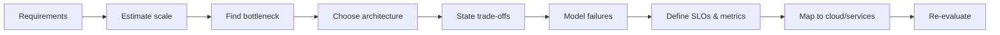

---

# Part I — Thinking Like a Systems Architect

## 1. Requirements before architecture

### Functional requirements

Describe user-visible behavior: upload video, request ride, transfer money, create URL, fetch feed, receive notification.

### Non-functional requirements

The architecture usually changes more from the non-functional requirements than from the endpoint list:

- **Scale:** requests/second, concurrent connections, events/second, storage growth.
- **Latency:** p50/p95/p99/p99.9; end-to-end and per dependency.
- **Availability:** e.g. 99.9% ≈ 43.8 minutes/month unavailable; 99.99% ≈ 4.38 minutes/month.
- **Durability:** probability of permanently losing committed data.
- **Consistency:** linearizable, serializable, snapshot, read-your-writes, monotonic reads, eventual.
- **Freshness:** how stale can a response be?
- **Ordering:** global, per account, per partition, best effort.
- **Security/compliance:** encryption, audit, PCI, GDPR, data residency.
- **Cost:** storage tier, egress, replication factor, compute utilization.

### Back-of-the-envelope estimation

Do not over-optimize arithmetic. Use estimates to discover architecture.

Example: 50M DAU, 10 reads/user/day:

```text
500M reads/day / 86,400 ≈ 5,800 average RPS
Peak factor 5x–10x -> plan around 30k–60k RPS
If response is 20 KB -> ~1.2 GB/s at 60k RPS before compression/CDN
```

The important insight is not 5,787 vs 5,800. It is that bandwidth/CDN/cache strategy may matter more than CPU.

> **Teaching addition — a repeatable estimation contract.** State whether storage units are decimal (`MB = 10^6` bytes) or binary (`MiB = 2^20` bytes), show the formula before rounding, separate average from peak, and apply replication, indexes, backups, compression, and safety headroom as explicit multipliers. Numbers without units are not estimates.

#### Four worked examples

| Workload | Derivation | Result | Design signal |
|---|---|---:|---|
| Read API | `50M users × 10 reads/day ÷ 86,400 × 10 peak` | ≈57,870 peak RPS | Load balancing and cache/origin capacity dominate. |
| API egress | `57,870 RPS × 20 KB/response` | ≈1.16 GB/s, or 9.26 Gb/s | Compression and CDN placement can matter more than app CPU. |
| Photo ingest | `2M uploads/day × 8 MB` | 16 TB/day; 5.84 PB/year raw | Object storage, lifecycle tiers, and upload bandwidth dominate. Three full replicas would be 17.52 PB/year before metadata, erasure coding, or compression. |
| Persistent chat | `10M connections ÷ 30 s heartbeat`; `10M × 48 KB gateway state` | ≈333,333 heartbeats/s; 480 GB fleet memory | Connection count, heartbeat fan-in, file descriptors, and reconnect storms are first-class capacity inputs. |

An availability percentage is also a capacity constraint. Over a 30-day month, a 99.95% SLO has `43,200 × 0.0005 = 21.6` minutes of error budget. Google SRE recommends deriving SLIs and targets from what users care about rather than copying a fashionable number.[40]

#### Step-by-step storage dry run

Assume 2 million 8 MB photos arrive daily, retained for 365 days, with 15% metadata/index overhead and two full copies:

| Step | Formula | Running result |
|---:|---|---:|
| 1. Daily raw bytes | `2,000,000 × 8 MB` | 16 TB/day |
| 2. Annual raw bytes | `16 TB × 365` | 5.84 PB |
| 3. Metadata/index overhead | `5.84 PB × 1.15` | 6.716 PB |
| 4. Two full copies | `6.716 PB × 2` | 13.432 PB |
| 5. 25% operating headroom | `13.432 PB × 1.25` | **16.79 PB provisioned** |

The multiplication order does not change the arithmetic, but writing each factor separately exposes assumptions that can be challenged. If the store uses erasure coding rather than two complete copies, replace the replication multiplier with the measured storage-amplification factor.

#### Capacity invariants and boundary checks

- Dimensions must cancel: `requests/day ÷ seconds/day = requests/second`; never add bytes to requests.
- Peak capacity must be at least peak demand plus deliberate headroom. Averages do not size queues, sockets, or shards.
- Apply fan-out: one API request that performs four storage reads creates four read operations at the data tier.
- Distinguish logical bytes from physical bytes. Replicas, indexes, compaction, backups, and transient migration space all consume capacity.
- For bursty traffic, Little's Law gives `concurrency ≈ throughput × latency`; 60,000 RPS at 200 ms implies about 12,000 in-flight requests before retries.
- Reject impossible inputs—negative counts, zero-sized periods, overflow—and document rounding direction. Capacity is normally rounded **up**.

```java
// file: CapacityEstimator.java
import java.math.BigDecimal;
import java.math.RoundingMode;

public final class CapacityEstimator {
    private static final BigDecimal SECONDS_PER_DAY = new BigDecimal("86400");

    static BigDecimal peakRps(long dailyUsers, long actionsPerUser, BigDecimal peakFactor) {
        if (dailyUsers < 0 || actionsPerUser < 0 || peakFactor.signum() < 0) {
            throw new IllegalArgumentException("inputs must be non-negative");
        }
        return BigDecimal.valueOf(dailyUsers)
                .multiply(BigDecimal.valueOf(actionsPerUser))
                .divide(SECONDS_PER_DAY, 6, RoundingMode.HALF_UP)
                .multiply(peakFactor);
    }

    static BigDecimal decimalPetabytesPerYear(long objectsPerDay, long bytesPerObject) {
        if (objectsPerDay < 0 || bytesPerObject < 0) {
            throw new IllegalArgumentException("inputs must be non-negative");
        }
        return BigDecimal.valueOf(objectsPerDay)
                .multiply(BigDecimal.valueOf(bytesPerObject))
                .multiply(BigDecimal.valueOf(365))
                .divide(new BigDecimal("1000000000000000"), 6, RoundingMode.HALF_UP);
    }

    public static void main(String[] args) {
        BigDecimal rps = peakRps(50_000_000L, 10, new BigDecimal("10"));
        BigDecimal pb = decimalPetabytesPerYear(2_000_000L, 8_000_000L);
        if (rps.setScale(0, RoundingMode.HALF_UP).longValueExact() != 57_870L) throw new AssertionError(rps);
        if (pb.compareTo(new BigDecimal("5.840000")) != 0) throw new AssertionError(pb);
        if (peakRps(0, 0, BigDecimal.ZERO).signum() != 0) throw new AssertionError("zero boundary");
        try {
            peakRps(-1, 1, BigDecimal.ONE);
            throw new AssertionError("negative input accepted");
        } catch (IllegalArgumentException expected) {
            // rejected as required
        }
        System.out.println("peakRps=" + rps + ", rawPBPerYear=" + pb);
    }
}
```

The estimator performs a constant number of arbitrary-precision operations: O(1) with respect to the number of workload records. If input numeric precision is considered part of the input, arithmetic is polynomial in the number of digits. The returned values occupy O(1) application records; formatting a `d`-digit result costs O(d) time and output space.

---

# Part II — Traffic Entry, DNS, CDN, and Load Balancing

## 2. DNS is the first routing layer

DNS translates names to records, but in distributed architecture it also becomes a coarse traffic-management plane.

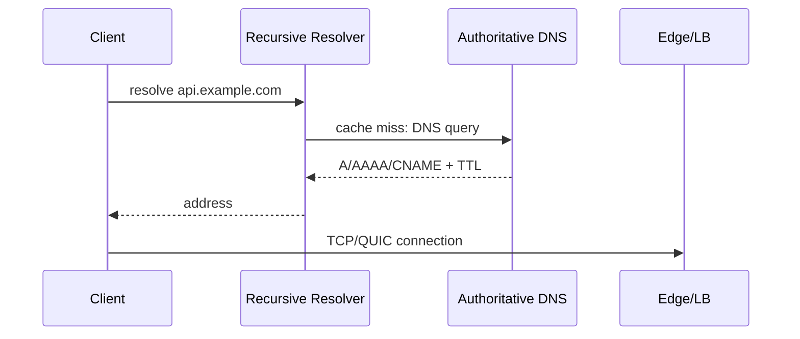

### DNS routing strategies

- **Round-robin DNS:** multiple A/AAAA records; cheap but coarse and client/resolver caching weakens control.
- **Weighted routing:** percentage rollout / active-active traffic distribution.
- **Latency/geolocation routing:** direct users to a region likely to minimize RTT.
- **Failover routing:** health-check based active-passive.
- **Anycast:** the *same IP prefix* is advertised from multiple locations using BGP; the network routes toward a topologically close announcement.

### Why DNS is not your per-request load balancer

DNS TTLs, recursive resolver behavior, and client caching mean you cannot reliably move every request instantly. DNS is excellent for region/site selection; L4/L7 load balancers are better for connection/request-level decisions.

---

## 3. Load Balancers

### Core problem solved

A load balancer decouples the client-visible endpoint from a changing backend fleet. It handles distribution, unhealthy-instance removal, connection termination, traffic shaping, and often TLS/WAF/auth concerns.

### L4 vs L7

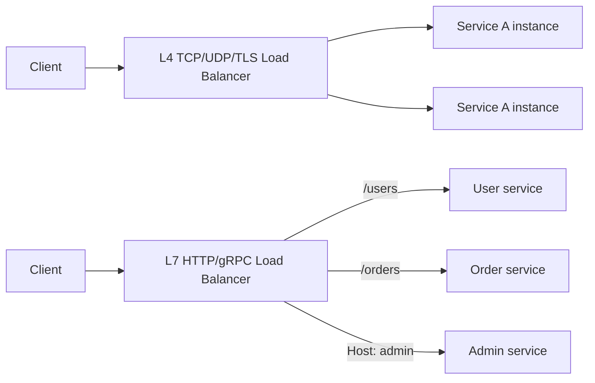

| Dimension | Layer 4 | Layer 7 |
|---|---|---|
| Understands | IP, port, transport flow | HTTP method/path/header/cookie, gRPC metadata |
| Typical protocols | TCP, UDP, TLS pass-through | HTTP/1.1, HTTP/2, HTTPS, gRPC |
| Cost/latency | lower processing overhead | more inspection and proxying |
| Routing | flow hash / tuple | path/host/header/content rules |
| TLS | pass-through or terminate | commonly terminates TLS |
| Use | extreme throughput, non-HTTP traffic | APIs, microservices, canary, auth/WAF |

AWS documents ALB as an OSI Layer-7 balancer; NLB is intended for TCP/UDP/TLS and high performance. Google’s global external Application Load Balancer uses globally distributed Google Front Ends (GFEs) and can route to the closest healthy backend with capacity.[1][2]

### Algorithms

#### Round robin

Best when backend capacity and request cost are roughly homogeneous.

```text
R1 -> S1
R2 -> S2
R3 -> S3
R4 -> S1
```

Failure mode: a 5 ms request and a 5 s report request count equally.

#### Least connections / least outstanding requests

Useful when request duration varies. It approximates load by current inflight work.

Trade-off: connection count is still not CPU utilization. A single expensive ML request can dwarf many light requests.

#### Weighted round robin / weighted random

Assign more traffic to larger instances or gradually shift during migration.

#### Consistent hashing

Map a stable key (user ID, session ID, cache key) to a backend. This minimizes key movement when nodes change.

Use when locality matters: stateful session shards, caches, partition owners.

### Connection-level realities

An L7 proxy may multiplex many HTTP/2 streams over persistent backend connections. A connection-based algorithm can therefore behave differently than request-based load accounting.

### Health checks are a control system

Bad health checks cause cascading failure.

- **Liveness:** process is alive.
- **Readiness:** process can safely accept traffic.
- **Dependency-aware readiness:** dangerous if every instance removes itself because one shared DB is slow—this can turn a DB brownout into zero serving capacity.
- **Slow start:** gradually ramp new instances to avoid cold-cache/JIT spikes. AWS ALB exposes slow-start for target groups.[1]

### Cross-zone / cross-region trade-offs

- Cross-zone improves fleet utilization but may increase data-transfer cost and blast radius.
- Cross-region improves resilience but introduces WAN latency and data-consistency complexity.

### Failure scenarios interviewers look for

1. **LB is healthy, backends are overloaded:** use admission control, autoscaling, circuit breakers, load shedding.
2. **One AZ fails:** multi-AZ target groups; ensure capacity in remaining zones.
3. **Regional outage:** global traffic manager / anycast / DNS failover.
4. **Slow backend, not dead:** passive latency/error signals can matter more than binary health checks.
5. **Connection draining:** stop new requests while completing inflight work during deployments.

### Cloud mapping

| Need | AWS | Azure | Google Cloud |
|---|---|---|---|
| L7 HTTP routing | Application Load Balancer | Application Gateway / Front Door | Application Load Balancer |
| L4 transport | Network Load Balancer | Azure Load Balancer | Network Load Balancer |
| Global edge routing | Global Accelerator / Route 53 + CloudFront | Front Door / Traffic Manager | Global anycast load balancing |
| DNS | Route 53 | Azure DNS | Cloud DNS |
| CDN | CloudFront | Front Door/CDN | Cloud CDN / Media CDN |

### Industry examples

- **Google Cloud** uses global anycast load balancing and GFEs to terminate user traffic near the edge.[2]
- **Cloudflare** advertises service IPs using Anycast from many locations so routing naturally lands users near an edge location.[3]
- **Uber** historically described HAProxy, NGINX, Hyperbahn, and application-level consistent hashing via Ringpop for service routing.[4]

### Metrics

- requests/s, connections/s
- active/inflight connections
- p50/p95/p99 target response time
- 4xx/5xx rates
- unhealthy target count
- connection reset / TLS handshake error rate
- cross-zone bytes and backend saturation

---

# Part III — Caching

## 4. Caching as latency and load control

Caching is not “make it fast.” It is deliberately allowing a cheaper/faster copy to answer instead of the source of truth.

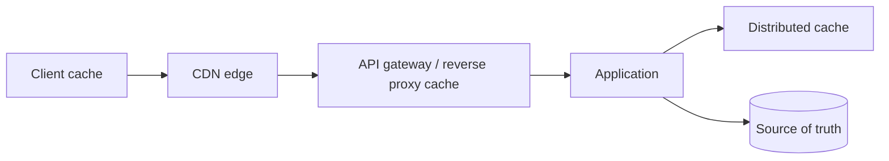

### Cache hierarchy

1. **Client/browser:** HTTP Cache-Control, ETag, local storage where appropriate.
2. **CDN/edge:** static objects, media segments, sometimes cacheable API responses.
3. **Reverse proxy/API gateway:** shared response cache.
4. **Application-local:** fastest but per-instance and harder to keep coherent.
5. **Distributed cache:** Redis/Memcached/Valkey, shared by service fleet.
6. **Database buffer/page cache:** below application layer.

### Cache-aside (lazy loading)

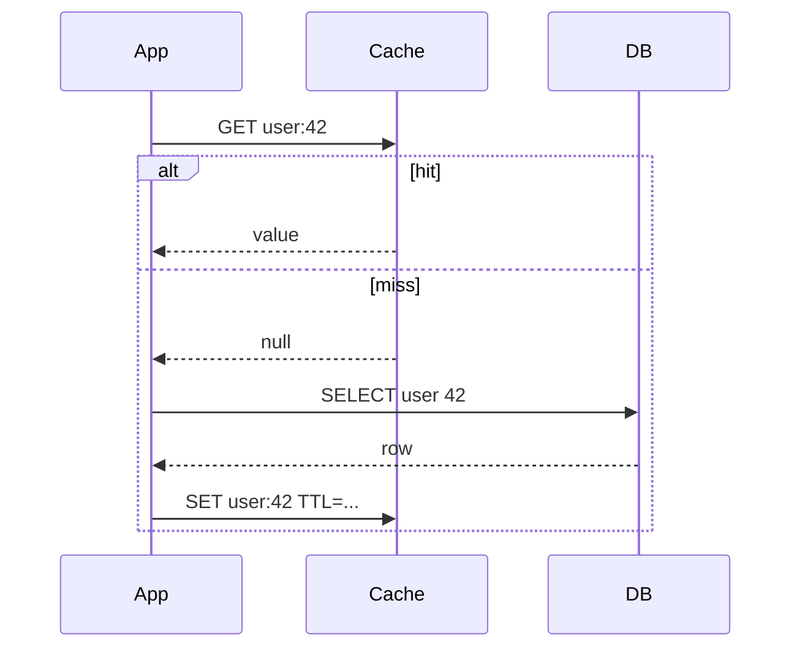

**Pros:** simple, caches only demanded data, cache failure can degrade to DB.

**Cons:** miss penalty; stale data; cold-start load. AWS explicitly documents lazy loading as a common pattern and notes the miss penalty and stale-data risk.[5]

> **Teaching addition — cache correctness before cache speed.** Cache-aside has two different obligations: coalesce duplicate work on a miss, and prevent an older read from overwriting knowledge of a newer committed write. A distributed mutex addresses the first problem only; a version/fencing rule addresses the second.

#### Four concrete examples

| Data | Read/write policy | Acceptable outcome | Unacceptable outcome |
|---|---|---|---|
| Product description | Cache-aside, 10-minute TTL, invalidate after commit | A brief old description | A cache outage taking the catalog DB down through unbounded fallback traffic |
| Bank balance | Authoritative ledger/DB; cache only a labelled projection | A projection explicitly marked delayed | Treating a Redis value as the committed balance |
| Feature flag | Versioned value, push invalidation, short TTL fallback | Bounded propagation delay | An older refresh replacing a newer rollout version |
| Expensive report | Single-flight regeneration, stale-while-revalidate | One builder plus stale readers | 5,000 simultaneous builders after one expiry |

#### Cache-aside invariants

1. The durable store owns the committed version; the cache is disposable unless the design explicitly makes it durable truth.
2. At most one local loader per key performs the expensive miss path at a time. Cross-process coalescing requires a lease or broker; a JVM map alone is not global coordination.
3. A value with version `v_old` must never replace a cached or invalidation-watermark version `v_new > v_old`.
4. Failure to fill the cache must not turn a successful durable read into a failed user request unless the stated correctness model requires it.
5. Every fallback path is bounded by timeout, concurrency, and origin capacity. “Just query the DB” is not a degradation plan.

#### Stale-resurrection dry run with a version watermark

| Time | Reader | Writer | Cache / watermark | Result |
|---:|---|---|---|---|
| T1 | Misses and starts DB read of v1 | — | empty / floor 1 | Reader holds v1. |
| T2 | — | Commits v2 to DB | empty / floor 1 | Durable truth is v2. |
| T3 | — | Raises floor to 2, invalidates key | empty / floor 2 | Any loader below v2 is fenced out. |
| T4 | Tries to publish v1 | — | empty / floor 2 | Publish is rejected; v1 cannot resurrect. |
| T5 | Retries DB and reads v2 | — | v2 / floor 2 | Subsequent readers may use v2. |

The order matters: commit durable state, then advance the version watermark, then invalidate/update the cache. Systems with lagging read replicas must retry against an authority or delay until the replica reaches the required version.

```java
// file: VersionedCacheAside.java
import java.util.Map;
import java.util.concurrent.CompletableFuture;
import java.util.concurrent.ConcurrentHashMap;
import java.util.concurrent.atomic.AtomicInteger;
import java.util.random.RandomGenerator;

public final class VersionedCacheAside {
    record Value(long version, String payload) {}

    private final Map<String, Value> database = new ConcurrentHashMap<>();
    private final Map<String, Value> cache = new ConcurrentHashMap<>();
    private final Map<String, Long> versionFloor = new ConcurrentHashMap<>();
    private final Map<String, CompletableFuture<Value>> inFlight = new ConcurrentHashMap<>();
    private final AtomicInteger databaseReads = new AtomicInteger();

    Value get(String key) {
        Value hit = cache.get(key);
        if (hit != null && hit.version() >= versionFloor.getOrDefault(key, 0L)) return hit;

        CompletableFuture<Value> future = inFlight.computeIfAbsent(key, ignored -> {
            CompletableFuture<Value> created = new CompletableFuture<>();
            try {
                created.complete(loadAndPublish(key));
            } catch (Throwable error) {
                created.completeExceptionally(error);
            }
            return created;
        });
        try {
            return future.join();
        } finally {
            inFlight.remove(key, future);
        }
    }

    private Value loadAndPublish(String key) {
        databaseReads.incrementAndGet();
        Value loaded = database.get(key);
        if (loaded == null) throw new IllegalArgumentException("missing key: " + key);
        return publishLoaded(key, loaded);
    }

    Value publishLoaded(String key, Value loaded) {
        long floor = versionFloor.getOrDefault(key, 0L);
        if (loaded.version() < floor) {
            throw new IllegalStateException("stale read " + loaded.version() + " < " + floor);
        }
        return cache.compute(key, (ignored, current) ->
                current == null || loaded.version() > current.version() ? loaded : current);
    }

    void commit(String key, Value value) {
        database.compute(key, (ignored, current) -> {
            if (current != null && value.version() <= current.version()) {
                throw new IllegalArgumentException("version must increase");
            }
            return value;                 // durable commit boundary in a real repository
        });
        versionFloor.merge(key, value.version(), Math::max); // fence older loaders
        cache.remove(key);                                  // invalidate after commit
    }

    public static void main(String[] args) {
        VersionedCacheAside c = new VersionedCacheAside();
        c.commit("flag", new Value(1, "off"));
        if (!c.get("flag").payload().equals("off")) throw new AssertionError();
        if (!c.get("flag").payload().equals("off")) throw new AssertionError();
        if (c.databaseReads.get() != 1) throw new AssertionError("second read should hit cache");

        Value staleSnapshot = new Value(1, "off");
        c.commit("flag", new Value(2, "on"));
        try {
            c.publishLoaded("flag", staleSnapshot);
            throw new AssertionError("stale value resurrected");
        } catch (IllegalStateException expected) {
            // version floor correctly fences the old read
        }
        if (!c.get("flag").equals(new Value(2, "on"))) throw new AssertionError();

        RandomGenerator random = RandomGenerator.of("L64X128MixRandom");
        for (long version = 3; version <= 10_002; version++) {
            Value previous = c.get("flag");
            Value next = new Value(version, "value-" + random.nextInt(1_000_000));
            c.commit("flag", next);
            if (random.nextBoolean()) {
                try {
                    c.publishLoaded("flag", previous);
                    throw new AssertionError("random stale value resurrected at " + version);
                } catch (IllegalStateException expected) {
                    // older snapshot remains fenced
                }
            }
            if (!c.get("flag").equals(next)) throw new AssertionError("lost version " + version);
        }
        System.out.println("cache-aside checks passed; dbReads=" + c.databaseReads.get());
    }
}
```

For one JVM, expected `get`/`commit` map work is O(1) average and O(k) key storage for `k` cached keys. A miss adds one origin read with latency `L`; `n` concurrent local misses for one key still perform one origin read and retain O(n) waiting continuations. Serializing or returning a payload of `b` bytes costs O(b) time and output space even when the key lookup is O(1). The sample intentionally does not claim distributed single-flight, eviction, or durable watermark storage.

Common errors: invalidating before the database commit; using wall-clock timestamps as versions without a monotonicity guarantee; holding a distributed lock without a fencing token; caching authorization-dependent responses under a shared key; omitting TTL jitter; and allowing unlimited fallback concurrency. RFC 9111 also requires shared caches to respect authorization and `Vary` semantics and defines freshness, validation, and stale-response rules precisely.[41]

### Write-through

Write source-of-truth and cache in the write path.

**Pros:** reads likely hot/fresh.

**Cons:** extra write latency; cache pollution; dual-write failure complexity. “Write DB then cache” can still race unless you define ordering/invalidation semantics.

### Write-behind / write-back

Write cache first and asynchronously persist.

**Use:** counters, telemetry, coalesced updates where temporary cache loss is acceptable or cache persistence is strong.

**Risk:** the cache becomes part of the durability path. You have shifted the correctness burden, not eliminated it.

### Invalidation patterns

> “There are only two hard things…” is funny; in production, invalidation is a consistency protocol.

Common options:

- TTL-only
- delete cache after committed DB write
- update cache after write
- CDC/event-driven invalidation
- versioned keys (`profile:v17:user:42`)

#### Race: stale resurrection

```text
T1: reader misses cache
T2: writer updates DB to v2, invalidates cache
T3: reader returns old DB v1 it fetched earlier
T4: reader puts v1 back in cache  <-- stale resurrection
```

Mitigations: version checks, shorter TTL, write-through serialization, CDC, compare-and-set, request coalescing.

### Eviction

- **LRU:** evict least recently used. Good when recency predicts reuse.
- **LFU:** evict least frequently used. Better for durable popularity but can retain formerly-hot keys.
- **ARC:** balances recency and frequency adaptively; more metadata/complexity.
- **TTL-based expiration:** freshness policy, not necessarily memory-pressure policy.

### Thundering herd / cache stampede

A hot key expires and thousands of requests hit the DB simultaneously.

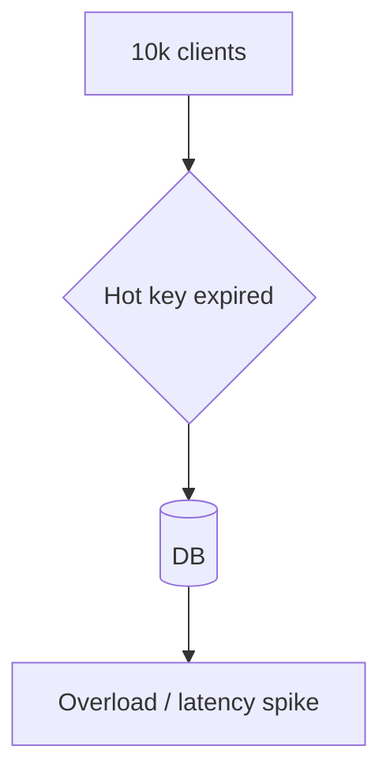

Mitigations:

- single-flight/request coalescing
- distributed lock around regeneration
- stale-while-revalidate
- TTL jitter
- probabilistic early refresh
- never expire truly hot reference data; update asynchronously
- multi-tier cache / origin shield

Google Media CDN documents multi-tier caches and origin shielding; Cloud CDN fills caches reactively at edge locations.[6][7]

### Hot keys and skew

A cache cluster can have plenty of aggregate memory/CPU while one shard is saturated. Replicate hot keys, shard the value, use local L1 caches, or redesign the key.

### Cache consistency choices

| Data | Typical policy |
|---|---|
| Product catalog | eventual + TTL |
| User session | authoritative cache with persistence / replication |
| Bank balance | usually do not treat an ordinary cache as source of truth |
| Feature flags | short TTL + push invalidation/versioning |
| Feed ranking | eventual acceptable, aggressive caching |

### Company example: Meta TAO

Meta described TAO as a geographically distributed graph data layer with separate persistent MySQL storage and RAM/flash caching tiers. Requests hit caching clusters; writes propagate through followers/leaders to persistent storage, with shards movable to smooth hotspots.[8]

### Cloud mapping

| Capability | AWS | Azure | GCP |
|---|---|---|---|
| Redis/Valkey managed | ElastiCache | Azure Managed Redis | Memorystore for Redis |
| Memcached | ElastiCache | (third-party/self managed common) | Memorystore for Memcached |
| CDN | CloudFront | Front Door/CDN | Cloud CDN / Media CDN |
| API response cache | API Gateway / CloudFront patterns | API Management / Front Door | API Gateway + CDN patterns |

### Metrics

- hit ratio **and byte hit ratio**
- miss latency
- origin requests/s
- evictions/s
- memory fragmentation
- hot-key CPU/network skew
- stale read rate (business metric)
- regeneration concurrency

---

# Part IV — Databases and Storage Engines

## 5. Choose data stores from access patterns and correctness

“SQL vs NoSQL” is too shallow. Start with:

- access patterns
- transaction boundaries
- cardinality and data size
- write/read ratio
- required secondary indexes
- consistency and isolation
- geographic distribution
- operational model

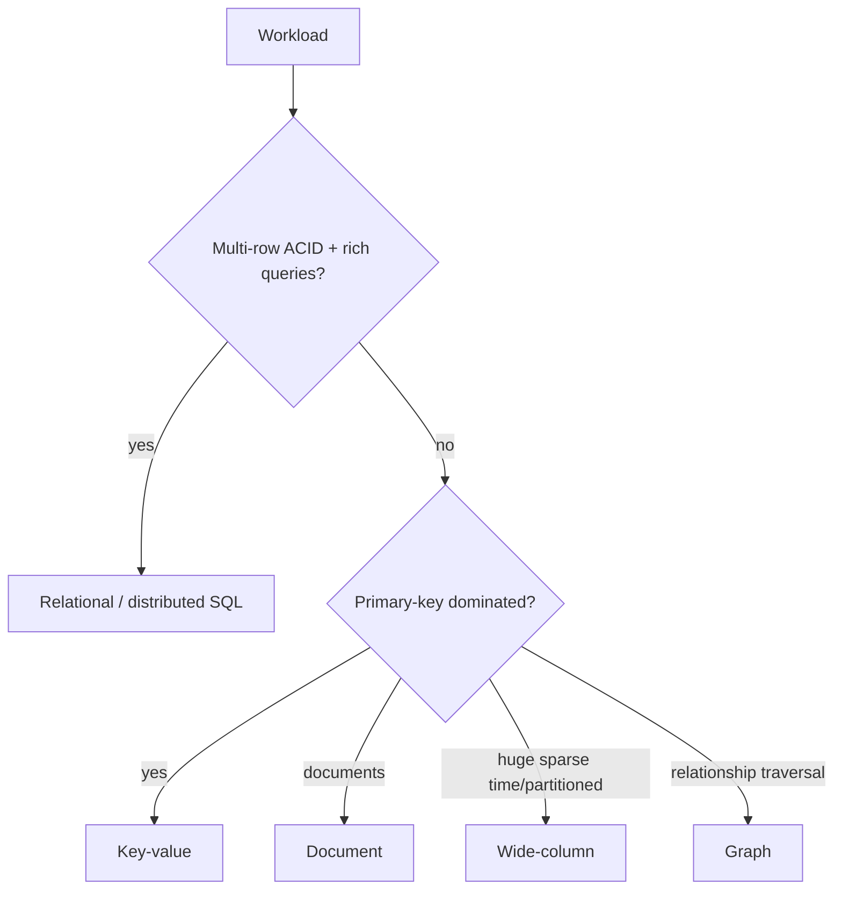

## 6. Relational systems

Strengths:

- schema constraints
- multi-row transactions
- mature query optimization
- joins and secondary indexes
- isolation levels

Weakness is not “cannot scale.” Modern distributed SQL systems scale significantly; the trade-off is distributed coordination, write latency, operational complexity, and cost.

### ACID vs isolation

ACID does not mean every transaction is serializable. Isolation levels matter:

- Read committed
- Repeatable read / snapshot isolation
- Serializable

An interview answer should mention anomalies: dirty read, non-repeatable read, phantom, write skew, lost update.

## 7. NoSQL families

### Key-value

Examples: DynamoDB, Redis, FoundationDB-like KV layers.

Good for deterministic primary-key lookup and massive horizontal scale.

### Document

Examples: MongoDB, Firestore/Cosmos document APIs.

Natural aggregate/document model, flexible schema, secondary indexes.

### Wide-column

Examples: Cassandra, Bigtable.

Designed around partition key + clustering/range access. Excellent for massive sparse datasets and high write throughput when queries are known ahead of time.

### Graph

Examples: Neo4j, Amazon Neptune, Cosmos Gremlin.

Optimized for relationship traversal where repeated joins in a relational model become expensive/awkward.

---

## 8. Partitioning / sharding

Sharding increases parallel capacity but makes formerly-local operations distributed.

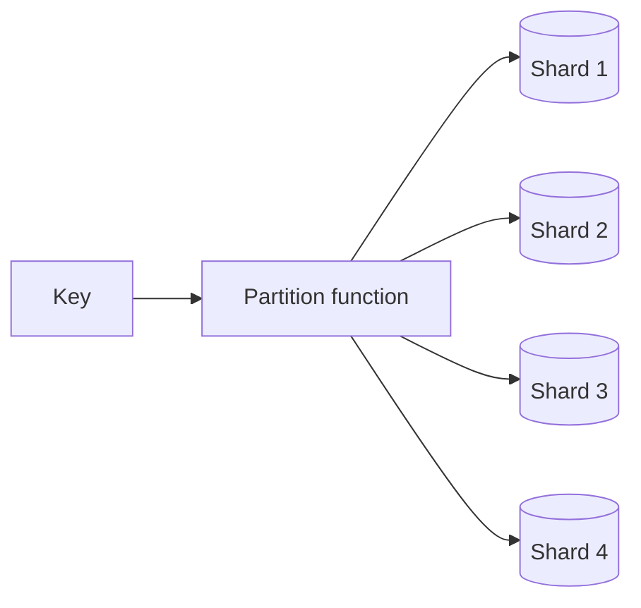

### Hash partitioning

`shard = hash(key) mod N`

**Good:** uniform distribution.

**Bad:** changing N remaps most keys; range scans are scatter-gather.

### Range partitioning

Rows grouped by contiguous key ranges.

**Good:** range scans, time-order locality.

**Bad:** monotonically increasing keys can create a hot tail.

### Directory-based partitioning

A metadata service maps key/range to shard.

**Good:** arbitrary movement.

**Bad:** metadata becomes critical control plane; cache/replicate it carefully.

### Consistent hashing + virtual nodes

Keys and nodes are placed on a logical ring. Adding/removing a node shifts only nearby ranges. Virtual nodes give each physical node multiple token ranges, smoothing capacity and simplifying incremental expansion. Cassandra documents vnodes as a trade-off: easier/flexible expansion versus more streaming peers and potential availability impact.[9]

### Hot partition example

DynamoDB warns that poor partition-key design produces hot partitions. A physical partition has finite per-partition throughput; adaptive capacity can help but cannot make a single-key bottleneck disappear without limit.[10]

### Resharding

Production systems need a rebalancing story:

1. create destination shard
2. snapshot/copy historical data
3. dual-write or stream change log
4. verify catch-up
5. move routing ownership
6. drain old shard

This is why “we’ll shard later” can be expensive if keys and APIs did not preserve partitionability.

---

## 9. Replication

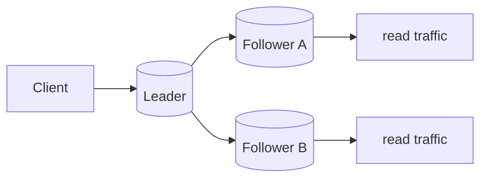

### Synchronous replication

A write is acknowledged only after required replicas confirm.

- stronger durability/consistency
- increased write latency
- availability can decrease during partition depending on quorum rules

### Asynchronous replication

Leader acknowledges earlier, followers catch up.

- lower write latency, better local availability
- replica lag and possible data loss on failover if acknowledged writes were not replicated

### Leader-follower

Simple ordering point; reads may scale via followers.

Challenges: failover, split brain, stale replica reads, leader hotspot.

### Multi-leader

Useful for multi-region writes / disconnected operation, but conflict detection and resolution become first-class.

### Leaderless / quorum style

Clients/coordinators write to multiple replicas. With replication factor `N`, write quorum `W`, read quorum `R`, `R + W > N` is a common condition used to increase the chance of overlapping versions, but real correctness still depends on versioning, failure behavior, sloppy quorums, repair, and conflict resolution.

### Spanner as a concrete strong-replication example

Google documents Spanner as synchronously replicated using Paxos; replica sets vote on writes. TrueTime provides bounded-time uncertainty used to support externally consistent transactions.[11][12]

### Cosmos DB as explicit consistency spectrum

Azure Cosmos DB exposes Strong, Bounded Staleness, Session, Consistent Prefix, and Eventual consistency. Microsoft explicitly documents that strong multi-region consistency raises write latency and can reduce read throughput relative to weaker levels.[13]

---

## 10. Indexing: B-tree vs LSM-tree

### B-tree family

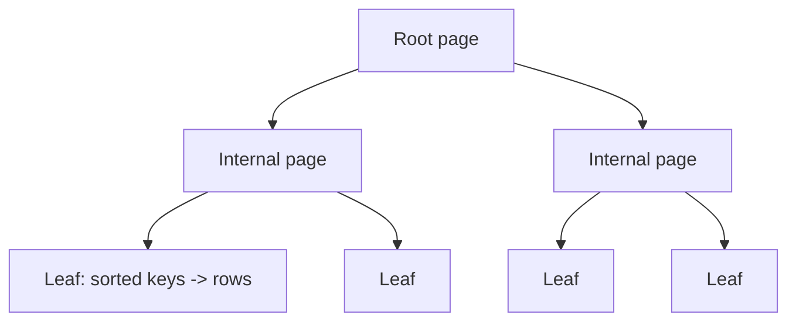

B-trees maintain sorted pages and are excellent for point lookup and range scans. PostgreSQL’s B-tree is a multi-level balanced structure; leaf tuples reference table rows.[14]

Trade-offs:

- random page updates/splits
- write amplification from multiple indexes
- excellent ordered traversal and mature relational integration

### LSM-tree family

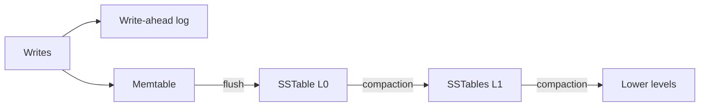

LSM designs buffer writes in memory and append/flush sorted immutable files, then compact.

Strengths:

- high write throughput, sequential I/O
- efficient compression

Costs:

- read amplification across levels/files
- write amplification during compaction
- space amplification
- compaction can create tail-latency spikes

Mitigations: bloom filters, block caches, leveled/tiered compaction, partitioned indexes.

### Interview rule

If you choose Cassandra/Bigtable-like storage because “writes are fast,” mention **why** (append/LSM behavior) and **what you pay** (compaction/read amplification).

---

# Part V — Consistency, CAP, PACELC, and Time

## 11. CAP is a partition decision, not a database personality test

During a network partition, a distributed system cannot simultaneously guarantee both:

- **Consistency** in the CAP sense (linearizable single-copy behavior)
- **Availability** for every request

Partition tolerance is not usually optional in a distributed deployment; networks fail.

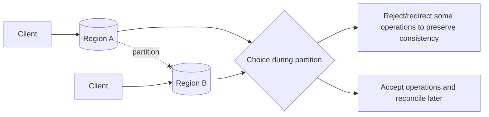

### PACELC

CAP talks about partition time. PACELC asks:

- **P**artition -> choose **A**vailability or **C**onsistency
- **E**lse (normal operation) -> choose **L**atency or **C**onsistency

This is more useful for real architecture because most of your system’s life is *not* during a partition.

### Common consistency guarantees

- linearizability
- serializability (transaction ordering; related but different concept)
- snapshot isolation
- read-your-writes
- monotonic reads
- causal consistency
- eventual consistency

### Product-specific consistency beats product labels

Do not say “NoSQL is AP.” DynamoDB, Cosmos DB, Cassandra, Spanner, etc. expose different operations/configurations and guarantees. State the operation and chosen consistency level.

---

# Part VI — Communication Protocols

## 12. HTTP/REST

REST is an architectural style usually implemented over HTTP, not a wire protocol by itself.

### Useful semantics

- `GET` safe/idempotent by semantics
- `PUT` intended to be idempotent
- `POST` generally not idempotent unless application adds an idempotency key
- conditional requests: ETag / If-Match
- status codes can convey retryability

### Connection evolution

- HTTP/1.1: persistent connections but head-of-line constraints per connection
- HTTP/2: multiplexed streams over one TCP connection, header compression, binary framing
- HTTP/3: HTTP semantics over QUIC/UDP; avoids TCP-level cross-stream head-of-line blocking

## 13. gRPC

gRPC commonly uses Protocol Buffers and HTTP/2, supporting unary and streaming patterns.

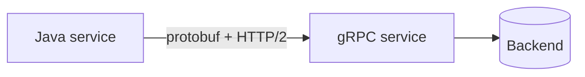

Good for internal service-to-service contracts where strong schemas, code generation, low serialization overhead, and streaming help.

Trade-offs: browser/public API ergonomics, debugging, proxies, schema evolution discipline.

## 14. WebSockets

Long-lived full-duplex channel.

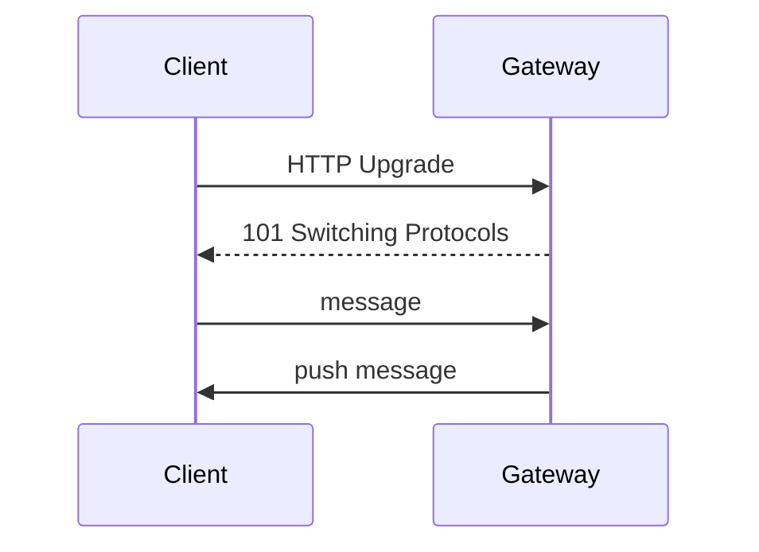

Use: chat, multiplayer, collaborative editing, realtime dashboards.

Operational costs:

- millions of persistent connections consume file descriptors/memory
- reconnect storms
- connection ownership/routing
- backpressure
- fan-out and presence state

## 15. Server-Sent Events (SSE)

Server -> client event stream over HTTP. Simpler than WebSockets when the client mostly receives updates.

Use: progress streams, notifications, AI token streaming.

## 16. Long polling

Client asks; server holds request until event/timeout; client reconnects.

Use when WebSocket/SSE infrastructure is unavailable or compatibility simplicity is more important than connection efficiency.

### Protocol choice table

| Need | Default candidate |
|---|---|
| CRUD public API | HTTP/REST |
| typed internal RPC | gRPC |
| bidirectional realtime | WebSocket |
| server-to-browser stream | SSE |
| legacy/simple push | long polling |
| large media delivery | HTTP range requests/CDN/HTTP2-3 |

---

# Part VII — Message Queues and Event Streaming

## 17. Why asynchronous architecture exists

Queues/streams decouple producer latency and availability from downstream work.

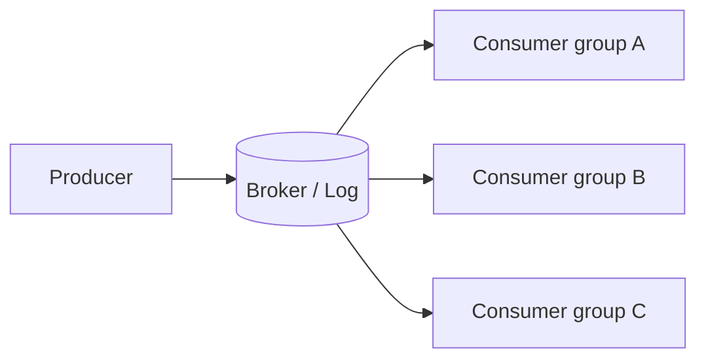

### Queue vs log

#### RabbitMQ-style queue/broker

Focuses on routing and delivery of work. Messages are often removed/acknowledged once processed.

#### Kafka-style distributed log

Records are retained for a configured period. Consumers track offsets; multiple consumer groups can replay independently.

| Dimension | Queue broker | Event log |
|---|---|---|
| Primary mental model | deliver work | durable ordered history |
| Replay | not usually primary | core capability |
| Routing | rich exchanges/queues | topic/partition |
| Consumer state | broker tracks delivery/acks | consumer group offsets |
| Common use | task queues, workflow | event sourcing, CDC, stream processing |

### Kafka partition ordering

Ordering is normally **within a partition**, not globally across a topic. Pick partition keys based on the ordering invariant (e.g. `account_id`).

### Delivery semantics

#### At-most-once

May lose messages; avoids duplicates.

#### At-least-once

Retry until acknowledged; duplicates are possible. Design consumers to be idempotent.

#### Exactly-once

The phrase is dangerous. Exactly-once *processing effect* requires coordination between consumed position and output side effect.

Kafka supports idempotent producers and transactions for Kafka-to-Kafka workflows, but external sinks still require idempotent writes, transactional outbox/inbox, deduplication, or coordinated commits.[15]

RabbitMQ documentation emphasizes publisher confirms + consumer acknowledgements for data safety; quorum queues replicate to a quorum and therefore trade latency for safety.[16]

### Transactional outbox

Avoid this dual-write bug:

```text
1. DB commit succeeds
2. publish event fails
=> state changed but event missing
```

Pattern:

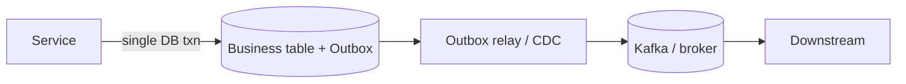

Store business change and event record in one DB transaction, then publish asynchronously. Consumers still need idempotency.

### Backpressure

When downstream is slower than upstream:

- queue depth grows
- consumer lag grows
- storage fills
- end-to-end freshness violates SLO

Controls: producer rate limits, bounded queues, autoscaling consumers, priority queues, load shedding, dead-letter handling.

### Cloud mapping

| Pattern | AWS | Azure | GCP |
|---|---|---|---|
| Task queue | SQS | Service Bus Queue | Pub/Sub subscription / Cloud Tasks |
| Pub/Sub | SNS + SQS | Service Bus Topics / Event Grid | Pub/Sub |
| High-volume event stream | MSK / Kinesis | Event Hubs | Managed Kafka / Pub/Sub |
| Workflow | Step Functions | Durable Functions / Logic Apps | Workflows |

Google Pub/Sub describes itself as a horizontally scalable global messaging system, while Google now also offers managed Apache Kafka for workloads needing Kafka compatibility/portability.[17][18]

---

# Part VIII — Consistent Hashing and Distributed Coordination

## 18. Consistent hashing

### Problem

With modulo hashing, changing the node count remaps almost everything.

### Ring model

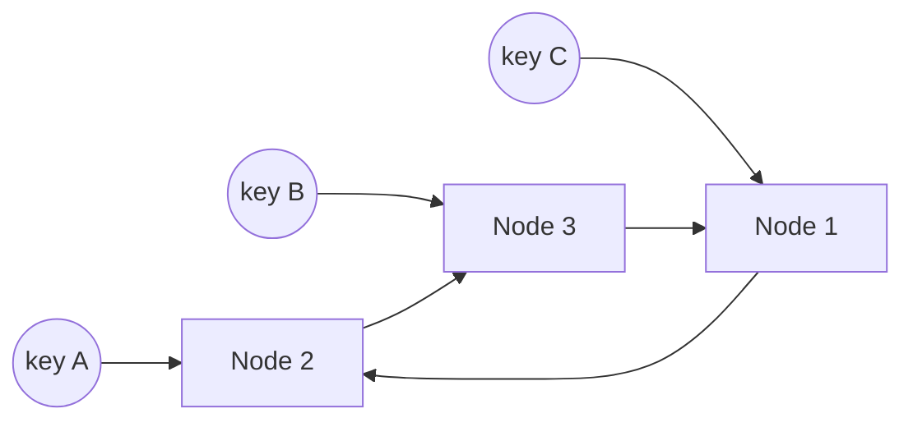

The ring is conceptual: hash both keys and node tokens into the same hash space, then assign a key to the next token clockwise (or implementation equivalent).

### Virtual nodes

Each physical server owns multiple tokens.

Benefits:

- smoother key distribution
- capacity weighting
- smaller rebalancing chunks

Costs:

- more metadata
- more peers/ranges during repair/rebalancing

### When not to use it

If you already have a managed database with its own partition map, application-level consistent hashing can fight the storage system. Use it when you actually own shard/cache/connection routing.

---

## 19. Consensus: why “just elect a leader” is hard

Consensus lets nodes agree on a value/order despite failures.

### Raft mental model

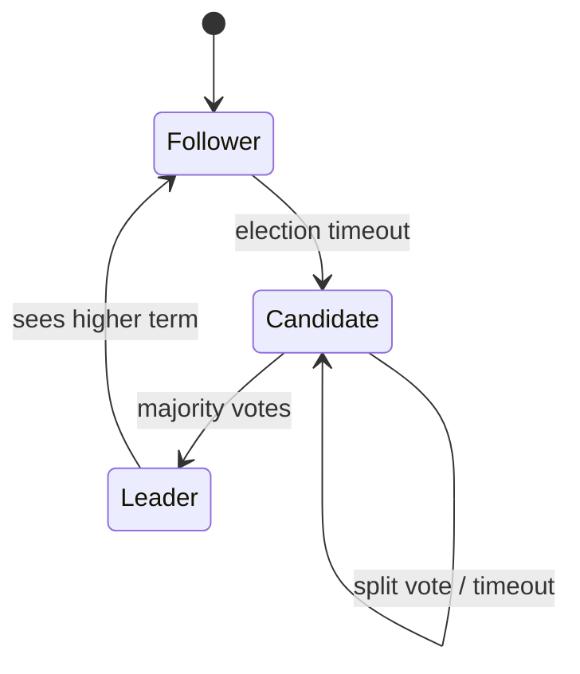

Raft decomposes the problem into leader election, log replication, and safety. A majority quorum means a 5-node group can continue with 3 live nodes; lose majority and safe progress stops.[19]

### Log replication

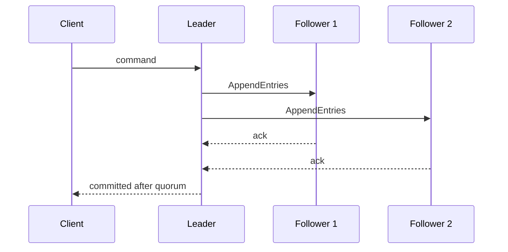

### Paxos vs Raft

Both solve consensus classes of problems. Raft was deliberately structured to be more understandable operationally. Systems may use Paxos/Multi-Paxos variants (Spanner historically documented Paxos) or Raft (etcd, Cockroach-style replication layers, RabbitMQ quorum queues).

### Consensus is expensive by physics

A strongly replicated write requires network round trips to a quorum. Across continents, the speed of light becomes architecture.

---

## 20. Distributed locking

A distributed lock is not a Java `synchronized` block over the network.

### Required properties

- mutual exclusion / safety
- liveness / release after owner failure
- ownership identity
- bounded leases or sessions
- fencing against stale owners

### Lease + fencing token

```mermaid
sequenceDiagram
    participant A as Worker A
    participant C as Coordinator
    participant R as Protected Resource
    A->>C: acquire lock
    C-->>A: lease + fencing token 41
    A->>R: write(token=41)
    Note over A: GC pause / partition; lease expires
    participant B as Worker B
    B->>C: acquire lock
    C-->>B: lease + token 42
    B->>R: write(token=42)
    A->>R: stale write token 41
    R-->>A: reject: token < 42
```

The fencing token is crucial: a paused old owner may wake after its lease expired. The protected resource must reject older tokens.

### Coordination systems

- **etcd:** consensus-backed KV, leases, locks; commonly Kubernetes control plane.
- **ZooKeeper:** ephemeral sequential nodes for locks/election recipes.
- **Google Chubby:** influential coarse-grained lock/metadata service designed for availability and reliability rather than high throughput.[20]
- **Redis locks:** useful in some workloads; understand lease assumptions and Redlock debate. Redis documents the algorithm and its clock-drift assumptions.[21]

### Interview rule

If correctness is financial/inventory critical, prefer database constraints/transactions or a consensus-backed coordinator over a casual cache lock.

---

# Part IX — Reliability Patterns

## 21. Timeouts, retries, backoff, and jitter

Every remote call needs a timeout. Unlimited waiting is an unbounded resource leak.

### Retry only transient failures

Retries amplify traffic. During overload, naive retries can become the attack.

Use:

```text
exponential backoff + random jitter + retry budget
```

Example:

```text
100 ms, 200 ms, 400 ms, 800 ms ... capped, each randomized
```

### Idempotency

A client timing out cannot know whether the server committed. Idempotency keys convert “retry maybe duplicates work” into “retry same logical operation.” Stripe documents this explicitly for safely retrying API operations.[22]

## 22. Circuit breaker

```mermaid
stateDiagram-v2
    Closed --> Open: error/latency threshold
    Open --> HalfOpen: cool-down expires
    HalfOpen --> Closed: probes succeed
    HalfOpen --> Open: probe fails
```

Purpose: stop spending resources on a dependency known to be unhealthy.

## 23. Bulkheads

Separate thread pools, queues, connection pools, or service instances so one workload cannot consume all capacity.

Example: separate “generate PDF” workers from latency-sensitive checkout workers.

## 24. Load shedding

When capacity is exhausted, rejecting low-priority work quickly can preserve high-priority SLOs.

Staff-level answers discuss **degraded modes**, not only scaling:

- serve stale cache
- disable recommendations
- lower media quality
- queue noncritical writes
- reject expensive optional queries

---

# Part X — Observability and Capacity

## 25. The four signals

At minimum:

- latency
- traffic
- errors
- saturation

For queue systems add lag/depth; for DB add replication lag, lock waits, slow queries, cache hit ratio; for JVM add GC pause, heap, thread pools, connection pools.

### Tail latency

Average latency hides pain. In fan-out systems, tail latency compounds.

If a request fans out to 100 dependencies and each dependency has a 1% chance of being “slow” for a given call, the chance at least one is slow is approximately:

```text
1 - 0.99^100 ≈ 63%
```

This is why p99 matters in distributed aggregation systems.

### SLI / SLO / error budget

- **SLI:** measured indicator, e.g. successful requests under 300 ms.
- **SLO:** target, e.g. 99.95% monthly.
- **Error budget:** allowed unreliability, used to balance feature velocity vs reliability work.

---

# Part XI — Security as architecture

## 26. Core controls

- TLS in transit; mTLS for high-trust service identity where appropriate
- encryption at rest with KMS-managed keys
- least-privilege IAM
- secret rotation
- network segmentation / private endpoints
- WAF and DDoS protection at edge
- audit logs
- PII classification and retention
- tokenization for payment data

Security affects data placement, cacheability, logging, and incident blast radius. It is not an appendix.

---

# Part XII — Cloud Provider Decision Matrix

## 27. Common primitives

| Architectural primitive | AWS | Azure | Google Cloud | What to evaluate |
|---|---|---|---|---|
| Global DNS | Route 53 | Azure DNS / Traffic Manager | Cloud DNS | failover, latency routing, TTL |
| CDN | CloudFront | Front Door/CDN | Cloud CDN / Media CDN | PoPs, origin shield, egress |
| L7 LB | ALB | Application Gateway / Front Door | Application Load Balancer | HTTP2/3, gRPC, WAF, globality |
| L4 LB | NLB | Load Balancer | Network Load Balancer | static IP, UDP, throughput |
| Cache | ElastiCache | Azure Managed Redis | Memorystore | replication, cluster mode, failover |
| SQL | RDS/Aurora | Azure SQL/Postgres | Cloud SQL/AlloyDB | failover, read replicas, engine |
| Distributed SQL | Aurora DSQL / options by workload | Cosmos/SQL options differ semantically | Spanner | transactions, consistency, global writes |
| KV/NoSQL | DynamoDB | Cosmos DB | Bigtable/Firestore | partition model, consistency, indexes |
| Queue | SQS | Service Bus | Pub/Sub / Tasks | ordering, DLQ, semantics |
| Event stream | MSK/Kinesis | Event Hubs | Managed Kafka/Pub/Sub | replay, ordering, ecosystem |
| Object store | S3 | Blob Storage | Cloud Storage | durability, lifecycle, consistency |
| Coordination | managed via EKS etcd/internal services; DynamoDB locks common patterns | managed control planes / Cosmos patterns | managed control planes; Spanner/Firestore patterns | lease/fencing/consensus guarantees |

**Important:** products with similar marketing categories do not have identical guarantees. Compare consistency, failure domain, ordering, transactions, quota, and cost—not logos.

---

# Part XIII — How Components Combine

## 28. Typical read-heavy service

```mermaid
flowchart LR
    U[Users] --> DNS[DNS/Anycast]
    DNS --> CDN[CDN]
    CDN --> LB[L7 LB]
    LB --> API[Stateless APIs]
    API --> R[(Redis)]
    API --> DB[(Primary DB)]
    DB --> RR[(Read replicas)]
    API --> Q[(Queue/Stream)]
    Q --> W[Async workers]
```

Architectural reasoning:

- CDN removes global static/segment traffic from origin.
- L7 LB spreads stateless requests and terminates TLS.
- Redis protects DB from repeated hot reads.
- DB remains source of truth.
- async queue moves slow work out of request path.
- replicas add read capacity but introduce lag semantics.

## 29. Typical global write architecture

```mermaid
flowchart TD
    U1[US users] --> E1[US edge/API]
    U2[EU users] --> E2[EU edge/API]
    U3[APAC users] --> E3[APAC edge/API]
    E1 --> G[(Global data layer)]
    E2 --> G
    E3 --> G
    G --> S[(Event stream)]
    S --> A[Derived views/search/analytics]
```

The hard question is not the boxes. It is the write consistency model:

- single home region per entity?
- global synchronous quorum?
- multi-master conflict resolution?
- CRDT/domain-specific merge?

---

# Part XIV — Staff-Level Trade-off Cases

## Case 1: “Redis makes the API fast, so cache everything”

Counter-analysis:

- Is the data safe to be stale?
- What happens on cache flush?
- Can the DB absorb cold-start traffic?
- Are keys tenant-safe?
- Does cache invalidation race with writes?
- Is Redis now accidentally a source of truth?

## Case 2: “Use Kafka so we never lose events”

Kafka does not make an end-to-end workflow magically exactly-once. Ask:

- producer ack settings and retries?
- replication factor / in-sync replicas?
- key/partition ordering?
- consumer offset commit timing?
- side-effect idempotency?
- DLQ/replay strategy?
- schema evolution?

## Case 3: “Use a distributed lock for inventory”

First ask whether the database can enforce the invariant atomically:

```sql
UPDATE inventory
SET available = available - 1
WHERE sku = ? AND available > 0;
```

A row-level conditional write can be more correct and simpler than a separate distributed lock service.

## Case 4: “Active-active in every region for availability”

Active-active compute is easy compared with active-active writes. Determine conflict semantics first. Sometimes active-active stateless compute + single-writer-per-entity data is the best compromise.

## Case 5: “Strong consistency is always safer”

Strong consistency can be necessary for money/inventory, but paying WAN consensus latency for image view counters or recommendation impressions may reduce availability and cost efficiency with no user value.

---

# Part XV — FAANG Interview Checklist

## 30. The 45-minute flow

1. **0–5 min:** clarify functionality and NFRs.
2. **5–10 min:** estimate scale; define dominant reads/writes/storage/bandwidth.
3. **10–18 min:** APIs + high-level architecture.
4. **18–30 min:** deep dive on 1–2 bottlenecks.
5. **30–38 min:** failures, consistency, hot keys/partitions, multi-region.
6. **38–43 min:** observability, security, cost.
7. **43–45 min:** summarize trade-offs and future scale path.

### Phrases that show architecture maturity

Use the ideas naturally, not as buzzwords:

- “I want ordering per account, not globally, because global ordering would serialize unrelated traffic.”
- “I’ll use at-least-once delivery and make the consumer idempotent using the business operation ID.”
- “The cache is disposable; the database remains authoritative.”
- “This read replica can be stale, so I’ll route read-after-write traffic to the leader for a short window/session.”
- “The partition key is part of the correctness/performance design because it determines hot-shard behavior.”
- “During regional partition I prefer rejecting balance-changing writes over accepting conflicting ledger entries.”

---

# Part XVI — Database Internals, Complex Cases, and Interview Mastery

This part upgrades the earlier database overview into the mental model expected from a senior Java/backend engineer. A database is not merely a product category. It is a collection of decisions about **data layout, write durability, concurrency control, indexing, replication, partition ownership, and recovery**.

## 31. The physical write path: from SQL to durable bytes

Consider:

```sql
UPDATE account SET balance = balance - 100 WHERE account_id = 42;
```

The simplified path is:

```mermaid
flowchart TD
  A["SQL + bind values"] --> B["Parse and plan"]
  B --> C["Locate page through index"]
  C --> D["Lock or validate version"]
  D --> E["Append WAL / redo record"]
  E --> F["Flush log to durable storage"]
  F --> G["Acknowledge COMMIT"]
  G --> H["Checkpoint dirty pages later"]
```

The crucial interview insight is that a commit normally does **not** require every modified data page to be written immediately. The write-ahead log (WAL/redo log) records enough information to recover committed work. Data pages can be flushed later. This converts scattered random writes into a more sequential log path, but durability still depends on flush policy, filesystem behavior, storage caches, and replica acknowledgement policy.

### Crash cases

| Crash point | Expected outcome |
|---|---|
| Before commit record is durable | Transaction is rolled back/not visible after recovery |
| Commit record durable, data page not flushed | Recovery replays WAL/redo |
| Page partly written | Checksums/double-write or WAL recovery detects/repairs, depending on engine |
| Leader dies after local commit but before async replication | Acknowledged data may be lost on failover |
| Quorum commit completed | Data survives the tolerated number of replica failures |

**Interview question:** “The API returned 200, but the row disappeared after failover. How?” A valid answer is that the primary acknowledged before a replica had durably persisted the log; automated failover promoted a lagging replica. The fix is not “add retries”—it is to align acknowledgement/commit policy with the business RPO.

## 32. Pages, heaps, clustered storage, and amplification

Most disk-oriented engines move data in pages/blocks rather than individual rows. A heap-organized table stores rows without primary-key physical ordering; an index points to row locations. In a clustered organization, the primary index determines row placement, so primary-key choice affects locality, page splits, and secondary-index size.

### PostgreSQL-style heap versus InnoDB-style clustered primary key

| Dimension | Heap table + separate indexes | Clustered primary-key table |
|---|---|---|
| Row location | Heap page/tuple identifier | Primary-key B+ tree leaf |
| Secondary index points to | Tuple identifier or key | Usually primary-key value |
| Primary-key range scan | Index then heap access unless covered | Naturally localized in leaf order |
| Random UUID effect | Index fragmentation and scattered writes | Can cause page splits across the main table |
| Primary-key width | Affects primary index | Also inflates every secondary index |

Example: an InnoDB table using a 36-character textual UUID as primary key pays that width in secondary-index leaf entries. A compact binary UUID or ordered identifier can reduce memory and I/O, but time-ordered identifiers can create a right-edge hot page at extreme write rates. There is no universally perfect key.

### Three amplifications

- **Write amplification:** one logical write causes WAL, index, page, compaction, and replica writes.
- **Read amplification:** a lookup consults multiple levels/files/pages or fetches heap data after an index hit.
- **Space amplification:** multiple versions, tombstones, indexes, replicas, and temporary compaction copies consume more than logical data size.

## 33. MVCC, locks, and isolation anomalies

Multi-Version Concurrency Control lets readers observe a snapshot while writers create new row versions. MVCC reduces reader/writer blocking, but old versions must eventually be reclaimed. A long-running transaction can prevent cleanup, inflate tables/indexes, and increase replica or vacuum pressure.

```mermaid
sequenceDiagram
  participant T1 as Txn A
  participant DB as MVCC Store
  participant T2 as Txn B
  T1->>DB: Read row version v1
  T2->>DB: Update; create v2
  T2->>DB: Commit v2
  T1->>DB: Read snapshot; still sees v1
  T1->>DB: Commit / release snapshot
  DB->>DB: Vacuum/GC may reclaim v1
```

### Anomaly catalog

| Anomaly | Example | Prevention |
|---|---|---|
| Dirty read | T2 sees T1's uncommitted balance | Read Committed or stronger |
| Non-repeatable read | Same row changes between two reads | Repeatable Read/snapshot |
| Phantom | Predicate query gains matching rows | Serializable/predicate locking/SSI |
| Lost update | Two read-modify-writes overwrite each other | Atomic update, version check, lock |
| Write skew | Two doctors independently go off call while each sees the other on call | Serializable or explicit invariant lock |

The difficult case is **write skew**. Snapshot isolation can prevent dirty reads and lost updates yet still violate a cross-row invariant because transactions update different rows. A Staff-level answer names the invariant and shows where it is serialized.

```sql
-- Optimistic concurrency control
UPDATE document
SET body = ?, version = version + 1
WHERE id = ? AND version = ?;
-- zero rows means conflict: reload/merge/retry
```

## 34. Index structures beyond “B-tree versus LSM”

| Index | Best for | Weakness / trap |
|---|---|---|
| B/B+ tree | Equality, range, ordering, prefix | Random writes/page splits; poor unanchored substring search |
| Hash | Equality | No useful range/order traversal |
| Composite | Queries matching leftmost key prefix | Wrong column order makes it unusable or less selective |
| Covering | Avoiding base-table lookup | Larger index and higher write cost |
| Partial/filtered | Small frequently queried subset | Query predicate must imply filter |
| Inverted / GIN | Terms, arrays, JSON membership | Expensive updates; large posting lists |
| GiST/R-tree family | Spatial/ranges/custom distance | Approximation/recheck and workload-specific tuning |
| BRIN/zone map | Huge naturally ordered append tables | Weak when physical order does not correlate with value |
| HNSW | High-recall approximate vector search | Memory/build cost; deletion/update management |
| IVF | Large vector corpus with tunable probes | Requires training/partition selection; recall trade-off |

### Composite-index reasoning

For index `(tenant_id, status, created_at DESC)`, this is well aligned:

```sql
SELECT id, created_at
FROM orders
WHERE tenant_id = ? AND status = 'OPEN'
ORDER BY created_at DESC
LIMIT 50;
```

An index only on `status` may be terrible because status has low cardinality. In a multi-tenant system, putting `tenant_id` first supports isolation/locality and prevents scanning other tenants' entries. But a global operations query by status may need a separate index or analytical projection.

### Why indexes make writes slower

Every insert/update may modify the base record plus each affected index, generate more WAL, dirty more pages, increase cache pressure, and complicate vacuum/compaction. “Add an index” must include expected selectivity, read frequency, write cost, storage overhead, and plan verification.

## 35. Query planning and production diagnosis

The optimizer estimates row counts and compares candidate plans. Bad statistics, correlated columns, parameter-sensitive distributions, implicit casts, functions on indexed columns, or stale histograms can produce a catastrophic plan.

```sql
-- Often prevents ordinary index use
WHERE LOWER(email) = LOWER(?)

-- Possible remedy: normalized column or expression index
CREATE INDEX idx_user_email_lower ON app_user (LOWER(email));
```

Production checklist:

1. Capture the actual plan, not only the SQL text.
2. Compare estimated versus actual rows at each operator.
3. Check whether the bottleneck is CPU, random I/O, lock wait, network, or memory spill.
4. Look for N+1 calls, missing/unused indexes, wide `SELECT *`, sort/hash spills, and large offsets.
5. Validate improvement under representative data skew and concurrent load.

Deep pagination with `OFFSET` forces the engine to find/discard preceding rows. Prefer keyset pagination:

```sql
SELECT id, created_at
FROM event
WHERE tenant_id = ?
  AND (created_at, id) < (?, ?)
ORDER BY created_at DESC, id DESC
LIMIT 100;
```

## 36. Relational design, denormalization, and complex domain cases

Normalization reduces update anomalies; denormalization buys read locality at the cost of duplication and repair logic. The correct boundary follows **transactional invariants and access patterns**, not fashion.

### Case: order checkout

Keep authoritative order state, order lines, payment intent, and inventory reservation identifiers transactionally clear. Product name/price displayed on an old invoice should usually be snapshotted into the order line rather than joined to the current product catalog.

### Case: social feed

- Celebrity: fan-out-on-read avoids millions of synchronous inbox writes.
- Ordinary account: fan-out-on-write gives fast reads.
- Hybrid: precompute most inboxes; merge celebrity posts at read time.

This often means a relational source of truth plus a denormalized feed store/cache and event log—not one database doing everything.

### Case: ledger

Use an immutable double-entry journal as truth. Balance is a projection that can be recomputed/reconciled. Do not mutate a single balance field as the only historical record.

## 37. Distributed transactions and correctness patterns

Two-phase commit can atomically coordinate prepared participants but adds blocking/coupling and operational complexity. A saga decomposes a business operation into local commits and compensations, but compensation is not magical rollback: sending an email, shipping a package, or executing a market trade may be irreversible.

```mermaid
flowchart LR
  A["Order DB transaction"] --> B["Outbox row"]
  B --> C["CDC / relay"]
  C --> D["Event broker"]
  D --> E["Payment consumer"]
  D --> F["Inventory consumer"]
  E --> G["Idempotency table"]
  F --> H["Reservation state"]
```

Use the **transactional outbox** when changing local state and announcing that change must be atomic. Consumers still need idempotency. Store a stable business operation ID with the effect in the same local transaction; acknowledging the broker before that commit can lose work, while committing before acknowledgement creates duplicates.

## 38. CDC, replicas, and read-your-writes

Change Data Capture reads a database log to build search indexes, caches, analytics tables, or events. CDC is asynchronous: consumers lag, events can be replayed, schemas evolve, and snapshots must meet the incremental stream without gaps.

```mermaid
flowchart TD
  A["Primary database"] --> B["WAL / binlog"]
  B --> C["CDC connector"]
  C --> D["Durable event log"]
  D --> E["Search projection"]
  D --> F["Warehouse/lakehouse"]
  D --> G["Cache invalidator"]
```

Replica lag breaks read-after-write if a client writes to the leader then reads from a follower. Options include leader reads for a session window, a causal/session token, waiting for a replica log position, or showing pending state. Never promise strong read-your-writes merely because replicas are “usually fast.”

## 39. Database families and their storage patterns

| Family / examples | Dominant storage/access pattern | Strong fit | Important failure mode |
|---|---|---|---|
| PostgreSQL, MySQL/InnoDB, SQL Server, Oracle | Pages + WAL/redo; B-tree-centric; MVCC/locking varies | Transactions, joins, constraints, evolving queries | Lock contention, replica lag, bad plans, connection storms |
| DynamoDB | Partitioned key-value/document; managed replication | Known key access at elastic scale | Hot partition, costly scans, awkward cross-item invariants |
| Cassandra/ScyllaDB | LSM, memtables, SSTables, tombstones, tunable quorum | High write throughput, multi-DC availability | Tombstone/compaction/repair debt; partition-key mistakes |
| MongoDB/WiredTiger | BSON documents, B-tree indexes, sharded replica sets | Aggregate-shaped documents, flexible schema | Unbounded documents/arrays; shard-key hotspots; index fan-out |
| Redis/Valkey | In-memory structures with optional log/snapshot persistence | Cache, counters, rate limits, ephemeral coordination | Memory cliff, hot key, failover data loss depending persistence |
| Neo4j | Native graph records/index-free adjacency concept | Variable-depth relationship traversal | Supernodes, hard horizontal partitioning, misuse for simple joins |
| Elasticsearch/OpenSearch | Lucene segments + inverted indexes; immutable segment merges | Full text, faceting, log/search projections | Mapping explosion, expensive updates, merge pressure |
| ClickHouse | Columnar parts, sparse primary index, background merges | High-volume OLAP scans/aggregations | Too many small parts, mutation cost, poor OLTP fit |
| Bigtable/HBase | Sorted distributed map / LSM family by row key | Sparse time series, huge keyed datasets | Monotonic-key hotspot; limited secondary-query flexibility |
| Spanner/CockroachDB/YugabyteDB | Distributed ordered KV + consensus ranges/tablets | SQL semantics across failure domains | WAN/consensus latency, hotspot ranges, cost/complexity |
| Object stores (S3/Blob/GCS, MinIO/Ceph) | Immutable-ish objects addressed by key | Media, backups, data lakes, large blobs | Listing/overwrite semantics, small-object overhead, no relational queries |

“Popular” is not the same as “correct.” PostgreSQL is an excellent default for many business systems; Cassandra is excellent when query-driven denormalization and repair/compaction operations are acceptable; Elasticsearch should usually be a rebuildable search projection, not the sole financial truth.

## 40. Specialized databases: when they are justified

### Time series

Model around append rate, retention, downsampling, tag cardinality, and time-window scans. High-cardinality unbounded labels can overwhelm indexes. Options include TimescaleDB/PostgreSQL, InfluxDB, VictoriaMetrics, ClickHouse, Azure Data Explorer, Amazon Timestream, and Google Cloud monitoring/analytics primitives.

### Graph

Use graph databases when traversal depth and relationship-centric queries dominate. If the problem is “fetch customer and their orders,” a relational join is simpler. If it is “find fraud rings within four hops under edge-type constraints,” native graph traversal can justify the operational cost.

### Vector

Vector indexes solve approximate nearest-neighbor candidate retrieval; they do not replace metadata filtering, authorization, keyword relevance, reranking, or the source document store. PostgreSQL with pgvector is operationally attractive at moderate scale; dedicated systems such as Milvus, Weaviate, Pinecone, or search engines with vector support become attractive when corpus size, recall/latency tuning, hybrid retrieval, or independent scaling dominates.

### Search

An inverted index maps terms to posting lists. Updates create new immutable segments; merges reclaim deleted versions. Search is usually eventually consistent. Design a replayable indexing pipeline and preserve the authoritative record elsewhere.

## 41. Database interview questions with model reasoning

### “SQL or NoSQL?”

Weak: “NoSQL scales; SQL is consistent.”

Strong: state the access patterns, invariants, transaction boundary, expected item/partition size, query flexibility, write/read rate, skew, consistency requirement, and operational ownership. Then choose a concrete engine and identify what must be built around it.

### “How do you prevent overselling the last item?”

Use one atomic conditional update or serialized reservation owner:

```sql
UPDATE inventory
SET available = available - 1
WHERE sku = ? AND available > 0;
```

Check affected rows. Add reservation expiry and idempotency. A cache may accelerate reads but cannot be the correctness authority unless its persistence/failover semantics are explicitly designed.

### “How do you migrate a billion-row table?”

Use expand/contract: add backward-compatible schema, dual-read or backfill, capture concurrent changes, validate counts/checksums/business invariants, switch reads, then retire old fields. Throttle to protect foreground p99 and replica lag. Avoid a single massive transaction.

### “One tenant is 40% of traffic—what breaks?”

A tenant-key shard becomes hot. Sub-shard that tenant by stable suffix/time/entity, isolate it into dedicated capacity, or use directory-based placement. Global secondary indexes and cross-shard queries must be reconsidered.

### “Exactly-once database update from Kafka?”

Kafka transactions alone do not atomically commit an arbitrary external database. Use idempotent effects keyed by event/business ID, or coordinate via an outbox/inbox pattern. “Exactly-once” must be scoped to a boundary.

# Part XVII — Protocols, Wire Semantics, and Java Libraries

## 42. Protocol layers: stop comparing unlike things

```mermaid
flowchart TD
  A["Application contract: REST, gRPC, GraphQL"] --> B["Messaging semantics: request/response, stream, pub-sub"]
  B --> C["Framing/transport: HTTP/1.1, HTTP/2, HTTP/3, AMQP, Kafka protocol"]
  C --> D["Security: TLS / mTLS / OAuth tokens"]
  D --> E["Network: TCP or QUIC/UDP"]
```

REST is an architectural style, JSON is a representation, HTTP is an application protocol, TCP/QUIC are transports, and TLS provides authenticated encryption. Saying “REST versus HTTP” or “WebSocket versus TCP” mixes layers.

## 43. HTTP/REST in production

HTTP/1.1 reuses connections but concurrent responses on one connection are constrained by ordering; clients typically use pools. HTTP/2 multiplexes streams over one TCP connection and compresses headers, reducing application-level head-of-line constraints, though packet loss can still stall TCP delivery. HTTP/3 maps HTTP semantics onto QUIC streams over UDP so loss on one stream need not block all streams.

Key semantics:

- `GET`, `PUT`, and `DELETE` are intended to be idempotent; `POST` is not inherently idempotent.
- Safe retry depends on the operation and whether the server processed a timed-out request.
- Use an idempotency key for create/payment operations.
- `ETag` + `If-Match` supports optimistic concurrency; `If-None-Match` supports conditional cache validation.
- `429` indicates rate limiting; `Retry-After` may guide delay. `503` indicates temporary unavailability.
- A timeout must exist at connect, TLS handshake, request, response/read, and whole-operation levels.

### Java choices

| Need | Common Java library | Notes |
|---|---|---|
| Synchronous service call | Spring `RestClient`, Java `HttpClient`, Apache HttpClient, OkHttp | Configure pool limits, connect/read/overall timeout, TLS, metrics |
| Reactive high concurrency | Spring `WebClient` + Reactor Netty | Nonblocking helps I/O concurrency; blocking JDBC inside event loop defeats it |
| Declarative client | Spring HTTP interfaces, OpenFeign | Convenient, but retry/error behavior must be explicit |
| Resilience | Resilience4j | Time limiter, retry, circuit breaker, bulkhead; avoid stacked hidden retries |
| Serialization | Jackson | Set schema/unknown-field strategy; beware polymorphic deserialization risks |

## 44. gRPC and Protocol Buffers

gRPC commonly uses HTTP/2, length-prefixed messages, Protobuf schemas, generated stubs, metadata, status codes, deadlines, cancellation, and unary/server-stream/client-stream/bidirectional-stream calls.

```mermaid
sequenceDiagram
  participant C as Java client stub
  participant P as Protobuf codec
  participant H as HTTP/2 stream
  participant S as Server handler
  C->>P: Typed request
  P->>H: Headers + framed binary message
  H->>S: Decode and invoke
  S-->>H: Message(s) + trailers/status
  H-->>C: Typed response or status
```

Schema rules: never reuse removed field numbers; prefer additive optional fields; unknown fields enable rolling deployment compatibility; changing semantic meaning without changing the field is still a breaking change. Propagate deadlines and cancellation. Retrying a non-idempotent RPC after an ambiguous timeout can duplicate effects.

Java: `grpc-java`, `protobuf-java`, and Netty transport are common. In Spring ecosystems, use maintained gRPC integration compatible with the chosen Spring Boot line; verify lifecycle, observability, reflection, health, TLS, and load-balancing support rather than choosing a starter only for annotation convenience.

## 45. WebSocket, SSE, long polling, and RSocket

| Mechanism | Direction | Best use | Operational concern |
|---|---|---|---|
| WebSocket | Full duplex | Chat, collaboration, games, bidirectional control | Connection state, heartbeats, backpressure, reconnect/resume |
| SSE | Server to browser | Notifications, status/event feeds | Text/event-stream, proxy timeouts, per-origin/browser limits, replay ID |
| Long polling | Server to client by repeated held requests | Compatibility/fallback, modest event rate | Request churn and duplicate/gap handling |
| RSocket | Reactive streams over several transports | Backpressured service streams | Smaller ecosystem/interoperability than HTTP/gRPC |

Long-lived connections change capacity math: size concurrent sockets, file descriptors, connection memory, heartbeat traffic, load-balancer idle timeout, deployment draining, and regional reconnection storms. The application needs sequence/event IDs so a reconnect can resume or detect a gap.

Java: Spring WebSocket/STOMP for broker-style messaging; Reactor Netty or Jakarta WebSocket for lower-level control; Spring MVC/WebFlux can emit SSE; Spring RSocket supports request-response, fire-and-forget, stream, and channel interaction models.

## 46. GraphQL

GraphQL gives clients a typed query schema and lets them choose response shape. It reduces endpoint proliferation and over-fetching but moves complexity into resolver planning, authorization at field/object boundaries, query cost controls, batching, caching, and schema evolution.

Avoid N+1 resolver calls using batching/DataLoader. Enforce depth/complexity limits and persisted queries for exposed APIs. Java options include GraphQL Java and Spring for GraphQL. GraphQL is not automatically faster than REST; a flexible query can be much more expensive.

## 47. Messaging protocols and libraries

### Kafka protocol/model

Kafka clients append records to partition leaders and consumers fetch by offset. Ordering is per partition. Producer idempotence prevents duplicate appends caused by producer retries within its supported session/epoch semantics; transactions coordinate Kafka records/offsets, not arbitrary side effects.

Java: Apache Kafka client, Spring for Apache Kafka, Kafka Streams; use schema management (Avro/Protobuf/JSON Schema) and compatibility rules. Monitor consumer lag, rebalance time, ISR health, produce/fetch latency, and dead-letter/retry topic growth.

### AMQP/RabbitMQ

AMQP models exchanges, bindings, queues, routing keys, acknowledgements, and settlement. Publisher confirms protect the publisher-to-broker handoff; consumer acknowledgements protect broker-to-consumer processing. They solve different loss windows. RabbitMQ quorum queues replicate using a consensus approach and favor data safety; classic queues may fit lower-safety/lower-overhead cases.

Java: RabbitMQ Java client, Spring AMQP. Set prefetch to bound in-flight work; acknowledge only after the effect commits; use publisher confirms for critical publication; define retry/DLX behavior and poison-message limits.

### MQTT

MQTT is designed for lightweight pub/sub, frequently for devices and unreliable links. QoS 0/1/2 describes delivery handshake strength, not end-to-end business exactly-once. Retained messages, persistent sessions, last-will messages, topic authorization, offline queues, and fleet certificate rotation matter.

Java: Eclipse Paho and HiveMQ clients are common. Brokers include Mosquitto, EMQX, HiveMQ, and RabbitMQ's MQTT support.

## 48. Database wire protocols and Java data access

| Store | Wire/client approach | Java stack | Interview concern |
|---|---|---|---|
| Relational | Vendor protocol via JDBC | JDBC, HikariCP, jOOQ, Hibernate/JPA, Spring Data JDBC/JPA | Pool exhaustion, transaction scope, N+1, fetch size, prepared statements |
| PostgreSQL | PostgreSQL frontend/backend protocol | pgJDBC, R2DBC PostgreSQL | Server process/connection cost, prepared-plan behavior, COPY for bulk |
| MySQL | MySQL client/server protocol | Connector/J, R2DBC MySQL | Session state, failover semantics, timezone/encoding, batch rewrite |
| MongoDB | MongoDB wire protocol | Official sync/reactive Java driver, Spring Data MongoDB | Read/write concern, retryable writes, session/transaction scope |
| Cassandra | Native protocol | DataStax/Apache Java driver, Spring Data Cassandra | Token awareness, consistency level, prepared statements, partition size |
| Redis | RESP | Lettuce, Jedis, Redisson, Spring Data Redis | Cluster slot routing, blocking commands, pipelining, failover semantics |
| Elasticsearch | HTTP/JSON APIs | Official Java API Client | Bulk sizing, refresh visibility, mapping/schema evolution |

### Connection-pool reasoning

More connections can reduce queue wait until the database saturates; beyond that they increase context switching, memory, lock concurrency, and collapse risk. Apply Little's Law carefully: if a service sustains 500 DB operations/s and average DB residence time is 20 ms, roughly 10 operations are concurrently resident on average, but size for variability and p99 without flooding the database. Bound the service pool and the global connection budget across all replicas.

JPA/Hibernate strengths include unit-of-work, dirty checking, mapping, and transaction integration. Risks include accidental N+1, eager graphs, oversized persistence contexts, implicit flushes, and hiding SQL. For SQL-intensive/reporting code, jOOQ or explicit SQL may expose intent better. Reactive database access does not make a slow query faster; it changes thread utilization and requires an end-to-end nonblocking driver/path.

## 49. Security protocols around distributed systems

- **TLS 1.3:** authenticates the server (and optionally client via mTLS), negotiates keys, encrypts/integrity-protects transport. Certificate rotation and hostname verification are operational requirements.
- **OAuth 2.0:** authorization framework. Use authorization code + PKCE for user-facing public clients; client credentials for machine identities where appropriate.
- **OpenID Connect:** identity layer over OAuth 2.0; ID token describes authentication, access token authorizes an API.
- **mTLS:** strong workload identity/channel authentication but needs certificate issuance, rotation, revocation, and trust-domain design.
- **Kerberos:** ticket-based authentication common in enterprise environments; clock synchronization, SPNs, delegation, and keytab protection matter.

Do not put identity claims blindly into application trust. Validate issuer, audience, signature, expiry, scopes/roles, token type, and tenant boundary. Separate authentication from object-level authorization.

# Part XVIII — AWS, Azure, GCP, and Leading Non-Hyperscaler Alternatives

## 50. Capability map (not a claim of perfect equivalence)

| Capability | AWS | Azure | Google Cloud | Leading portable / specialist alternatives |
|---|---|---|---|---|
| Global DNS/traffic | Route 53, Global Accelerator | Azure DNS, Front Door, Traffic Manager | Cloud DNS, global load balancing | Cloudflare, Akamai, NS1 |
| CDN | CloudFront | Azure Front Door/CDN | Cloud CDN, Media CDN | Cloudflare, Akamai, Fastly |
| L7/L4 load balancing | ALB/NLB | Application Gateway/Load Balancer | Application/Network Load Balancer | NGINX, HAProxy, Envoy, F5 |
| Kubernetes | EKS | AKS | GKE | OpenShift, Rancher, self-managed Kubernetes |
| Serverless functions | Lambda | Azure Functions | Cloud Run functions | Knative, OpenFaaS |
| Containers/serverless | ECS/Fargate, App Runner | Container Apps | Cloud Run | Kubernetes + Knative, Nomad |
| Relational managed | RDS/Aurora | Azure SQL, PostgreSQL/MySQL | Cloud SQL, AlloyDB | Oracle DB, CockroachDB Cloud, YugabyteDB, Aiven, Neon |
| Globally distributed SQL | Aurora DSQL | Cosmos DB distributed relational capabilities | Spanner | CockroachDB, YugabyteDB |
| Key-value/document | DynamoDB, DocumentDB | Cosmos DB, Azure DocumentDB | Firestore | MongoDB Atlas, Couchbase Capella |
| Wide-column | Keyspaces | Managed Instance for Cassandra | Bigtable | DataStax Astra, ScyllaDB Cloud |
| Graph | Neptune | Cosmos DB Gremlin | Spanner Graph / partner offerings | Neo4j Aura, TigerGraph |
| Cache | ElastiCache, MemoryDB | Azure Managed Redis | Memorystore | Redis Cloud, Valkey, Hazelcast |
| Event streaming | MSK, Kinesis | Event Hubs | Pub/Sub, Managed Kafka | Confluent Cloud, Redpanda, Aiven Kafka |
| Queue | SQS/SNS | Service Bus | Pub/Sub / Cloud Tasks | RabbitMQ, NATS, Solace |
| Object storage | S3 | Blob Storage | Cloud Storage | MinIO, Ceph, Cloudflare R2, Backblaze B2 |
| Warehouse/lakehouse | Redshift, Athena, EMR | Synapse, Fabric, Databricks | BigQuery, Dataproc | Snowflake, Databricks, ClickHouse Cloud, Trino |
| Observability | CloudWatch/X-Ray | Azure Monitor/App Insights | Cloud Monitoring/Trace | Datadog, Grafana stack, New Relic, Elastic, Honeycomb |
| Secrets/KMS | Secrets Manager/KMS | Key Vault | Secret Manager/Cloud KMS | HashiCorp Vault, Thales |

Provider names and packaging change. Validate current regional availability, quotas, consistency guarantees, networking, and pricing before a production decision.

## 51. How to compare providers in an interview

Do not say “AWS is best” or “GCP is best.” Compare the dominant requirement:

- **AWS:** broad service portfolio and ecosystem; design carefully around regional/global scopes and cross-service semantics.
- **Azure:** strong Microsoft enterprise identity, SQL, hybrid, and organizational integration; pay attention to service tier/API-specific guarantees.
- **Google Cloud:** strong global networking, data/analytics, Kubernetes heritage, Spanner/Bigtable lineage; validate ecosystem/region needs.
- **Oracle Cloud (OCI):** compelling when Oracle Database, Exadata, enterprise licensing, or high-throughput network economics dominate.
- **Cloudflare/Akamai/Fastly:** leaders in edge delivery/security; often complement rather than replace a hyperscaler.
- **MongoDB Atlas, Confluent, Snowflake, Databricks, CockroachDB, Neo4j:** specialists can offer deeper cross-cloud capability in one domain but introduce another vendor/control plane and data-egress/network dependency.
- **Open-source/on-prem:** Kubernetes, OpenStack, Ceph/MinIO, PostgreSQL, Kafka/Redpanda, NATS, Redis/Valkey, Cassandra/ScyllaDB provide portability/control, but the organization owns upgrades, backups, scaling, incident response, and expertise.

### Decision scorecard

| Dimension | Evidence to collect |
|---|---|
| Correctness | Transaction/consistency boundary, failover behavior, acknowledged-write loss window |
| Performance | p50/p95/p99 under representative item size, skew, concurrency, and region path |
| Availability | SLA plus architecture needed to qualify; AZ/region failure behavior |
| Operability | Backups, PITR, upgrades, online resharding, observability, support |
| Security | Identity integration, private networking, encryption keys, audit, compliance |
| Cost | Compute, storage, requests, IOPS, backups, cross-AZ/region egress, support |
| Portability | Protocol/API compatibility, export format, data gravity, proprietary features |
| People | Existing skills, on-call readiness, hiring market, learning curve |

## 52. Worked cloud mapping: globally distributed order system

```mermaid
flowchart TD
  U["Global clients"] --> E["Edge DNS/WAF/CDN"]
  E --> R["Regional API ingress"]
  R --> S["Stateless order service"]
  S --> D["Authoritative transactional DB"]
  D --> O["Outbox / CDC"]
  O --> K["Event stream"]
  K --> P["Search, analytics, notifications"]
```

| Layer | AWS example | Azure example | GCP example | Portable example |
|---|---|---|---|---|
| Edge | Route 53 + CloudFront + WAF | Front Door + WAF | Global LB + Cloud CDN + Armor | Cloudflare/Akamai |
| Compute | EKS/ECS/Lambda | AKS/Container Apps/Functions | GKE/Cloud Run | Kubernetes/Nomad |
| Transaction DB | Aurora; DynamoDB if modeled by key | Azure SQL/PostgreSQL/Cosmos DB | AlloyDB/Spanner | PostgreSQL/CockroachDB/YugabyteDB |
| CDC/event | DMS/outbox + MSK/Kinesis | CDC + Event Hubs | Datastream/outbox + Pub/Sub/Kafka | Debezium + Kafka/Redpanda/NATS |
| Search | OpenSearch Service | Azure AI Search | Vertex AI Search/Elastic partner | Elasticsearch/OpenSearch |
| Observe | CloudWatch/X-Ray | Azure Monitor/App Insights | Cloud Monitoring/Trace | OpenTelemetry + Grafana/Datadog |

The table is a starting architecture, not a shopping list. A design must still specify the authoritative commit boundary, partition key, read-your-writes policy, regional failover, idempotency, and reconciliation.

# Part XIX — New Practice Cases

## 53. Ten rapid interview drills

1. A Redis failover loses the last two seconds of writes. Was Redis being used as cache or truth, and was that acceptable?
2. A PostgreSQL read replica returns 404 immediately after create. Provide three read-your-writes solutions.
3. A Cassandra partition grows to 8 GB because all device history uses one partition key. Redesign the key with time buckets.
4. Kafka lag is low but customers receive duplicate refunds. Identify why broker delivery metrics do not prove business idempotency.
5. An HTTP client times out at 900 ms while the server commits at 950 ms. Explain safe retry design.
6. A GraphQL endpoint causes 20,001 SQL queries for 10,000 rows. Apply batching and bounded query complexity.
7. A UUID primary key causes random InnoDB page splits. Compare ordered UUID, sequence, and Snowflake-style IDs.
8. A global strong-consistency database raises p99 after adding a distant region. Explain quorum/physics and leader placement.
9. Elasticsearch reports the new order late. Explain why the UI should not treat the search index as the commit authority.
10. A WebSocket fleet reconnects simultaneously after a regional event. Design jitter, admission control, resume tokens, and backpressure.

---

# References and further reading

1. AWS, **Elastic Load Balancing / ALB target groups and algorithms**: https://docs.aws.amazon.com/elasticloadbalancing/latest/application/load-balancer-target-groups.html
2. Google Cloud, **Application Load Balancer / global deployment architecture**: https://docs.cloud.google.com/load-balancing/docs/application-load-balancer and https://docs.cloud.google.com/architecture/deployment-archetypes/global
3. Cloudflare, **Load Balancing Reference Architecture / Anycast**: https://developers.cloudflare.com/reference-architecture/architectures/load-balancing/
4. Uber Engineering, **The Uber Engineering Tech Stack, Part I**: https://www.uber.com/us/en/blog/tech-stack-part-one-foundation/
5. AWS, **ElastiCache caching strategies**: https://docs.aws.amazon.com/AmazonElastiCache/latest/dg/Strategies.html
6. Google Cloud, **Cloud CDN overview**: https://docs.cloud.google.com/cdn/docs/overview
7. Google Cloud, **Media CDN origin shielding**: https://docs.cloud.google.com/media-cdn/docs/origins
8. Meta Engineering, **TAO: The power of the graph**: https://engineering.fb.com/2013/06/25/core-infra/tao-the-power-of-the-graph/
9. Apache Cassandra, **Production recommendations / virtual nodes**: https://cassandra.apache.org/doc/stable/cassandra/getting-started/production.html
10. AWS, **DynamoDB partition-key design and adaptive capacity**: https://docs.aws.amazon.com/amazondynamodb/latest/developerguide/bp-partition-key-design.html and https://docs.aws.amazon.com/amazondynamodb/latest/developerguide/burst-adaptive-capacity.html
11. Google Cloud, **Spanner replication**: https://docs.cloud.google.com/spanner/docs/replication
12. Google Cloud, **Spanner TrueTime and external consistency**: https://docs.cloud.google.com/spanner/docs/true-time-external-consistency
13. Microsoft, **Azure Cosmos DB consistency levels**: https://learn.microsoft.com/en-us/azure/cosmos-db/consistency-levels
14. PostgreSQL, **B-Tree indexes**: https://www.postgresql.org/docs/current/btree.html
15. Apache Kafka, **Design / delivery semantics**: https://kafka.apache.org/documentation/#semantics
16. RabbitMQ, **Consumer acknowledgements, publisher confirms, quorum queues**: https://www.rabbitmq.com/docs/confirms and https://www.rabbitmq.com/docs/quorum-queues
17. Google Cloud, **Pub/Sub architecture**: https://docs.cloud.google.com/pubsub/architecture
18. Google Cloud, **Managed Service for Apache Kafka**: https://docs.cloud.google.com/managed-service-for-apache-kafka/docs/overview
19. Ongaro & Ousterhout, **In Search of an Understandable Consensus Algorithm (Raft)**: https://raft.github.io/raft.pdf
20. Google Research, **The Chubby lock service for loosely-coupled distributed systems**: https://research.google/pubs/the-chubby-lock-service-for-loosely-coupled-distributed-systems/
21. Redis, **Distributed Locks with Redis**: https://redis.io/docs/latest/develop/clients/patterns/distributed-locks/
22. Stripe, **Idempotent requests**: https://docs.stripe.com/api/idempotent_requests
23. Alex Xu / ByteByteGo — system design pedagogical patterns and case studies: https://bytebytego.com/
24. Martin Kleppmann, **Designing Data-Intensive Applications**, O'Reilly — replication, partitioning, transactions, streams, distributed-systems reasoning.
25. Donne Martin, **System Design Primer**: https://github.com/donnemartin/system-design-primer
26. PostgreSQL, **Transaction isolation and MVCC / index types**: https://www.postgresql.org/docs/current/transaction-iso.html and https://www.postgresql.org/docs/current/indexes-types.html
27. MySQL, **InnoDB clustered/secondary indexes, redo and undo logs**: https://dev.mysql.com/doc/refman/8.4/en/innodb-index-types.html and https://dev.mysql.com/doc/refman/8.4/en/innodb-redo-log.html
28. Google Research, **Bigtable: A Distributed Storage System for Structured Data**: https://research.google/pubs/bigtable-a-distributed-storage-system-for-structured-data/
29. Apache Cassandra, **Architecture and storage engine documentation**: https://cassandra.apache.org/doc/latest/cassandra/architecture/index.html
30. MongoDB, **WiredTiger storage engine, sharding, read/write concerns**: https://www.mongodb.com/docs/manual/core/wiredtiger/ and https://www.mongodb.com/docs/manual/sharding/
31. gRPC, **Protocol over HTTP/2 and Java documentation**: https://github.com/grpc/grpc/blob/master/doc/PROTOCOL-HTTP2.md and https://grpc.io/docs/languages/java/
32. Spring Framework, **REST clients, WebFlux, WebSocket and RSocket**: https://docs.spring.io/spring-framework/reference/integration/rest-clients.html and https://docs.spring.io/spring-framework/reference/web.html
33. Apache Kafka, **Design and delivery semantics**: https://kafka.apache.org/documentation/#design
34. RabbitMQ, **Protocols, confirms and quorum queues**: https://www.rabbitmq.com/docs/protocols and https://www.rabbitmq.com/docs/confirms
35. Microsoft, **Choose an Azure data store**: https://learn.microsoft.com/en-us/azure/architecture/guide/technology-choices/data-stores-getting-started
36. Microsoft, **Relational database technologies on Azure and AWS**: https://learn.microsoft.com/en-us/azure/architecture/aws-professional/databases
37. Google Cloud, **Database products and workload selection**: https://cloud.google.com/products/databases
38. AWS, **Purpose-built databases overview**: https://aws.amazon.com/products/databases/
39. CNCF, **Cloud Native Landscape**: https://landscape.cncf.io/
40. Google SRE Workbook, **Implementing SLOs**: https://sre.google/workbook/implementing-slos/
41. IETF / RFC Editor, **RFC 9111 — HTTP Caching**: https://www.rfc-editor.org/rfc/rfc9111.html

---

# Suggested study sequence for a Java backend engineer

1. Read Load Balancing + Caching.
2. Read Databases, Sharding, Replication, Indexing.
3. Read CAP/PACELC and consistency guarantees.
4. Read Messaging + transactional outbox.
5. Read Consensus + distributed locks.
6. Practice one design daily and explain every arrow in the architecture.
7. Re-do designs with one changed constraint: 10x traffic, multi-region, strict ordering, regional outage, or 10x lower cost.

**Goal:** stop recognizing products and start recognizing *forces*: locality, serialization points, fan-out, skew, queue buildup, consensus latency, replica lag, and failure domains.
